# CoRE-1ルールブック v25.0.0

# 1章　はじめに
本ルールブックはエンジニア選手権、The Championship of Robotics Engineers（CoRE）の1部リーグで使用するルールを記載している。リーグに共通するルールは共通ルールブックに記載されているため、共通ルールブックも参照すること。

# 2章　重要な用語集
ここでは、ルールブック内で使用される用語の中でも重要なものを概説する。各用語の詳細については、ルールブック中の該当する箇所を参照すること。

| 用語 | 定義 |
| -------- | -------- |
| 総大将チーム | 総大将決定戦により選出されるチームのこと。総大将チームは所属している選手の中から総大将を1名選出する。 |
| 総大将 | 競技中における各操縦手の指揮や、各ラウンドにおける出撃ロボットを決定する選手のこと。 |
| 同盟 | 総大将チームを筆頭とした複数チームの組み合わせのこと。決勝トーナメントでは個々のチーム同士ではなく同盟同士の対戦となり、試合に敗北した同盟は勝利した同盟の傘下となって次の試合に出場する。 |
| 総大将決定戦 | 総大将チームを決定するための試合。4チームからなるグループ戦の結果から計算される勝ち点によって、アタッカーチームとしてエントリーしたチームの順位を決定する。 |
| 決勝トーナメント | 競技優勝を決定するための試合。総大将決定戦で結成した4つの同盟によるトーナメント。 |
| 試合 | 総大将決定戦においては各チームの勝ち点、決勝トーナメントにおいては各同盟の勝敗を決定するための対戦のこと。 |
| ラウンド | 決勝トーナメントにおける試合の区切りのこと。 |
| アタッカー | 総大将決定戦、決勝トーナメントに出場でき、主にフライングディスクを投擲して相手ロボットへ攻撃するロボットのこと。 |
| ビルダー | 決勝トーナメントのみに出場し、フィールド上のブロックを運搬・配置し、フィールド上で新たな通行ルートの開拓や防壁の構築などを行うロボットのこと。 |
| オートタレット | 決勝トーナメントのみに出場するロボットのこと。実行委員会が製作したロボットに対してソフトウェア開発のみ行う。 |
| ストライダー | 決勝トーナメントのみに出場する4脚歩行ロボットのこと。4本の脚を有しており、各種障害物が配置されたフィールド上の指定エリアを歩行する。 |
| 攻撃サイド | 総大将決定戦で行われる、1 vs 3のグループ戦における1チーム側のこと。 |
| 迎撃サイド | 総大将決定戦で行われる、1 vs 3のグループ戦における3チーム側のこと。 |
| HP | ロボットのヒットポイントのこと。 |
| 撃破 | ロボットのHPが0となり、行動できなくなった状態。 |
| 復活 | 撃破から1分が経過した時に、HPが自動回復して競技に復帰できる要素のこと。 |
| 強化素材 | スポットへ設置することによってバフ効果やHP回復ができる競技用品。 |
| バフ効果 | 自分の攻撃力が一定時間上昇し、有利な状態が発生すること。 |
| ブロック | ビルダーが移動させることができる競技用品。 |
| オートレフェリーシステム | 競技中のヒット判定やHP管理、その他判定に関する処理を行うシステム。 |
| ダメージパネル | ロボットにフライングディスクやボールがヒットしたことを判定する装置。 |
| 陣地 | ダメージパネルが取り付けられた構造物。決勝トーナメントのフィールド上に3つ設置されており、ダメージパネルへの攻撃によって占拠レベルが変化する。 |
| 占拠 | 陣地が同盟からの攻撃を一定量受け、どちらかの同盟の陣地として確定した状態のこと。 |

# 3章　ビルダーの規則
**⚠注意**
- ロボットに共通する規則は共通ルールブック5章を参照すること。

ビルダーは決勝トーナメントから出撃できる。ビルダーチームは総大将決定戦で決定した4つの同盟に割り当てられる。なお、アタッカーチームがビルダーを開発してエントリーした場合、当該アタッカーチームが所属する同盟に当該ビルダーが割り当てられる。ただし、ビルダーが特定の同盟に偏って所属しないよう、実行委員会が同盟の編成を調整する場合がある。

## サイズの制限
ビルダーのサイズは、試合開始時に幅800mm×奥行き800mm×高さ1000mmを超えてはならない。試合開始後は幅1200mm×奥行き1200mm×高さ1200mmを超えてはならない。サイズの計測にはオートレフェリーシステムが含まれる。また、映像伝送装置のうち、HDMIトランスミッターとそのマウントパーツ、バッテリー、HDMIケーブルはサイズの計測に含めない。

## 分離の制限
ビルダーは分離してはならない。

## 重量の制限
ビルダーの重量は、30kgを超えてはならない。重量の計算には、バッテリー、映像伝送装置、オートレフェリーシステム、エアタンクを含める。エアタンクの重量の計算には空気の有無は問わない。また、映像伝送装置のうち、HDMIトランスミッターとそのマウントパーツ、バッテリー、HDMIケーブルは重量の計算に含めない。

## 操縦方法の制限
操縦手がビルダーを操縦する時には、実行委員会が貸出する操縦用無線モジュールを用いた無線通信以外の手段を用いてはならない。なお、緊急時に操縦手から無線通信によって停止を指令できるようにしなければならない。

## 無線通信の制限
操縦以外の目的で使用する無線モジュールは5GHz・1.9GHz・920MHz・315MHz帯の周波数を用いてはならない。操縦以外の目的で使用する無線モジュールがある場合は、事前に使用するモジュールと周波数帯域を実行委員会に届け出なければならない。

## 競技に必要な物品の搭載
ビルダーには共通ルールブック内、5章 ロボット共通の規則で定義する装置・部品に加え、以下の装置・部品を取り付け、適切に接続しなければならない。
1. 操縦用の無線受信モジュール（詳細は共通ルールブック8章を参照）
2. オートレフェリーシステムのクライアント（詳細は共通ルールブック9章を参照）
3. 映像伝送装置（詳細は共通ルールブック10章を参照）

# 4章　オートタレットの規則
**⚠注意**
- オートタレットのハードウェアは実行委員会が提供するものであり一切変更・改造してはならない。ただし、ハードウェアの保守・整備が可能な選手はチームに1名以上置くこと。

オートタレットは決勝トーナメントから出撃できる。オートタレットチームは、総大将決定戦で決定した4つの同盟に割り当てられる。なお、アタッカーチームがオートタレットのソフトウェアを開発してエントリーした場合、当該アタッカーチームが所属する同盟に当該オートタレットが割り当てられる。ただし、オートタレットが特定の同盟に偏って所属しないよう、実行委員会が同盟の編成を調整する場合がある。

## オートタレットの規則
オートタレットのハードウェアは実行委員会が用意するものを使用しなければならない。なお、オートタレットのハードウェアは変更・改造してはならない。オートタレットチームは、オートタレットに接続されたデスクトップコンピュータ上で動作する、ロボット制御用のソフトウェア開発のみを行う。なお共通ハードウェア上でROS 2を用いたソフトウェア開発を行うことで技能を高め合うというオートタレット開発の趣旨に鑑み、オートタレットチームは選手権終了後に特別な事情がない限り、開発したソフトウェアをGithubなどを用いて公開しなければならない。

### ハードウェアの構成
オートタレットは、ボールの発射機構と、発射機構を回転させる2軸のジンバル機構、ボールを発射機構に供給する給弾機構、ダメージパネル2つとHPインジケータのオートレフェリーシステムから構成される。ボールの発射機構は、2つのローラーを2つのブラシレスモータで回転させてボールを発射する、ピッチングマシンのような構造を持つ。ジンバル機構は、2つのブラシレスモータを使ってピッチ、ヨー方向に発射機構を回転できる。給弾機構は、2つのサーボモータを使って発射機構にボールを送り出す。オートタレットのサイズは幅550mm×奥行き650mm×高さ1000mmである。オートタレットには2つのダメージパネルが高さ600mmの位置に15度の傾斜を付けて取り付けられている。

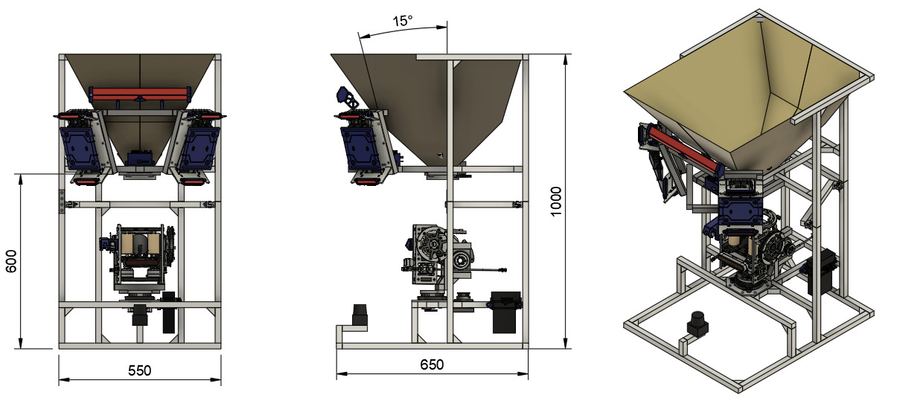 

フィールド上のロボットを検知するセンサとして、オートタレットには1つのデプスカメラ（[Realsense D455](https://www.intelrealsense.com/depth-camera-d455/)）および1つの測域センサ（[UST-30LX](https://www.hokuyo-aut.co.jp/search/single.php?serial=195)）を搭載する。カメラはジンバル機構上に取付されており、ジンバルの回転とともにカメラの向きも回転する。このカメラは後述のデスクトップコンピュータに直接接続する。ジンバルの側面には操縦ブース用カメラが取り付けられている。この操縦ブース用カメラの映像は操縦ブースに転送されており、フィールド上のロボットを検知するために用いることはできない。測域センサはオートタレットのフレームに固定して取り付けられている。

 

オートタレットの制御には、デスクトップコンピュータおよび組み込み用コンピュータ（[Raspberry Pi 4B](https://www.raspberrypi.com/products/raspberry-pi-4-model-b/)）を使用する。デスクトップコンピュータ上では、チームが開発するROS 2ベースのソフトウェアを実行し、デプスカメラから得られた画像情報および測域センサから得られた距離情報からオートタレットの動作を決定し、その制御コマンドをイーサネット経由でオートタレットへ送信する。オートタレットに搭載された組み込み用コンピュータは、デスクトップコンピュータから受信した制御コマンドに従ってオートタレットの各種アクチュエータを制御する。

### ローラー回転数の制限
オートタレットのローラーは、試合中を通して6500rpmを超えてはならない。

### ソフトウェア開発の規則
各チームは、ロボット用のソフトウェアプラットフォームの一つであるROS 2を用いてソフトウェアを開発しなければならない。チームが開発できるソフトウェアはデスクトップコンピュータ上で動作するもののみであり、組み込み用コンピュータのソフトウェアを変更してはならない。また、チームは開発したソフトウェアを実行委員会が指定する方法で公開しなければならない。

### オートタレット設置の規則
オートタレットは、オートタレットゾーンに設けた白線上にジンバルのYaw軸の回転中心が一致するように設置しなければならない。オートタレットは共通陣地が設置されている方向を正面として左右25°の範囲内の任意の角度で設置できる。

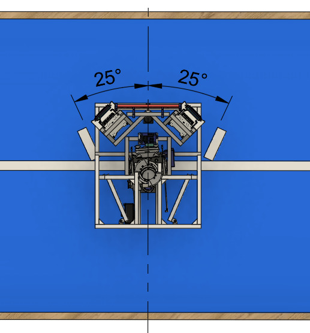 

オートタレットを制御するためのデスクトップコンピュータは、オートタレットゾーン内でオートタレットの近傍に設置する。オートタレットチームは、操縦ブース内のオートタレット操縦席に制御用デスクトップコンピュータをリモート操作するために必要なコンピュータを設置する。いずれのコンピュータも、映像伝送装置やオートレフェリーとの混線を防ぐため、電波を発する機器を利用してはならない。

### 試合中の規則
オートタレットの操縦手はラウンド開始までにオートタレットのプログラムを起動させなければならない。オートタレットの操縦手は、ラウンド中にリモート操作用のコンピュータに触れてはならない。

# 5章　ストライダーの規則
**⚠注意**
- ストライダーはCoRE-1での技術開発を促進するためテクニカルチャレンジとして実施する。テクニカルチャレンジでは開発する技術の方向性を絞り込んでいるため、エントリーチームは当該チャレンジの趣旨を理解して技術開発に挑戦すること。

ストライダーは決勝トーナメントから出撃できる。ストライダーチームは、総大将決定戦で決定した4つの同盟に割り当てられる。なお、アタッカーチームがストライダーを開発してエントリーした場合、当該アタッカーチームが所属する同盟に当該ストライダーが割り当てられる。ただし、ストライダーが特定の同盟に偏って所属しないよう、実行委員会が同盟の編成を調整する場合がある。

## ストライダーテクニカルチャレンジの趣旨
このストライダーのテクニカルチャレンジは、Boston Dynamics社のSpotMiniやUnitree社のUnitree Go2のような，主に2-3自由度の脚部を4本持ち，それらが生成する歩容によって移動するロボットの開発を目指すものである。ロボット競技界隈ではテオヤンセン機構やチェビシェフリンク機構などを使用した1自由度の脚部を複数を用いた歩行ロボットが見られるが、本テクニカルチャレンジではこのような類いの歩行ロボットの開発は目指す方向とは異なるため出場を許可しない。したがって、ストライダーの開発にあたっては実行委員会へ開発方針を共有し、承認を得なければ出場できないこととする。また、選手権開催直前に開発したストライダーのビデオを実行委員会へ提出し、本テクニカルチャレンジの趣旨に沿ったストライダーが開発されていることを実行委員会が確認できなければ、出場することはできない。なお、ビデオ審査においてはストライダーの完成度自体の高さは関係なく、あくまで本テクニカルチャレンジの趣旨に沿ったストライダーが開発されているかどうかを確認する。

## サイズの制限
ストライダーのサイズは、4脚での直立状態で幅1000mm×奥行き1000mm×高さ1200mmを超えてはならない。ただし有線操縦の場合、ケーブル固定用の支柱はサイズに含めない。ストライダーの脚先接地点から膝関節に相当する箇所までのリンク長、および膝関節から股関節に相当する箇所までのリンク長はいずれも200mmから400mmまでの長さにしなければならない。

## 分離の制限
ストライダーは分離してはならない。

## 重量の制限
ストライダーの重量は、30kgを超えてはならない。重量の計算には、バッテリー、エアタンクを含める。エアタンクの重量の計算には空気の有無は問わない。

## 操縦方法の制限
操縦手がストライダーを操縦する時には、実行委員会が貸出する操縦用無線モジュールを用いた無線通信、もしくはチームが用意する有線通信、どちらかの手段を用いなければならない。なお、いずれの手段でも緊急時に操縦手から停止を指令できるようにしなければならない。有線通信の場合、ケーブルがストライダー本体に絡まらないようストライダー上部に高さ300mm以上のケーブル固定用の支柱を取り付けなければならない。また、ケーブルの長さは十分に確保し、ケーブルを介してストライダーに力を作用させないようにしなければならない。

## 無線通信の制限
操縦以外の目的で使用する無線モジュールは5GHz・1.9GHz・920MHz・315MHz帯の周波数を用いてはならない。操縦以外の目的で使用する無線モジュールがある場合は、事前に使用するモジュールと周波数帯域を実行委員会に届け出なければならない。

## 競技に必要な物品の搭載
ストライダーには共通ルールブック内、5章 ロボット共通の規則で定義する装置・部品に加え、以下の装置・部品を取り付け、適切に接続しなければならない。
1. 操縦用の無線受信モジュール（有線操縦しない場合のみ。詳細は共通ルールブック8章を参照）

# 6章　競技形式の規則
競技は、総大将決定戦（アタッカー予選）と決勝トーナメントに分けて実施する。

まず総大将決定戦ではアタッカーチームとしてエントリーしたすべてのチームの順位を決定するために1vs3のグループ戦を実施する。グループ戦での結果に基づき各チームの勝ち点を算出して順位を決定し、上位4チームを総大将チームとして選出する。その他のアタッカーチーム、またビルダー・オートタレット・ストライダーの各チームは、総大将チームによる指名および実行委員会が戦力バランスを調整する形で同盟に割り当てる。

決勝トーナメントでは4つの同盟による同盟バトルをトーナメント形式で実施する。準決勝では、各総大将の指揮の下、各同盟からアタッカーとビルダーを合わせて4台、オートタレット1台、ストライダー1台を出撃させて2本先取の試合を行う。試合の各ラウンドでは、出撃させるロボットを総大将が決定できる。準決勝で敗北した同盟は、対戦相手の同盟の傘下に入って1つの同盟となり、決勝戦に進出する。決勝戦では各総大将の指揮の下、各同盟からアタッカーとビルダーを合わせて5台、オートタレット1台、ストライダー1台を出撃させて3本先取の試合を行う。決勝戦で勝利した同盟が競技優勝、敗北した同盟が競技準優勝となる。

以下に、各競技形式の詳細を説明する。

## 総大将決定戦の形式
**⚠注意**
- 総大将決定戦に参加できるのはアタッカーチームとしてエントリーしたチームのみである。
- その他のロボット種別のチームとしてエントリーしたチームは総大将チームになることはできない。

総大将決定戦では総大将チームを4つ選出してそれぞれの同盟を結成するために、アタッカーチームとしてエントリーしたすべてのチームによる1vs3のグループ戦を実施する。なお、その他のロボット種別のチームとしてエントリーしたチームは、総大将決定戦に参加できず、また総大将チームには選出されないことに注意すること。

グループ分けはシーズン途中に提出する審査ビデオの結果に基づき行う。審査ビデオの要件は別途提出資料の詳細を参照すること。グループ戦によってすべてのアタッカーチームの勝ち点を算出し、順位を決定する。この中で、上位4チームが総大将チームとして選出され、それぞれの同盟を率いる。

### グループ戦
4つのチームを1つのグループとして割り当てる。グループ内で1チーム、3チームに分かれて1vs3で2分間の試合を実施する。このとき、1チーム側を攻撃サイド、3チーム側を迎撃サイドと呼ぶ。各グループ戦の試合は4回連続で行い、各チームが攻撃サイドで1試合、迎撃サイドで3試合出場するように試合毎に役割を入れ替える。 試合の流れについては7章の進行の規則を参照すること。

グループ戦の試合は、以下の条件のいずれかを満たすと終了する。
- 攻撃サイドのロボットが撃破される。
- 迎撃サイドのすべてのロボットが撃破される。
- 上記2条件に当てはまらず、2分間が経過する。

なお、エントリーチームの数が4の倍数にならず、すべてのグループ戦を4チームで行うことができない場合は、エントリーチームの中からグループ戦に2回出場するチームを実行委員会が選出する。選出は、審査ビデオの結果に基づいてグループ戦の難易度が極端にばらつかないように配慮して行う。また、グループ戦に2回出場するチームの勝ち点は、最初に出場したグループ戦の勝ち点のみを採用し、2回目に出場した勝ち点は順位付けに反映しない。

### 勝ち点の計算方法と順位付け
グループ戦の各試合において、以下の通りの計算方法で各チームの勝ち点を計算する。なお、迎撃サイドはどのチームが撃破したか、ダメージを与えたかを問わず、出撃したすべてのチームが以下で計算した得点を獲得する。

- 攻撃サイドとして出撃した試合において
    - 迎撃サイドのロボットを撃破した：（5×撃破台数）点･･･A
    - 迎撃サイドのロボットへダメージを与えた回数：0～6点･･･B
- 迎撃サイドとして出撃した試合において
    - 攻撃サイドのロボットを撃破した：3点･･･C
    - 攻撃サイドのロボットへダメージを与えた回数：0～10点･･･D

各項の最大得点は以下の通りである。
- Aの最大得点は15点（3台をすべて撃破）
- Bの最大得点は6点（3台をすべて撃破）
- Cの最大得点は9点（1試合最大3点×迎撃サイドで出場した3試合）
- Dの最大得点は30点（1試合最大10点×迎撃サイドで出場した3試合）

各チームの勝ち点は以下の式で求める。この式では、攻撃サイドと迎撃サイドの点数比が1:1となるように調整し、合計して満点を100点としている。なお、小数点第三位以下を切り捨てて勝ち点を求める。
 $$ （勝ち点）= \left[ \frac{(A+B)}{21}+\frac{(C+D)}{39} \right] \times50 $$

求めた勝ち点から各チームの順位を付ける。同点が発生した場合は、以下の基準で順位を付ける。この基準で順位が求まらない場合は同順位として扱う。
1. 攻撃サイドの時に迎撃サイドのロボット3台を撃破するまでのタイムが早い順。
2. 攻撃サイドの時に迎撃サイドのロボットを撃破した台数が多い順。
3. 攻撃サイドの時に迎撃サイドのロボット1台を撃破するまでのタイムが早い順。

### 同盟の結成方法
総大将決定戦で決まった順位のうち、上位4チームを総大将チームとして選出する。それ以外のアタッカーチームおよびビルダー・オートタレット・ストライダーチームの同盟への割り当ては、以下に示す手順で行う。
1. 総大将チームが他のロボット種別を開発していた場合、そのロボットを当該総大将チームの同盟に割り当てる。
2. 1位の総大将チームから順番に、残りのアタッカー・ビルダー・オートタレット・ストライダーから2台のロボットを指名して同盟に割り当てる。なお、他のロボット種別も開発しているアタッカーチームのロボットを指名した場合、アタッカーと当該チームが開発したもう1台のロボットの2台を同時に割り当てる。
3. 総大将決定戦の順位が偏らないよう、また特定の同盟に同一種別のロボットが偏らないよう、実行委員会が残りのすべてのロボットを各同盟に割り当てる。

## 決勝トーナメントの形式
**⚠注意**
- 決勝トーナメントからビルダー・オートタレット・ストライダーが出撃できる。
- 同盟に属するすべてのチームが準決勝では第2ラウンドまでに、決勝戦では第3ラウンドまでに最低1回は出撃するように、総大将は出撃チームを選ばなければならない。

総大将決定戦で決まった4つの同盟による同盟バトルを行う。準決勝で敗北した同盟は勝利した同盟の傘下に入り、決勝に進出する。

### 同盟バトル
2つの同盟による1ラウンド5分間の同盟バトルを行う。準決勝は3ラウンド2本先取形式（BO3）で行う。決勝は5ラウンド3本先取形式（BO5）で行う。決勝トーナメントの各ラウンドでは総大将指揮の下、下記の通りロボットを出撃させて競技を行う。準決勝、決勝ともに同盟に属するすべてのロボットが準決勝では第2ラウンドまでに、決勝戦では第3ラウンドまでに、最低1回は出撃するように総大将は出撃するチームを選ばなければならない。試合の流れについては7章の進行の規則を参照すること。

#### 準決勝で出撃するロボットの台数
- アタッカーとビルダー合わせて4台
- オートタレット1台
- ストライダー1台

#### 決勝で出撃するロボットの台数
- アタッカーとビルダー合わせて5台
- オートタレット1台
- ストライダー1台

決勝トーナメントにおける各ラウンドは、以下の条件のいずれかを満たすと終了する。
- どちらかの同盟が共通陣地および相手陣地の両方を同時刻に占拠状態とする。
- 上記条件に当てはまらず、5分間が経過する。

### ラウンドの勝敗条件
決勝トーナメントにおける各ラウンドの勝敗は、以下の順序で決定する。
1. 共通陣地および相手陣地の両方を同時刻に占拠状態とした同盟の勝利
2. 相手アタッカーおよびビルダーを撃破した回数が多い同盟の勝利
3. 5分経過時に陣地を多く占拠している同盟の勝利
4. 5分経過時にスポットをより多く獲得した同盟の勝利
5. 相手同盟への与ダメージが多い同盟の勝利
6. 以上の条件で決定できない場合、引き分けとなり当該ラウンドは再試合となる

### トーナメント表
決勝トーナメントは以下の同盟の割り当てで実施する。各対戦において上側の同盟がフィールドの赤サイドに、下側の同盟が青サイドに割り当てられる。

 

## 競技における選手の役割
各チームはエントリーした選手の中から操縦手1名、整備手5名を選出する。決勝トーナメントから必要に応じて、アタッカーチームおよびオートタレットチームは補給手1名を選出できる。また、決勝トーナメントからは総大将の役割が追加され、1つの同盟につき総大将チームから1名選出する。

### 総大将チームによる総大将の選出
総大将チームは自チームに所属する選手の中から総大将1名を選出する。総大将候補となる選手1名は、チーム情報提出時に申請しなければならない。総大将は操縦手・整備手・補給手と兼任してはならない。また総大将は選出後、変更してはならない。敗北した同盟の総大将はその役割がなくなる形で、勝利した同盟の傘下に入る。

### 総大将の役割
総大将は、同盟に所属する選手の意見を参考に決勝トーナメントの各ラウンドで出撃させるチームを決定できる。ラウンド中、総大将は操縦ブースの指定された位置で指揮しなければならない。総大将は操縦ブースで自同盟から出撃中のアタッカーおよびビルダーすべての操縦画面、およびオートタレットのカメラ映像を見ることができ、ヘッドセットを使って自同盟から出撃中の操縦手と双方向に会話できる。ただし、総大将はストライダーの操縦手とはラウンド中にヘッドセットで会話できない。総大将はストライダーゾーン付近に設けたLEDなどのインジケータを操作することができ、このインジケータ操作によってストライダーの操縦手に合図を送ることのみができる。また、総大将はセッティングタイムに参加できる。

### 総大将チームによる副大将の選出
総大将チームは自同盟に所属する自チーム以外の選手の中から副大将1名を選出する。ただし、副大将は操縦手・整備手・補給手と兼任してはならない。また副大将は選出後、変更してはならない。敗北した同盟の副大将はその役割がなくなる形で、勝利した同盟の傘下に入る。

### 副大将の役割
副大将は、総大将を補佐する形で戦略の考案と操縦手への指示を補佐する。ラウンド中、副大将は操縦ブースの指定された位置で指揮しなければならない。副大将は操縦ブースで自同盟から出撃中のアタッカーおよびビルダーすべての操縦画面、およびオートタレットのカメラ映像を見ることができ、ヘッドセットを使って自同盟から出撃中の操縦手と双方向に会話できる。ただし、副大将はストライダーの操縦手とはラウンド中にヘッドセットで会話できない。また、副大将はセッティングタイムに参加できる。

### アタッカーおよびビルダーの操縦手の役割
アタッカーおよびビルダーの操縦手は、映像伝送装置で送信される映像を見ながらロボットを操縦する。ラウンド中、操縦ブースの指定された操縦席に着席しなければならない。操縦手はヘッドセットを使って自同盟から出撃中の他の操縦手および総大将・副大将と相互に会話できる。また、操縦手はセッティングタイムに参加できる。

### オートタレットの操縦手の役割
オートタレットの操縦手はラウンド開始までにオートタレットに動作開始の命令を送信する。ラウンドが開始すると緊急時にオートタレットの動作を完全停止する以外の命令を送ってはならない。ラウンド中、操縦ブースの指定された操縦席に着席しなければならない。操縦手はヘッドセットを使って自同盟から出撃中の他の操縦手および総大将・副大将と相互に会話できる。また、操縦手はセッティングタイムに参加できる。

### ストライダーの操縦手の役割
ストライダーの操縦手は、ロボットを直接目視しながら操縦する。ラウンド中、ストライダー操縦ゾーン内に留まらなければならない。ストライダーの操縦手は自同盟から出撃中の他の操縦手および総大将・副大将と会話することはできない。ただし、総大将によって操作されるストライダーゾーン付近に設けたLEDなどのインジケータを見ることによって、総大将からの合図を確認することができる。また、操縦手はセッティングタイムに参加できる。

### アタッカーの整備手の役割
アタッカーの整備手は、セッティングタイムにアタッカーの調整を行う。また、アタッカーの整備手は自動補給ゾーンにフライングディスク・マガジン・補給ベースを設置できる。セッティングタイム終了後、整備手はスタンバイブースで待機しなければならない。

### ビルダーの整備手の役割
ビルダーの整備手は、セッティングタイムにビルダーの調整を行う。また、ビルダーの整備手は自同盟側の他の整備手と協力して、自同盟側のブロックの初期位置を調整できる。セッティングタイム終了後、整備手はスタンバイブースで待機しなければならない。

### オートタレットの整備手の役割
オートタレットの整備手は、セッティングタイムにオートタレットの設置・調整を行う。セッティングタイム終了後、整備手はスタンバイブースで待機しなければならない。

### ストライダーの整備手の役割
ストライダーの整備手は、セッティングタイムにストライダーの設置・調整を行う。セッティングタイム終了後、整備手はスタンバイブースで待機しなければならない。

### アタッカーの補給手の役割
アタッカーの補給手は、決勝トーナメントの各ラウンド中に手動補給ゾーンで自チームのアタッカーへフライングディスクを補給できる。ラウンド中、手動補給を行う予定のアタッカーの補給手は補給待機ブースで待機しなければならない。また、アタッカーの補給手はセッティングタイムに参加できる。

### オートタレットの補給手の役割
オートタレットの補給手は、セッティングタイムにオートタレットへボールを補給する。セッティングタイム終了後、補給手はスタンバイブースで待機しなければならない。

## 審判団
オートレフェリーシステムの補助の下、競技の判定はすべて審判団が責任を負う。審判団は主審・副審・操縦ブース審判から構成される。各審判の人数は以下の表の通りである。

| 種別 | 総大将決定戦 | 決勝トーナメント |
| -------- | -------- | -------- |
| 主審 | 1名 | 1名 |
| 副審 | 2名 | 6名 |
| 操縦ブース審判 | 2名 | 4名 |

# 7章　各競技進行の規則
## 総大将決定戦の進行
総大将決定戦は、以下のプロセスに従って競技が進行する。

### システムチェック
試合に出場するグループのすべてのチームは、スタンバイブースに移動してシステムチェックを受けなければならない。システムチェックでは、オートレフェリーシステムが正常に動作するかをチェックする。

### フィールドへロボットを配置
審判の合図に従って、整備手はロボットをスタートゾーンへ配置する。

### セッティングタイム
タイマーの合図で2分間のセッティングタイムが開始する。この時間内では、操縦手および整備手がフィールドに入って、試合に向けたロボットの調整・動作確認を行うことができる。また、各チームにはセッティングタイム開始とともにフライングディスクが割り当てられる。操縦手はセッティングタイムが終了するまでに操縦ブース内の指定された席に着席しなければならない。オートレフェリーシステムや映像伝送装置などの競技システムにトラブルが起きた場合、テクニカルタイムアウトの措置が執られることがある。詳細はテクニカルタイムアウトの項を参照すること。

### オートレフェリーシステムの初期化
セッティングタイムが終了し、フィールドから選手・審判を含めてすべての人が出た後に、スタッフがオートレフェリーシステムの初期化を行う時間を設ける。

### 試合
タイマーのカウントダウンとともに、2分間の試合が開始する。試合が終了した後、各チームの整備手はロボットの電源を切るか、非常停止スイッチを操作しなければならない。

### フライングディスクの返却
試合の終了後、ロボットにフライングディスクが搭載されている場合はスタッフの指示に従って速やかにディスクを取り出して返却すること。

### 攻撃サイドと迎撃サイドの入れ替え
グループ内のすべてのチームが攻撃サイドとして一度出撃するように、攻撃サイドと迎撃サイドを入れ替えて「フィールドへロボットを配置」からのプロセスを繰り返す。

### 1グループ内の勝ち点の確定
グループ内のすべてのチームが攻撃サイドとして試合を終えると当該グループの各チームの勝ち点が確定し、試合が終了する。また、このとき当該グループ戦に出場したすべてのキャプテンに対してヒーローインタビューが行われる。

## 決勝トーナメントの進行
決勝トーナメントからは以下のプロセスに従って競技が進行する。

### システムチェック
同盟バトルに出場する両同盟のすべてのチームは、スタンバイブースに移動してシステムチェックを受けなければならない。システムチェックでは、オートレフェリーシステムが正常に動作するかをチェックする。

### 同盟バトルに出場するチームの紹介
同盟バトルに出場する両同盟のすべてのキャプテンおよび総大将は、対戦同盟の入場および紹介に参加するため指定された速やかに立ち位置に移動しなければならない。

### 同盟会議
タイマーの合図で3分間の同盟会議が開始する。両同盟の総大将は、当該ラウンドに同盟から出撃させるチームおよび出撃チームが使う操縦席の番号を決定し、同盟会議の時間が終了するまでに審判へ申告する。申告は実行委員会が作成したフォーマットの書類に記載する形で行う。申告後、出撃するチームと操縦席番号は一切変更できない。

### フィールドへロボットを配置
審判の合図に従って、出撃するチームの整備手はアタッカーおよびビルダーをスタートゾーンへ、オートタレットをオートタレットゾーンへ、ストライダーをストライダースタートゾーンへ配置する。

### セッティングタイム
タイマーの合図で3分間のセッティングタイムが開始する。この時間内では、出撃チームの操縦手・整備手・補給手がフィールドに入って、試合に向けてロボットの調整、動作確認を行うことができる。また、各同盟にはセッティングタイム開始とともにフライングディスクおよびボールが割り当てられる。操縦手はセッティングタイムが終了するまでに操縦ブース内の指定された操縦席に着席しなければならない。
- セッティングタイム中に出撃チームにトラブルが起きた場合、審判に対して最大2分間のタイムアウトを申告できる。詳細はタイムアウトの項を参照すること。
- オートレフェリーシステムや映像伝送装置などの競技システムにトラブルが起きた場合、テクニカルタイムアウトの措置が執られることがある。詳細はテクニカルタイムアウトの項を参照すること。

### オートレフェリーシステムの初期化とオートタレットのスタンバイ
セッティングタイムが終了し、フィールドから選手・審判を含めてすべての人が出た後に、スタッフがオートレフェリーシステムの初期化を行う。オートタレットの操縦手は、この時間が終わるまでにラウンド開始へ向けてオートタレットに動作開始の命令の送信を終わらせること。この時間を超えると、オートタレットへ停止命令以外の一切の命令を送信してはならない。

### ラウンド
タイマーのカウントダウンとともに、5分間のラウンドが開始する。ラウンドが終了した後、各チームの整備手はロボットの電源を切るか、非常停止スイッチを操作しなければならない。

### フライングディスク・ボール・ブロックの返却
試合の終了後、ロボットにフライングディスクやブロックが、オートタレットにボールが搭載されている場合はスタッフの指示に従って速やかにそれらを取り出して返却すること。

### 勝敗の確定
準決勝においてはどちらかの同盟がラウンドを2本先取、決勝戦においては3本先取した時点でその試合が終了する。試合終了後、両総大将に対してヒーローインタビューが行われる。

## セッティングタイム中のタイムアウト
総大将決定戦、決勝トーナメントともに実行委員会の判断によりテクニカルタイムアウトが発生する場合がある。決勝トーナメントからは総大将の判断により最大2分間のタイムアウトを申請できる。

### テクニカルタイムアウト
オートレフェリーシステムや映像伝送装置、操縦用無線モジュール、陣地など実行委員会が用意するシステムやデバイスにトラブルが発生した場合、審判はテクニカルタイムアウトを宣言し、セッティングタイムの時間経過を一時停止できる。各システムに接続した出場チームオリジナルのデバイスなどにトラブルが発生した場合、テクニカルタイムアウトは適用されない。テクニカルタイムアウトが実行されている間、選手はスタッフと協力して発生しているトラブルへ対処することしか認められず、それ以外の目的でロボットの調整・修理を行ってはならない。

### タイムアウト
決勝トーナメントからはセッティングタイム中、ロボットにトラブルが起こった場合や、戦略を検討する時間が必要となった場合に、セッティングタイムを2分間延長するタイムアウトを申請できる。タイムアウトは、同盟ごとに1試合に1度だけ認められる。  申請する際は、同盟の総大将が審判にタイムアウトを申請すること。審判はタイムアウトの申請を受けた場合、両方の同盟に対してタイムアウトを通告する。両同盟はこの時間にロボットの調整、修理や戦略の検討を行うことができる。1回のセッティングタイム中にタイムアウトを申請できるのはどちらかの同盟のみとする。両同盟からタイムアウトの申請があった場合、先に審判へ申請があった同盟のタイムアウトが優先され、後から申請があった同盟のタイムアウトは却下される。なお、セッティングタイムが残り15秒未満である場合、タイムアウトの申請は認められない。また、タイムアウトを申請後からキャンセルすることは認められない。

# 8章　競技内容の規則
**⚠注意**
- 衝撃や振動によってダメージパネルが反応してHPが減少した場合も、そのダメージは有効とする。
- 総大将決定戦の迎撃サイド内、もしくは決勝トーナメントの自同盟内からフライングディスクの投擲によって味方ロボットのHPが減少した場合も、そのダメージは有効とする。

## 共通の規則
### フライングディスクによる攻撃
アタッカーは、フライングディスクを投げ当てる以外の行為で相手ロボットや陣地のダメージパネルを攻撃してはならない。フライングディスクがダメージパネルにヒットしたとき、ヒットしたロボットのHPが10減少する。決勝トーナメントにおいてバフ効果を得ている場合、減少するHPがバフ効果の倍率だけ増加する。なお、衝撃や振動によってダメージパネルが反応してHPが減少した場合でも、そのダメージは有効として競技を続行する。決勝トーナメントにおいては補給手の安全を確保するため、補給中の手動補給ゾーンに向けて意図的にフライングディスクを投げてはならない。

### フライングディスクの再利用
フィールド内に落ちているすべてのフライングディスクは、アタッカーが拾って再利用できる。ただし、フィールドの外に出たフライングディスクを拾って再利用してはならない。

### アタッカーの撃破
以下のどちらかの条件を満たしたとき、そのアタッカーは撃破となる。
- HPが0となった場合。
- アタッカーが転倒し、復帰できなくなった場合。なお、転倒とは、ロボットの底面がフィールド面から離れ、自力で復帰できなくなった場合を指す。

### ロボット同士の接触
相手ロボットを転倒させる、動きを押さえつけ拘束するまたは破損させる行為をしてはならない。相手ロボットを故意に転倒・拘束・破損させたと審判が判断した場合、反則もしくは失格となる。

### ロボットの非常停止
ロボットが競技中に制御不能となった場合、操縦手が非常停止の信号を送信して、もしくは審判が非常停止スイッチを押して当該ロボットを停止させる。以降、当該ロボットは停止したまま試合もしくはラウンドが終了するまで待機しなければならない。

## 総大将決定戦
### 各サイドのカラー
攻撃サイドは赤、迎撃サイドは青とする。

### アタッカーのスタート位置
セッティングタイムが終了するまでに、攻撃サイドのロボットは赤スタートゾーンに、迎撃サイドのすべてのロボットは青スタートゾーンに、上面から見て収まっていなければならない。

### ロボットのHP
試合開始時、攻撃サイドのロボットのHPは100、迎撃サイドのロボットのHPはいずれも20である。

### フライングディスクの付与
セッティングタイム開始時に、攻撃サイド・迎撃サイドどちらのチームにも1チーム当たり50枚ずつフライングディスクを付与する。

## 決勝トーナメント
### 各同盟のカラー
準決勝・決勝戦の各試合において赤サイドに割り当てられた同盟は赤同盟、青サイドに割り当てられた同盟は青同盟とする。

### アタッカーおよびビルダーのスタート位置
セッティングタイムが終了するまでに、赤サイドとして出場する同盟のすべてのアタッカーおよびビルダーは赤スタートゾーンに、青サイドとして出場する同盟のすべてのアタッカーおよびビルダーは青スタートゾーンに、上面から見て収まっていなければならない。

### オートタレットのスタート位置
セッティングタイムが終了するまでに、赤サイドとして出場するオートタレットは赤オートタレットゾーンの中央に任意の向きで、青サイドとして出場するオートタレットは青オートタレットゾーンの中央に任意の向きで配置しなければならない。

### ロボットのHP
ラウンド開始時、アタッカーのHPは40、ビルダーのHPは80、オートタレットのHPは200である。なお、ストライダーにHPは存在しない。

### ビルダーの撃破
以下のどちらかの条件を満たしたとき、そのビルダーは撃破となる。
- HPが0となった場合。
- ビルダーが転倒し、復帰できなくなった場合。なお、転倒とは、ロボットの底面がフィールド面から離れ、自力で復帰できなくなった場合を指す。

### オートタレットの撃破
オートタレットのHPが0となった場合、そのオートタレットは撃破となる。

### アタッカーの撃破からの復活
アタッカーが撃破されてから1分が経過すると、当該アタッカーのHPが30に自動回復して復活し、その場から動作を再開できる。ただし、当該アタッカーが転倒状態にある場合は復活できない。なお、復活から5秒間はHPが減少しない無敵状態とする。

### ビルダーの撃破からの復活
ビルダーロボットが撃破されてから1分が経過すると、当該ビルダーのHPが60に自動回復して復活し、その場から動作を再開できる。ただし、当該ビルダーが転倒状態にある場合は復活できない。なお、復活から5秒間はHPが減少しない無敵状態とする。

### オートタレットの撃破からの復活
オートタレットが撃破されると当該ラウンドでは復活しない。

### フライングディスクの付与
セッティングタイム開始時、各同盟には以下の枚数のフライングディスクが付与される。各同盟は、付与されたフライングディスクをそのラウンドに出撃するすべてのチームで共用する。
- 準決勝では1ラウンド1同盟当たり500枚
- 決勝戦では1ラウンド1同盟当たり600枚

### フライングディスクの手動補給
アタッカーが上面から見てすべて自同盟のスタートゾーンに隣接する手動補給ゾーンに入れば、補給手がフライングディスクを補給できる。なお手動補給の場合、アタッカーが上面から見てすべて自同盟の手動補給ゾーンに入った時刻から20秒以上が経過しなければ、手動補給ゾーン外に出て競技に復帰できない。審判が時間を計測して補給手に手動補給ゾーン外に出てよいタイミングを指示するため、補給手はアタッカーのカメラ越しに操縦手に合図を送ること。

マガジンを使用して補給する場合、マガジンはセッティングタイム中に補給待機ブースに設置しなければならない。補給手は、自チームのアタッカーが手動補給ゾーンに入った時にマガジンを補給待機ブースから手動補給ゾーンに運び、マガジンを取り付けることができる。なお、マガジンをアタッカーから取り外した場合、当該マガジンは補給後に直ちに補給待機ブースに運ばなければならない。

また、補給中は以下の制限を守らなければならない。
- 非常停止スイッチを操作し、アタッカーを完全停止（脱力）状態としなければならない。
- 手動補給ゾーンには同時に複数のアタッカーが入ってはならない。
- 補給手はスタートゾーンに立ち入ってはならない。
- アタッカーに搭載されたマガジンの取り外しに必要な場合を除き、アタッカー上にあるフライングディスクを取り除いてはならない。
- アタッカーが強化素材を持っている場合、補給手は強化素材に触れてはならない。

なお、手動補給中は、当該アタッカーがロボットのサイズ制限を満たさない状況の発生が一時的に認められる。
ただし、この例外は当該アタッカーが上面から見て手動補給ゾーンに常に収まっている場合のみ認められる。

**⚠留意事項**
- 補給手が介在する補給中に、発射機構内で詰まっているフライングディスクを取り除く、強化素材を持ち替えるような、補給とは関係のない操作は認められないことを意図している。

### フライングディスクの自動補給
**⚠注意**
- 自動補給方法の実現および補給ベースの製作は必須ではない。
- 自動補給中に相手ロボットから攻撃を受けた場合、そのダメージは有効とする。

アタッカーが上面から見て自同盟の自動補給ゾーンに収まっていれば、アタッカーは自動補給ゾーンに置かれたフライングディスクの補給およびマガジンの取り付け、取り外しができる。また自動補給ゾーンには、これらの自動補給の方法を補助するための補給ベースを設置できる。なお、自動補給中は、当該アタッカーがロボットのサイズ制限を満たさない状況の発生が一時的に認められる。ただし、この例外は当該アタッカーが上面から見て自動補給ゾーンに常に収まっている場合のみ認められる。また、ダメージパネルの設置規則は、自動補給中も常に満たさなければならない。

#### 自動補給ゾーン内に設置したフライングディスクの補給方法
アタッカーが上面から見て自同盟の自動補給ゾーンに収まっていれば、アタッカーは自動補給ゾーン内に設置したフライングディスクを補給できる。このとき、フライングディスクを補給しやすくするため、各チームが製作した補給ベースにフライングディスクを設置できる。

#### 自動補給ゾーン内に設置したマガジンを使った補給方法
アタッカーが上面から見て自同盟の自動補給ゾーンに収まっていれば、アタッカーは自動補給ゾーンに設置したマガジンを取り付けることができる。必要であれば、アタッカーは現在取り付けているマガジンを分離し、取り外すことができる。ただし、取り外したマガジンは自同盟の自動補給ゾーン外に出てはならない。このとき、マガジンを取り付け、取り外ししやすくするため、各チームが製作した補給ベースを使用できる。

#### 補給ベースの制限
各チームは以下の制限を満たした補給ベースを1つ製作し、自動補給の補助に使用できる。また高さが1000mmを超える補給ベースは、自動補給ゾーンに接するフェンスへ固定することを強く推奨する。フェンスの壁面はコンパネなどの木材で製作するため、木ネジなどを使用してフェンス壁面に補給ベースを固定できる。
- 補給ベースのサイズは、マガジンを取り付けた状態で幅1000mm×奥行き1000mm×高さ1600mmを超えてはならない。
- マガジンを除いて、補給ベースは分離してはならない。
- 補給ベースの重量は、マガジンを取り付けた状態で30kgを超えてはならない。重量の計測にはフライングディスクは含めない。
- 補給ベースには、電力や圧縮空気などのエネルギー源を取り付けてはならない。
- ラウンド中、補給ベースは上空から見て常に自動補給ゾーン内に収まっていなければならない。

### ブロックの位置調整
セッティング時、ビルダーの整備手は自同盟から出撃する他のチームの整備手と協力してフィールド上に置かれた自同盟側のブロックの位置を調整できる。ただし、上面から見た際にブロックがブロックレールと重なる範囲内で調整しなければならない。オートタレットゾーン横にある3列のブロックレールのみ、ブロックを縦に複数個重ねて置くことができる。なお、セッティングタイム開始時の配置と異なるゾーン・エリアにブロックを移動させてはならない。

### ボールの付与
セッティングタイム開始時、各同盟にはオートタレット用のボールが150個付与される。

### ボールによる攻撃
オートタレットから投げられたボールがダメージパネルにヒットしたとき、ヒットしたロボットのHPが10減少する。バフ効果を得ている場合、減少するHPがバフ効果の倍率だけ増加する。なお、オートタレットは陣地を攻撃してはならない。また、オートタレットが自同盟のロボットを攻撃してしまい、ダメージパネルにヒットすればそのダメージも有効となる。

### 強化素材の回収とスポットへの設置
**⚠注意**
- 強化素材の設置は審判が判定するため、バフ効果やHP回復効果が瞬時に反映されない場合もある。
- 相手同盟のスポットに強化素材を設置した場合、その強化素材の色によらず相手同盟がバフ効果もしくはHP回復効果を得る。

ラウンド開始時、赤サイドと青サイドの強化素材置き場にそれぞれ6本の強化素材が設置されている。赤サイドの強化素材は赤色、青サイドの強化素材は青色である。アタッカーもしくはビルダーが自同盟の強化素材置き場から強化素材を回収し、自同盟の各スポットに設置するとバフ効果もしくはHP回復効果が得られる。ただし、1つのスポットに複数本の強化素材を設置したとしても、効果は最初の1回しか得ることができない。また、相手同盟の強化素材を保持した場合や両同盟のスポットに設置済みの強化素材を取り出した場合、反則となる。

強化素材の各スポットへの設置により得られる効果は以下の通りである。
- スポット1もしくは2に設置した場合
    - 40秒間、自同盟のすべてのロボットの攻撃力が2倍になる
- スポット3に設置した場合
    - 自同盟のすべてのロボットのHPが上限値まで回復する
- スポット4もしくは5に設置した場合
    - 60秒間、自同盟のすべてのロボットの攻撃力が2倍になる

スポット1,2,4,5の効果が同時刻に発生した場合、その効果は乗算されて両方とも反映される。例えば、強化素材をスポット1に設置してから5秒後にスポット2にも設置した場合、バフ効果の時間経過は以下の表のようになる。なお、実際の競技においては強化素材のスポットへの設置は審判が判断するため、その設置効果が瞬時に反映されない場合もあることに注意すること。

| 時刻 t (秒) | スポットの獲得状況 | バフ効果 |
| -------- | -------- | -------- |
| 0 ≦ t <5 | t = 0 秒でスポット1を獲得 | 攻撃力2倍 |
| 5 ≦ t < 40 | t = 5 秒でスポット2を獲得 | 攻撃力4倍 |
| 40 ≦ t < 45 | t = 40 秒でスポット1のバフ効果が終了 | 攻撃力2倍 |
| 45 ≦ t | t = 45 秒でスポット2のバフ効果が終了 | 攻撃力1倍 |

### バンカーによるバフ効果
アタッカーもしくはビルダーの接地面がすべてバンカー上面に登った場合、当該ロボットの防御力が2倍となり、ヒット時に減少するHPが半分となる。なお、実際の競技においては審判が判断するため、その効果が瞬時に反映されない場合もあることに注意すること。

### ブロックの移動と設置
ラウンド開始時、フィールド上にはブロックが複数設置されている。ビルダーは、これらのブロックを自由に移動させることができる。またブロックの上面に限り、ロボットが乗り上げることができる。なお、アタッカーがブロックを保持した場合は反則となる。

### ストライダーのゾーン踏破によるバフ効果
ストライダーがストライダースタートゾーンから歩行して、ストライダーゾーン1およびストライダーゾーン2を踏破した時、バフ効果が得られる。ストライダーのいずれかの1つの脚がゾーン間に設けた白線をまたいだ時に、踏破成功としてバフ効果が発動する。

ストライダーの各ゾーン踏破により得られる効果は以下の通りである。
- ストライダーゾーン1を踏破した場合
    - 30秒間、自同盟のすべてのロボットが一切の攻撃を受け付けない無敵状態になる
- ストライダーゾーン2を踏破した場合
    - 45秒間、自同盟のすべてのロボットが一切の攻撃を受け付けない無敵状態になる。ゾーン2踏破時にゾーン1踏破時のバフが終了していない場合、ゾーン2踏破時のバフはゾーン1踏破時のバフが終了後に連続して開始される。

なお、実際の競技においてはゾーンの踏破は審判が判断するため、バフ効果が瞬時に反映されない場合もあることに注意すること。

### 陣地
フィールドには両同盟が攻撃できる共通陣地、赤同盟のみ攻撃できる青陣地、青同盟のみ攻撃できる赤陣地、合計して3つの陣地がある。いずれの陣地も、相手同盟のオートタレットを撃破した後から攻撃できる。陣地には、ロボットに取り付けているダメージパネルと同様のものを取り付けている。ただし、陣地に取り付けたダメージパネルは、フライングディスクがヒットした時点から5秒間、当該ダメージパネルのみヒット判定を受け付けない無敵状態が生じる。赤同盟が攻撃できるダメージパネルはLEDが青色に発光しており、青同盟が攻撃できるダメージパネルはLEDが赤色に発光している。

#### 共通陣地
共通陣地には、赤同盟が攻撃できるダメージパネル、また青同盟が攻撃できるダメージパネルをそれぞれ3つずつ、合計6つのダメージパネルを取り付けている。

#### 赤・青陣地
赤陣地には青同盟が攻撃できるダメージパネルを4つ、青陣地には赤同盟が攻撃できるダメージパネルを4つ取り付けている。

#### 陣地の占拠条件
各陣地は、アタッカーからフライングディスクの投擲による攻撃を受けることによって、どちらかの同盟の陣地として占拠できる。なお、陣地のダメージパネルはフライングディスクの投擲以外の手段で攻撃してはならない。

共通陣地の占拠状態は下図の11段階の占拠レベルによって決定する。青5が青同盟による占拠の状態、赤5が赤同盟による占拠の状態である。占拠レベルが青4～中点～赤4の場合は、共通陣地はどちらの同盟にも占拠されていない。占拠レベルは中点が初期状態であり、中点から赤同盟による占拠および青同盟による占拠までそれぞれ5段階がある。フライングディスクが陣地下段のダメージパネルにヒットした場合、共通陣地の占拠レベルがヒットしたダメージパネルに応じて赤・青どちらかへ1つ移動する。フライングディスクが陣地上段のダメージパネルにヒットした場合、共通陣地の占拠レベルがヒットしたダメージパネルに応じて赤・青どちらかへ2つ移動する。例えば、青同盟が攻撃する下段のダメージパネルにヒットがあった場合、占拠レベルは青側に1つ移動する。なお、バフ効果を得ている場合はその倍率分の効果が付与される。例えば青同盟の攻撃力が2倍となっている場合に、青同盟が攻撃する上段のダメージパネルにフライングディスクがヒットした場合、占拠レベルが青側に4つ移動する。占拠レベルが青5もしくは赤5になったとき、共通陣地はどちらかの同盟の陣地として占拠される。共通陣地がどちらかの同盟によって既に占拠された状態で、占拠していない同盟側の攻撃がヒットした場合、占拠レベルが占拠していない同盟側へ移動し、共通陣地の占拠状態が解除される。なお、どちらの同盟にも占拠されていない状態（占拠レベルが青4～赤4の範囲）で、共通陣地への最後の攻撃から30秒間が経過すると、共通陣地の占拠レベルは中点にリセットされる。

赤・青陣地の占拠状態は10段階の占拠レベルによって決定する。赤同盟は青陣地を、青同盟は赤陣地を攻撃する。ただし、自同盟の陣地を攻撃した場合も陣地への攻撃は有効と判定される。占拠レベルは0が初期状態であり、いずれの陣地もフライングディスクが陣地下段のダメージパネルにヒットした場合、占拠レベルが1つ上がり、陣地上段のダメージパネルにヒットした場合、占拠レベルが2つ上がる。なお、バフ効果を得ている場合はその倍率分の効果が付与される。占拠レベルが10となった場合、その陣地が占拠される。なお、赤・青陣地の占拠レベルは時間経過によってリセットされない。

## 反則行為と失格
### 反則行為
以下の反則行為があった場合、当該ロボットのHPが20減少する。ストライダーの場合はその時点で動作を停止させ、ラウンド終了まで待機しなければならない。
1. スタート時にフライングをした場合。
2. ロボットがフィールド外に進入した場合。
3. 決勝トーナメントにおいて、相手同盟の手動補給ゾーンに進入した場合。
4. 決勝トーナメントにおいて、ビルダーが手動補給ゾーンに進入した場合。
5. 決勝トーナメントにおいて、相手同盟の自動補給ゾーン内にあるマガジンや補給ベースに接触した場合。
6. 決勝トーナメントにおいて、相手同盟の強化素材を保持した場合。
7. 決勝トーナメントにおいて、アタッカーがブロックを保持した場合。
8. 決勝トーナメントにおいて、スポットに設置済みの強化素材を取り出した場合。
9. 決勝トーナメントにおいて、アタッカーから分離したマガジンが当該同盟の自動補給ゾーン外に出た場合。
10. 決勝トーナメントにおいて、ストライダーがストライダーエリア外に接地した場合。
11. 決勝トーナメントにおいて、アタッカーが故意にストライダーを攻撃、もしくはストライダーゾーンへフライングディスクを投擲した場合。
12. 緊急時を除き、選手が審判の許可を得ずロボットに触れた場合。
13. 選手が競技中に指定された場所以外に立ち入った場合。
14. フィールドや選手権会場、設備などを破損、汚染した場合。
15. 審判の指示に従わない行為をした場合。
16. ルールブックの規則に違反する行為をした場合。

### 失格
審判が以下の失格行為を認めた場合、総大将決定戦の場合は当該試合を再試合とし、失格行為を行ったチームの順位は最下位とする。決勝トーナメントの場合、当該ラウンドは相手同盟の勝利とする。
1. 故意に相手ロボットの破損・拘束・転倒を招いた場合。
2. 相手ロボットの反則・失格を誘導した場合。
3. 故意にフィールドおよびブロックの破壊を行った場合。
4. オートレフェリーシステムや映像伝送装置のHDMIトランスミッターなど、実行委員会が貸与したロボット取付物品がロボットから落下した場合。
5. ルールブックの規則に違反する危険な行為を行った場合。
6. 発火など安全管理上、重大な問題が発生した場合。

# 9章　競技用品の規則
CoRE-1ではフライングディスク・ボール・強化素材・ブロックを競技中に使用する。以下に、各物品の詳細について示す。

## フライングディスク
フライングディスクは、アタッカーが相手ロボットおよび陣地を攻撃するために使用できる。積水化成品工業株式会社製の[ライトロンボードRLB20](https://www.sekisuikasei.com/jp/products/electronics/ligthlon_board/)を直径180mm、厚さ20mmの円盤形状に切り抜いたものを使用する。競技において、各チームは実行委員会で用意するフライングディスクを使用しなければならない。

## ボール
ボールは、自動ロボットが相手操縦ロボットへ攻撃するために使用できる。カシマヤ製作所SHOPにて購入できる直径約70mmの[PU カラーボール](https://kashimaya-shop.com/item-detail/498749)を使用する。競技において、各チームは実行委員会で用意するボールを使用しなければならない。ボールの色は複数色を混在させて使用する。

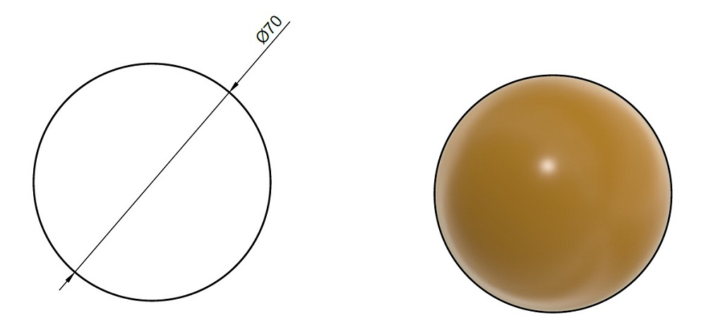

## 強化素材
強化素材は、ロボットのバフ効果もしくはHP回復効果を得るために使用できる。外径32mm、長さ500mm、厚み1.5mmのアルミニウム製パイプで、赤もしくは青色の熱収縮チューブで表面を覆ったものを使用する。競技において、各チームは実行委員会で用意する強化素材を使用しなければならない。

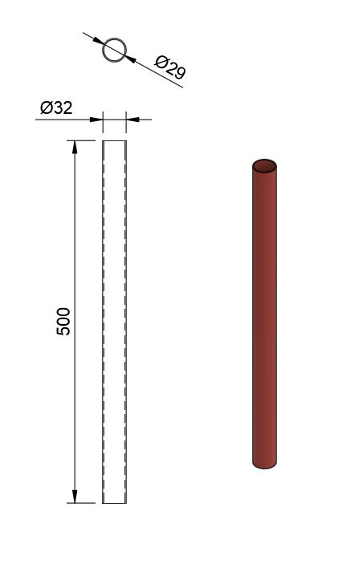

## ブロック
ブロックは、決勝トーナメントからフィールド上に置かれる物体であり、ビルダーがブロックを移動させることにより、新しい移動ルートの開拓、陣地の防御などに使用できる。ブロックは幅・奥行きがともに300mm、高さ200mmであり、強化ダンボール、MDF板、木材を図の通り組み合わせたものを使用する。重量は約1.3kgである。競技において、各チームは実行委員会で用意するブロックを使用しなければならない。ただし、強化ダンボールの外形サイズにばらつきがあるため、外形サイズに5mm程度の誤差が含まれる。

- 強化ダンボールはステキハコ製のA式みかんばこ（製造時のサイズに関しては近日中に追記予定）で素材をK7/W（強化ダンボール）としたものを用いる。一般的な布テープを用いてダンボールを組み立て、MDF板とは木工用ボンドで固定する。
- MDF板は長辺・短辺ともに300mm、厚さ2.5mmのものを用いる。
- 木材は、2x2材（長辺・短辺ともに38mm）を300mmにカットしたものを用いる。木材とMDFは木ネジおよび木工用ボンドで固定する。
- 

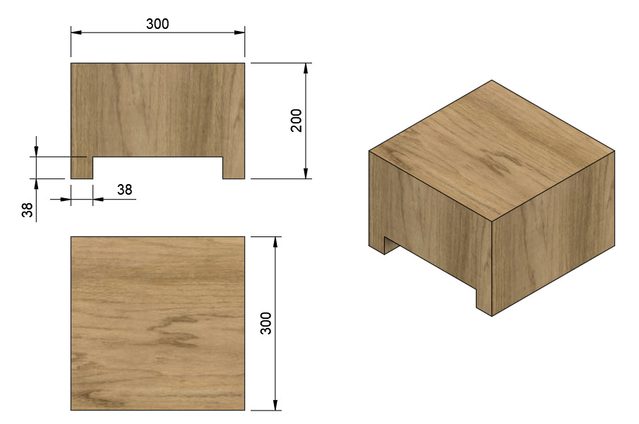

# 10章　フィールドの規則
**⚠注意**
- フィールド制作に当たって実際のフィールドと若干の変更が生じる可能性がある。変更の場合はルール更新によって最新の図面を随時公開する。なお、開発するロボットに影響を与えるような変更はやむを得ない場合以外、行わない。

CoRE-1では総大将決定戦と決勝トーナメントで異なるフィールドを使用する。以下に、各フィールドの詳細について示す。また、フィールドの寸法には若干の誤差が生じる。

## 総大将決定戦
総大将決定戦では決勝トーナメントのフィールドを一部使用する（[3DCAD図はこちらを参照](https://a360.co/3ztLLhT)）。

俯瞰図

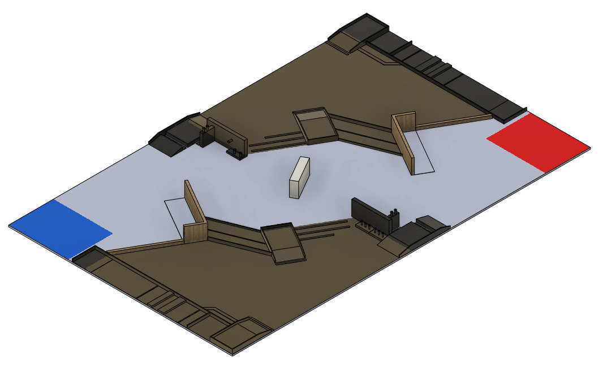

上面図

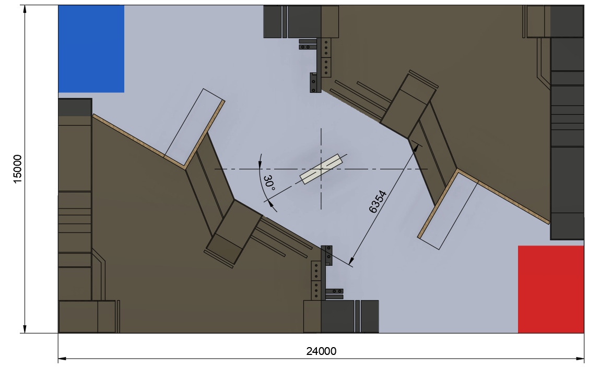

### スタートゾーン
スタートゾーンはフィールド両サイドに設けた、1m×3.5mの領域である。

### バトルエリア
バトルエリアは、各エリア・ゾーンや構造物を除くフィールドすべての領域である。

### バリケード
バトルエリア中央にはバリケードを設置する。バリケードのサイズは幅1000mm×奥行き450mm×高さ1000mmである。このバリケードを2個横並びに連結したものを配置する。バリケードにはおもりを載せ、容易に移動しないように設置する。

### フェンス
フィールド最外周には単管パイプと木材を用いたフェンスを設置する。フェンスの高さはバトルゾーンから140mmであり、2x6の木材を単管パイプに固定したものを使用する。

## 決勝トーナメント
決勝トーナメントでは24m×15mのフィールドを使用する（[3DCAD図はこちらを参照](https://a360.co/4c0hxRR)）。以下の図ではフィールド形状をわかりやすくするため、青サイド側のみにブロックを配置している。

俯瞰図

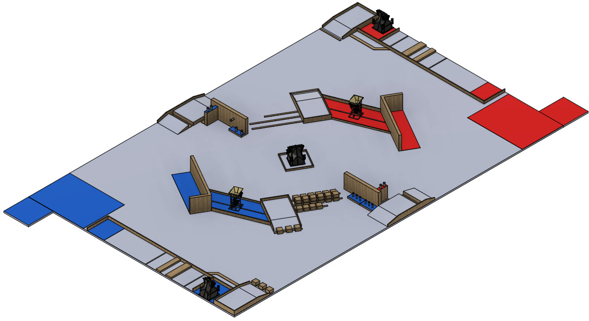

上面図

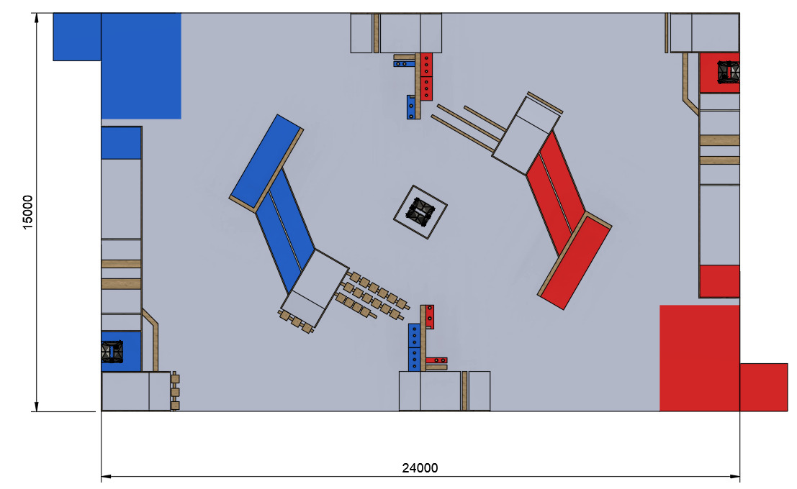

エリア配置

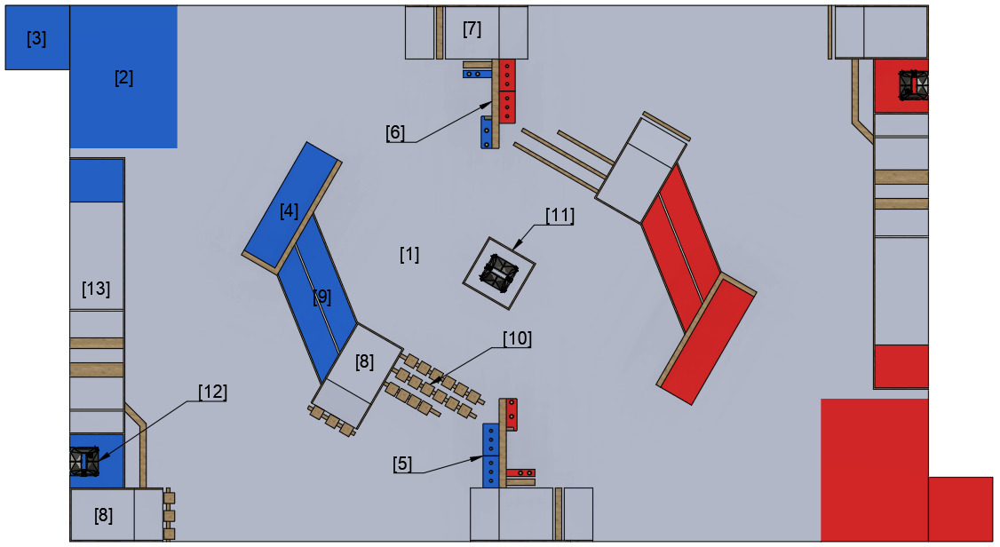

- [1] バトルエリア
- [2] スタートゾーン
- [3] 手動補給ゾーン
- [4] 自動補給ゾーン
- [5] 強化素材置き場
- [6] スポットゾーン
- [7] 高台
- [8]バンカー
- [9] オートタレットゾーン
- [10] ブロックゾーン
- [11] 共通陣地
- [12] 赤・青陣地
- [13]ストライダーエリア

### [1] バトルエリア
バトルエリアは、各エリア・ゾーンや構造物を除くフィールドすべての領域である。

### [2] スタートゾーン
スタートゾーンは赤サイド・青サイド用に1つずつ設置した、3m×4mの領域である。

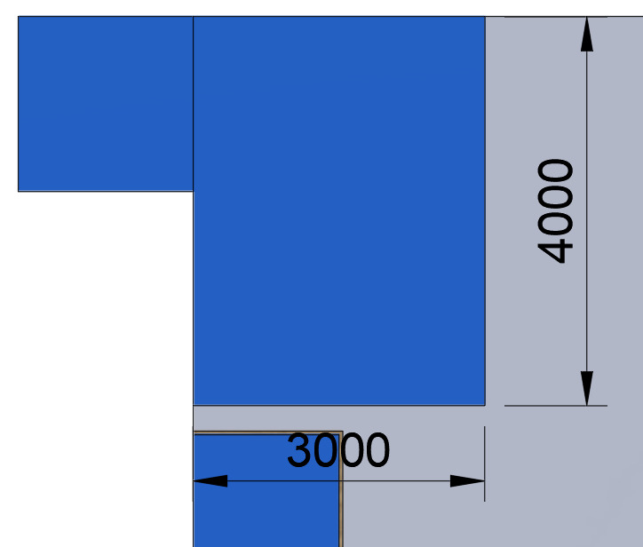

### [3] 手動補給ゾーン
手動補給ゾーンは赤サイド・青サイド用に1つずつ設置した、1.8m×1.8mの領域である。

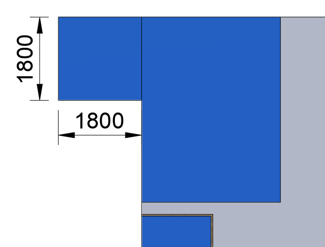

### [4] 自動補給ゾーン
自動補給ゾーンは赤サイド・青サイド用に1つずつ設置した、1m×3.5mの領域である。

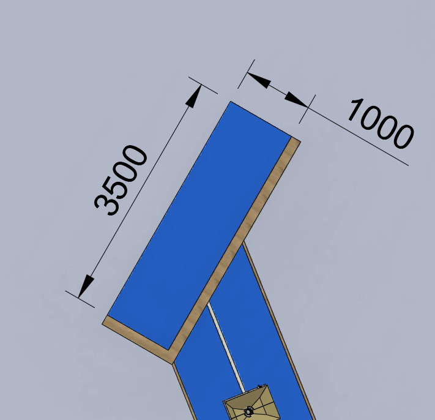

自動補給ゾーンには壁面が木材で組まれたL字型のフェンスが設置されており、アタッカーチームは補給ベースを木ネジなどを用いてフェンスに固定できる。なお、選手権当日のフェンスの各部寸法は若干の誤差を含むため、それを前提とした固定方法を用いることを推奨する。

### [5] 強化素材置き場
強化素材置き場はバトルエリア内に赤サイド・青サイド用に1つずつ設置する。幅900mm、奥行き450mm、高さ101mmの台座に直径60mm、内径56mmのポールを250mmの間隔で床面と直角に3つ取り付けた置き場を2つ連結して用いる。ポール最上面の高さは床面から300mmとする。ラウンド開始時、この6つのポールに強化素材がそれぞれ1つずつ挿入されている。

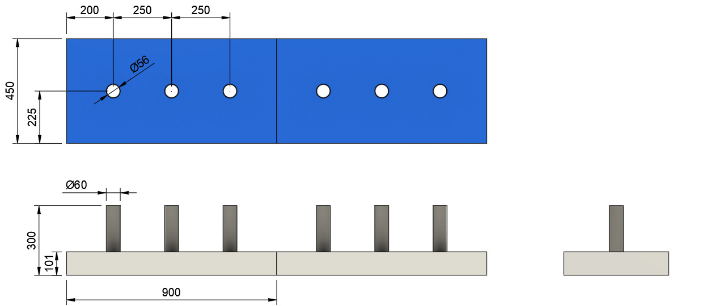

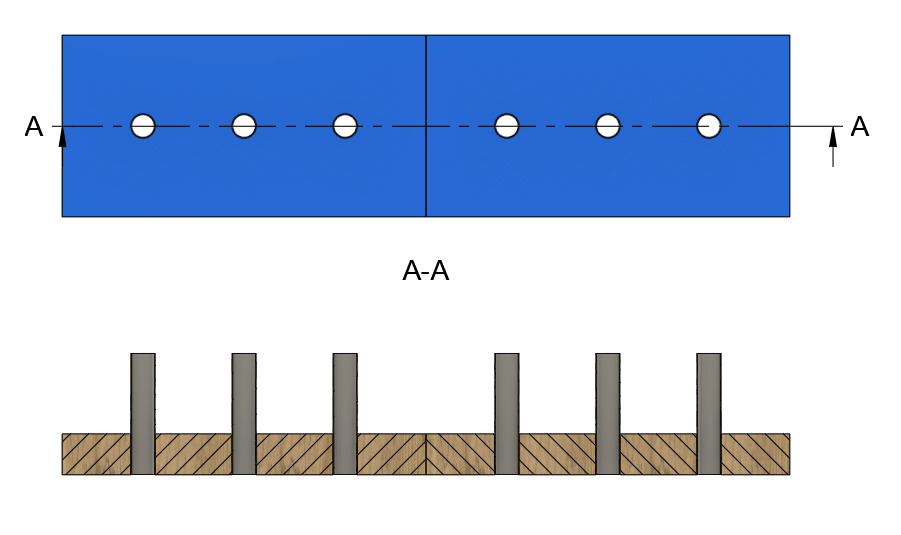

### [6] スポットゾーン
スポットゾーンはバトルエリア内に赤サイド・青サイド用に1つずつ設置する。下図のように直径114mm、内径107mmのポール（スポット）を床面と直角に4つ取り付け、床面と平行に1つ取り付ける。

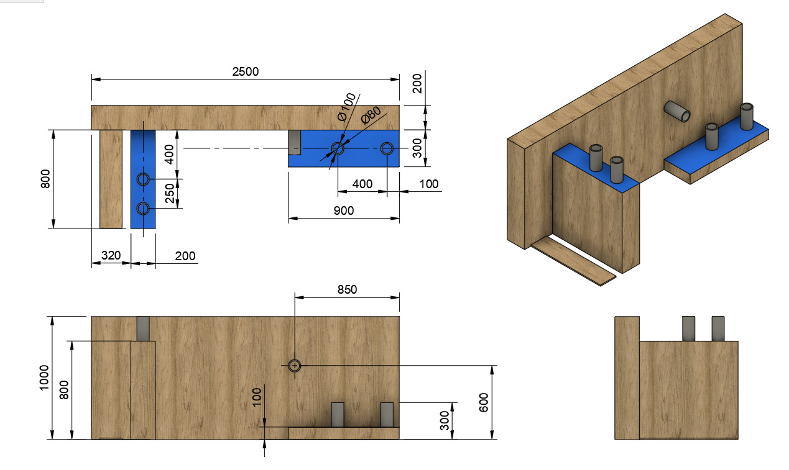

赤サイドの各スポットの配置は以下の図の通りである。青サイドも同様に、フィールド中央側からスポット1からスポット5の順番に並んでいる。
- [6-1] スポット1
- [6-2] スポット2
- [6-3] スポット3
- [6-3] スポット4
- [6-3] スポット5

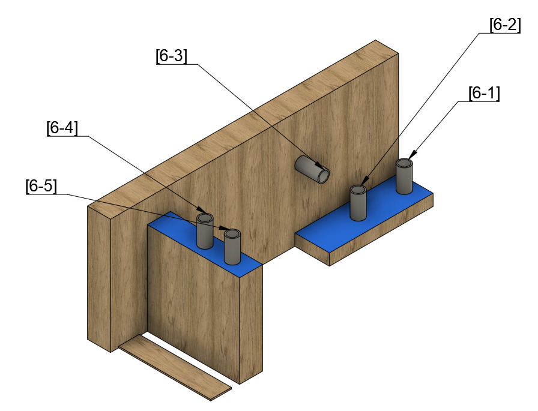

### [7] 高台
高台はバトルエリア内に2つ設置する。高さ200mmの台であり、二方向にスロープが付いている。片方のスロープには谷部があり、ロボットが通過できるようにビルダーがブロックを設置することができる。

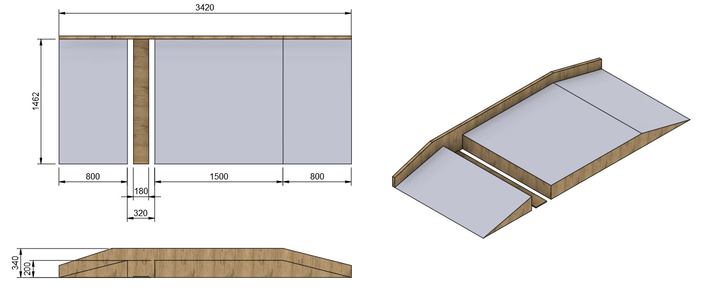

### [8]バンカー
バンカーはバトルエリア内に4つ設置する。高さ200mmの台であり、一方向にスロープがついている。スロープの下端側には厚み12mmのコンパネを用いて幅180mm・長さ1000mmのブロックレール1本を取り付け、すべてのバンカーでスタート時に3つのブロックを配置する。

### [9] オートタレットゾーン
オートタレットゾーンは赤サイド・青サイド用に1つずつ設置した領域である。厚み12mmのコンパネを用いてバトルエリアからかさ上げしている。ゾーンは幅38mm、高さ89mmの2x4材で囲まれている。各同盟は、オートタレット1台をオートタレットゾーンの中央に4章で規定された向きで設置できる。

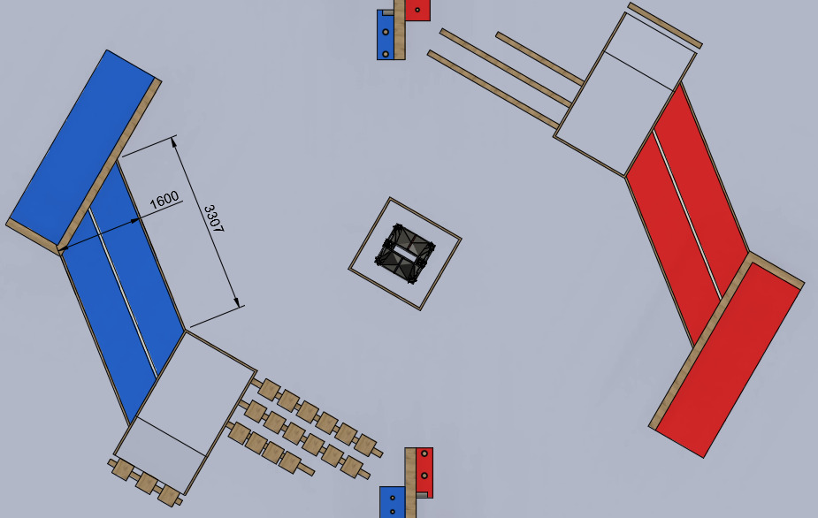

コンパネ上にはオートタレットの配置の際の目安となる下図のようなマーキングが施されている。

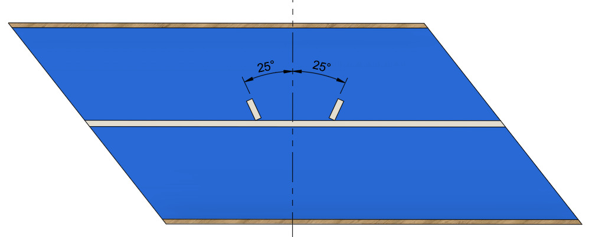

オートタレットゾーンからは、自動ロボットの電源・通信ケーブルを保護する高さ約15mmの床面用ケーブルモールをフィールド外へ向かって設置する。

### [10] ブロックゾーン
オートタレットゾーン横に合計22個のブロックを設置する領域である。厚み12mmのコンパネを用いて幅180mm・長さ2700mmのブロックレールを2本、幅180mm・長さ1800mmのブロックレールを1本取り付ける。

### [11] 共通陣地
共通陣地は1.8m×1.8mの領域の中心に設置している。厚み12mmのコンパネを用いてバトルエリアからかさ上げしている。共通陣地は幅38mm、高さ89mmの2x4材で囲まれている。6つのダメージパネルが取り付けられており、そのうち4つが地面から300mmの高さに、2つが地面から700mmの高さにある。いずれの高さも、ダメージパネルのベースプレート最下端までの高さを示している。700mmの高さにあるダメージパネルは20度の傾斜を付けて配置する。赤同盟が攻撃する3つのダメージパネルは各陣地上の[11-1]に、青同盟が攻撃する3つのダメージパネルは[11-2]の位置に配置する。

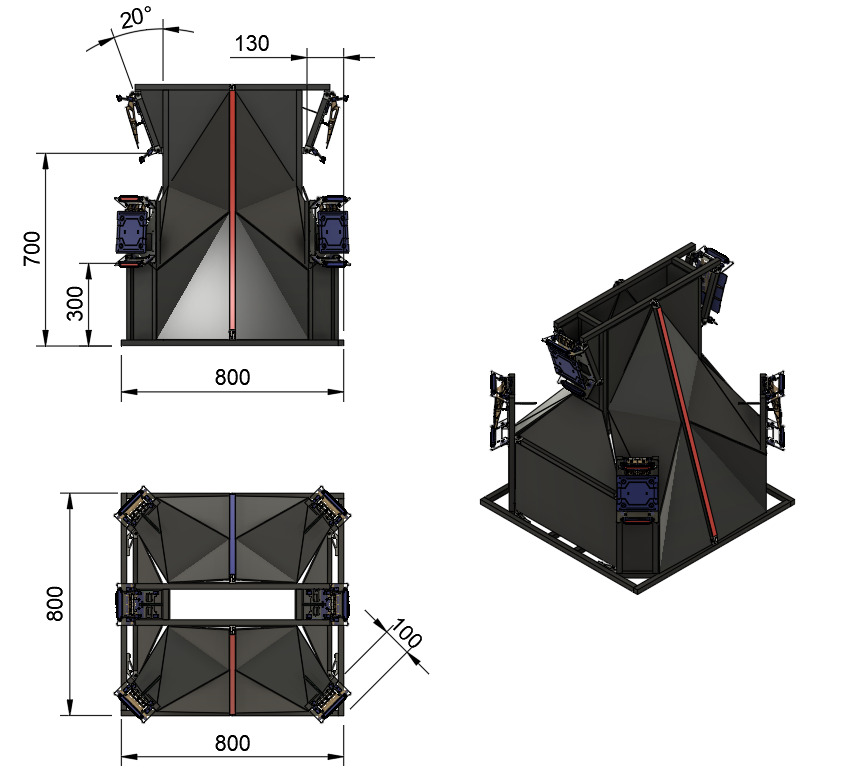

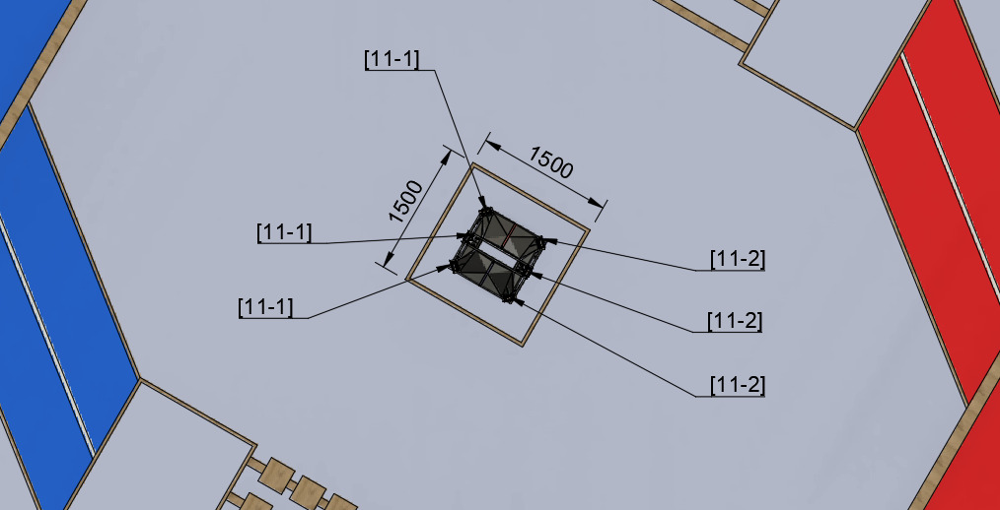

### [12] 赤・青陣地
赤・青陣地は1.8m×1.8mの領域の中心に設置している。厚み12mmのコンパネを用いてバトルエリアからかさ上げしている。どちらの陣地も幅38mm、高さ89mmの2x4材で囲まれている。4つのダメージパネルが取り付けられており、そのうち2つが地面から300mmの高さに、2つが地面から700mmの高さにある。いずれの高さも、ダメージパネルのベースプレート最下端までの高さを示している。700mmの高さにあるダメージパネルは20度の傾斜を付けて配置する。

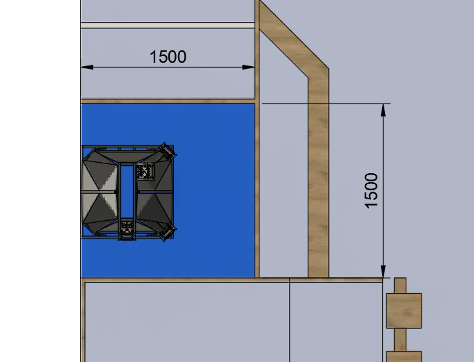

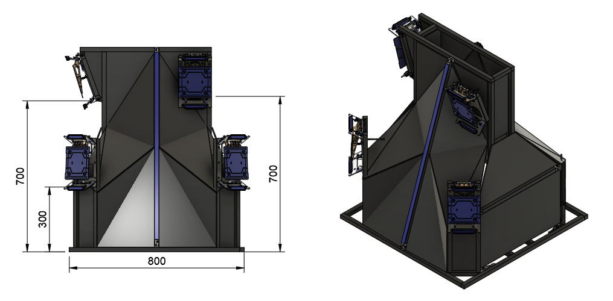

### [13] ストライダーエリア
ストライダーエリアはストライダースタートゾーン、ストライダーゾーン1、ストライダーゾーン2、ストライダーゾーン3で構成する。ストライダーゾーン2には障害物として高さが100mmで奥行きが300mmおよび400mmの段差を配置する。ストライダーゾーン1と2、またゾーン2と3の間は幅50mmのテープで区切る。

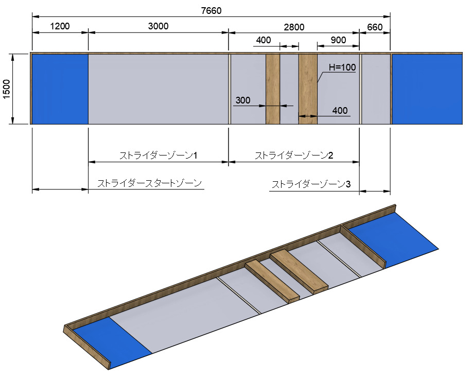

### フェンス
フィールド最外周には単管パイプと木材を用いたフェンスを設置する。フェンスの高さはバトルゾーンから140mmであり、2x6の木材を単管パイプに固定したものを使用する。

