# CoRE-1ルールブック v26.0.0

# 1章　はじめに
本ルールブックはエンジニア選手権、The Championship of Robotics Engineers（CoRE）の1部リーグで使用するルールを記載している。リーグに共通するルールは共通ルールブックに記載されているため、共通ルールブックも参照すること。

# 2章　重要な用語集
ここでは、ルールブック内で使用される用語の中でも重要なものを概説する。各用語の詳細については、ルールブック中の該当する箇所を参照すること。

| 用語 | 定義 |
| -------- | -------- |
| 総大将チーム | ビデオ審査により選出されるチームのこと。総大将チームは所属選手の中から総大将を1名選出する。 |
| 総大将 | 各操縦手の指揮や各ラウンドにおける出撃ロボットの決定、競技中に資源ポイントを消費して各種スキルを発動できる選手のこと。 |
| 同盟 | 総大将チームを筆頭とした複数チームの組み合わせのこと。予選・決勝トーナメントともに個々のチーム同士ではなく同盟同士の対戦を行い、決勝トーナメントの試合で敗北した同盟は勝利した同盟の傘下となって次の試合に出場する。 |
| 決勝トーナメント | 予選で決定した4つの同盟の組み合わせによる、競技優勝を決定するためのトーナメント戦のこと。 |
| 試合 | 各同盟の勝敗を決定するための対戦のこと。 |
| ラウンド | 各試合における対戦の区切りのこと。 |
| アタッカー | 主にフライングディスクを投擲して相手ロボットへ攻撃するロボットのこと。 |
| オートアタッカー | 人の操縦なしに完全自律で行動し、ミニフライングディスクを投擲して相手ロボットへ攻撃するロボットのこと。 |
| ビルダー | フィールド上のブロックを運搬・配置し、フィールド上で新たな通行ルートの開拓やシールドの構築などを行うロボットのこと。 |
| ストライダー | 4本の脚を有しており、各種障害物が配置されたフィールド上の指定エリアを歩行するロボットのこと。 |
| ヘッドアタッカー | 同盟内の出撃アタッカーの中から1台が割り当てられ、大量のヒットポイントを持ち自動回復機能を有するが、撃破されるとその時点でラウンド終了となるロボットのこと。 |
| HP | ロボットのヒットポイントのこと。 |
| 撃破 | ロボットのHPが0となり、行動できなくなった状態のこと。 |
| 復活 | 撃破状態からHPが回復して競技に復帰できる要素のこと。 |
| VP（勝利ポイント）| 各ラウンドの勝敗条件に用いるポイントのこと。|
| RP（資源ポイント）| 各ラウンド中に使用することで各種スキルを得られるポイントのこと。|
| RPコンテナ | スポットへ設置することでRPが獲得できる競技用品のこと。 |
| ブロック | ビルダーが移動させることができる競技用品のこと。 |
| オートレフェリーシステム | 競技中のヒット判定やHP管理、その他判定に関する処理を行うシステムのこと。 |
| ダメージパネル | ロボットにフライングディスクがヒットしたことを判定する装置のこと。 |
| 陣地 | ダメージパネルが取り付けられた構造物のこと。フィールド上に2つ設置されており、ダメージパネルへの攻撃によって撃破できる。 |

# 3章　ロボット共通の規則
**⚠注意**
- 人間に対して危害を及ぼす可能性がないか、また他のロボットやフィールドを破損させる可能性がないか十分にリスク評価し、許容可能な範囲となるまでリスク軽減策を講じなければならない。

## エネルギー源の規則
ロボットは電力もしくは圧縮空気以外のエネルギー源を用いてはならない。

**⚠禁止事項**
- 燃焼機関や高圧ガス、爆発物、危険な化学物質などの使用は禁じる。
- 油圧、水圧などフィールドを汚染する可能性があるアクチュエータの使用は禁じる。

### 電源の制限
アタッカー・オートアタッカー・ビルダーへ供給する電源の電圧は公称24Vを、ストライダーへ供給する電源の電圧は公称48Vを超えてはならない。電源には、容量が40A以下の電流遮断用素子や器具（ヒューズやブレーカーなど）を設けなければならない。

**⚠留意事項**
- 以降のルール改定ではオートレフェリーシステムにより電力消費量を計測し、電力消費量が大きい場合に競技上不利となるルールの導入を予定している（電力消費量が一定値を超えるとHPが減少するなど）。

### 圧縮空気の制限
圧縮空気はゲージ圧力が常温で0.75MPaを超えてはならない。このゲージ圧力が常に確認できる圧力計を取り付けること。なお圧縮空気のエアタンクは、市販のエアタンク以外を使用してはならない。

## ロボットの規則
### 外観の制限
ロボットの外観には、ダメージパネルなどオートレフェリーシステムと誤認するようなデザインおよび光源を使用してはならない。また、他のロボットに搭載されたカメラのホワイトバランスが崩れるような光源を使用してはならない。光源がどの方向から見てもカメラに向かないようにしなければならない。チーム外の第三者に権利が帰属するデザインは、正当な許諾なく使用してはならない。

### 非常停止スイッチの取付
ロボットには、非常停止スイッチとして黄色の土台に取り付けた赤い押しボタンを1つ以上備えなければならない。設置位置は、第三者でも見つけやすく、360度どこからでもいずれかのスイッチを押すことができ、スイッチを押す時に最もリスクが少ない位置としなければならない。非常停止スイッチの設置位置に関しては、ロボット全体の外観、デザイン性などよりも第三者でも安全に操作できることを最優先にして決定すること。

### チームコードシールの貼付
各チームのロボットを識別しやすくするため、チームコードを記載したシールをロボットに貼り付けなければならない。シールは実行委員会から各チームに2枚を配布する。様々な方向からチームコードが見えやすくなるよう、シールはそれぞれが対向するように貼り付けなければならない。なお、シールは容易に剥がれない下地に貼り付けなければならない。

シールのサイズは約270mm×80mmである（下記の例を参照）。シールには最大4桁のチームコード、CoREのロゴ、チームエンブレムを掲載する。

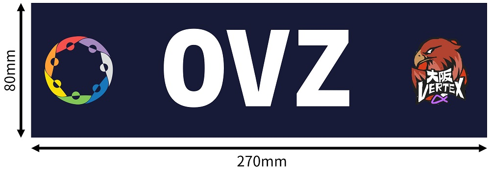

## 競技に必要な機能の実装
**⚠注意**
- 各チームはロボットの構造を考慮した上で、最も安全に完全停止（脱力）状態へ移行できる機能を実装しなければならない。

ロボットには以下の機能をすべて実装しなければならない。
1. 遠隔非常停止スイッチを含め、非常停止スイッチのいずれか1つを押した時にロボットが完全停止（脱力）状態へ移行する。
2. 撃破状態が発生するロボットは、撃破時にロボットが完全停止（脱力）状態へ移行する。牽引機構が搭載されたロボットは、撃破時に牽引状態を解除する。
3. 操縦可能なロボットは、操縦の信号がロストした時にロボットが完全停止（脱力）状態へ移行する。

1に関して、速やかにアクチュエータに供給される全てのエネルギー源を遮断し、安全に完全停止（脱力）状態へ移行しなければならない。この完全停止（脱力）状態は、操縦手からの操作があっても、完全停止（脱力）状態を維持しなければならない。

2に関して、オートレフェリーシステムから出力する撃破状態を表す信号をチーム側の制御回路で読み取り、撃破時に速やかにアクチュエータに供給されるエネルギー源を遮断し、安全に完全停止（脱力）状態へ移行しなければならない。また、このとき牽引機構が搭載されたロボットは牽引状態を解除し、牽引されたロボットもしくはシールドキャリアーを一切拘束せず、自由に移動できる状態にしなければならない。

3に関して、信号がロストした時に速やかにアクチュエータに供給される全てのエネルギー源を遮断し、安全に完全停止（脱力）状態へ移行しなければならない。この完全停止（脱力）状態は、信号が復帰するまで継続しなければならない。

# 4章　アタッカー
アタッカーは、フライングディスクを用いた相手ロボットと陣地への攻撃、RPコンテナの回収と設置、また他ロボットやシールドキャリアーの牽引が可能なロボットである。

## サイズの制限
アタッカーのサイズは、試合開始時に幅800mm×奥行き800mm×高さ1000mmを超えてはならない。試合開始後は幅1000mm×奥行き1000mm×高さ1200mmを超えてはならない。サイズの計測にはオートレフェリーシステムを含め、マガジンを利用する場合はマガジンも含める。なお、複数種類のマガジンを使用する場合には、競技中起こり得るマガジン取り付けのパターンすべてにおいてサイズ制限を超えてはならない。また、映像伝送装置のうち、HDMIトランスミッターとそのマウントパーツ、バッテリー、HDMIケーブルはサイズの計測に含めない。

## アームの制限
RPコンテナの回収や設置に使用するアーム機構は、その最下端と床面の距離が300mmを下回らないように、動作範囲が機械的に制限されていなければならない。

## フライングディスク射出機構の制限
フライングディスクの射出速度は秒速10m/sを超えてはならない。また、射出機構の数は1つまでとする。ただし競技中に人が一切操縦せず、センサ情報などを使って自動制御されている射出機構の数は制限しない。

## 牽引機構の制限
他ロボットやシールドキャリアーを牽引する機構は、撃破時に牽引状態が解除されるようにしなければならない。

## 分離の制限
マガジンを除いて、アタッカーは分離してはならない。

## 重量の制限
アタッカーの重量は40kgを超えてはならない。重量の計算には、バッテリー、映像伝送装置、オートレフェリーシステム、エアタンクを含め、マガジンを利用する場合はマガジンも含める。なお、複数種類のマガジンを使用する場合には、競技中起こり得るマガジン取り付けのパターンすべてにおいて40kgを超えてはならない。エアタンクの重量の計算には空気の有無は問わない。また、映像伝送装置のうち、HDMIトランスミッターとそのマウントパーツ、バッテリー、HDMIケーブルは重量の計算に含めない。

## 操縦方法の制限
実行委員会が貸出する操縦用無線モジュールを用いた無線通信以外の手段を用いてはならない。なお、緊急時に操縦手から無線通信によって停止を指令できるようにしなければならない。

## 無線通信の制限
操縦以外の目的で使用する無線モジュールは、5GHz・1.9GHz・920MHz・315MHz帯の周波数を用いてはならない。

## 競技システムの搭載
アタッカーには以下の装置・部品を取り付け、適切に接続しなければならない。いずれも詳細は競技システムのルールブックを参照すること。
1. 操縦用の無線受信モジュール
2. オートレフェリーシステムのクライアント
3. 映像伝送装置

## マガジンの規則
**⚠注意**
- マガジンの使用および製作は必須ではない。

ラウンド中、補給手によってフライングディスクを補給できる。このとき、フライングディスクを搭載したマガジンをロボットに取り付けることで補給することもできる。マガジンを使用する場合、以下の制限を満たさなければならない。
- マガジンのサイズは、500mm×500mm×800mmを超えてはならない。
- マガジンには、電力や圧縮空気などのエネルギー源を取り付けてはならない。

# 5章　オートアタッカー
オートアタッカーは、ミニフライングディスクを用いて相手ロボットや陣地への攻撃が可能なロボットである。オートアタッカーは、ラウンド中に人が操縦することができず、完全に自律して行動する必要がある。

## サイズの制限
オートアタッカーのサイズは、幅800mm×奥行き800mm×高さ1000mmを超えてはならない。サイズの計測にはオートレフェリーシステムが含まれる。

## ミニフライングディスク射出機構の制限
ミニフライングディスクの射出速度は秒速10m/sを超えてはならない。

## 分離の制限
オートアタッカーは分離してはならない。

## 重量の制限
オートアタッカーの重量は20kgを超えてはならない。重量の計算には、バッテリー、オートレフェリーシステム、エアタンクを含める。エアタンクの重量の計算には空気の有無は問わない。

## 操縦方法の制限
操縦手がラウンド開始時・終了時に遠隔でオートアタッカーを始動・停止させる時には、実行委員会が貸出する操縦用無線モジュールを用いた無線通信以外の手段を用いてはならない。なお、緊急時に操縦手から無線通信によって停止を指令できるようにしなければならない。

## 競技システムの搭載
オートアタッカーには以下の装置・部品を取り付け、適切に接続しなければならない。いずれも詳細は競技システムのルールブックを参照すること。
1. 操縦用の無線受信モジュール
2. オートレフェリーシステムのクライアント

# 6章　ビルダー
ビルダーは、ブロックの移動と設置、RPコンテナの回収と設置、また他ロボットやシールドキャリアーの牽引が可能なロボットである。

## サイズの制限
ビルダーのサイズは、試合開始時に幅800mm×奥行き800mm×高さ1000mmを超えてはならない。試合開始後は幅1200mm×奥行き1200mm×高さ1200mmを超えてはならない。サイズの計測にはオートレフェリーシステムが含まれる。また、映像伝送装置のうち、HDMIトランスミッターとそのマウントパーツ、バッテリー、HDMIケーブルはサイズの計測に含めない。

## 牽引機構の制限
他ロボットやシールドキャリアーを牽引する機構は、撃破時に牽引状態が解除されるようにしなければならない。

## 分離の制限
ビルダーは分離してはならない。

## 重量の制限
ビルダーの重量は40kgを超えてはならない。重量の計算には、バッテリー、映像伝送装置、オートレフェリーシステム、エアタンクを含める。エアタンクの重量の計算には空気の有無は問わない。また、映像伝送装置のうち、HDMIトランスミッターとそのマウントパーツ、バッテリー、HDMIケーブルは重量の計算に含めない。

## 操縦方法の制限
実行委員会が貸出する操縦用無線モジュールを用いた無線通信以外の手段を用いてはならない。なお、緊急時に操縦手から無線通信によって停止を指令できるようにしなければならない。

## 無線通信の制限
操縦以外の目的で使用する無線モジュールは5GHz・1.9GHz・920MHz・315MHz帯の周波数を用いてはならない。

## 競技システムの搭載
ビルダーには以下の装置・部品を取り付け、適切に接続しなければならない。いずれも詳細は競技システムのルールブックを参照すること。
1. 操縦用の無線受信モジュール
2. オートレフェリーシステムのクライアント
3. 映像伝送装置

# 7章　ストライダー
**⚠注意**
- ストライダーはCoRE-1での技術開発を促進するためテクニカルチャレンジとして実施する。テクニカルチャレンジでは開発する技術の方向性を絞り込んでいるため、エントリーチームは当該チャレンジの趣旨を理解して技術開発に挑戦すること。

ストライダーは、障害物踏破によるRP獲得、また総大将へストライダー視点の映像伝送ができるロボットである。

## ストライダーテクニカルチャレンジの趣旨
このストライダーのテクニカルチャレンジは、Boston Dynamics社のSpotMiniやUnitree社のUnitree Go2のような、主に2-3自由度の脚部を4本持ち、それらが生成する歩容によって移動するロボットの開発を目指すものである。ロボット競技界隈ではテオヤンセン機構やチェビシェフリンク機構などを使用した1自由度の脚部を複数を用いた歩行ロボットが見られるが、本テクニカルチャレンジではこのような類いの歩行ロボットの開発は目指す方向とは異なるため出場を許可しない。したがって、ストライダーの開発にあたっては実行委員会へ開発方針を共有し、承認を得なければ出場できないこととする。また、選手権開催直前に開発したストライダーのビデオを実行委員会へ提出し、本テクニカルチャレンジの趣旨に沿ったストライダーが開発されていることを実行委員会が確認できなければ、出場することはできない。なお、ビデオ審査においてはストライダーの完成度自体の高さは関係なく、あくまで本テクニカルチャレンジの趣旨に沿ったストライダーが開発されているかどうかを確認する。

## サイズの制限
ストライダーのサイズは、4脚での直立状態で幅1000mm×奥行き1000mm×高さ1200mmを超えてはならない。ただし有線操縦の場合、ケーブル固定用の支柱はサイズに含めない。ストライダーの脚先接地点から膝関節に相当する箇所までのリンク長、および膝関節から股関節に相当する箇所までのリンク長はいずれも200mmから400mmまでの長さにしなければならない。また、映像伝送装置のうち、HDMIトランスミッターとそのマウントパーツ、バッテリー、HDMIケーブルはサイズの計測に含めない。

## 分離の制限
ストライダーは分離してはならない。

## 重量の制限
ストライダーの重量は30kgを超えてはならない。重量の計算には、バッテリー、映像伝送装置、エアタンクを含める。エアタンクの重量の計算には空気の有無は問わない。また、映像伝送装置のうち、HDMIトランスミッターとそのマウントパーツ、バッテリー、HDMIケーブルは重量の計算に含めない。

## 操縦方法の制限
実行委員会が貸出する操縦用無線モジュールを用いた無線通信、もしくはチームが用意する有線通信のどちらかの手段を用いなければならない。なお、いずれの手段でも緊急時に操縦手から停止を指令できるようにしなければならない。有線通信の場合、ケーブルがストライダー本体に絡まらないようストライダー上部に高さ300mm以上のケーブル固定用の支柱を取り付けなければならない。また、ケーブルの長さは十分に確保し、ケーブルを介してストライダーに力を作用させないようにしなければならない。

## 無線通信の制限
操縦以外の目的で使用する無線モジュールは5GHz・1.9GHz・920MHz・315MHz帯の周波数を用いてはならない。

## 競技システムの搭載
ストライダーには以下の装置・部品を取り付け、適切に接続しなければならない。いずれも詳細は競技システムのルールブックを参照すること。
1. 操縦用の無線受信モジュール（有線操縦の場合は除く）
2. 映像伝送装置

# 8章　総大将チームの決定と同盟の結成
**⚠注意**
- 2026シーズンより総大将決定戦（アタッカー予選）は行わず、すべての試合が同盟バトルとなる。

総大将チームおよび同盟の割り当ては、シーズン途中に行うビデオ審査の順位に基づいて決定する。

## 総大将チームの決定方法
総大将チームは、アタッカーを開発したチームから選出される。アタッカーの審査ビデオに対して実行委員会が評点を付け、このうち上位4チームを総大将チームとする。

### 同盟の結成方法
ビデオ審査で決まった4つの総大将チームに対し、以下の手順で他のチームを割り当てて4つの同盟を結成する。
1. 総大将チームがアタッカー以外のロボット種別を開発していた場合、そのロボットを当該総大将チームの同盟に割り当てる。
2. ビデオ審査順位1位の総大将チームから順番に、残りのアタッカー・オートアタッカー・ビルダー・ストライダーから2台のロボットを指名して同盟に割り当てる。なお、他のロボット種別も開発しているアタッカーチームを指名した場合、アタッカーと当該チームが開発したもう1台のロボットの2台を同時に割り当てる。指名前に、すべてのチームの審査ビデオを出場チームに共有する。
3. ビデオ審査の順位が偏らないよう、また特定の同盟に同一種別のロボットが偏らないよう、実行委員会が残りのすべてのロボットを各同盟に割り当てる。

# 9章　競技形式
競技は予選と決勝トーナメントに分けて実施する。

まず予選では、4つの同盟による同盟バトルを総当たり形式で実施する。総当たり戦の結果を決勝トーナメントの組み合わせ決定に用いる。予選では各総大将指揮の下、各同盟からアタッカーとビルダーを合わせて4台、オートアタッカー最大1台、ストライダー最大1台を出撃させて1本先取の試合を行う。

決勝トーナメントでは4つの同盟による同盟バトルをトーナメント形式で実施する。準決勝では各総大将の指揮の下、各同盟からアタッカーとビルダーを合わせて4台、オートアタッカー最大1台、ストライダー最大1台を出撃させて2本先取の試合を行う。準決勝で敗北した同盟は、対戦相手の同盟の傘下に入って1つの同盟となり、決勝戦に進出する。決勝戦では各総大将の指揮の下、各同盟からアタッカーとビルダーを合わせて5台、オートアタッカー最大1台、ストライダー最大1台を出撃させて3本先取の試合を行う。決勝戦で勝利した同盟が競技優勝、敗北した同盟が競技準優勝となる。

以下に、各競技形式の詳細を説明する。

## 予選の形式
**⚠注意**
- 同盟内のロボットが予選中に最低2回は出撃するように、総大将は出撃ロボットを選ばなければならない。

総当たり形式で4つの同盟による同盟バトルを行う。

### 総当たり形式での同盟バトル
2つの同盟による1ラウンド7分間の同盟バトルを行う。予選の各試合は1ラウンド1本先取形式（BO1）で行う。予選の各ラウンドでは総大将指揮の下、下記の通りロボットを出撃させて競技を行う。同盟内のロボットが予選中に最低2回は出撃するように、総大将は出撃ロボットを選ばなければならない。試合の流れについては10章「各競技の進行」を参照すること。

#### 予選の出撃ロボット台数
- アタッカーとビルダー合わせて4台
- オートアタッカー最大1台
- ストライダー最大1台

試合は、以下の条件のいずれかを満たすと終了する。
- ヘッドアタッカーが撃破される
- 上記条件に当てはまらず、7分間が経過する。

### ラウンドの勝敗条件
予選の各ラウンドの勝敗は、以下の順序で決定する。
1. 相手ヘッドアタッカーを撃破した同盟の勝利
2. 獲得VPが多い同盟の勝利
3. スポットにより多くのRPコンテナを設置した同盟の勝利
4. 以上の条件で決定できない場合、引き分けとなる

### 組み合わせ表
予選は以下の組み合わせ表の通り、総大将チームのアタッカー審査順位に応じて実施する。

| | 青サイド | 赤サイド |
| -------- | -------- | -------- |
| 第1試合 | 4位の同盟 | 3位の同盟 |
| 第2試合 | 2位の同盟 | 1位の同盟 |
| 第3試合 | 4位の同盟 | 2位の同盟 |
| 第4試合 | 3位の同盟 | 1位の同盟 |
| 第5試合 | 3位の同盟 | 2位の同盟 |
| 第6試合 | 1位の同盟 | 4位の同盟 |
| 第7試合 | 4位の同盟 | 3位の同盟 |
| 第8試合 | 2位の同盟 | 1位の同盟 |
| 第9試合 | 4位の同盟 | 2位の同盟 |
| 第10試合 | 3位の同盟 | 1位の同盟 |
| 第11試合 | 3位の同盟 | 2位の同盟 |
| 第12試合 | 1位の同盟 | 4位の同盟 |

### 予選結果による順位付け
予選結果に基づいて、以下の順序で順位付けを行う。
1. 6回の試合の勝ち数
2. 6回の試合の獲得VPの総数

## 決勝トーナメントの形式
**⚠注意**
- 同盟内のロボットが準決勝では第2ラウンドまでに、決勝戦では第3ラウンドまでに最低1回は出撃するように、総大将は出撃ロボットを選ばなければならない。

予選で決まったトーナメントの組み合わせに基づき、4つの同盟による同盟バトルを行う。準決勝で敗北した同盟は勝利した同盟の傘下に入り、決勝に進出する。

### 同盟バトル
2つの同盟による1ラウンド7分間の同盟バトルを行う。準決勝は3ラウンド2本先取形式（BO3）、決勝は5ラウンド3本先取形式（BO5）で行う。決勝トーナメントの各ラウンドでは総大将指揮の下、下記の通りロボットを出撃させて競技を行う。準決勝、決勝ともに同盟内のロボットが準決勝では第2ラウンドまでに、決勝戦では第3ラウンドまでに、最低1回は出撃するように総大将は出撃ロボットを選ばなければならない。試合の流れについては10章「各競技の進行」を参照すること。

#### 準決勝の出撃ロボット台数
- アタッカーとビルダー合わせて4台
- オートアタッカー最大1台
- ストライダー最大1台

#### 決勝の出撃ロボット台数
- アタッカーとビルダー合わせて5台
- オートアタッカー最大1台
- ストライダー最大1台

決勝トーナメントにおける各ラウンドは、以下の条件のいずれかを満たすと終了する。
- ヘッドアタッカーが撃破される
- 上記条件に当てはまらず、7分間が経過する。

### ラウンドの勝敗条件
決勝トーナメントにおける各ラウンドの勝敗は、以下の順序で決定する。
1. 相手ヘッドアタッカーを撃破した同盟の勝利
2. 獲得VPが多い同盟の勝利
3. スポットにより多くのRPコンテナを設置した同盟の勝利
4. 以上の条件で決定できない場合、引き分けとなり当該ラウンドは再試合となる

### トーナメント表
決勝トーナメントは以下の同盟の割り当てで実施する。各対戦において上側の同盟がフィールドの赤サイドに、下側の同盟が青サイドに割り当てられる。

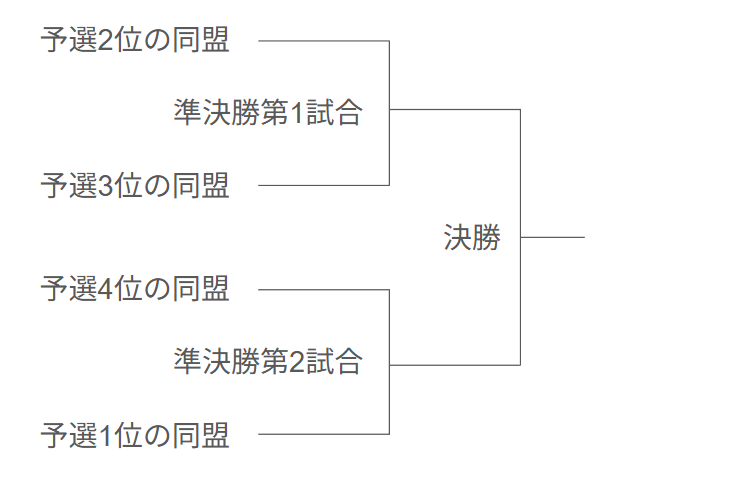

## 競技における選手の役割
各チームはエントリーした選手の中からロボットごとに操縦手1名、整備手5名を選出する。またアタッカー、オートアタッカー開発チームは必要に応じて補給手を選出できる。総大将チームは総大将を1名選出する。

### 総大将チームによる総大将の選出
総大将チームは自チームに所属する選手の中から総大将1名を選出する。総大将候補となる選手1名は、チーム情報提出時に申請しなければならない。総大将は操縦手・整備手・補給手と兼任してはならない。また総大将は選出後、変更してはならない。敗北した同盟の総大将はその役割がなくなる形で、勝利した同盟の傘下に入る。

### 総大将の役割
総大将は、同盟に所属する選手の意見を参考に決勝トーナメントの各ラウンドで出撃させるロボットを決定し、ヘッドアタッカーの割り当てを行う。ラウンド中、総大将は操縦ブースの指定位置で指揮しなければならない。総大将は操縦ブースで自同盟から出撃中のロボットすべての操縦画面を見ることができ、ヘッドセットを使って自同盟から出撃中の操縦手と双方向に会話できる。ただし、総大将はストライダーの操縦手とはラウンド中にヘッドセットで会話できない。総大将は、操縦ブースに設置された端末を操作し、資源ポイントを消費して各種スキルを発動できる。また、総大将はセッティングタイムに参加できる。

### 総大将チームによる副大将の選出
総大将チームは自同盟に所属する自チーム以外の選手の中から副大将1名を選出する。ただし、副大将は操縦手・整備手・補給手と兼任してはならない。また副大将は選出後、変更してはならない。敗北した同盟の副大将はその役割がなくなる形で、勝利した同盟の傘下に入る。

### 副大将の役割
副大将は、総大将を補佐する形で戦略の考案と操縦手への指揮を行う。ラウンド中、副大将は操縦ブースの指定位置で指揮しなければならない。副大将は操縦ブースで自同盟から出撃中のロボットすべての操縦画面を見ることができ、ヘッドセットを使って自同盟から出撃中の操縦手と双方向に会話できる。ただし、副大将はストライダーの操縦手とはラウンド中にヘッドセットで会話できない。また、副大将はセッティングタイムに参加できる。

### アタッカーおよびビルダー操縦手の役割
アタッカーおよびビルダーの操縦手は、映像伝送装置で送信される映像を見ながらロボットを操縦する。ラウンド中、操縦ブースの操縦席に着席しなければならない。操縦手はヘッドセットを使って自同盟から出撃中の他の操縦手および総大将・副大将と相互に会話できる。また、操縦手はセッティングタイムに参加できる。

### オートアタッカー操縦手の役割
オートアタッカーの操縦手はロボットを直接目視しながら動作開始、停止の命令を送信する。ラウンド中、操縦手はオートアタッカーの状態を直接視認するためフィールド付近を移動できる。ラウンド開始後、動作開始の命令を送信した後は、緊急時およびラウンド終了時にオートアタッカーの動作を完全停止する以外の命令を送ってはならない。ラウンド中に一度停止させた場合、再度動作開始の命令を送ってはならない。なお、操縦手は、自同盟から出撃中の他の操縦手および総大将・副大将と会話できない。また、操縦手はセッティングタイムに参加できる。

### ストライダー操縦手の役割
ストライダーの操縦手は、ストライダーエリア付近でロボットを直接目視しながら操縦する。操縦手はラウンド開始時、自同盟から出撃中の他の操縦手および総大将・副大将の会話を聞くことはできない。ストライダーがゴールゾーンまで到達した後、ワイヤレスヘッドセットを装着して他の操縦手および総大将・副大将の会話を聞くことのみができる。また、操縦手はセッティングタイムに参加できる。

### アタッカー整備手の役割
アタッカーの整備手は、セッティングタイムにアタッカーの調整を行う。またラウンド中、手動補給エリアで自チームのアタッカーの軽整備ができる。セッティングタイム終了後、整備手はスタンバイブースで待機しなければならない。ただしラウンド中、軽整備を行う予定の整備手（1チーム1名まで）は補給待機ブースで待機しなければならない。

### ビルダー整備手の役割
ビルダーの整備手は、セッティングタイムにビルダーの調整、および自同盟側の他の整備手と協力して、自同盟側のブロックの初期位置を調整できる。またラウンド中、手動補給エリアで自チームのビルダーの軽整備ができる。セッティングタイム終了後、整備手はスタンバイブースで待機しなければならない。ただしラウンド中、軽整備を行う予定の整備手（1チーム1名まで）は補給待機ブースで待機しなければならない。

### オートアタッカー整備手の役割
オートアタッカーの整備手は、セッティングタイムにオートアタッカーの設置・調整を行う。セッティングタイム終了後、整備手はスタンバイブースで待機しなければならない。

### ストライダー整備手の役割
ストライダーの整備手は、セッティングタイムにストライダーの設置・調整を行う。セッティングタイム終了後、整備手はスタンバイブースで待機しなければならない。

### アタッカー補給手の役割
アタッカーの補給手は、手動補給ゾーンで自チームのアタッカーへフライングディスクを補給できる。ラウンド中、手動補給を行う予定のアタッカーの補給手は補給待機ブースで待機しなければならない。また、アタッカーの補給手はセッティングタイムに参加できる。

### オートアタッカー補給手の役割
オートアタッカーの補給手は、セッティングタイムにオートアタッカーへミニフライングディスクを補給する。セッティングタイム終了後、補給手はスタンバイブースで待機しなければならない。また、オートアタッカーの補給手はセッティングタイムに参加できる。

## 審判団
競技状況はオートレフェリーシステムによって自動で判定し、システムのみで判定できない箇所は審判団が補助する。

# 10章　各競技の進行
予選、決勝トーナメントの各試合では以下のプロセスに従って競技が進行する。

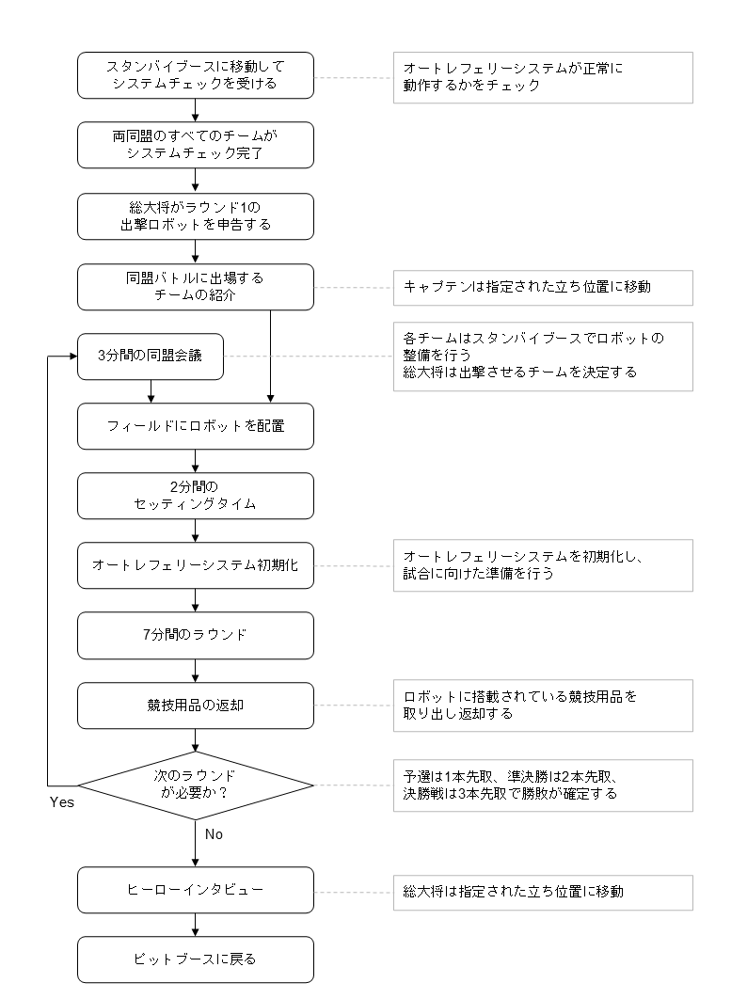

## システムチェック
試合に出場するグループのすべてのチームは、スタンバイブースでシステムチェックを受けなければならない。システムチェックでは、オートレフェリーシステムが正常に動作するかをチェックする。

## ラウンド1の出撃ロボットの決定
両同盟の総大将は、ラウンド1で同盟から出撃させるロボットとその操縦席の番号を決定し、審判へ申告する。申告は実行委員会が作成したフォーマットの書類に記載する形で行う。申告後、出撃するチームと操縦席番号は一切変更できない。

## 出場チームの紹介
出場する両同盟のすべてのキャプテンは、対戦同盟の入場および紹介に参加するため指定位置へ速やかに移動しなければならない。

## フィールドへロボットを配置
審判の指示に従って、出撃チームの整備手はアタッカーおよびビルダーをスタートゾーンへ、オートアタッカーをオートアタッカースタートゾーンへ、ストライダーをストライダースタートゾーンへ配置する。

## セッティングタイム
タイマーの合図で2分間のセッティングタイムが開始する。この時間では、出撃チームの操縦手および整備手がフィールドに入って、ロボットの調整・動作確認ができる。また、各チームにはセッティングタイム開始とともにフライングディスクおよびミニフライングディスクが割り当てられる。操縦手はセッティングタイム終了までに操縦席に着席しなければならない。
- 決勝トーナメントにおいては、セッティングタイム中に出撃チームにトラブルが起きた場合、審判に対して最大2分間のタイムアウトを申告できる。詳細はタイムアウトの項を参照すること。
- オートレフェリーシステムや映像伝送装置などの競技システムにトラブルが起きた場合、テクニカルタイムアウトの措置が執られることがある。詳細はテクニカルタイムアウトの項を参照すること。

## オートレフェリーシステムの初期化
セッティングタイムが終了し、フィールドから選手・審判を含めてすべての人が出た後に、オートレフェリーシステムの初期化を行う。

## ラウンド
タイマーのカウントダウンとともに、7分間のラウンドが開始する。ラウンド終了後、各チームの整備手はロボットの電源を切るか、非常停止スイッチを操作しなければならない。

## オートアタッカーのスタート
オートアタッカーの操縦手は、ラウンド開始後にオートアタッカーに動作開始の命令を送信できる。動作開始後は、緊急時およびラウンド終了時にオートアタッカーの動作を完全停止する以外の命令を送ってはならない。

## 競技用品の返却
ラウンド終了後、ロボットに競技用品が搭載されている場合は速やかに取り出して返却すること。

## 勝敗の確定
予選ではどちらかの同盟がラウンドを1本先取、準決勝では2本先取、決勝戦では3本先取した時点でその試合が終了する。決勝トーナメントでは試合終了後、両総大将に対してヒーローインタビューが行われる。

## 同盟会議
決勝トーナメントにおいて次のラウンドがある場合は、タイマーの合図で3分間の同盟会議が開始する。両同盟の総大将は、当該ラウンドに同盟から出撃させるロボットとその操縦席の番号を決定し、同盟会議の時間が終了するまでに審判へ申告する。申告は実行委員会が作成したフォーマットの書類に記載する形で行う。申告後、出撃するチームと操縦席番号は一切変更できない。

## セッティングタイム中のタイムアウト
実行委員会の判断によりテクニカルタイムアウトが発生する場合がある。決勝トーナメントからは総大将の判断により最大2分間のタイムアウトを申請できる。

### テクニカルタイムアウト
オートレフェリーシステムや映像伝送装置、操縦用無線モジュール、陣地など実行委員会が用意する競技システムにトラブルが発生した場合、審判はテクニカルタイムアウトを宣言し、セッティングタイムの時間経過を一時停止できる。出場チームオリジナルのデバイスなどにトラブルが発生した場合、テクニカルタイムアウトは適用されない。テクニカルタイムアウトが実行されている間、選手はスタッフと協力して発生しているトラブルへ対処することしか認められず、それ以外の目的でロボットの調整や修理を行ってはならない。

### タイムアウト
決勝トーナメントではセッティングタイム中、ロボットにトラブルが起こった場合に、セッティングタイムを2分間延長するタイムアウトを申請できる。タイムアウトは、同盟ごとに1試合に1度だけ認められる。 申請する際は、同盟の総大将が審判にタイムアウトを申請すること。審判はタイムアウトの申請を受けた場合、両方の同盟に対してタイムアウトを通告する。両同盟はこの時間にロボットの調整や修理を行うことができる。1回のセッティングタイム中にタイムアウトを申請できるのはどちらかの同盟のみとする。両同盟からタイムアウトの申請があった場合、先に審判へ申請があった同盟のタイムアウトが優先され、後から申請があった同盟のタイムアウトは却下される。なお、セッティングタイムが残り15秒未満である場合、タイムアウトの申請は認められない。また、タイムアウトを申請後からキャンセルすることは認められない。

# 11章　競技内容
**⚠注意**
- 自同盟内からフライングディスクの投擲によってHPが減少した場合も、そのダメージは有効とする。

## 各同盟のカラー
各試合において赤サイドに割り当てられた同盟は赤同盟、青サイドに割り当てられた同盟は青同盟とする。

## アタッカーおよびビルダーのスタート位置
セッティングタイムが終了するまでに、赤同盟のすべてのアタッカーおよびビルダーは赤スタートゾーンに、青同盟のすべてのアタッカーおよびビルダーは青スタートゾーンに、上面から見て収まっていなければならない。

## オートアタッカーのスタート位置
セッティングタイムが終了するまでに、赤同盟のオートアタッカーは赤オートアタッカースタートゾーンに、青同盟のオートアタッカーは青オートアタッカースタートゾーンに、上面から見て収まっていなければならない。

## フライングディスクの付与
セッティングタイム開始時、各同盟には以下の枚数のフライングディスクが付与される。出撃チームが各賞ファイナリスト選出ボーナスを獲得している場合は、そのボーナスに応じてディスクが追加される。各賞ファイナリスト選出ボーナスについては共通ルールブックを参照すること。各同盟は、付与されたフライングディスクをそのラウンドの出撃チームで共用する。
- 予選・準決勝では1ラウンド1同盟当たり400枚
- 決勝戦では1ラウンド1同盟当たり500枚

## ミニフライングディスクの付与
セッティングタイム開始時、各同盟にはオートアタッカー用のミニフライングディスクが200枚付与される。

## ブロックの位置調整
セッティング時、ビルダーの整備手は自同盟から出撃する他のチームの整備手と協力してフィールド上に置かれた自同盟側のブロックの位置を調整できる。ただし、上面から見た際にブロックが各ブロックゾーン内に収まるように配置しなければならない。なお、セッティングタイム開始時の配置と異なるブロックゾーンにブロックを移動させてはならない。

## シールドキャリアーの位置調整
セッティング時、ビルダーの整備手は自同盟から出撃する他のチームの整備手と協力してフィールド上に置かれた自同盟側のシールドキャリアーの位置を調整できる。ただし、上面から見た際にシールドキャリアーがブロックゾーン内に収まるように配置しなければならない。なお、セッティングタイム開始時の配置と異なるブロックゾーンにシールドキャリアーを移動させてはならない。また、セッティング終了時、シールドキャリアーにはブロックが触れないように配置しなければならない。

## ロボットのHP
ラウンド開始時、アタッカーのHPは60、ビルダーのHPは100、オートアタッカーのHPは200、ヘッドアタッカーに割り当てられたアタッカーのHPは300である。なお、ストライダーにHPは存在しない。

## フライングディスクによる攻撃
アタッカーは、フライングディスクを投げ当てる以外の行為で相手ロボットや陣地のダメージパネルを攻撃してはならない。フライングディスクがダメージパネルにヒットしたとき、ヒットしたロボットのHPが10減少する。攻撃力アップの効果を得ている場合、減少するHPがその倍率だけ増加する。補給手の安全を確保するため、補給中の手動補給ゾーンに向けて意図的にフライングディスクを投げてはならない。

## ミニフライングディスクによる攻撃
オートアタッカーは、ミニフライングディスクを投げ当てる以外の行為で相手ロボットや陣地のダメージパネルを攻撃してはならない。ミニフライングディスクがダメージパネルにヒットしたとき、ヒットしたロボットのHPが10減少する。攻撃力アップの効果を得ている場合、減少するHPがその倍率だけ増加する。補給手の安全を確保するため、補給中の手動補給ゾーンに向けて意図的にフライングディスクを投げてはならない。

## フライングディスクの再利用
フィールド内外に落ちているすべてのフライングディスクは再利用してはならない。

## ミニフライングディスクの再利用
フィールド内外に落ちているすべてのミニフライングディスクは再利用してはならない。

## ロボットの撃破
以下のどちらかの条件を満たしたとき、そのロボットは撃破となる。なお、ストライダーに撃破状態は存在しない。
- HPが0となった場合。
- ロボットが転倒し、復帰できなくなった場合。なお、転倒とは、ロボットの底面がフィールド面から離れ、自力で復帰できなくなった場合を指す。

## アタッカーの撃破からの復活
アタッカーは、以下の条件で撃破状態から復活できる。ただし、いずれの場合も転倒状態にある場合は復活できない。なお、復活から5秒間はHPが減少しない無敵状態とする。ヘッドアタッカーはこの規則に該当せず、復活できない。
- ラウンド開始後、最初の3分間はアタッカーが撃破されてから30秒が経過すると、HPが自動で全回復して復活し、その場から動作を再開できる。3分経過後は、自動回復はなくなり復活しなくなる。
- ラウンド中、他ロボットに牽引されるなどして自同盟のスタートゾーンに上面から見てロボットすべてが入ると、HPが全回復して復活し、その場から動作を再開できる。
- ラウンド中、総大将がリジェネを発動するとHPが全回復して復活し、その場から動作を再開できる。

## オートアタッカーの撃破からの復活
オートアタッカーは、以下の条件で撃破状態から復活できる。ただし、いずれの場合も転倒状態にある場合は復活できない。なお、復活から5秒間はHPが減少しない無敵状態とする。
- ラウンド開始後、最初の3分間はオートアタッカーが撃破されてから30秒が経過すると、HPが自動で全回復して復活し、その場から動作を再開できる。3分経過後は、自動回復はなくなり復活しなくなる。
- ラウンド中、他ロボットに牽引されるなどして自同盟のスタートゾーンに上面から見てロボットすべてが入ると、HPが全回復して復活し、その場から動作を再開できる。
- ラウンド中、総大将がリジェネを発動するとHPが全回復して復活し、その場から動作を再開できる。

## ビルダーの撃破からの復活
ビルダーは、以下の条件で撃破状態から復活できる。ただし、いずれの場合も転倒状態にある場合は復活できない。なお、復活から5秒間はHPが減少しない無敵状態とする。
- ラウンド中、ビルダーが撃破されてから30秒が経過すると、HPが自動で全回復して復活し、その場から動作を再開できる。
- ラウンド中、他ロボットに牽引されるなどして自同盟のスタートゾーンに上面から見てロボットすべてが入ると、HPが全回復して復活し、その場から動作を再開できる。
- ラウンド中、総大将がリジェネを発動するとHPが全回復して復活し、その場から動作を再開できる。

## ヘッドアタッカーの自動回復
ラウンド中、ヘッドアタッカーのHPは1秒経過ごとにHPが5ずつ自動回復する。ただし、自同盟の陣地が撃破されると自動回復効果がなくなる。

## ロボットの牽引
アタッカーもしくはビルダーは、撃破状態の他のロボットを牽引できる。

## RPコンテナの回収とスポットへの設置
**⚠注意**
- RPコンテナの設置は審判が判定するため、RP獲得が瞬時に反映されない場合もある。
- 相手同盟のスポットにRPコンテナを設置した場合、反則とする。

ラウンド開始時、赤サイドと青サイドのRPコンテナ置き場にそれぞれ15個のRPコンテナが設置されている。赤サイドのRPコンテナは赤色、青サイドは青色である。フィールド中央の共通RPコンテナ置場には4つのRPコンテナが設置されている。共通RPコンテナは黄色である。アタッカーもしくはビルダーが自同盟サイド、もしくは共通RPコンテナを回収し、自同盟の各スポットに設置するとRPが得られる。ただし、1つのスポットに複数個のRPコンテナを設置したとしても、RPは最初の1回しか得ることができない。また、相手同盟のRPコンテナを保持した場合や両同盟のスポットに設置済みのRPコンテナを取り出した場合、反則となる。

## 勝利ポイントの獲得
各同盟は、以下の表の通り勝利ポイント（VP）を獲得できる。

| 獲得VP量 | 事象 | 備考 |
| -------- | -------- | -------- |
| 10 | 相手ロボットを1台撃破する |  |
| 50 | スポットの横一列に、自同盟が設置したRPコンテナを4つ隣接させる | 最大3回 |

## 資源ポイントの初期値と獲得
資源ポイント（RP）の初期値は、以下の通り決定する。各賞ファイナリスト選出ボーナスについては共通ルールブックを参照すること。
（RPの初期値）＝100＋（出撃チームの各賞ファイナリスト選出ボーナス）

ラウンド中、以下の表の通り追加でRPを得ることができる。

| 獲得RP量 | 事象 | 備考 |
| -------- | -------- | -------- |
| 100 | 試合時間が5分経過する | 経過時に自動的に加算 |
| 30 | RPコンテナをスポットに1つ設置する | 最大18回 |
| 100 | スポットの横一列に、自同盟が設置したRPコンテナを4つ隣接させる | 最大3回 |
| 40 | ストライダーが段差ゾーンを踏破した |  |
| 40 | ストライダーが砂利ゾーンを踏破した |  |
| 40 | ストライダーが凹凸ゾーンを踏破した |  |
| 40 | ストライダーがスロープゾーンを踏破した |  |
| 40 | ストライダーがハードルゾーンを踏破した |  |
| 40 | ストライダーが谷ゾーンを踏破した |  |
| 40 | ストライダーがゴールゾーンに到達した |  |

## 資源ポイントの消費によるスキル発動
各同盟は資源ポイント（RP）を消費することで、以下の表の通り各種スキルを発動ができる。ピットインとサプライを除くすべてのスキルは、同時刻に重ねて発動することはできず、また効果終了後5秒間はスキルを発動できない。RPの消費とスキルの選択の方法については後日詳細を発表する。

| スキル名 | 消費RP量 | 効果 |
| -------- | -------- | -------- |
| ピットイン | 20 | フライングディスクの手動補給や軽整備を1回 |
| サプライ | 100 | 自同盟で利用できるフライングディスクを100枚追加 |
| ヒーリング Lv.1 | 50 | 自同盟のロボットのHPを30回復 |
| ヒーリング Lv.2 | 100 | 自同盟のロボットのHPを全回復 |
| ブースト Lv.1 | 50 | 自同盟のロボットの攻撃力を20秒間2倍 |
| ブースト Lv.2 | 90 | 自同盟のロボットの攻撃力を40秒間2倍 |
| バリア Lv.1 | 80 | 自同盟のロボットが20秒間受けるダメージが半減 |
| バリア Lv.2 | 150 | 自同盟のロボットが15秒間無敵 |
| リジェネ | 100 | 自同盟のロボットの1台をHP全回復状態でその場で復活させる |

## フライングディスクの手動補給や軽整備
総大将がRPを消費してピットインを発動すれば、アタッカーもしくはビルダー1台が手動補給エリアに1度侵入できる。当該ロボットが上面から見てすべて自同盟の手動補給エリア内の補給ゾーンに入れば、補給手がフライングディスクを補給できる。もしくは整備手が軽整備できる。なお、当該ロボットが上面から見てすべて自同盟の補給ゾーンに入った時刻から20秒以上が経過しなければ、補給ゾーン外に出て競技に復帰できない。審判が時間を計測して補給手に補給ゾーン外に出てよいタイミングを指示するため、補給手もしくは整備手はカメラ越しに操縦手に合図を送ること。

マガジンを使用して補給する場合、マガジンはセッティングタイム中に補給待機ブースに設置しなければならない。補給手は、自チームのアタッカーが補給ゾーンに入った時にマガジンを補給待機ブースから補給ゾーンに運び、マガジンを取り付けることができる。なお、マガジンをアタッカーから取り外した場合、当該マガジンは補給後に直ちに補給待機ブースに運ばなければならない。

また、補給および軽整備中は以下の制限を守らなければならない。
- 非常停止スイッチを操作し、ロボットを完全停止（脱力）状態としなければならない。
- 手動補給エリアには同時に複数のロボットが入ってはならない。
- ロボットがRPコンテナやブロックを持っている場合、補給手もしくは整備手はそれらに触れてはならない。ただし、RPコンテナやブロックをロボットから取り除くことはできる。

なお、手動補給中は、当該アタッカーがサイズ制限を満たさない状況の発生が一時的に認められる。ただし、この例外は当該アタッカーが上面から見て補給ゾーンに常に収まっている場合のみ認められる。

## オートアタッカーへのミニフライングディスクの補給や軽整備
ラウンド開始後、オートアタッカーにはミニフライングディスクを補給してはならない。また、オートアタッカーは補給ゾーンに侵入して軽整備を行ってはならない。

## バンカーによる防御力アップ
ロボットの接地面がすべてバンカー上面に登った場合、当該ロボットには防御力アップの効果が付与され、バンカー上に登っている間はヒット時に減少するHPが半分となる。なお、実際の競技においては審判が判断するため、その効果が瞬時に反映されない場合もあることに注意すること。

## ブロックの移動と設置
ラウンド開始時、フィールド上にはブロックが複数設置されている。ビルダーは、これらのブロックを自由に移動できる。またブロックの上面に限り、ロボットが乗り上げることができる。なお、ビルダー以外のロボットがブロックを保持した場合は反則となる。

## シールドキャリアーの移動
ラウンド開始時、各ブロックゾーンに1つのシールドキャリアーが設置されている。アタッカーもしくはビルダーは、このシールドキャリアーを牽引して移動できる。ただし、牽引時はシールドキャリアーが常時フィールド床面から離れるように持ち上げて移動させてはならない。

## ストライダーのゾーン踏破
**⚠注意**
- 踏破は審判が判定するため、RP獲得が瞬時に反映されない場合もある。

ストライダーがストライダースタートゾーンから歩行して、各障害物ゾーンを踏破するとRPを獲得できる。ストライダーのいずれかの1つの脚がゾーン間に設けた白線をまたいだ時に、踏破成功と判定する。ストライダーがリトライし、既に踏破判定が行われたゾーンを再度踏破したとしても、RPは最初の踏破時のみにしか獲得できない。

## ストライダーからの映像伝送
ストライダーがすべての障害物を踏破し、上面から見てすべてストライダーゴールゾーンに入れば、ストライダー視点の映像が総大将に表示される。

## ストライダーのリトライ
ストライダー操縦手が副審に申告し、リトライが認められた場合、ストライダーはスタートゾーンからリスタートできる。

## 陣地
フィールドには青陣地と赤陣地の2つの陣地がある。陣地には、ロボットに取り付けているダメージパネルと同様のものを6つ取り付けている。各陣地は、アタッカーからフライングディスクの、もしくはオートアタッカーからミニフライングディスクの投擲による攻撃を受けることによって、撃破できる。なお、陣地のダメージパネルは両フライングディスクの投擲以外の手段で攻撃してはならない。

陣地の初期HPは500である。低い位置に取り付けられた4つのダメージパネルにヒットさせると陣地のHPが10減少し、高い位置のダメージパネルにヒットさせるとHPが20減少する。なお、攻撃力アップのスキルが発動されている時間中は、陣地に加わるダメージ量もその倍率だけ増加する。試合開始後3分間、陣地は一切の攻撃を受け付けない。3分経過後、陣地への攻撃が可能となる。

## ロボットの非常停止
ロボットが競技中に制御不能となった場合、操縦手が非常停止の信号を送信して、もしくは審判が非常停止スイッチを押して当該ロボットを停止させる。以降、当該ロボットは停止したままラウンドが終了するまで待機しなければならない。

## 反則行為と失格
### 反則行為
以下の反則行為があった場合、当該同盟のVPが50減少する。ただし、VPは0より小さくはならない。
1. スタート時にフライングをした場合。
2. ロボットがフィールド外に進入した場合。
3. 相手同盟の手動補給ゾーンに進入した場合。
4. オートアタッカーが手動補給ゾーンに進入した場合。
5. 相手同盟のRPコンテナを保持した場合。
6. スポットに設置済みのRPコンテナを取り出した場合。
7. ビルダー以外のロボットがブロックを保持した場合。
8. ストライダーがストライダーエリア外に接地した場合。
11. アタッカーが故意にストライダーを攻撃、もしくはストライダーゾーンへフライングディスクを投擲した場合。
9. 緊急時を除き、選手が審判の許可を得ずロボットに触れた場合。
10. 選手が競技中に指定された場所以外に立ち入った場合。
11. フィールドや選手権会場、設備などを破損、汚染した場合。
12. 審判の指示に従わない行為をした場合。
13. ルールブックの規則に違反する行為をした場合。

### 失格
審判が以下の失格行為を認めた場合、当該ラウンドは相手同盟の勝利とする。
1. 故意に相手ロボットの破損・拘束・転倒を招いた場合。
2. 相手ロボットの反則・失格を誘導した場合。
3. 故意にフィールドおよびブロックの破壊を行った場合。
4. オートレフェリーシステムや映像伝送装置など、実行委員会が貸与した競技システムがロボットから落下した場合。
5. オートレフェリーシステムや映像伝送装置など、実行委員会が貸与した競技システムを故意に破損させた場合。
6. ルールブックの規則に違反する危険な行為を行った場合。
7. 発火など安全管理上、重大な問題が発生した場合。

# 12章　競技用品
CoRE-1ではフライングディスク、ミニフライングディスク、RPコンテナ、ブロックおよびシールドキャリアーを使用する。以下に各物品の詳細について示す。

## フライングディスク
フライングディスクは、アタッカーが相手ロボットおよび陣地を攻撃するために使用できる。積水化成品工業株式会社製の[ライトロンボードRLB20](https://www.sekisuikasei.com/jp/products/electronics/ligthlon_board/)を直径180mm、厚さ20mmの円盤形状に切り抜いたものを使用する。競技中、各チームは実行委員会で用意するフライングディスクを使用しなければならない。

## ミニフライングディスク
ミニフライングディスクは、オートアタッカーが相手ロボットおよび陣地を攻撃するために使用できる。積水化成品工業株式会社製の[ライトロンボードRLB20](https://www.sekisuikasei.com/jp/products/electronics/ligthlon_board/)を直径100mm、厚さ20mmの円盤形状に切り抜いたものを使用する。競技において、各チームは実行委員会で用意するフライングディスクを使用しなければならない。

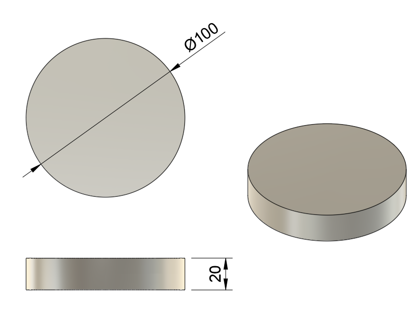

## RPコンテナ
RPコンテナは、アタッカーもしくはビルダーがRPを獲得するために使用できる。一辺が150mmの立方体形状で、BambuLab製のTPU68Dおよび高速PETGで3Dプリントしたものを使用する。重量は約500gである。競技中、各チームは実行委員会で用意するRPコンテナを使用しなければならない。

## ブロック
ブロックは、ビルダーが移動させることにより新しい移動ルートの開拓、陣地の防御、シールドの構築などに使用できる。ブロックは幅・奥行きがともに300mm、高さ200mmであり、強化ダンボール、MDF板、木材を図の通り組み合わせたものを使用する。重量は約1.3kgである。競技において、各チームは実行委員会で用意するブロックを使用しなければならない。ただし、強化ダンボールの外形サイズにばらつきがあるため、外形サイズに5mm程度の誤差が含まれる。

- 強化ダンボールはステキハコ製のA式みかんばこ（長辺290mm x 短辺284mm x 深さ136mm）で素材をK7/W（強化ダンボール）としたものを用いる。一般的な布テープを用いてダンボールを組み立て、MDF板とは木工用ボンドで固定する。
- MDF板は長辺・短辺ともに300mm、厚さ2.5mmのものを用いる。
- 木材は、2x2材（長辺・短辺ともに38mm）を300mmにカットしたものを用いる。木材とMDFは木ネジおよび木工用ボンドで固定する。

## シールドキャリアー
シールドキャリアーは、キャスターが4つ付いた土台の上にビルダーがブロックを置くことで、アタッカーもしくはビルダーが牽引して移動可能なシールドとして使用できる。

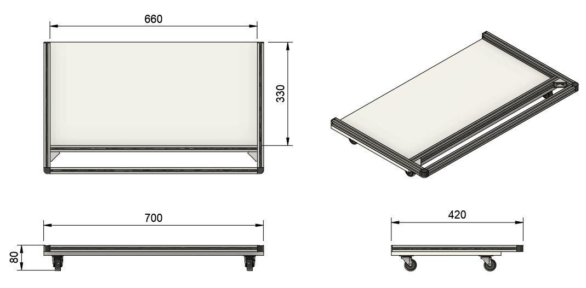

# 13章　フィールド
**⚠注意**
- フィールド制作に当たって実際のフィールドと若干の変更が生じる可能性がある。変更の場合はルール更新によって最新の図面を随時公開する。

予選と決勝トーナメントは同じ27.6m×18.3mのフィールドを使用する（[3DCAD図はこちらを参照](https://a360.co/46RoSla)）。以下の図ではフィールド形状をわかりやすくするため、青サイド側のみにブロックを配置している。また、フィールドの寸法には若干の誤差が生じる。

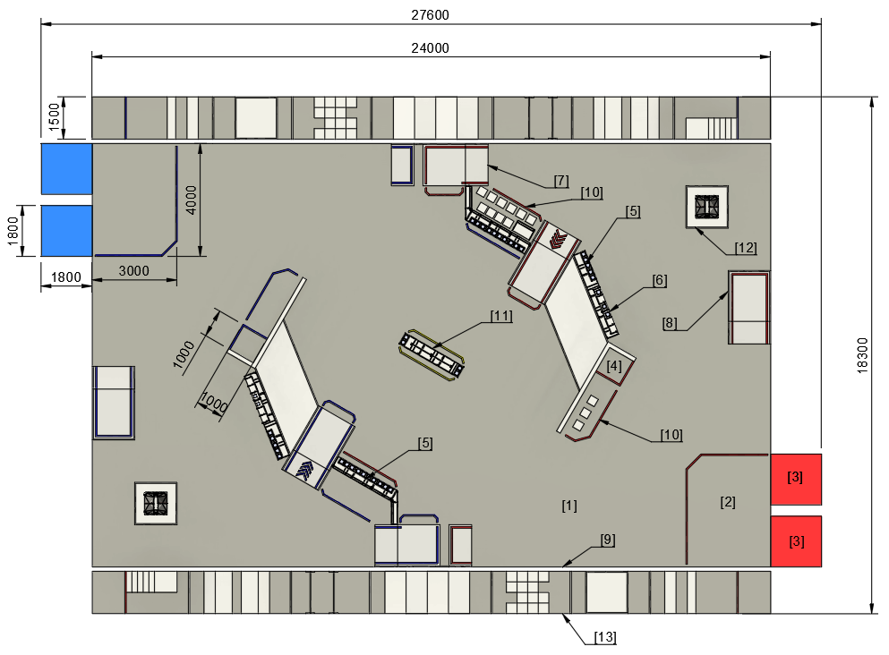

- [1] バトルエリア
- [2] スタートゾーン
- [3] 手動補給ゾーン
- [4] オートアタッカースタートゾーン
- [5] RPコンテナ置き場
- [6] スポットゾーン
- [7] 高台
- [8] バンカー
- [9] 進入禁止ゾーン
- [10] ブロックゾーン
- [11] 共通RPコンテナ置場
- [12] 赤・青陣地
- [13]ストライダーエリア

## [1] バトルエリア
バトルエリアは、各エリア・ゾーンや構造物を除くフィールドすべての領域である。

## [2] スタートゾーン
スタートゾーンは赤サイド・青サイド用に1つずつ設置した、3m×4mの領域である。

## [3] 手動補給ゾーン
手動補給ゾーンは赤サイド・青サイド用に2つずつ設置した、1.8m×1.8mの領域である。

## [4] オートアタッカースタートゾーン
オートアタッカースタートゾーンは赤サイド・青サイド用に1つずつ設置した、1m×1mの領域である。

## [5] RPコンテナ置き場
RPコンテナ置き場はバトルエリア内に赤サイド・青サイド用に2つずつ設置する。

## [6] スポット
スポットはバトルエリア内に赤サイド・青サイド用に1つずつ設置する。

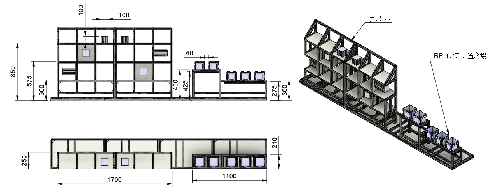

## [7] 高台
高台はバトルエリア内に2つ設置する。高さ200mmの台であり、二方向にスロープが付いている。片方のスロープには谷部があり、ロボットが通過できるようにビルダーがブロックを設置できる。

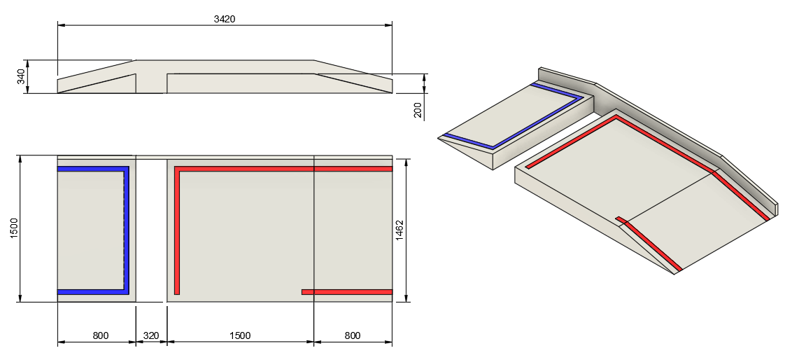

## [8]バンカー
バンカーはバトルエリア内に4つ設置する。高さ200mmの台であり、一方向にスロープがついている。

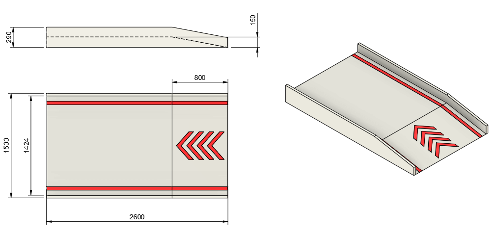

## [9] 進入禁止ゾーン
このゾーンはいずれのロボットも接地して侵入してはならない。

## [10] ブロックゾーン
合計22個のブロックを設置する領域である。

## [11] 共通RPコンテナ置き場
共通RPコンテナ置き場はバトルエリア内中央に1つ設置する。

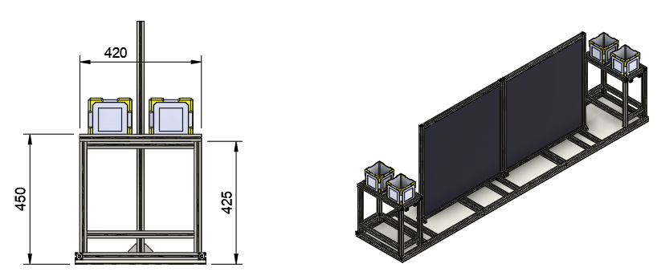

## [12] 赤・青陣地
赤・青陣地は1.5m×1.5mの領域の中心に設置している。厚み12mmのコンパネを用いてバトルエリアからかさ上げしている。どちらの陣地も幅38mm、高さ89mmの2x4材で囲まれている。6つのダメージパネルが取り付けられており、そのうち4つが地面から160mmの高さに、2つが地面から800mmの高さにある。いずれの高さも、ダメージパネルのヒットエリア最下端までの高さを示している。800mmの高さにあるダメージパネルは20度の傾斜を付けて配置する。

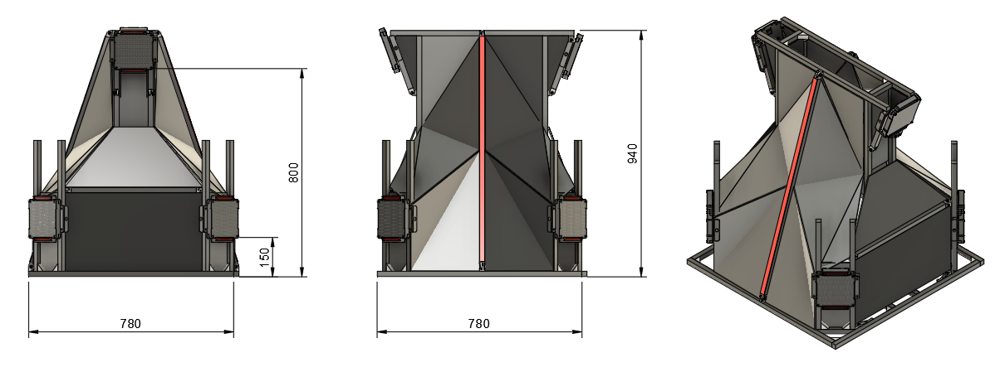

## [13] ストライダーエリア
ストライダーエリアはストライダースタートゾーン、段差ゾーン、砂利ゾーン、凹凸ゾーン、スロープゾーン、ハードルゾーン、谷ゾーン、ストライダーゴールゾーンから構成される。各ゾーンの間は幅50mmの白色テープで区切る。

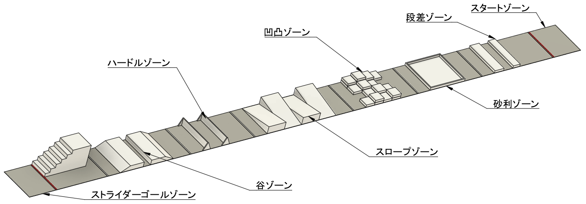

## フェンス
フィールド最外周には単管パイプと木材を用いたフェンスを設置する。また、ストライダーエリアとフィールドの間にも同様のフェンスを設置する。ただし、ストライダーエリアの谷ゾーンで、ビルダーがブロックを挿入できる箇所にはフェンスを設けない。フェンスの高さはバトルゾーンから140mmであり、2x6の木材を単管パイプに固定したものを使用する。
