# CoRE-Rulebook

# 1章　はじめに
本ルールブックはエンジニア選手権、The Championship of Robotics Engineers（CoRE）の1部リーグで使用するルールを記載している。リーグに共通するルールは共通ルールブックに記載されているため、共通ルールブックも参照すること。

# 2章　重要な用語集
ここでは、ルールブック内で使用される用語の中でも重要なものを概説する。各用語の詳細については、ルールブック中の該当する箇所を参照すること。

| 用語 | 定義 |
| -------- | -------- |
| 総大将チーム | 総大将決定戦により選出されるチームのこと。総大将チームは所属している選手の中から総大将を1名選出する。 |
| 総大将 | 競技中における各操縦手の指揮や、各ラウンドにおける出撃ロボットを決定する選手のこと。 |
| 同盟 | 総大将チームを筆頭とした複数チームの組み合わせのこと。決勝トーナメントでは個々のチーム同士ではなく同盟同士の対戦となり、試合に敗北した同盟は勝利した同盟の傘下となって次の試合に出場する。 |
| 総大将決定戦 | 総大将チームを決定するための試合。4チームからなるグループ戦の結果から計算される勝ち点によって、操縦ロボットチームとしてエントリーしたチームの順位を決定する。 |
| 決勝トーナメント | 競技優勝を決定するための試合。総大将決定戦で結成した4つの同盟によるトーナメント。 |
| 試合 |総大将決定戦においては各チームの勝ち点、決勝トーナメントにおいては各同盟の勝敗を決定するための対戦のこと。 |
| ラウンド | 決勝トーナメントにおける試合の区切りのこと。 |
| 操縦ロボット | 総大将決定戦、決勝トーナメントに出場でき、各チームがハードウェア・ソフトウェアの製作を行うロボット。 |
| 自動ロボット | 決勝トーナメントのみに出場するロボット。実行委員会が製作したロボットに対してソフトウェア開発のみ行う。 |
| 攻撃サイド | 総大将決定戦で行われる、1 vs 3のグループ戦における1チーム側のこと。 |
| 迎撃サイド | 総大将決定戦で行われる、1 vs 3のグループ戦における3チーム側のこと。 |
| HP | 操縦ロボットのヒットポイントのこと。 |
| 撃破 | 操縦ロボットのHPが0となり、行動できなくなった状態。 |
| 復活 | 撃破から1分が経過した時に、HPが自動回復して競技に復帰できる要素のこと。 |
| ファーストブラッド | ラウンド開始後、相手同盟の操縦ロボット1台を最初に撃破した状態のこと。 |
| 強化素材 | スポットへ設置することによってバフ効果やHP回復ができる競技用品。 |
| バフ効果 | 自分の攻撃力が一定時間上昇し、有利な状態が発生すること。 |
| オートレフェリーシステム | 競技中のヒット判定やHP管理、その他判定に関する処理を行うシステム。 |
| ダメージパネル | 操縦ロボットにフライングディスクやボールがヒットしたことを判定する装置。 |
| 陣地 | ダメージパネルが6枚取り付けられた構造物。決勝トーナメントのフィールド上に3つ設置されており、ダメージパネルへの攻撃によって占拠レベルが変化する。 |
| 占拠 | 陣地が同盟からの攻撃を一定量受け、どちらかの同盟の陣地として確定した状態のこと。 |

# 3章　自動ロボットチームおよび自動ロボットの規則
**⚠注意**
- 自動ロボットは、自動ロボットチームとしてエントリーしたチームのみが扱う。
- 自動ロボットのハードウェアは一切変更・改造してはならない。ただし、ハードウェアの保守・整備が可能な選手はチームに1名以上置くこと。

**自動ロボットの詳細な規則は後日発表する**

CoRE-1では、自動ロボットチームとしてエントリーした各チームが決勝トーナメントから参加する。自動ロボットチームは、総大将決定戦で決定した4つの同盟すべてに1チーム以上割り当てられる。自動ロボットのハードウェアは実行委員会が用意するものを使用しなければならない。なお、自動ロボットのハードウェアは変更・改造してはならない。自動ロボットチームは、自動ロボットに接続されたデスクトップコンピュータ上で動作する、ロボット制御用のソフトウェア開発のみを行う。自動ロボットチームには、操縦ロボットチームとは異なる提出物が求められるため、別途CoRE Webサイト上で公開する提出物の情報を確認すること。

## 自動ロボットチームの構成
チーム構成の規則は操縦ロボットのチームの規則と同様である。なお自動ロボットのハードウェアは一切の変更・改造が禁止ではあるが、チームには最低1名以上、ハードウェアの保守・整備が可能な選手を置かなければならない。

## 自動ロボットの規則
### ハードウェアの構成
自動ロボットは、ボールの発射機構と、発射機構を回転させる2軸のジンバル機構、ボールを発射機構に供給する給弾機構から構成される。ボールの発射機構は、2つのローラーを2つのブラシレスモータで回転させてボールを発射する、ピッチングマシンのような構造を持つ。ジンバル機構は、2つのブラシレスモータを使ってピッチ、ヨー方向に発射機構を回転できる。給弾機構は、2つのサーボモータを使って発射機構にボールを送り出す。自動ロボットのサイズは、およそ幅800mm×奥行き800mm×高さ1200mmである。

フィールド上の操縦ロボットを検知するセンサとして、自動ロボットには1つのカメラのみを搭載する。カメラはジンバル機構上に取付されており、ジンバルの回転とともにカメラの向きも回転する。このカメラは後述のデスクトップコンピュータに直接接続する。搭載するカメラの仕様は後日発表する。

自動ロボットの制御には、デスクトップコンピュータおよび組み込み用コンピュータを使用する。デスクトップコンピュータ上では、チームが開発するROS 2ベースのソフトウェアを実行し、カメラから得られた画像情報から自動ロボットの動作を決定し、その制御コマンドをイーサネット経由で自動ロボットへ送信する。自動ロボットにはこのコマンドを受け付ける組み込み用コンピュータを搭載しており、制御コマンドに従って自動ロボットの各種アクチュエータを制御する。

**⚠留意事項**
- 今回のルールでは、自動ロボットに搭載するセンサはカメラ1つのみとしているが、次回以降のルール改定ではカメラ2つを用いたステレオビジョンへの拡張、LiDARなどカメラ以外のセンサの追加を予定している。

### ソフトウェア開発の規則
各チームは、ロボット用のソフトウェアプラットフォームの一つであるROS 2を用いてソフトウェアを開発しなければならない。チームが開発できるソフトウェアはデスクトップコンピュータ上で動作するもののみであり、組み込み用コンピュータのソフトウェアを変更してはならない。また、チームは開発したソフトウェアを実行委員会が指定する方法で公開しなければならない。

## 自動ロボットチームへの貸出機材
**⚠注意**
- 貸出にあたり、チームは借用規則に同意し、各規則を遵守しなければならない。
- 不可抗力によらない借用者の不適切な使用・管理方法に起因する機材の破損・紛失などが生じた場合、機材の修理・新規購入に必要な費用の一部または全額を請求することがある。

自動ロボットチームとしてエントリーしたチームには、実行委員会より以下の物品を貸し出す予定である。詳細は後日発表する。
- 自動ロボットハードウェア
    - ロボット本体・カメラ・組み込み用コンピュータ・電源類などすべて含む。
- デスクトップコンピュータ（Ubuntuベース）
    - GeForce RTX 3060相当のグラフィックカードを搭載した、ミドルタワーサイズのデスクトップコンピュータを予定。なお、ディスプレイ・キーボード・マウスは付属しない。
- ボール50個
- ダメージパネル1つ
    - 操縦ロボットに取り付けるものと同等のもの。

# 4章　競技形式の規則
競技は、総大将決定戦（予選）と決勝トーナメントに分けて実施する。

まず総大将決定戦では操縦ロボットチームとしてエントリーしたすべてのチームの順位を決定するために1vs3のグループ戦を実施する。グループ戦での結果に基づき各チームの勝ち点を算出して順位を決定し、上位4チームを総大将チームとして選出する。また、この順位に従ってその他の操縦ロボットチームを、それぞれ決定した総大将チームの下に割り当てる。自動ロボットチームはくじ引きによって同盟に割り当て、4つの同盟を結成する。

決勝トーナメントでは4つの同盟による同盟バトルをトーナメント形式で実施する。準決勝では、各総大将の指揮の下、各同盟から操縦ロボット4台、自動ロボット1台を出撃させて2本先取の試合を行う。試合の各ラウンドでは、出撃させる操縦ロボットを総大将が決定できる。準決勝で敗北した同盟は、対戦相手の同盟の傘下に入って1つの同盟となり、決勝戦に進出する。決勝戦では各総大将の指揮の下、各同盟から操縦ロボット5台、自動ロボット1台を出撃させて3本先取の試合を行う。決勝戦で勝利した同盟が競技優勝、敗北した同盟が競技準優勝となる。

以下に、各競技形式の詳細を説明する。

## 総大将決定戦の形式
**⚠注意**
- 総大将決定戦に参加できるのは操縦ロボットチームとしてエントリーしたチームのみである。
- 自動ロボットチームとしてエントリーしたチームは総大将チームになることはできない。

総大将決定戦では総大将チームを4つ選出してそれぞれの同盟を結成するために、操縦ロボットチームとしてエントリーしたすべてのチームによる1vs3のグループ戦を実施する。なお、自動ロボットチームとしてエントリーしたチームは、総大将決定戦に参加できず、また総大将チームには選出されないことに注意すること。

グループ分けはシーズン途中に提出する審査ビデオの結果に基づき行う。審査ビデオの要件は別途提出資料の詳細を参照すること。グループ戦によってすべての操縦ロボットチームの勝ち点を算出し、順位を決定する。この中で、上位4チームが総大将チームとして選出され、それぞれの同盟を率いる。

### グループ戦
4つのチームを1つのグループとして割り当てる。なお、エントリーチームの数によっては、グループ戦を4チームで行うことだけを目的とした実行委員会チームをグループに割り当てる場合もある。グループ内で1チーム（攻撃サイド）、3チーム（迎撃サイド）に分かれて1vs3で2分間の試合を実施する。グループ内のすべてのチームが攻撃サイドとして試合に出撃するように、攻撃サイド・迎撃サイドのチームを入れ替えながら試合を連続して実施する。つまり、各チームは攻撃サイドで1試合、迎撃サイドで3試合を行う。 試合の流れについては5章の進行の規則を参照すること。

グループ戦の試合は、以下の条件のいずれかを満たすと終了する。
- 攻撃サイドのロボットが撃破される。
- 迎撃サイドのすべてのロボットが撃破される。
- 上記2条件に当てはまらず、2分間が経過する。

### 勝ち点の計算方法と順位付け
グループ戦の各試合において、以下の通りの計算方法で各チームの勝ち点を計算する。

- 攻撃サイドとして出撃した試合において
    - 迎撃サイドのロボットを撃破した：（5×撃破台数）点･･･A
    - 迎撃サイドのロボットへダメージを与えた回数：0～6点･･･B
- 迎撃サイドとして出撃した試合において
    - 攻撃サイドのロボットを撃破した：3点･･･C
    - 攻撃サイドのロボットへダメージを与えた回数：0～10点･･･D

迎撃サイドとして出撃した試合においては、どの迎撃サイドのチームが攻撃サイドへダメージを与えたか、撃破したかに関わらず、迎撃サイドとして出撃したすべてのチームが点数を獲得できる。なお、各項の最大得点は以下の通りである。
- Aの最大得点は15点（3台をすべて撃破）
- Bの最大得点は6点（3台をすべて撃破）
- Cの最大得点は9点（1試合最大3点×迎撃サイドで出場した3試合）
- Dの最大得点は30点（1試合最大10点×迎撃サイドで出場した3試合）

各チームの勝ち点は以下の式で求める。この式では、攻撃サイドと迎撃サイドの点数比が5:5となるように調整し、合計して満点を100点としている。なお、小数点第三位以下を切り捨てて勝ち点を求める。
<!-- $$ （勝ち点）= \frac{(A+B)}{21}\times60+\frac{(C+D)}{39}\times40 $$ -->
 $$ （勝ち点）= \left[ \frac{(A+B)}{21}+\frac{(C+D)}{39} \right] \times50 $$

求めた勝ち点から各チームの順位を付ける。同点が発生した場合は、以下の基準で順位を付ける。この基準で順位が求まらない場合は同順位として扱う。
1. 攻撃サイドの時に迎撃サイドの操縦ロボット3台を撃破するまでのタイムが早い順。
2. 攻撃サイドの時に迎撃サイドの操縦ロボットを撃破した台数が多い順。
3. 攻撃サイドの時に迎撃サイドの操縦ロボット1台を撃破するまでのタイムが早い順。

### 同盟の結成方法
グループ戦で決まった順位のうち、上位4チームを総大将チームとして選出する。それ以外の操縦ロボットチームおよび自動ロボットチームの同盟への割り当ては、以下に示す手順でくじ引きによって行う。なお、くじを引くのは総大将チームのキャプテンとし、順位1位のチームから順番に1度ずつ引くものとする。
1. 上位5～8位のチームをくじ引きによって割り当てる
2. 上位9～12位のチームをくじ引きによって割り当てる
3. 上位13～20位のチームをくじ引きによって割り当てる
4. 自動ロボットのチームをくじ引きによって割り当てる

## 決勝トーナメントの形式
**⚠注意**
- 決勝トーナメントから自動ロボットが出撃できる。
- 同盟に属するすべてのチームが複数のラウンドのうち最低1回は出撃するように、総大将は出撃チームを選ばなければならない。
- 自動ロボットの操縦手は、総大将とともに自同盟から出撃中のロボットの操縦画面をすべて見ることができ、総大将とともにヘッドセットを使って他の操縦手と会話できる。

総大将決定戦で決まった4つの同盟による同盟バトルを行う。準決勝で敗北した同盟は勝利した同盟の傘下に入り、決勝に進出する。

### 同盟バトル
2つの同盟による1ラウンド5分間の同盟バトルを行う。準決勝では2本先取形式（BO3）で勝敗を決定するため、最大で3ラウンドの試合が行われる。決勝では3本先取形式（BO5）で勝敗を決定するため、最大で5ラウンドの試合が行われる。準決勝の各ラウンドでは総大将指揮の下、同盟内から操縦ロボットを4台、自動ロボットを1台出撃させて5vs5で競技を行う。決勝戦の各ラウンドでは総大将指揮の下、同盟内から操縦ロボットを5台、自動ロボットを1台出撃させて6vs6で競技を行う。準決勝、決勝ともに同盟に属するすべての操縦ロボットが複数のラウンドの内、最低1回は出撃するように総大将は出撃するチームを選ばなければならない。試合の流れについては5章の進行の規則を参照すること。

決勝トーナメントにおける各ラウンドは、以下の条件のいずれかを満たすと終了する。
- どちらかの同盟が3つの陣地すべてを同時刻に占拠状態とする。
- どちらかの同盟が相手操縦ロボットすべてを同時刻に撃破状態とする。
- 上記2条件に当てはまらず、5分間が経過する。

### ラウンドの勝敗条件
決勝トーナメントにおける各ラウンドの勝敗は、以下の順序で決定する。
1. 3つの陣地すべてを同時刻に占拠状態とした同盟の勝利
2. 相手操縦ロボットすべてを同時刻に撃破状態とした同盟の勝利
3. 相手操縦ロボットを撃破した回数が多い同盟の勝利
4. 5分経過時に陣地を多く占拠している同盟の勝利
5. 5分経過時にスポットをより多く獲得した同盟の勝利
6. 相手同盟への与ダメージが多い同盟の勝利
7. 以上の条件で決定できない場合、引き分けとなり当該ラウンドは再試合となる

### トーナメント表
決勝トーナメントは以下の同盟の割り当てで実施する。各対戦において上側の同盟がフィールドの赤サイドに、下側の同盟が青サイドに割り当てられる。

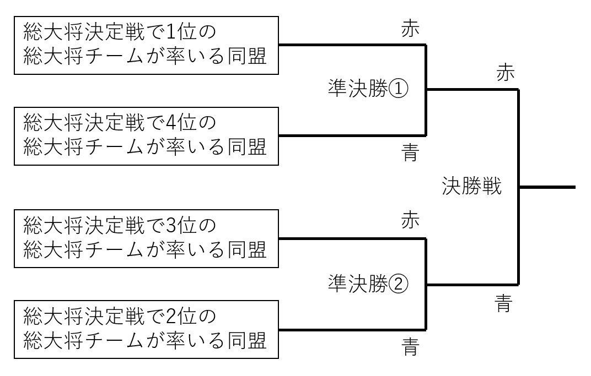 

## 競技における選手の役割
各チームはエントリーした選手の中から操縦手1名、整備手5名を選出する。決勝トーナメントから必要に応じて、補給手1名を選出できる。また、決勝トーナメントからは総大将の役割が追加され、1つの同盟につき総大将チームから1名選出する。

### 総大将チームによる総大将の選出
総大将チームは自チームに所属する選手の中から総大将1名を選出する。ただし、総大将は操縦手・整備手・補給手と兼任してはならない。また総大将は選出後、変更してはならない。敗北した同盟の総大将はその役割がなくなる形で、勝利した同盟の傘下に入る。

### 総大将の役割
総大将は、同盟に所属する選手の意見を参考に決勝トーナメントの各ラウンドで出撃させるチームを決定できる。ラウンド中、総大将は操縦ブースの指定された席に着席しなければならない。総大将は操縦ブースで自同盟から出撃中の操縦ロボットすべての操縦画面、および自動ロボットのカメラ映像を見ることができ、ヘッドセットを使って自同盟から出撃中の操縦手と双方向に会話できる。

### 操縦ロボットの操縦手の役割
操縦ロボットの操縦手は、映像伝送装置で送信される映像を見ながら操縦ロボットを操縦する。ラウンド中、操縦ブースの指定された操縦席に着席しなければならない。決勝トーナメントからは、ヘッドセットを使って自同盟から出撃中の他の操縦手および総大将と相互に会話できる。また、操縦ロボットの操縦手はセッティングタイムに参加できる。

### 自動ロボットの操縦手の役割
自動ロボットの操縦手はラウンド開始までに自動ロボットに動作開始の命令を送信する。ラウンドが開始すると自動ロボットの動作を完全停止する以外の命令を送ってはならない。ラウンド中、操縦ブースの指定された操縦席に着席しなければならない。自動ロボットの操縦手は、総大将とともに自同盟から出撃中の操縦ロボットすべての操縦画面、および自動ロボットのカメラ映像を見ることができ、ヘッドセットを使って自同盟から出撃中の他の操縦手および総大将と双方向に会話できる。また、自動ロボットの操縦手はセッティングタイムに参加できる。

### 操縦ロボットの整備手の役割
操縦ロボットの整備手は、セッティングタイムに操縦ロボットの調整を行う。また、自動補給ゾーンにフライングディスク・マガジン・補給ベースを設置できる。セッティングタイム終了後、操縦ロボットの整備手はスタンバイブースで待機しなければならない。

### 自動ロボットの整備手の役割
自動ロボットの整備手は、セッティングタイムに自動ロボットの設置・調整を行う。セッティングタイム終了後、自動ロボットの整備手はスタンバイブースで待機しなければならない。

### 操縦ロボットの補給手の役割
操縦ロボットの補給手は、決勝トーナメントの各ラウンド中に手動補給ゾーンで自チームの操縦ロボットへフライングディスクを補給できる。ラウンド中、操縦ロボットの補給手は補給待機ブースで待機しなければならない。また、操縦ロボットの補給手はセッティングタイムに参加できる。

### 自動ロボットの補給手の役割
自動ロボットの補給手は、セッティングタイムに自動ロボットへボールを補給する。セッティングタイム終了後、自動ロボットの補給手はスタンバイブースで待機しなければならない。

## 審判団
オートレフェリーシステムの補助の下、競技の判定はすべて審判団が責任を負う。審判団は主審・副審・操縦ブース審判から構成される。各審判の人数は以下の表の通りである。

| 種別 | 総大将決定戦 | 決勝トーナメント |
| -------- | -------- | -------- |
| 主審 | 1名 | 1名 |
| 副審 | 2名 | 6名 |
| 操縦ブース審判 | 2名 | 4名 |

# 5章　各競技進行の規則
## 総大将決定戦の進行
総大将決定戦は、以下のプロセスに従って競技が進行する。

### システムチェック
試合に出場するグループのすべてのチームは、スタンバイブースに移動してシステムチェックを受けなければならない。システムチェックでは、オートレフェリーシステムが正常に動作するかをチェックする。

### グループ戦に出場するチームの紹介
試合に出場するグループのすべての選手と監督は、対戦チームの入場および紹介に参加するため指定された立ち位置へ速やかに移動しなければならない。なお、入場および紹介に参加するのはキャプテン・操縦手のみになる場合もある。

### スタートゾーンへ操縦ロボットを配置
審判の合図に従って、整備手は操縦ロボットをスタートゾーンへ配置する。攻撃サイドのチームは赤スタートゾーンへ、迎撃サイドのチームは青スタートゾーンへ操縦ロボットを配置する。

### セッティングタイム
タイマーの合図で2分間のセッティングタイムが開始する。この時間内では、操縦手および整備手がフィールドに入って、試合に向けた操縦ロボットの調整・動作確認を行うことができる。また、各チームにはセッティングタイム開始とともにフライングディスクが割り当てられる。操縦手はセッティングタイムが終了するまでに操縦ブース内の指定された席に着席しなければならない。オートレフェリーシステムや映像伝送装置などの競技システムにトラブルが起きた場合、テクニカルタイムアウトの措置が執られることがある。詳細はテクニカルタイムアウトの項を参照すること。

### オートレフェリーシステムの初期化
セッティングタイムが終了し、フィールドから選手・審判を含めてすべての人が出た後に、スタッフがオートレフェリーシステムの初期化を行う時間を30秒程度設ける。

### 試合
タイマーのカウントダウンとともに、2分間の試合が開始する。試合が終了した後、各チームの整備手は操縦ロボットの電源を切るか、非常停止スイッチを操作しなければならない。

### フライングディスクの返却
試合の終了後、操縦ロボットにフライングディスクが搭載されている場合はスタッフの指示に従って速やかにディスクを取り出して返却すること。

### 攻撃サイドと迎撃サイドの入れ替え
グループ内のすべてのチームが攻撃サイドとして一度出撃するように、攻撃サイドと迎撃サイドを入れ替えて「スタートゾーンへの操縦ロボットの配置」からのプロセスを繰り返す。

### 1グループ内の勝ち点の確定
グループ内のすべてのチームが攻撃サイドとして試合を終えると当該グループの各チームの勝ち点が確定し、試合が終了する。試合終了後、キャプテンと操縦手は対戦チームの紹介に参加しなければならない。また、このときヒーローインタビューが行われることがある。

## 決勝トーナメントの進行
決勝トーナメントからは以下のプロセスに従って競技が進行する。

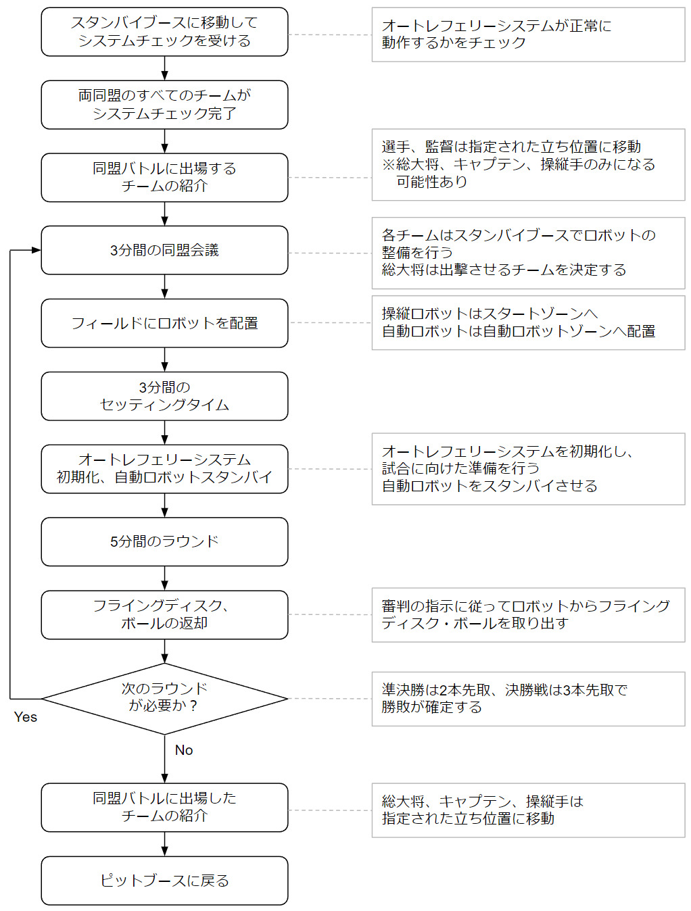

### システムチェック
同盟バトルに出場する両同盟のすべてのチームは、スタンバイブースに移動してシステムチェックを受けなければならない。システムチェックでは、オートレフェリーシステムが正常に動作するかをチェックする。

### 同盟バトルに出場するチームの紹介
同盟バトルに出場する両同盟のすべての選手と監督は、対戦同盟の入場および紹介に参加するため指定された速やかに立ち位置に移動しなければならない。なお、入場および紹介に参加するのは総大将・キャプテン・操縦手のみになる場合もある。

### 同盟会議
タイマーの合図で3分間の同盟会議が開始する。両同盟の総大将は、当該ラウンドに同盟からどのチームを出撃させるかを決定し、審判へ申告する。

### フィールドへロボットを配置
審判の合図に従って、出撃するチームの整備手は操縦ロボットをスタートゾーンへ、自動ロボットを自動ロボットゾーンへ配置する。

### セッティングタイム
タイマーの合図で3分間のセッティングタイムが開始する。この時間内では、操縦手・整備手・補給手がフィールドに入って、試合に向けて操縦ロボットおよび自動ロボットの調整、動作確認を行うことができる。また、各同盟にはセッティングタイム開始とともにフライングディスクが割り当てられる。操縦手はセッティングタイムが終了するまでに操縦ブース内の指定された操縦席に着席しなければならない。
- セッティングタイム中にチームにトラブルが起きた場合、審判に対して最大2分間のタイムアウトを申告できる。詳細はタイムアウトの項を参照すること。
- オートレフェリーシステムや映像伝送装置などの競技システムにトラブルが起きた場合、テクニカルタイムアウトの措置が執られることがある。詳細はテクニカルタイムアウトの項を参照すること。

### オートレフェリーシステムの初期化と自動ロボットのスタンバイ
セッティングタイムが終了し、フィールドから選手・審判を含めてすべての人が出た後に、スタッフがオートレフェリーシステムの初期化を行う時間を30秒程度設ける。自動ロボットの操縦手は、この時間が終わるまでにラウンド開始へ向けて自動ロボットに動作開始の命令の送信を終わらせること。この時間を超えると、自動ロボットへ停止命令以外の一切の命令を送信してはならない。

### ラウンド
タイマーのカウントダウンとともに、5分間のラウンドが開始する。ラウンドが終了した後、各チームの整備手は操縦ロボットおよび自動ロボットの電源を切るか、非常停止スイッチを操作しなければならない。

### フライングディスク、ボールの返却
試合の終了後、操縦ロボットにフライングディスクが、自動ロボットにボールが搭載されている場合はスタッフの指示に従って速やかにそれらを取り出して返却すること。

### 勝敗の確定
準決勝においてはどちらかの同盟がラウンドを2本先取、決勝戦においては3本先取した時点でその試合が終了する。試合終了後、総大将および同盟に所属するすべてのキャプテン、操縦手は対戦同盟の紹介に参加しなければならない。また、このときヒーローインタビューが行われる。

## セッティングタイム中のタイムアウト
総大将決定戦、決勝トーナメントともに実行委員会の判断によりテクニカルタイムアウトが発生する場合がある。決勝トーナメントからは総大将の判断により最大2分間のタイムアウトを申請できる。

### テクニカルタイムアウト
オートレフェリーシステムや映像伝送装置、操縦用無線モジュール、陣地など実行委員会が用意するシステムやデバイスにトラブルが発生した場合、審判はテクニカルタイムアウトを宣言し、セッティングタイムの時間経過を一時停止できる。各システムに接続した出場チームオリジナルのデバイスなどにトラブルが発生した場合、テクニカルタイムアウトは適用されない。テクニカルタイムアウトが実行されている間、選手はスタッフと協力して発生しているトラブルへ対処することしか認められず、それ以外の目的で操縦ロボットや自動ロボットの調整・修理を行ってはならない。

### タイムアウト
決勝トーナメントからはセッティングタイム中、ロボットにトラブルが起こった場合や、戦略を検討する時間が必要となった場合に、セッティングタイムを2分間延長するタイムアウトを申請できる。タイムアウトは、同盟ごとに1試合に1度だけ認められる。  申請する際は、同盟の総大将が審判にタイムアウトを申請すること。審判はタイムアウトの申請を受けた場合、両方の同盟に対してタイムアウトを通告する。両同盟はこの時間にロボットの調整、修理や戦略の検討を行うことができる。1回のセッティングタイム中にタイムアウトを申請できるのはどちらかの同盟のみとする。両同盟からタイムアウトの申請があった場合、先に審判へ申請があった同盟のタイムアウトが優先され、後から申請があった同盟のタイムアウトは却下される。なお、セッティングタイムが残り15秒未満である場合、タイムアウトの申請は認められない。また、タイムアウトを申請後からキャンセルすることは認められない。

# 6章　競技内容の規則
**⚠注意**
- 衝撃や振動によってダメージパネルが反応してHPが減少した場合も、そのダメージは有効とする。
- 総大将決定戦の迎撃サイド内、決勝トーナメントの自同盟内からフライングディスクの投擲によってHPが減少した場合も、そのダメージは有効とする。

## 共通の規則
### フライングディスクによる攻撃
操縦ロボットは、フライングディスクを投げ当てる以外の行為で相手操縦ロボットのダメージパネルを攻撃してはならない。フライングディスクがダメージパネルにヒットしたとき、ヒットした操縦ロボットのHPが10減少する。決勝トーナメントにおいてバフ効果を得ている場合、減少するHPがバフ効果の倍率だけ増加する。なお、衝撃や振動によってダメージパネルが反応してHPが減少した場合でも、そのダメージは有効として競技を続行する。決勝トーナメントにおいては補給手の安全を確保するため、補給中の手動補給ゾーンに向けて意図的にフライングディスクを投げてはならない。

### フライングディスクの再利用
フィールド内に落ちているすべてのフライングディスクは、操縦ロボットが拾って再利用できる。ただし、フィールドの外に出たフライングディスクを拾って再利用してはならない。

### 操縦ロボットの撃破
以下のどちらかの条件を満たしたとき、その操縦ロボットは撃破となる。なお、転倒とは、操縦ロボットの底面がフィールド面から離れ、自力で復帰できなくなった場合を指す。
- HPが0となった場合。
- 操縦ロボットが転倒し、復帰できなくなった場合。

### 操縦ロボット同士の接触
相手操縦ロボットを転倒させる、動きを押さえつけ拘束するまたは破損させる行為をしてはならない。相手操縦ロボットを故意に転倒・拘束・破損させたと審判が判断した場合、反則もしくは失格となる。

### ロボットの非常停止
操縦ロボット、自動ロボットともに競技中に制御不能となった場合、操縦手が非常停止の信号を送信して、もしくは審判が非常停止スイッチを押して当該ロボットを停止させる。以降、当該ロボットは停止したまま試合もしくはラウンドが終了するまで待機しなければならない。

## 総大将決定戦
### 各サイドのカラー
攻撃サイドは赤、迎撃サイドは青とする。

### 操縦ロボットのスタート位置
セッティングタイムが終了するまでに、攻撃サイドの操縦ロボットは上面から見て赤スタートゾーンに、迎撃サイドのすべての操縦ロボットは上面から見て青スタートゾーンに収まっていなければならない。

### 操縦ロボットのHP
試合開始時、攻撃サイドの操縦ロボットのHPは100、迎撃サイドの操縦ロボットのHPはいずれも20である。

### フライングディスクの付与
セッティングタイム開始時に、攻撃サイド・迎撃サイドどちらのチームにも1チーム当たり50枚ずつフライングディスクを付与する。

## 決勝トーナメント
### 各同盟のカラー
準決勝・決勝戦の各試合において赤サイドに割り当てられた同盟は赤同盟、青サイドに割り当てられた同盟は青同盟とする。

### 操縦ロボットのスタート位置
セッティングタイムが終了するまでに、赤サイドとして出場する同盟のすべての操縦ロボットは上面から見て赤スタートゾーンに、青サイドとして出場する同盟のすべての操縦ロボットは上面から見て青スタートゾーンに収まっていなければならない。

### 自動ロボットのスタート位置
セッティングタイムが終了するまでに、赤サイドとして出場する自動ロボットは赤自動ロボットゾーンの中央に任意の向きで、青サイドとして出場する自動ロボットは青自動ロボットゾーンの中央に任意の向きで配置しなければならない。

### ロボットのHP
ラウンド開始時、操縦ロボットのHPはいずれも40である。なお、自動ロボットにHPは存在しない。

### 撃破からの復活
操縦ロボットが撃破されてから1分が経過すると、当該ロボットのHPが30に自動回復して復活し、その場から動作を再開できる。ただし、当該ロボットが転倒状態にある場合は復活できない。なお、復活から5秒間はHPが減少しない無敵状態とする。

### フライングディスクの付与
セッティングタイム開始時、各同盟には以下の枚数のフライングディスクが付与される。各同盟は、付与されたフライングディスクをそのラウンドに出撃するすべてのチームで共用する。
- 準決勝では1ラウンド1同盟当たり500枚
- 決勝戦では1ラウンド1同盟当たり600枚

### フライングディスクの手動補給
操縦ロボットが上面から見てすべて自同盟の手動補給ゾーン内の補給エリアに入れば、補給手がフライングディスクを補給できる。なお手動補給の場合、操縦ロボットが上面から見てすべて自同盟の補給エリアに入った時刻から20秒以上が経過しなければ、補給エリア外に出て競技に復帰できない。審判が時間を計測して補給手に補給エリア外に出てよいタイミングを指示するため、補給手は操縦ロボットのカメラ越しに操縦手に合図を送ること。

マガジンを使用して補給する場合、マガジンはセッティングタイム中に補給待機ブースに設置しなければならない。補給手は、自チームの操縦ロボットが補給エリアに入った時にマガジンを補給待機ブースから補給エリアに運び、マガジンを取り付けることができる。なお、マガジンを操縦ロボットから取り外した場合、当該マガジンは補給後に直ちに補給待機ブースに運ばなければならない。

また、補給中は以下の制限を守らなければならない。
- 非常停止スイッチを操作し、操縦ロボットを完全停止（脱力）状態としなければならない。
- 手動補給ゾーンには同時に複数の操縦ロボットが入ってはならない。
- 操縦ロボットに搭載されたマガジンを取り外す行為を除き、操縦ロボット上にあるフライングディスクを取り除いてはならない。
- 操縦ロボットが強化素材を持っている場合、補給手は強化素材に触れてはならない。

**⚠留意事項**
- 補給手が介在する補給中に、発射機構内で詰まっているフライングディスクを取り除く、強化素材を持ち替えるような、補給とは関係のない操作は認められないことを意図している。

### フライングディスクの自動補給
**⚠注意**
- 自動補給方法の実現および補給ベースの製作は必須ではない。
- 自動補給中に相手ロボットから攻撃を受けた場合、そのダメージは有効とする。

操縦ロボットが上面から見て自同盟の自動補給ゾーンに収まっていれば、操縦ロボットは自動補給ゾーンに置かれたフライングディスクの補給およびマガジンの取り付け、取り外しができる。また自動補給ゾーンには、これらの自動補給の方法を補助するための補給ベースを設置できる。なお、自動補給中は、当該操縦ロボットがロボットのサイズ制限を満たさない状況の発生が一時的に認められる。ただし、この例外は当該操縦ロボットが上面から見て自動補給ゾーンに常に収まっている場合のみ認められる。また、ダメージパネルの設置規則は、自動補給中も常に満たさなければならない。

#### 自動補給ゾーン内に設置したフライングディスクの補給方法
操縦ロボットが上面から見て自同盟の自動補給ゾーンに収まっていれば、操縦ロボットは自動補給ゾーン内に設置したフライングディスクを補給できる。このとき、フライングディスクを補給しやすくするため、各チームが製作した補給ベースにフライングディスクを設置できる。

#### 自動補給ゾーン内に設置したマガジンを使った補給方法
操縦ロボットが上面から見て自同盟の自動補給ゾーンに収まっていれば、操縦ロボットは自動補給ゾーンに設置したマガジンをロボットに取り付けることができる。必要であれば、操縦ロボットは現在取り付けているマガジンを分離し、取り外すことができる。ただし、取り外したマガジンは自同盟の自動補給ゾーン外に出てはならない。このとき、マガジンを取り付け、取り外ししやすくするため、各チームが製作した補給ベースを使用できる。

#### 補給ベースの制限
各チームは以下の制限を満たした補給ベースを1つ製作し、自動補給の補助に使用できる。また高さが1000mmを超える補給ベースは、自動補給ゾーンに接するフェンスへ固定することを強く推奨する。フェンスの詳細は後日発表する。
- 補給ベースのサイズは、マガジンを取り付けた状態で幅1000mm×奥行き1000mm×高さ1600mmを超えてはならない。
- マガジンを除いて、補給ベースは分離してはならない。
- 補給ベースの重量は、マガジンを取り付けた状態で30kgを超えてはならない。重量の計測にはフライングディスクは含めない。
- 補給ベースには、電力や圧縮空気などのエネルギー源を取り付けてはならない。
- ラウンド中、補給ベースは上空から見て常に自動補給ゾーン内に収まっていなければならない。

### ボールの付与
セッティングタイム開始時、各同盟には自動ロボット用のボールが150個付与される。

### ボールによる攻撃
自動ロボットから投げられたボールがダメージパネルにヒットしたとき、ヒットした操縦ロボットのHPが10減少する。バフ効果を得ている場合、減少するHPがバフ効果の倍率だけ増加する。なお、自動ロボットは陣地を攻撃してはならない。また、自動ロボットが自同盟の操縦ロボットを攻撃してしまい、ダメージパネルにヒットすればそのダメージも有効となる。

### 強化素材の回収とスポットへの設置
**⚠注意**
- 強化素材の設置は審判が判定するため、バフ効果やHP回復効果が瞬時に反映されない場合もある。
- 相手同盟のスポットに強化素材を設置した場合、その強化素材の色によらず相手同盟がバフ効果もしくはHP回復効果を得る。

ラウンド開始時、赤サイドと青サイドの強化素材置き場にそれぞれ3本の強化素材が設置されている。赤サイドの強化素材は赤色、青サイドの強化素材は青色である。操縦ロボットが自同盟の強化素材置き場から強化素材を回収し、自同盟の各スポットに設置するとバフ効果もしくはHP回復効果が得られる。ただし、1つのスポットに複数本の強化素材を設置したとしても、効果は最初の1回しか得ることができない。また、相手同盟の強化素材を保持した場合や両同盟のスポットに設置済みの強化素材を取り出した場合、反則となる。

強化素材の各スポットへの設置により得られる効果は以下の通りである。
- スポット1に設置した場合
    - 30秒間、自同盟のすべてのロボットの攻撃力が2倍になる
- スポット2に設置した場合
    - 自同盟のすべての操縦ロボットのHPが上限値まで回復する
- スポット3に設置した場合
    - 30秒間、自同盟のすべてのロボットの攻撃力が2倍になる

スポット1とスポット3の効果が同時刻に発生した場合、その効果は乗算されて両方とも反映される。例えば、強化素材をスポット1に設置してから5秒後にスポット3にも設置した場合、バフ効果の時間経過は以下の表のようになる。なお、実際の競技においては強化素材のスポットへの設置は審判が判断するため、その設置効果が瞬時に反映されない場合もあることに注意すること。

| 時刻 t (秒) | スポットの獲得状況 | バフ効果 |
| -------- | -------- | -------- |
| 0 ≦ t <5 | t = 0 秒でスポット1を獲得 | 攻撃力2倍 |
| 5 ≦ t < 30 | t = 5 秒でスポット3を獲得 | 攻撃力4倍 |
| 30 ≦ t < 35 | t = 30 秒でスポット1のバフ効果が終了 | 攻撃力2倍 |
| 35 ≦ t | t = 35 秒でスポット3のバフ効果が終了 | 攻撃力1倍 |

### ファーストブラッド
ラウンド開始後、相手操縦ロボットをいずれか1台撃破した同盟は、その時点でファーストブラッドを獲得する。ファーストブラッドは、両同盟ともに1つのラウンドで1度のみ、すなわち最初に相手操縦ロボット1台を撃破した際に獲得できる。なお、相手操縦ロボットが転倒によって撃破となった場合は、ファーストブラッドの対象とはしない。

### 陣地
フィールドに設置された3つの陣地は、自同盟がファーストブラッドを獲得した後から攻撃できる。1つの陣地には、赤同盟が攻撃するダメージパネル、また青同盟が攻撃するダメージパネルをそれぞれ3つずつ、合計6つのダメージパネルを取り付ける。陣地に取り付けたダメージパネルは、操縦ロボットに取り付けているダメージパネルと同様のものである。ただし、陣地に取り付けられたダメージパネルは、フライングディスクがヒットした時点から5秒間、当該ダメージパネルのみヒット判定を受け付けない無敵状態とする。

各陣地は、両同盟の操縦ロボットからフライングディスクの投擲による攻撃を受けることによって、どちらかの同盟の陣地として占拠できる。なお、陣地のダメージパネルはフライングディスクの投擲以外の手段で攻撃してはならない。

各陣地の占拠状態は、下図の11段階の占拠レベルによって決定する。青5が青同盟による占拠の状態、赤5が赤同盟による占拠の状態である。占拠レベルが青4～中点～赤4の場合は、陣地はどちらの同盟にも占拠されていない。占拠レベルは中点が初期状態であり、中点から赤同盟による占拠および青同盟による占拠までそれぞれ5段階がある。フライングディスクがダメージパネルにヒットした場合、陣地の占拠レベルがヒットしたダメージパネルに応じてどちらかへ1つ移動する。例えば、青同盟が攻撃するダメージパネルにヒットがあった場合、占拠レベルは青側に1つ移動する。なお、バフ効果を得ている場合はその倍率分の効果が付与される。例えば青同盟の攻撃力が2倍となっている場合に、青同盟が攻撃するダメージパネルにフライングディスクがヒットした場合、占拠レベルが青側に2つ移動する。占拠レベルが青5もしくは赤5になったとき、その陣地はどちらかの同盟の陣地として占拠される。陣地がどちらかの同盟によって既に占拠された状態で、占拠していない同盟側の攻撃がヒットした場合、占拠レベルが占拠していない同盟側へ移動し、当該陣地の占拠状態が解除される。なお、どちらの同盟にも占拠されていない状態（占拠レベルが青4～赤4の範囲）で、陣地への最後の攻撃から30秒間が経過すると、当該陣地の占拠レベルは中点にリセットされる。

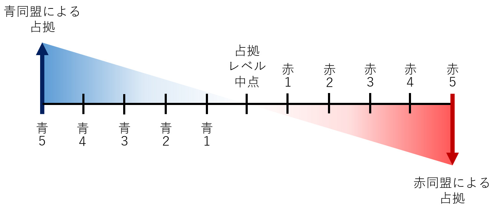

## 反則行為と失格
### 反則行為
以下の反則行為があった場合、当該操縦ロボットのHPが20減少する。
1. スタート時にフライングをした場合。
2. 操縦ロボットがフィールド外に進入した場合。
3. 決勝トーナメントにおいて、相手同盟の自動補給ゾーンまたは手動補給ゾーンに進入した場合。
4. 決勝トーナメントにおいて、相手同盟の強化素材を保持した場合。
5. 決勝トーナメントにおいて、スポットに設置済みの強化素材を取り出した場合。
6. 決勝トーナメントにおいて、操縦ロボットから分離したマガジンが当該同盟の自動補給ゾーン外に出た場合。
7. 緊急時を除き、選手が審判の許可を得ず操縦ロボットに触れた場合。
8. 選手が競技中に指定された場所以外に立ち入った場合。
9. フィールドや選手権会場、設備などを破損、汚染した場合。
10. 審判の指示に従わない行為をした場合。
11. ルールブックの規則に違反する行為をした場合。

### 失格
審判が以下の失格行為を認めた場合、総大将決定戦の場合は当該試合を再試合とし、失格行為を行ったチームの順位は最下位とする。決勝トーナメントの場合、当該ラウンドは相手同盟の勝利とする。
1. 故意に相手ロボットの破損・拘束・転倒を招いた場合。
2. 相手ロボットの反則・失格を誘導した場合。
3. 故意によるフィールドの破壊を行った場合。
4. 映像伝送装置のHDMIトランスミッターがロボットから落下した場合。
5. ルールブックの規則に違反する危険な行為を行った場合。
6. 発火など安全管理上、重大な問題が発生した場合。

# 7章　競技用品の規則
CoRE-1ではフライングディスク・ボール・強化素材を競技中に使用する。以下に、各物品の詳細について示す。

## フライングディスク
フライングディスクは、操縦ロボットで相手操縦ロボットおよび陣地を攻撃するために使用できる。積水化成品工業株式会社製の[ライトロンボードRLB20](https://www.sekisuikasei.com/jp/products/electronics/ligthlon_board/)を直径180mm、厚さ20mmの円盤形状に切り抜いたものを使用する。競技において、各チームは実行委員会で用意するフライングディスクを使用しなければならない。

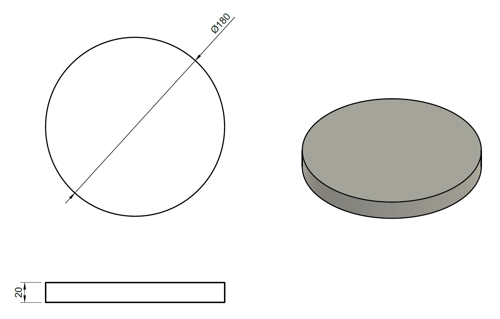

## ボール
ボールは、自動ロボットが相手操縦ロボットへ攻撃するために使用できる。カシマヤ製作所SHOPにて購入できる直径約70mmの[PU カラーボール](https://kashimaya-shop.com/item-detail/498749)を使用する。競技において、各チームは実行委員会で用意するボールを使用しなければならない。ボールの色は複数色を混在させて使用する。

## 強化素材
強化素材は、操縦ロボットのバフ効果もしくはHP回復効果を得るために使用できる。外径32mm、長さ500mm、厚み1.5mmのアルミニウム製パイプで、赤もしくは青色の熱収縮チューブで表面を覆ったものを使用する。競技において、各チームは実行委員会で用意する強化素材を使用しなければならない。

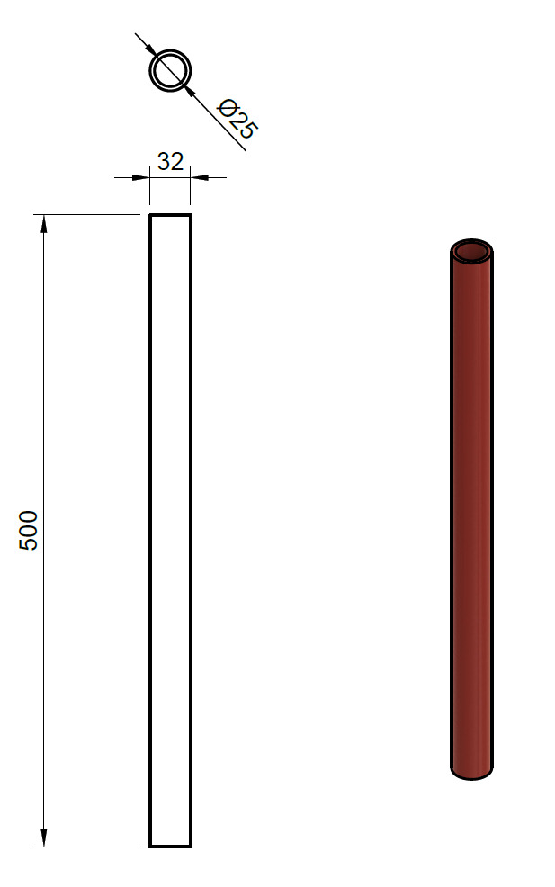

# 8章　フィールドの規則
CoRE-1では総大将決定戦と決勝トーナメントで異なるフィールドを使用する。以下に、各フィールドの詳細について示す。また、フィールドの寸法には若干の誤差が生じる。

## 総大将決定戦
総大将決定戦では14m×7.5mのフィールドを使用する（[3DCAD図はこちらを参照](https://a360.co/3LeF59Q)）。フィールドはスタートゾーン・バトルゾーンで構成される。フィールド外周はフェンスで囲まれている。

俯瞰図

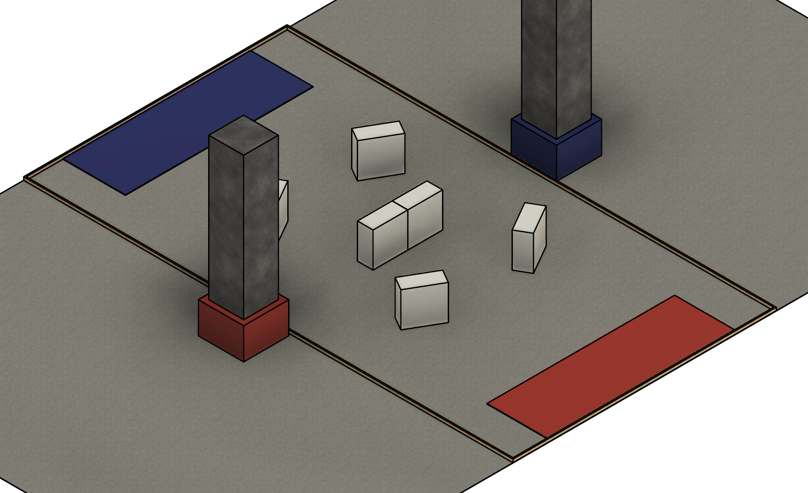

上面図

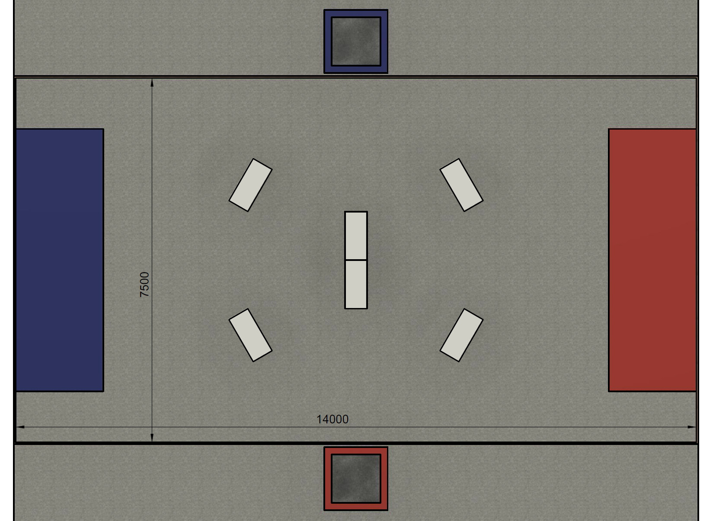

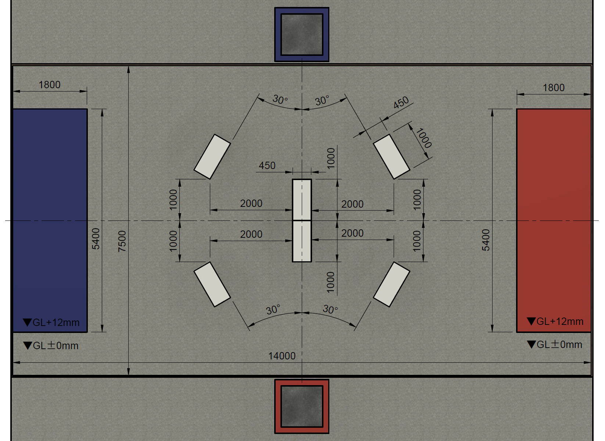

### スタートゾーン
スタートゾーンはフィールド両サイドに設けた、1.8m×5.4mの領域である。スタートゾーンは厚み12mmのコンパネを用いてバトルゾーンからかさ上げしている。

### バトルゾーン
バトルゾーンは、スタートゾーンやバリケードを除くフィールドすべての領域である。

### バリケード
バトルゾーン中央にはバリケードを設置する。バリケードのサイズはいずれも幅1000mm×奥行き450mm×高さ1000mmである。このバリケードを6個配置する。中央にある横並びのバリケードは連結されている。すべてのバリケードにはおもりを載せ、容易に移動しないように設置する。

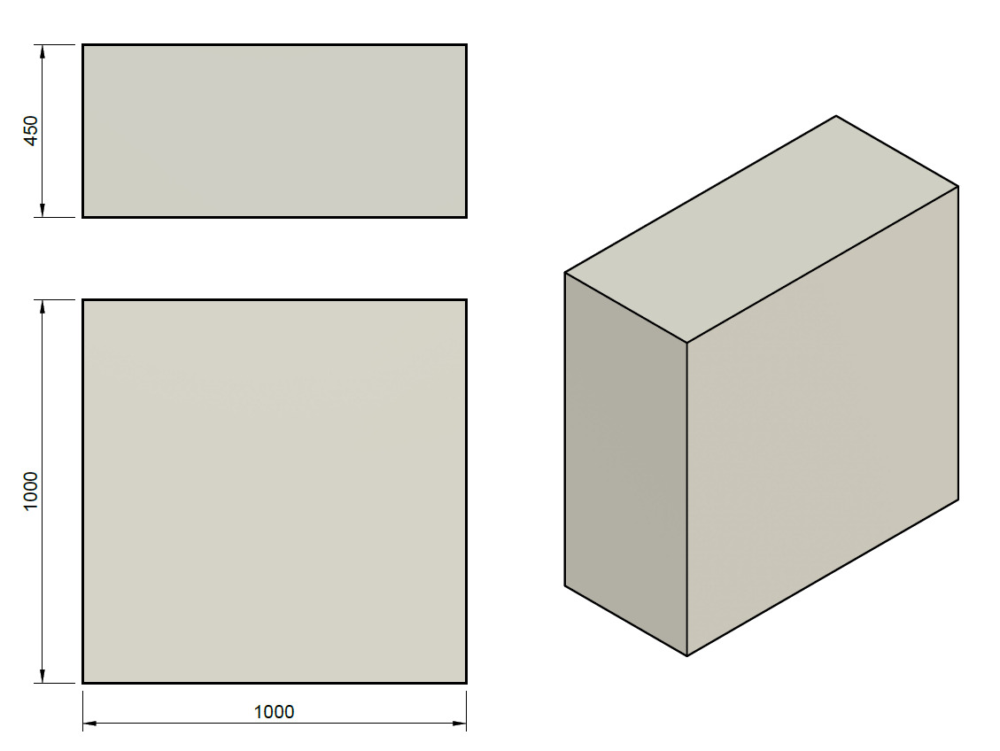

### フェンス
フィールド最外周には単管パイプと木材を用いたフェンスを設置する。

## 決勝トーナメント
決勝トーナメントでは23m×14mのフィールドを使用する（[3DCAD図はこちらを参照](https://a360.co/3PwJXdd)）。フィールドは赤サイド・青サイドに分かれ、スタートゾーン・バトルゾーン・スポットゾーン・強化素材置き場・陣地・自動ロボットゾーン・手動補給ゾーン・自動補給ゾーンで構成される。フィールド外周はフェンスで囲まれている。

俯瞰図

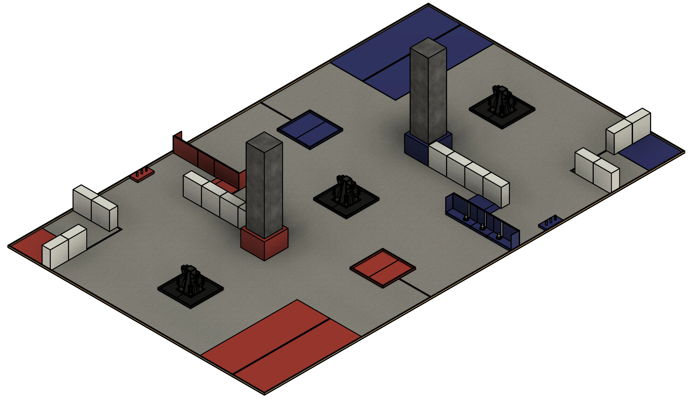

上面図

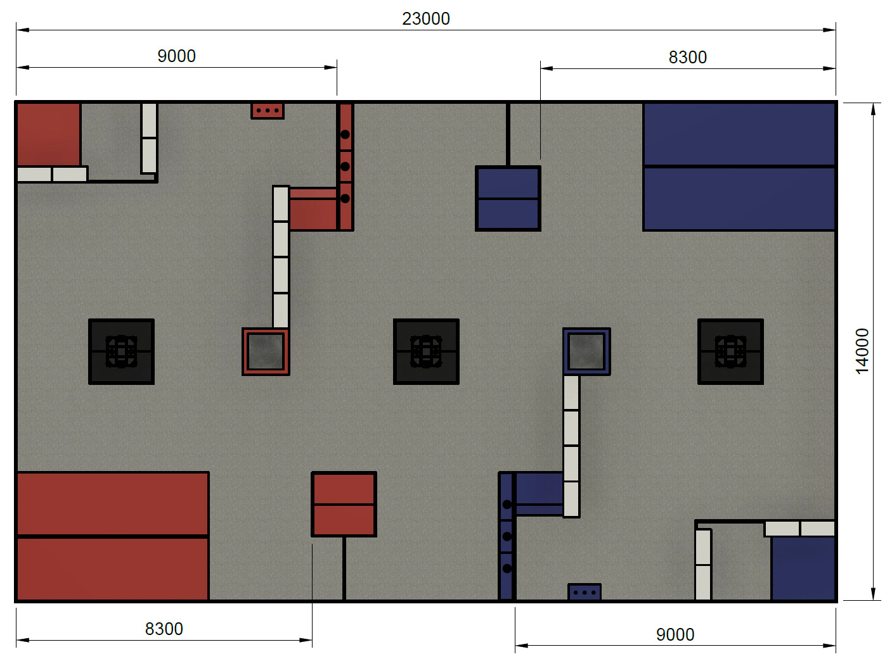

ゾーン配置

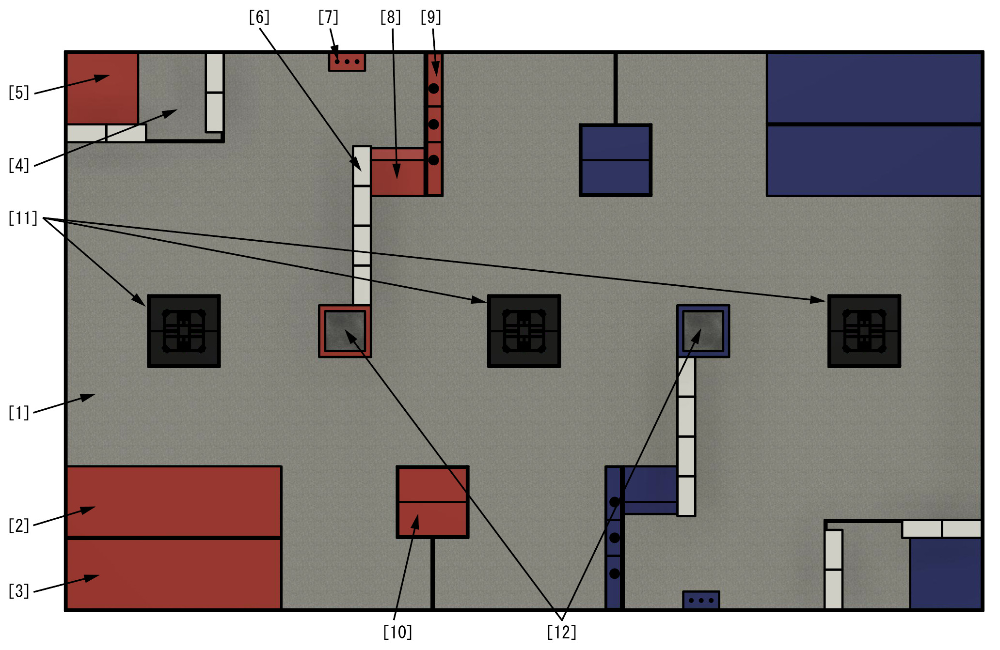

- [1] バトルゾーン
- [2] スタートゾーン
- [3] 自動補給ゾーン
- [4] 手動補給ゾーン
- [5] 補給エリア
- [6] バリケード
- [7] 強化素材置き場
- [8] 高台
- [9] スポットゾーン
- [10] 自動ロボットゾーン
- [11] 陣地
- [12] 柱（選手権会場構造物）

### [1] バトルゾーン
バトルゾーンは、各ゾーンや構造物を除くフィールドすべての領域である。

### [2] スタートゾーン
スタートゾーンは赤サイド・青サイド用に1つずつ設置した、5.4m×1.8mの領域（下図の黄色マーカ内）である。スタートゾーンは厚み12mmのコンパネを用いてバトルゾーンからかさ上げしている。

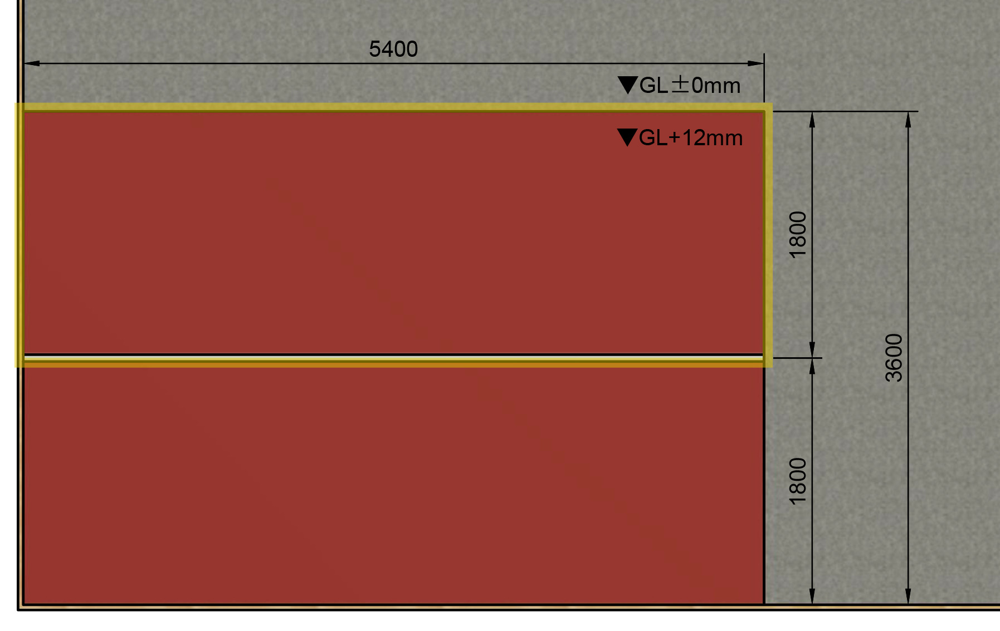

### [3] 自動補給ゾーン
自動補給ゾーンは赤サイド・青サイド用に1つずつ設置した、5.4m×1.8mの領域（下図の黄色マーカ内）である。自動補給ゾーンは厚み12mmのコンパネを用いてバトルゾーンからかさ上げしている。

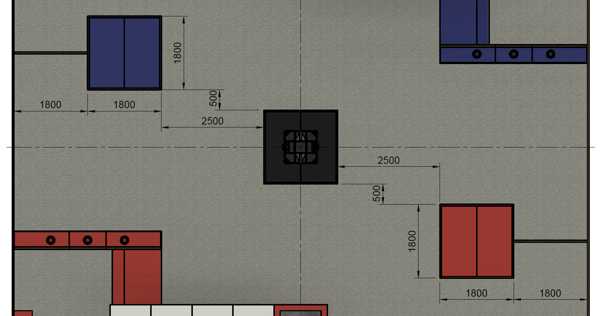

### [4] 手動補給ゾーンと [5] 補給エリア
手動補給ゾーンは赤サイド・青サイド用に1つずつ設置した、3950mm×2250mmの領域である。ゾーンは4つのバリケードを用いて囲まれている。ゾーン内には、1800mm×1800mmの補給エリアがある。補給エリアは厚み12mmのコンパネを用いてバトルゾーンからかさ上げしている。

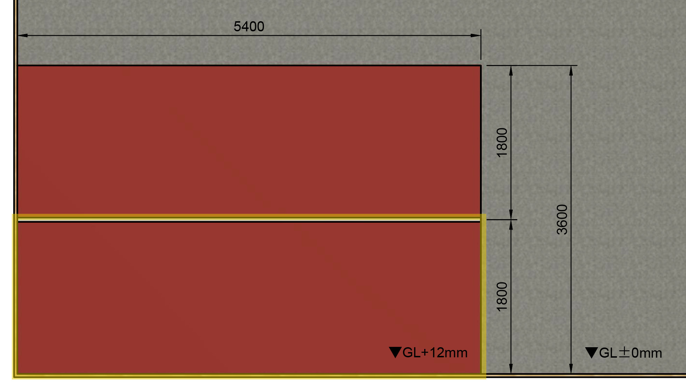

### [6] バリケード
バトルゾーン内および手動補給ゾーン内に、バリケードを設置する。バリケードのサイズはいずれも幅1000mm×奥行き450mm×高さ1000mmである。このバリケードを2つ連結したものを両同盟の手動補給ゾーン内にそれぞれ2セット設置する。また、バリケードを4つ連結したものを、両同盟の高台付近にそれぞれ2セット設置する。すべてのバリケードにはおもりを載せ、容易に移動しないように設置する。

### [7] 強化素材置き場
強化素材置き場はバトルゾーン内に赤サイド・青サイド用に1つずつ設置する。幅900mm、奥行き450mm、高さ101mmの台座に直径60mm、内径56mmのポールを250mmの間隔で床面と直角に3つ取り付ける。ポール最上面の高さは床面から300mmとする。ラウンド開始時、このポールに強化素材が3つそれぞれ挿入されている。

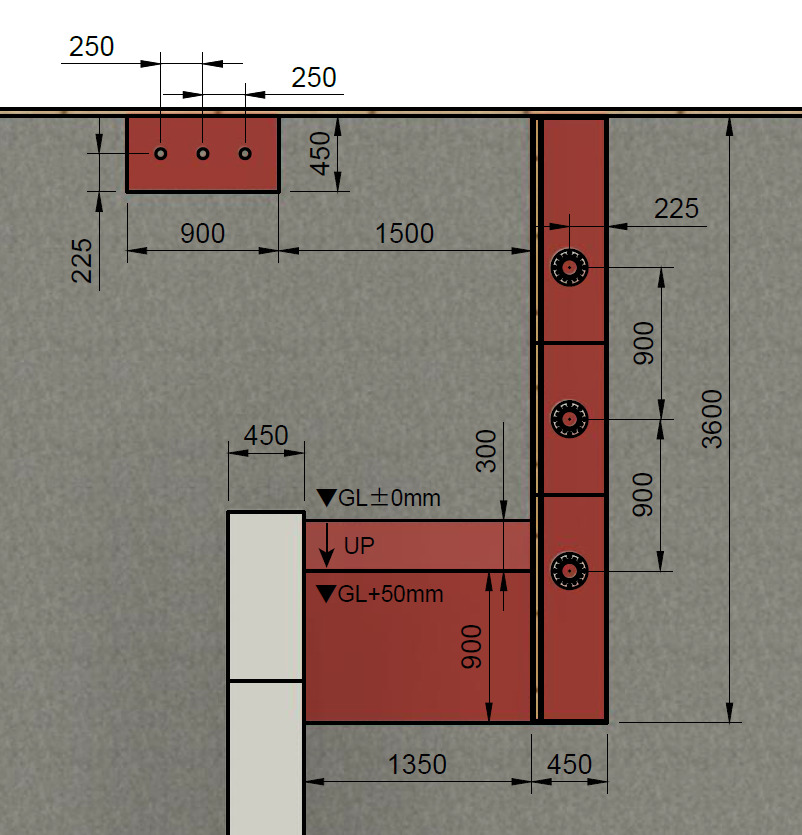

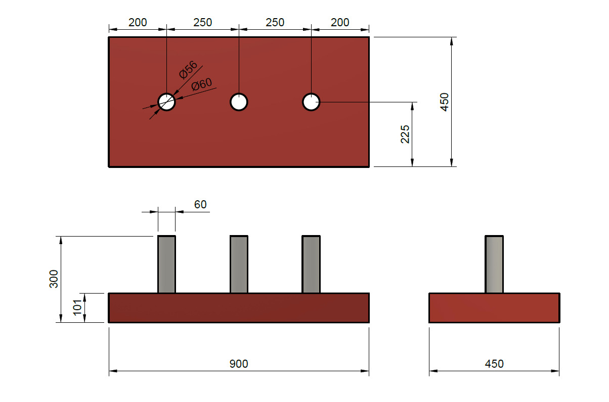

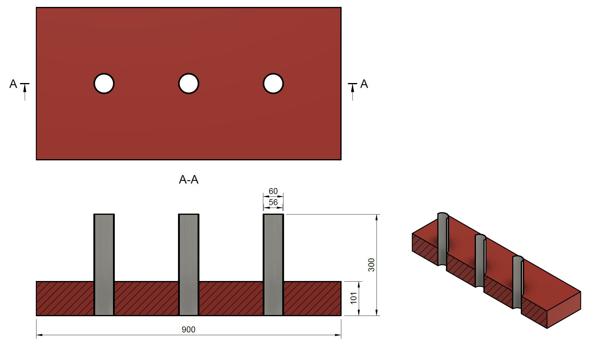

### [8] 高台
高台はバトルゾーン内に2つ設置する。高さ50mmの台であり、一方向にスロープが付いている。
スロープは[株式会社 大同機械 積み積みスロープ H50㎜スロープパーツ](https://www.daidoc.co.jp/products/5730)を使用する。

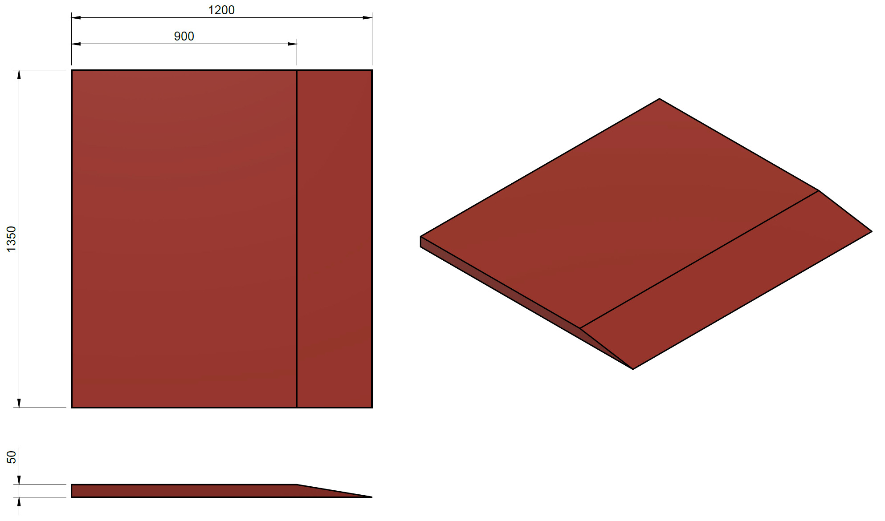

### [9] スポットゾーン
スポットゾーンはバトルゾーン内に赤サイド・青サイド用に1つずつ設置する。幅3600mm×奥行き450mm×高さ100mmの台座に直径114mm、内径107mmのポール（スポット）を900mmの間隔で床面と直角に3つ取り付ける。ポール最上面の高さは、床面から300mmである。

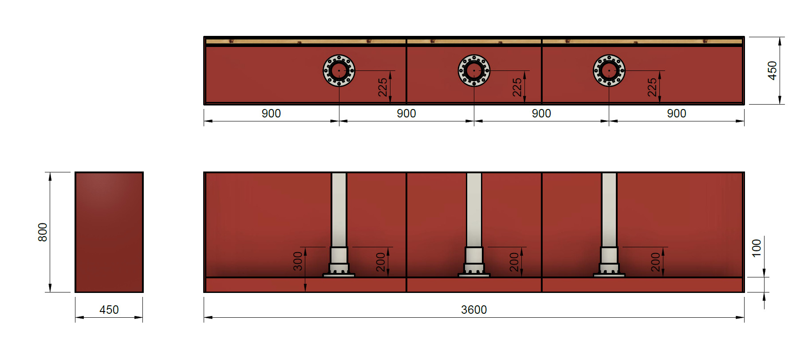

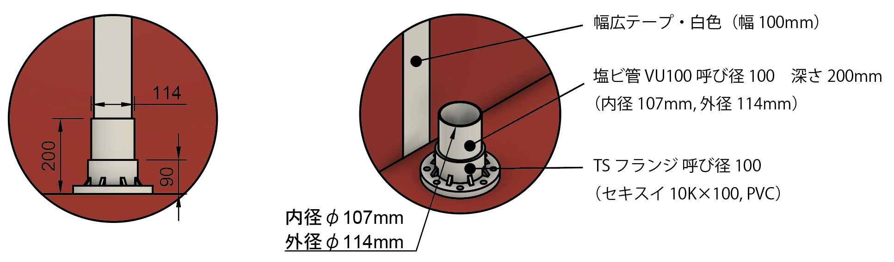

赤サイドの各スポットの配置は以下の図の通りである。青サイドも同様に、フィールド中央側からスポット1・スポット2・スポット3の順番に並んでいる。
- [9-1] スポット1
- [9-2] スポット2
- [9-3] スポット3

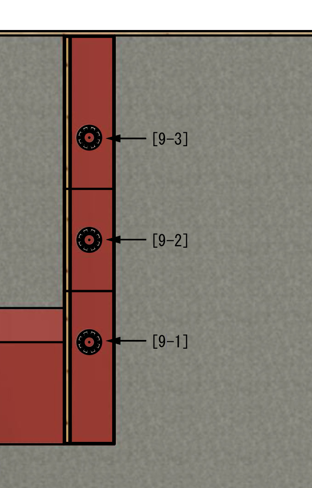

### [10] 自動ロボットゾーン
自動ロボットゾーンは赤サイド・青サイド用に1つずつ設置した、1.8m×1.8mの領域である。厚み12mmのコンパネを用いてバトルゾーンからかさ上げしている。ゾーンは幅38mm、高さ89mmの2x4材で囲まれている。各同盟は、自動ロボット1台を自動ロボットゾーンの中央に任意の向きで設置できる。

自動ロボットゾーンからは、自動ロボットの電源・通信ケーブルを保護するケーブルモールをフィールド外へ向かって設置する。詳細は後日発表する。

### [11] 陣地
**⚠注意**
- 陣地の外観は、ダメージパネルの配置を変更せず、またダメージパネルの進入禁止領域の制限に反しない範囲で今後変更する。
- 陣地には、現在の占拠レベルを示すためのLEDを取り付ける予定である。
 
陣地は1.8m×1.8mの領域である。厚み12mmのコンパネを用いてバトルゾーンからかさ上げしている。陣地は幅38mm、高さ89mmの2x4材で囲まれている。6つのダメージパネルが取り付けられており、そのうち4つが地面から300mmの高さに、2つが地面から700mmの高さにある。いずれの高さも、ダメージパネルのベースプレート最下端までの高さを示している。700mmの高さにあるダメージパネルは20度の傾斜を付けて配置する。赤同盟が攻撃する3つのダメージパネルは各陣地上の[11-1]に、青同盟が攻撃する3つのダメージパネルは[11-2]の位置に配置する。

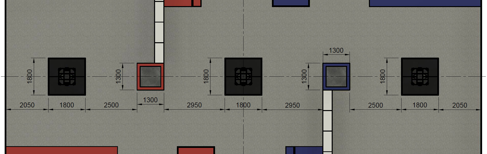

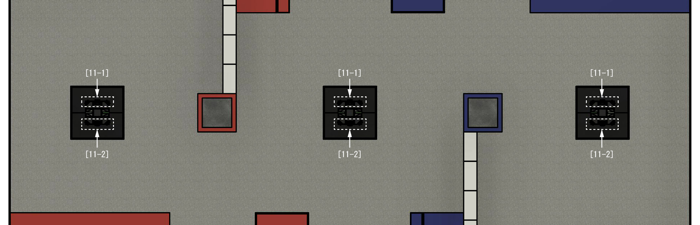

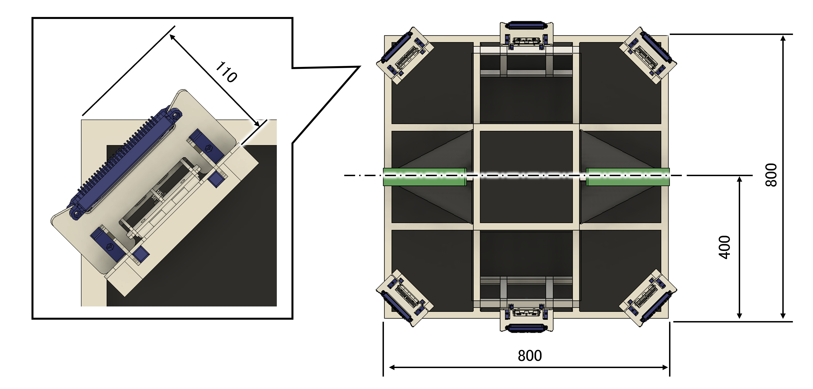

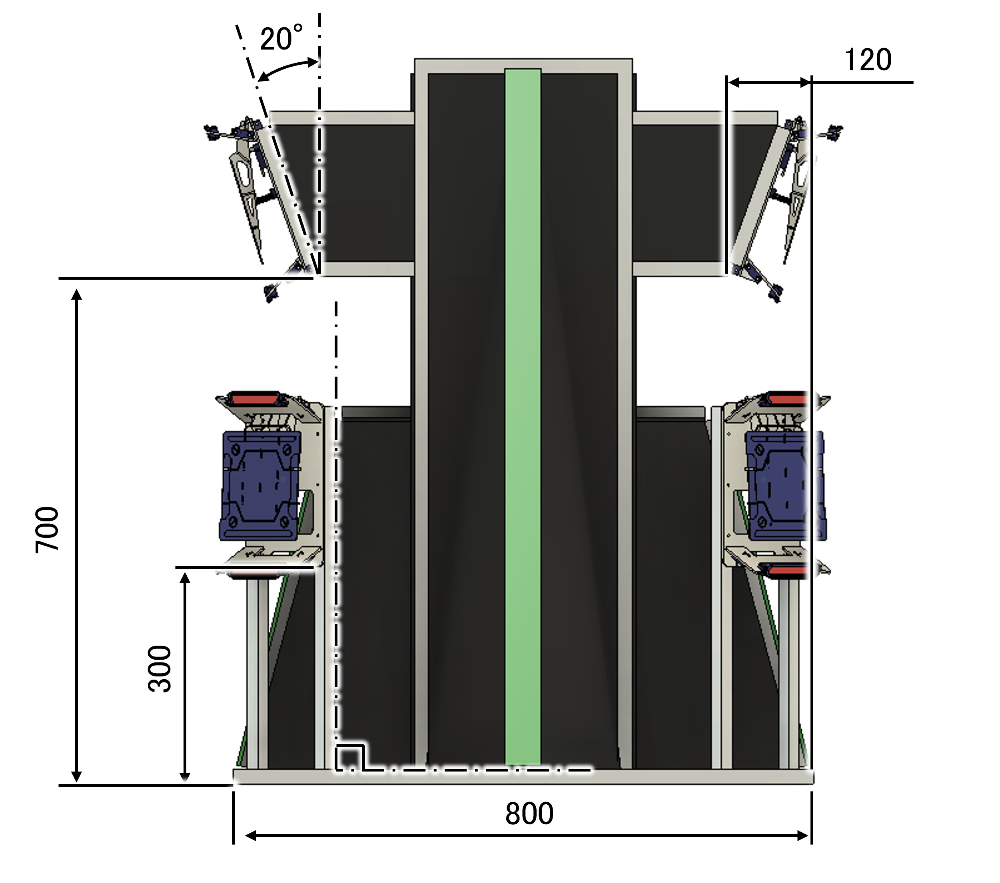

### [12] 柱
柱は選手権会場の構造物である。幅1300mm×奥行き1300mm×高さ1000mmの木材を用いたフェンスを作成して柱周囲を養生している。柱自体は幅1000mm×奥行き1000mmであり、高さは天井まで続いている。

### フェンス
フィールド最外周には単管パイプと木材を用いたフェンスを設置する。