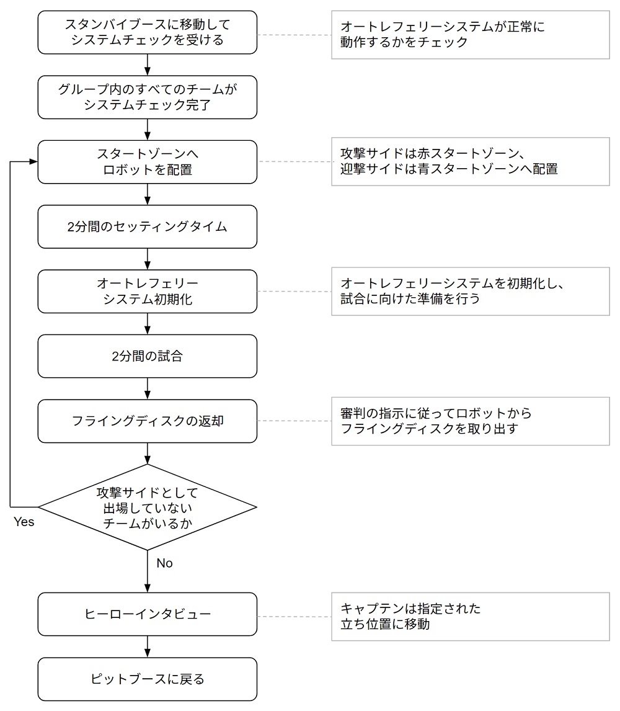
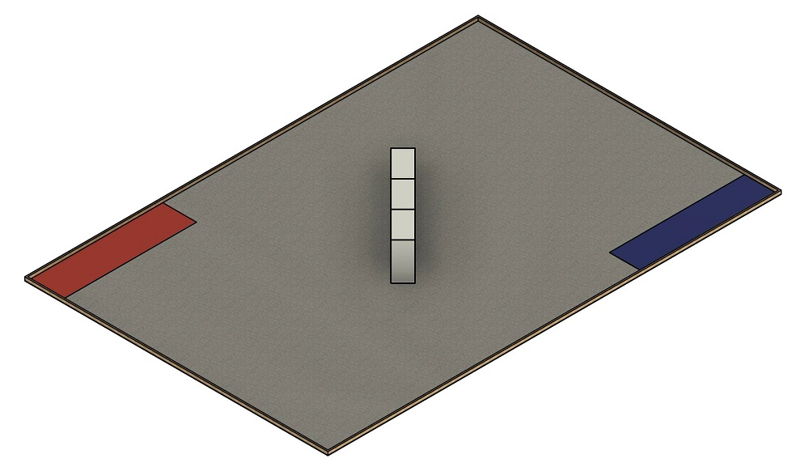
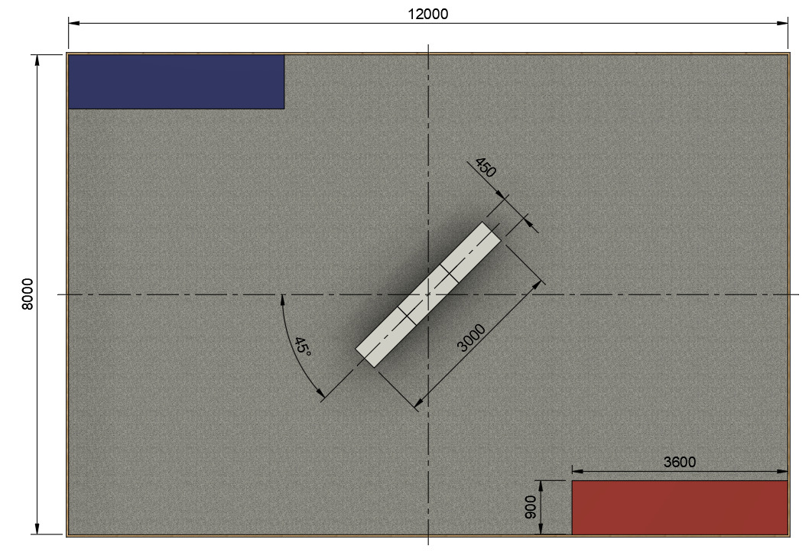
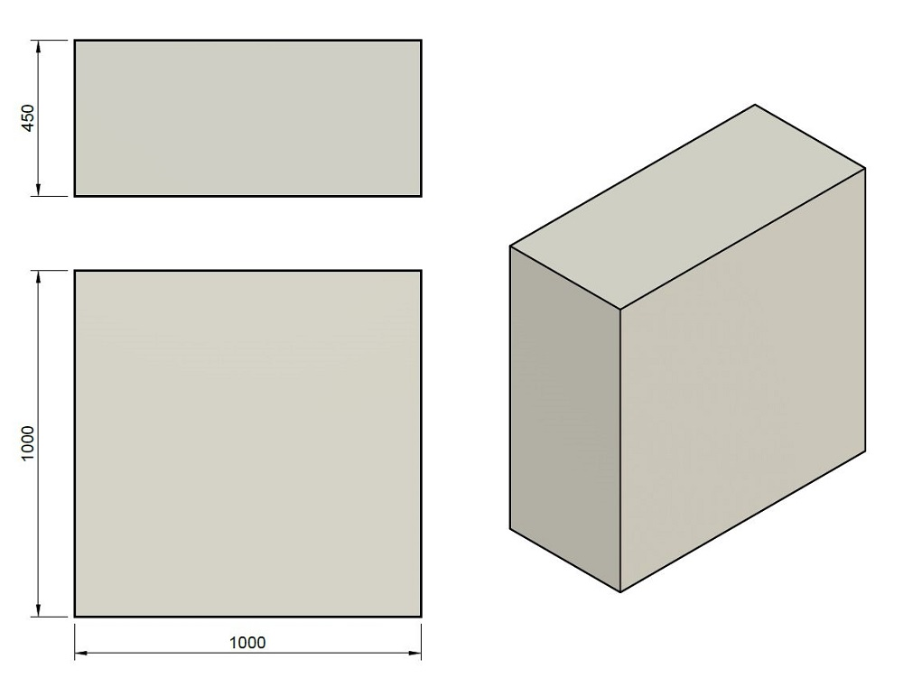
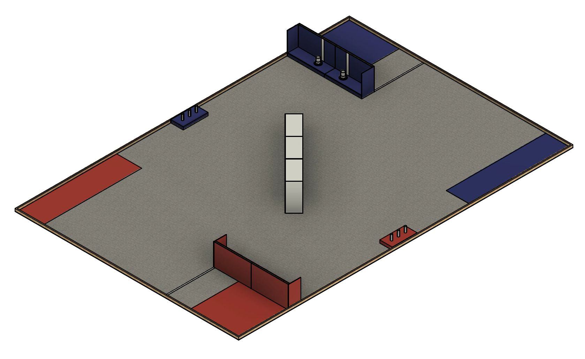
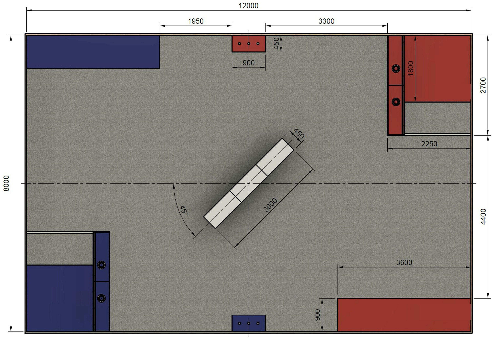
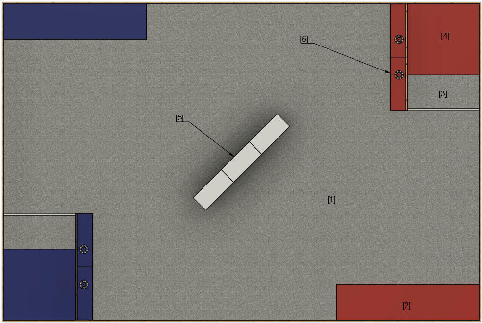
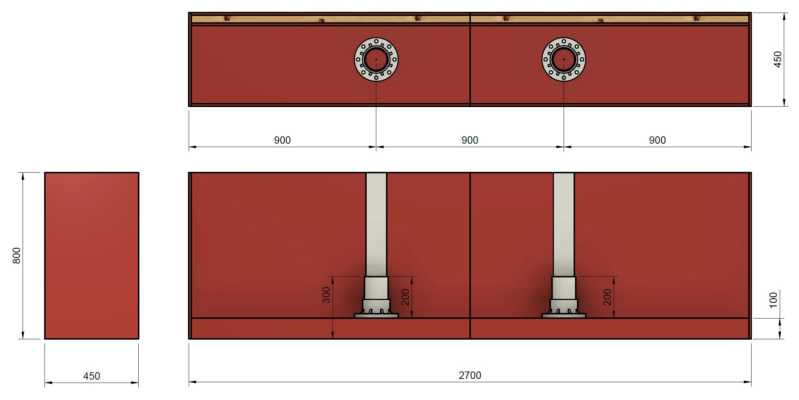
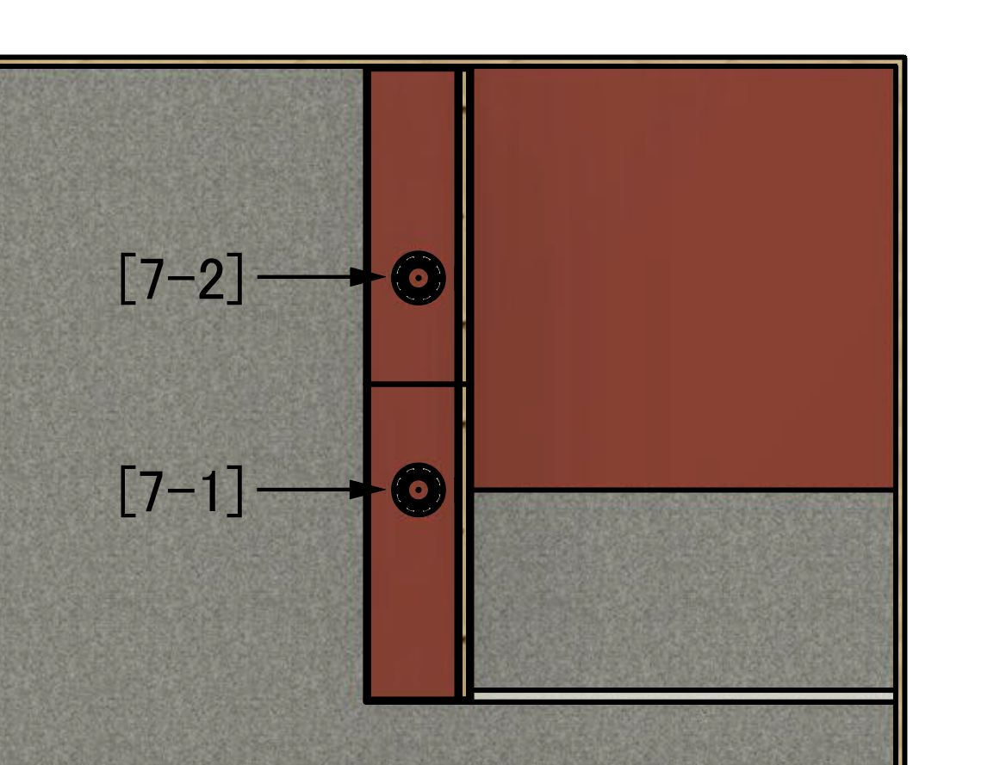

# CoRE-2ルールブック v25.1.0

# 1章　はじめに
本ルールブックはエンジニア選手権、The Championship of Robotics Engineers（CoRE）の2部リーグで使用するルールを記載している。リーグに共通するルールは共通ルールブックに記載されているため、共通ルールブックも参照すること。

# 2章　重要な用語集
ここでは、ルールブック内で使用される用語の中でも重要なものを概説する。各用語の詳細については、ルールブック中の該当する箇所を参照すること。

| 用語 | 定義 |
| -------- | -------- |
| 総大将チーム | 総大将決定戦により選出されるチームのこと。総大将チームは所属している選手の中から総大将を1名選出する。 |
| 総大将 | 競技中における各操縦手の指揮や、各ラウンドにおける出撃ロボットを決定する選手のこと。 |
| 同盟 | 総大将チームを筆頭とした複数チームの組み合わせのこと。決勝戦では個々のチーム同士ではなく同盟同士で対戦する。 |
| 総大将決定戦（アタッカー予選） | 総大将チームを決定するための試合のこと。4チームからなるグループ戦の結果から計算される勝ち点によって、アタッカーチームとしてエントリーしたチームの順位を決定する。 |
| 決勝戦 | 競技優勝を決定するための試合のこと。総大将決定戦で結成した2つの同盟による試合。 |
| 試合 | 総大将決定戦においては各チームの勝ち点、決勝戦では各同盟の勝敗を決定するための対戦のこと。 |
| ラウンド | 決勝戦における試合の区切りのこと。 |
| アタッカー | 総大将決定戦・決勝戦に出場でき、主にフライングディスクを投擲して相手ロボットへ攻撃するロボットのこと。 |
| 攻撃サイド | 総大将決定戦で行われる、1vs3のグループ戦における1チーム側のこと。 |
| 迎撃サイド | 総大将決定戦で行われる、1vs3のグループ戦における3チーム側のこと。 |
| HP | ロボットのヒットポイントのこと。 |
| 撃破 | ロボットのHPが0となり、行動できなくなった状態のこと。 |
| 復活 | 撃破から45秒が経過した時に、HPが自動回復して競技に復帰できる要素のこと。 |
| 強化素材 | スポットへ設置することによってバフ効果を獲得できる競技用品のこと。 |
| バフ効果 | 自分の攻撃力が一定時間上昇し、有利な状態が発生すること。 |
| オートレフェリーシステム | 競技中のヒット判定やHP管理、その他判定に関する処理を行うシステムのこと。 |
| ダメージパネル | ロボットにフライングディスクがヒットしたことを判定する装置のこと。 |

# 3章　競技形式の規則
競技は、総大将決定戦（アタッカー予選）と決勝戦に分けて実施する。

まず総大将決定戦ではアタッカーチームとしてエントリーしたすべてのチームの順位を決定するためにグループ戦を実施する。グループ戦での結果に基づき各チームの勝ち点を算出して、全チームの総大将決定戦における順位を決定し、全チーム中上位2チームを総大将チームとして選出する。また、この順位に従ってその他のアタッカーチームを、それぞれ決定した総大将チームの下に割り当てる。

決勝戦では2つの同盟による同盟バトルを実施する。決勝戦では各総大将の指揮の下、各同盟からアタッカー3台を出撃させて3本先取の試合を行う。決勝戦で勝利した同盟が競技優勝、敗北した同盟が競技準優勝となる。

以下に、各競技形式の詳細を説明する。

## 総大将決定戦の形式
総大将決定戦では総大将チームを2つ選出して2つの同盟を結成するために、アタッカーチームとしてエントリーしたすべてのチームを1グループあたり4チームとなるようにグループに分け、各チームが攻撃サイドとして1試合、迎撃サイドとして3試合出場するグループ戦を各グループで行う。

グループ分けはシーズン途中に提出する審査ビデオの結果に基づき行う。審査ビデオの要件は別途提出資料の詳細を参照すること。グループ戦によってすべてのアタッカーチームの勝ち点を算出し、順位を決定する。この中で、上位2チームが総大将チームとして選出され、それぞれの同盟を率いる。

### グループ戦
グループ戦は4つのチームで行う。グループ内で1チームと3チームに分かれ、1チームvs3チームで2分間の試合を行う。このとき、1チーム側を攻撃サイド、3チーム側を迎撃サイドと呼ぶ。各グループ戦の試合は4回連続で行い、全チームが攻撃サイドで1試合、迎撃サイドで3試合出場するように試合毎に役割を入れ替える。 試合の流れについては5章の進行の規則を参照すること。

グループ戦の各試合は、以下の条件のいずれかを満たすと終了する。
- 攻撃サイドのロボットが撃破される。
- 迎撃サイドのすべてのロボットが撃破される。
- 上記2条件に当てはまらず、2分間が経過する。

なお、エントリーチームの数が4の倍数にならず、すべてのグループ戦を4チームで行うことができない場合は、エントリーチームの中からグループ戦に2回出場するチームを実行委員会が選出する。選出は、審査ビデオの結果に基づいてグループ戦の難易度が極端にばらつかないように配慮して行う。また、グループ戦に2回出場するチームの勝ち点は、最初に出場したグループ戦の勝ち点のみを採用し、2回目に出場した勝ち点は順位付けに反映しない。

### 勝ち点の計算方法と順位付け
まず、グループ戦の各試合において、以下の計算方法で各チームの得点を計算する。なお、迎撃サイドはどのチームが撃破したか、ダメージを与えたかを問わず、出撃したすべてのチームが以下で計算した得点を獲得する。

- 攻撃サイドとして出撃した試合における得点
    - 迎撃サイドのロボットを撃破した：（5×撃破台数）点･･･A
    - 迎撃サイドのロボットへダメージを与えた回数：0～6点･･･B
- 迎撃サイドとして出撃した試合における得点
    - 攻撃サイドのロボットを撃破した：3点･･･C
    - 攻撃サイドのロボットへダメージを与えた回数：0～10点･･･D

各項の最大得点は以下の通りである。
- Aの最大得点：15点（3台をすべて撃破）
- Bの最大得点：6点（3台をすべて撃破）
- Cの最大得点：9点（1試合最大3点×迎撃サイドで出場した3試合）
- Dの最大得点：30点（1試合最大10点×迎撃サイドで出場した3試合）

各チームの勝ち点は以下の式で求める。この式では、攻撃サイドと迎撃サイドの点数比が1:1となるように調整し、合計して満点を100点としている。なお、小数点第三位以下を切り捨てて勝ち点を求める。

$$ （勝ち点）= \left[ \frac{(A+B)}{21}+\frac{(C+D)}{39} \right] \times50 $$

求めた勝ち点から総大将決定戦に出場した全チームの順位を付ける。同点が発生した場合は、以下の基準で順位を付ける。この基準で順位が求まらない場合は同順位として扱う。
1. 攻撃サイドの時に迎撃サイドのロボット3台を撃破するまでのタイムが早い順。
2. 攻撃サイドの時に迎撃サイドのロボットを撃破した台数が多い順。
3. 攻撃サイドの時に迎撃サイドのロボット1台を撃破するまでのタイムが早い順。

### 同盟の結成方法
総大将決定戦で決まった順位のうち、上位2チームを総大将チームとして選出する。それ以外のアタッカーチームの同盟への割り当ては、以下に示す手順で行う。
1. 1位の総大将チームから順番に、1台のロボットを指名して同盟に割り当てる。
2. 総大将決定戦の順位が偏らないよう実行委員会が残りのすべてのロボットを各同盟に割り当てる。

## 決勝戦の形式
**⚠注意**
- 同盟に属するすべてのチームが決勝戦のラウンドで第3ラウンドまでに最低1回は出撃するように、総大将は出撃チームを選ばなければならない。

総大将決定戦で決まった2つの同盟による同盟バトルを行う。

### 同盟バトル
2つの同盟による5ラウンド3本先取形式（BO5）の同盟バトルを行う。各ラウンドでは総大将指揮の下、同盟内からアタッカーを3台出撃させて3vs3で競技を行う。同盟に属するすべてのロボットが第3ラウンドまでに最低1回は出撃するように総大将は出撃するチームを選ばなければならない。試合の流れについては4章の進行の規則を参照すること。

決勝戦の各ラウンドは、以下の条件のいずれかを満たすと終了する。
- どちらかの同盟のすべてのアタッカーが撃破状態である。
- 上記の条件に当てはまらず、5分間が経過する。

### ラウンドの勝敗条件
決勝戦の各ラウンドの勝敗は、以下の順序で決定する。
1. 相手アタッカーすべてを撃破状態とした同盟の勝利
2. 相手アタッカーを撃破した回数が多い同盟の勝利
3. 5分経過時に自同盟のスポットへより多くの強化素材を設置した同盟の勝利
4. 相手同盟への与ダメージが多い同盟の勝利
5. 以上の条件で決定できない場合、引き分けとなり当該ラウンドは再試合となる

## 競技における選手の役割
各チームはエントリーした選手の中から操縦手1名、整備手5名を選出する。決勝戦では必要に応じて、補給手1名を選出できる。また、決勝戦では総大将の役割が追加され、1つの同盟につき総大将チームから1名選出する。

### 総大将チームによる総大将の選出
総大将チームは自チームに所属する選手の中から総大将1名を選出する。ただし、総大将は操縦手・整備手・補給手と兼任してはならない。また総大将は選出後、変更してはならない。

### 総大将の役割
総大将は、同盟に所属する選手の意見を参考に決勝戦の各ラウンドで出撃させるチームを決定する。ラウンド中、総大将は操縦ブースの指定された位置で指揮しなければならない。総大将は操縦ブースで自同盟から出撃中のアタッカーすべての操縦画面を見ることが可能であり、自同盟から出撃中の操縦手全員と会話できる。また、総大将はセッティングタイムに参加できる。

### 操縦手の役割
操縦手は、映像伝送装置で送信される映像を見ながらアタッカーを操縦する。ラウンド中、操縦ブースの指定された操縦席に着席しなければならない。決勝戦では、自同盟から出撃中の他の操縦手および総大将と会話できる。また、操縦手はセッティングタイムに参加できる。

### 整備手の役割
整備手は、セッティングタイムにアタッカーの調整を行う。セッティングタイム終了後、整備手はスタンバイブースで待機しなければならない。

### 補給手の役割
補給手は、決勝戦の各ラウンド中に手動補給エリアで自チームのアタッカーへフライングディスクを補給できる。ラウンド中、補給手は補給待機ブースで待機しなければならない。また、補給手はセッティングタイムに参加できる。

## 審判団
オートレフェリーシステムの補助の下、競技の判定はすべて審判団が責任を負う。審判団は主審・副審・操縦ブース審判から構成される。各審判の人数は以下の表の通りである。

| 種別 | 総大将決定戦 | 決勝戦 |
| -------- | -------- | -------- |
| 主審 | 1名 | 1名 |
| 副審 | 2名 | 4名 |
| 操縦ブース審判 | 2名 | 2名 |

# 4章　各競技進行の規則
## 総大将決定戦の進行
総大将決定戦は、以下のプロセスに従って競技が進行する。

 

### システムチェック
試合に出場するグループのすべてのチームは、スタンバイブースに移動してシステムチェックを受けなければならない。システムチェックでは、オートレフェリーシステムが正常に動作するかをチェックする。

### グループ戦に出場するチームの紹介
試合に出場するグループのすべての選手と監督は、対戦チームの入場および紹介に参加するため指定された立ち位置へ速やかに移動しなければならない。なお選手権進行の都合上、入場および紹介に参加するのはキャプテン・操縦手のみになる場合もある。

### フィールドへロボットを配置
審判の合図に従って、整備手はアタッカーをスタートゾーンへ配置する。

### セッティングタイム
タイマーの合図で2分間のセッティングタイムが開始する。この時間内では、操縦手および整備手がフィールドに入って、試合に向けたアタッカーの調整・動作確認を行うことができる。また、各チームにはセッティングタイム開始とともにフライングディスクが割り当てられる。操縦手はセッティングタイムが終了するまでに操縦ブース内の指定された席に着席しなければならない。オートレフェリーシステムや映像伝送装置などの競技システムにトラブルが起きた場合、テクニカルタイムアウトの措置が執られることがある。詳細はテクニカルタイムアウトの項を参照すること。

### オートレフェリーシステムの初期化
セッティングタイムが終了し、フィールドから選手・審判を含めてすべての人が出た後に、スタッフがオートレフェリーシステムの初期化を行う。

### 試合
タイマーのカウントダウンとともに、2分間の試合が開始する。試合中、迎撃サイドの操縦手は同じ操縦ブースに着席し、相互に会話することができる。試合が終了した後、各チームの整備手はアタッカーの電源を切るか、非常停止スイッチを操作しなければならない。

### フライングディスクの返却
試合の終了後、アタッカーにフライングディスクが搭載されている場合はスタッフの指示に従って速やかにディスクを取り出して返却すること。

### 攻撃サイドと迎撃サイドの入れ替え
グループ内のすべてのチームが攻撃サイドとして一度出撃するように、攻撃サイドと迎撃サイドを入れ替えて「フィールドへロボットを配置」からのプロセスを繰り返す。

### 1グループ内の勝ち点の確定
グループ内のすべてのチームが攻撃サイドとして試合を終えると当該グループの各チームの勝ち点が確定する。その後、キャプテンと操縦手は対戦チームの紹介に参加しなければならない。また、このときヒーローインタビューが行われることがある。

## 決勝戦の進行
決勝戦では以下のプロセスに従って競技が進行する。

 

### システムチェック
同盟バトルに出場する両同盟のすべてのチームは、スタンバイブースに移動してシステムチェックを受けなければならない。システムチェックでは、オートレフェリーシステムが正常に動作するかをチェックする。

### 同盟バトルに出場するチームの紹介
同盟バトルに出場する両同盟のすべての選手と監督は、対戦同盟の入場および紹介に参加するため指定された立ち位置へ速やかに移動しなければならない。なお選手権進行の都合上、入場および紹介に参加するのは総大将・キャプテン・操縦手のみになる場合もある。

### 同盟会議
タイマーの合図で3分間の同盟会議が開始する。両同盟の総大将は、当該ラウンドに同盟から出撃させるチームおよび出撃チームが使う操縦席の番号を決定し、同盟会議の時間が終了するまでに審判へ申告する。申告は実行委員会が作成したフォーマットの書類に記載する形で行う。申告後、出撃するチームと操縦席番号は一切変更できない。

### フィールドへロボットを配置
審判の合図に従って、出撃するチームの整備手はアタッカーをスタートゾーンへ配置する。

### セッティングタイム
タイマーの合図で3分間のセッティングタイムが開始する。この時間内では、出撃チームの操縦手・整備手・補給手がフィールドに入って、試合に向けてロボットの調整、動作確認を行うことができる。また、各同盟にはセッティングタイム開始とともにフライングディスクが割り当てられる。操縦手はセッティングタイムが終了するまでに操縦ブース内の指定された操縦席に着席しなければならない。
- セッティングタイム中に出撃チームにトラブルが起きた場合、審判に対して最大2分間のタイムアウトを申告できる。詳細はタイムアウトの項を参照すること。
- オートレフェリーシステムや映像伝送装置などの競技システムにトラブルが起きた場合、テクニカルタイムアウトの措置が執られることがある。詳細はテクニカルタイムアウトの項を参照すること。

### オートレフェリーシステムの初期化
セッティングタイムが終了し、フィールドから選手・審判を含めてすべての人が出た後に、スタッフがオートレフェリーシステムの初期化を行う。

### ラウンド
タイマーのカウントダウンとともに、5分間のラウンドが開始する。ラウンドが終了した後、各チームの整備手はロボットの電源を切るか、非常停止スイッチを操作しなければならない。

### フライングディスクの返却
試合の終了後、アタッカーにフライングディスクが搭載されている場合はスタッフの指示に従って速やかに取り出して返却すること。

### 勝敗の確定
どちらかの同盟がラウンドを3本先取した時点でその同盟バトルが終了する。同盟バトル終了後、総大将および同盟に所属するすべてのキャプテン、操縦手は対戦同盟の紹介に参加しなければならない。また、このときヒーローインタビューが行われる。

## セッティングタイム中のタイムアウト
総大将決定戦、決勝戦ともに実行委員会の判断によりテクニカルタイムアウトが発生する場合がある。決勝戦では総大将の判断により最大2分間のタイムアウトを申請できる。

### テクニカルタイムアウト
オートレフェリーシステムや映像伝送装置、操縦用無線モジュールなど実行委員会が用意するシステムやデバイスにトラブルが発生した場合、審判はテクニカルタイムアウトを宣言し、セッティングタイムの時間経過を一時停止できる。各システムに接続した出場チームオリジナルのデバイスなどにトラブルが発生した場合、テクニカルタイムアウトは適用されない。テクニカルタイムアウトが実行されている間、選手はスタッフと協力して発生しているトラブルへ対処することしか認められず、それ以外の目的でロボットの調整・修理を行ってはならない。

### タイムアウト
決勝戦ではセッティングタイム中、ロボットにトラブルが起こった場合や、戦略を検討する時間が必要となった場合に、セッティングタイムを2分間延長するタイムアウトを申請できる。タイムアウトは、同盟ごとに1試合に1度だけ認められる。  申請する際は、同盟の総大将が審判にタイムアウトを申請すること。審判はタイムアウトの申請を受けた場合、両方の同盟に対してタイムアウトを通告する。両同盟はこの時間にロボットの調整、修理や戦略の検討を行うことができる。1回のセッティングタイム中にタイムアウトを申請できるのはどちらかの同盟のみとする。両同盟からタイムアウトの申請があった場合、先に審判へ申請があった同盟のタイムアウトが優先され、後から申請があった同盟のタイムアウトは却下される。なお、セッティングタイムが残り15秒未満である場合、タイムアウトの申請は認められない。また、タイムアウトを申請後からキャンセルすることは認められない。

# 5章　競技内容の規則
**⚠注意**
- 衝撃や振動によってダメージパネルが反応してHPが減少した場合も、そのダメージは有効とする。
- 総大将決定戦の迎撃サイド内、決勝戦の自同盟内からフライングディスクの投擲によってHPが減少した場合も、そのダメージは有効とする。

## 共通の規則
### フライングディスクによる攻撃
アタッカーは、フライングディスクを投げ当てる以外の行為で相手ロボットのダメージパネルを攻撃してはならない。フライングディスクがダメージパネルにヒットしたとき、ヒットしたロボットのHPが10減少する。決勝戦においてバフ効果を得ている場合、減少するHPがバフ効果の倍率だけ増加する。なお、衝撃や振動によってダメージパネルが反応してHPが減少した場合でも、そのダメージは有効として競技を続行する。決勝戦においては補給手の安全を確保するため、補給中の手動補給エリアに向けて意図的にフライングディスクを投げてはならない。

### フライングディスクの再利用
フィールド内に落ちているすべてのフライングディスクは、アタッカーが拾って再利用できる。ただし、フィールドの外に出たフライングディスクを拾って再利用してはならない。

### ロボットの撃破
以下のどちらかの条件を満たしたとき、そのロボットは撃破となる。
- HPが0となった場合。
- ロボットが転倒し、復帰できなくなった場合。なお、転倒とは、操縦ロボットの底面がフィールド面から離れ、自力で復帰できなくなった場合を指す。

### ロボット同士の接触
他ロボットを転倒させる、動きを押さえつけ拘束する、または破損させる行為をしてはならない。他ロボットを故意に転倒・拘束・破損させたと審判が判断した場合、反則もしくは失格となる。

### ロボットの非常停止
ロボットが競技中に制御不能となった場合、操縦手が非常停止の信号を送信して、もしくは審判が非常停止スイッチを押して当該ロボットを停止させる。以降、当該ロボットは停止したまま試合もしくはラウンドが終了するまで待機しなければならない。

## 総大将決定戦
### 各サイドのカラー
攻撃サイドは赤、迎撃サイドは青とする。

### ロボットのスタート位置
セッティングタイムが終了するまでに、攻撃サイドのロボットは赤スタートゾーンに、迎撃サイドのすべてのロボットは青スタートゾーンに、上面から見て収まっていなければならない。

### ロボットのHP
試合開始時、攻撃サイドのロボットのHPは100、迎撃サイドのロボットのHPはいずれも20である。

### フライングディスクの付与
セッティングタイム開始時に、攻撃サイド・迎撃サイドどちらのチームにも1チーム当たり50枚ずつフライングディスクを付与する。

## 決勝戦
### 各同盟のカラー
総大将決定戦で1位の総大将チームが率いる同盟は赤サイドから出撃する赤同盟、2位の総大将チームが率いる同盟は青サイドから出撃する青同盟とする。

### ロボットのスタート位置
セッティングタイムが終了するまでに、赤同盟から出撃するすべてのロボットは赤スタートゾーンに、青同盟から出撃するすべてのロボットは青スタートゾーンに、上面から見て収まっていなければならない。

### ロボットのHP
ラウンド開始時、ロボットのHPはいずれも40である。

### 撃破からの復活
ロボットが撃破されてから45秒が経過すると、当該ロボットのHPが30に自動回復して復活し、その場から動作を再開できる。ただし、当該ロボットが転倒状態にある場合は復活できない。なお、復活から5秒間はHPが減少しない無敵状態とする。

### フライングディスクの付与
セッティングタイム開始時、1ラウンド1同盟当たり300枚のフライングディスクが付与される。各同盟は、付与されたフライングディスクをそのラウンドに出撃するすべてのチームで共用する。

### フライングディスクの手動補給
アタッカーが上面から見てすべて自同盟の手動補給エリア内の補給ゾーンに入れば、補給手がフライングディスクを補給できる。なお、アタッカーが上面から見てすべて自同盟の補給ゾーンに入った時刻から20秒以上が経過しなければ、補給ゾーン外に出て競技に復帰できない。審判が時間を計測して補給手に補給ゾーン外に出てよいタイミングを指示するため、補給手はアタッカーのカメラ越しに操縦手に合図を送ること。

マガジンを使用して補給する場合、マガジンはセッティングタイム中に補給待機ブースに設置しなければならない。補給手は、自チームのアタッカーが補給ゾーンに入った時にマガジンを補給待機ブースから補給ゾーンに運び、マガジンを取り付けることができる。なお、マガジンをアタッカーから取り外した場合、当該マガジンは補給後に直ちに補給待機ブースに運ばなければならない。

また、補給中は以下の制限を守らなければならない。
- 非常停止スイッチを操作し、アタッカーを完全停止（脱力）状態としなければならない。
- 手動補給エリアには同時に複数のアタッカーが入ってはならない。
- アタッカーに搭載されたマガジンの取り外しに必要な場合を除き、アタッカー上にあるフライングディスクを取り除いてはならない。
- アタッカーが強化素材を持っている場合、補給手は強化素材に触れてはならない。

なお、手動補給中は、当該アタッカーがロボットのサイズ制限を満たさない状況の発生が一時的に認められる。
ただし、この例外は当該アタッカーが上面から見て補給ゾーンに常に収まっている場合のみ認められる。

**⚠留意事項**
- 補給手が介在する補給中に、発射機構内で詰まっているフライングディスクを取り除く、強化素材を持ち替えるような、補給とは関係のない操作は認められないことを意図している。

### 強化素材の付与とアタッカーへの取付
セッティング開始時、1ラウンド1同盟当たり2本の強化素材が付与される。赤同盟の強化素材は赤色、青同盟の強化素材は青色である。各同盟は、付与された強化素材をそのラウンドに出撃するすべてのチームで共用する。整備手は、セッティング中に強化素材をアタッカーに取り付けることができる。ただし、強化素材の最低部の高さがフィールド床面より200mmを越えないように取り付けなければならない。

### 強化素材のスポットへの設置
**⚠注意**
- 強化素材の設置は審判が判定するため、バフ効果が瞬時に反映されない場合もある。
- 相手同盟のスポットに強化素材を設置した場合、その強化素材の色によらず相手同盟がバフ効果を得る。

アタッカーが、自同盟のスポットに設置すると45秒間、自同盟のすべてのロボットの攻撃力が2倍になるバフ効果が得られる。ただし、1つのスポットで得られるバフ効果は1回のみで、複数本の強化素材を設置したとしても、効果は最初の1回しか得ることができない。また、相手同盟の強化素材を保持した場合や両同盟のスポットに設置済みの強化素材を取り出した場合、反則となる。

2つのスポットでバフ効果が同時刻に発生した場合、その効果は乗算されて2つとも反映される。例えば、強化素材をスポット1に設置してから5秒後にスポット2にも設置した場合、バフ効果の時間経過による変化は以下の表のようになる。なお、実際の競技においては強化素材のスポットへの設置は審判が判断するため、その設置効果が瞬時に反映されない場合もあることに注意すること。

| 時刻 t (秒) | 各スポットでのバフ効果の獲得状況 | バフ効果 |
| -------- | -------- | -------- |
| 0 ≦ t <5 | t = 0 秒でスポット1のバフ効果を獲得 | 攻撃力2倍 |
| 5 ≦ t < 45 | t = 5 秒でスポット2のバフ効果を獲得 | 攻撃力4倍 |
| 45 ≦ t < 50 | t = 30 秒でスポット1のバフ効果が終了 | 攻撃力2倍 |
| 50 ≦ t | t = 50 秒でスポット2のバフ効果が終了 | 攻撃力1倍 |

## 反則行為と失格
### 反則行為
以下の反則行為があった場合、当該ロボットのHPが20減少する。
1. スタート時にフライングをした場合。
2. ロボットがフィールド外に進入した場合。
3. 決勝戦において、相手同盟の手動補給エリアに進入した場合。
4. 決勝戦において、相手同盟の強化素材を保持した場合。
5. 決勝戦において、スポットに設置済みの強化素材を取り出した場合。
6. 緊急時を除き、選手が審判の許可を得ずロボットに触れた場合。
7. 選手が競技中に指定された場所以外に立ち入った場合。
8. フィールドや選手権会場、設備などを破損、汚染した場合。
9. 審判の指示に従わない行為をした場合。
10. ルールブックの規則に違反する行為をした場合。

### 失格
審判が以下の失格行為を認めた場合、総大将決定戦の場合は当該試合を再試合とし、失格行為を行ったチームの順位は最下位とする。決勝戦の場合、当該ラウンドは相手同盟の勝利とする。
1. 故意に相手ロボットの破損・拘束・転倒を招いた場合。
2. 相手ロボットの反則・失格を誘導した場合。
3. 故意にフィールドの破壊を行った場合。
4. オートレフェリーシステムや映像伝送装置のHDMIトランスミッターなど、実行委員会が貸与したロボット取付物品がロボットから落下した場合。
5. ルールブックの規則に違反する危険な行為を行った場合。
6. 発火など、安全管理上重大な問題が発生した場合。

# 6章　競技用品の規則
CoRE-2ではフライングディスク・強化素材を競技中に使用する。以下に、各物品の詳細について示す。

## フライングディスク
フライングディスクは、アタッカーで相手アタッカーを攻撃するために使用できる。積水化成品工業株式会社製の[ライトロンボードRLB20](https://www.sekisuikasei.com/jp/products/electronics/ligthlon_board/)を直径180mm、厚さ20mmの円盤形状に切り抜いたものを使用する。競技において、各チームは実行委員会で用意するフライングディスクを使用しなければならない。

 

## 強化素材
強化素材は、アタッカーのバフ効果を得るために使用できる。外径32mm、長さ500mm、厚み1.5mmのアルミニウム製パイプで、赤もしくは青色の熱収縮チューブで表面を覆ったものを使用する。競技において、各チームは実行委員会で用意する強化素材を使用しなければならない。

 

# 7章　フィールドの規則
CoRE-2では総大将決定戦と決勝戦で異なるフィールドを使用する。以下に、各フィールドの詳細について示す。また、フィールドの寸法には若干の誤差が生じる。

## 総大将決定戦
総大将決定戦では12m×8mのフィールドを使用する（3DCAD図はこちらを参照）。

俯瞰図

 

上面図

 

### スタートゾーン
スタートゾーンは赤サイド・青サイド用に1つずつ設置した、L字型の領域である。

### バトルエリア
バトルエリアは、スタートゾーンやバリケードを除くフィールドすべての領域である。

### バリケード
バトルエリア中央にはバリケードを設置する。バリケードのサイズはいずれも幅1000mm×奥行き450mm×高さ1000mmである。このバリケードを中央に3個連結して配置する。バリケードにはおもりを載せ、容易に移動しないように設置する。バリケードには装飾を施す場合がある。

 

### フェンス
フィールド最外周には単管パイプを用いたフェンスを設置する。

## 決勝戦
決勝戦では12m×8mのフィールドを使用する（[3DCAD図はこちらを参照](https://a360.co/49rKzZj)）。

俯瞰図

 

上面図

 

エリア配置

 

- [1] バトルエリア
- [2] スタートゾーン
- [3] 手動補給エリア
- [4] 補給ゾーン
- [5] バリケード
- [6] スポットゾーン

### [1] バトルエリア
バトルエリアは、各エリア・ゾーンや構造物を除くフィールドすべての領域である。

### [2] スタートゾーン
スタートゾーンは赤サイド・青サイド用に1つずつ設置した、L字型の領域である。

### [3] 手動補給エリアと [4] 補給ゾーン
手動補給エリアは赤サイド・青サイド用に1つずつ設置した、1800mm×2700mmの領域である。エリア内には、1800mm×1800mmの補給ゾーンがある。

### [5] バリケード
バトルエリア内にバリケードを設置する。バリケードのサイズはいずれも幅1000mm×奥行き450mm×高さ1000mmである。このバリケードを3つ連結したものをバトルエリア中央に設置する。すべてのバリケードにはおもりを載せ、容易に移動しないように設置する。

### [6] スポットゾーン
スポットゾーンはバトルエリア内に赤サイド・青サイド用に1つずつ設置する。幅2700mm×奥行き450mm×高さ100mmの台座に直径114mm、内径107mmのスポットを900mmの間隔で床面と直角に2つ取り付ける。スポット最上面の高さは、床面から300mmである。

 
 

赤サイドの各スポットの配置は以下の図の通りである。青サイドも同様に、フィールド中央側からスポット1・スポット2の順番に並んでいる。
- [6-1] スポット1
- [6-2] スポット2

 

### フェンス
フィールド最外周には単管パイプを用いたフェンスを設置する。

