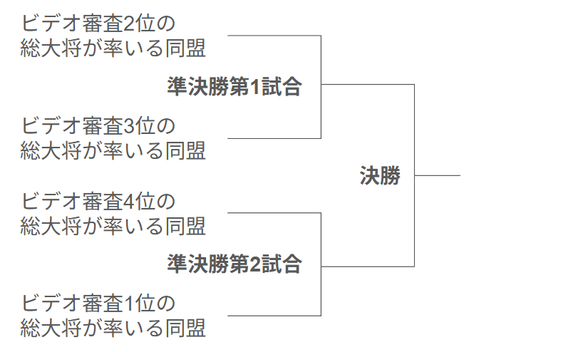
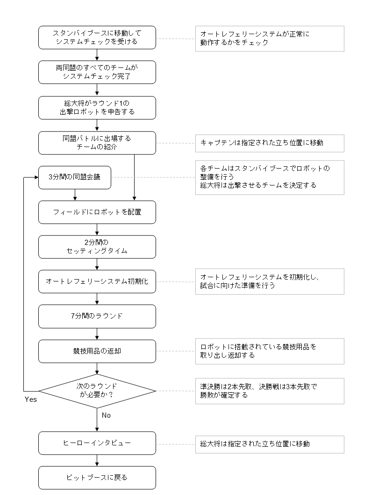
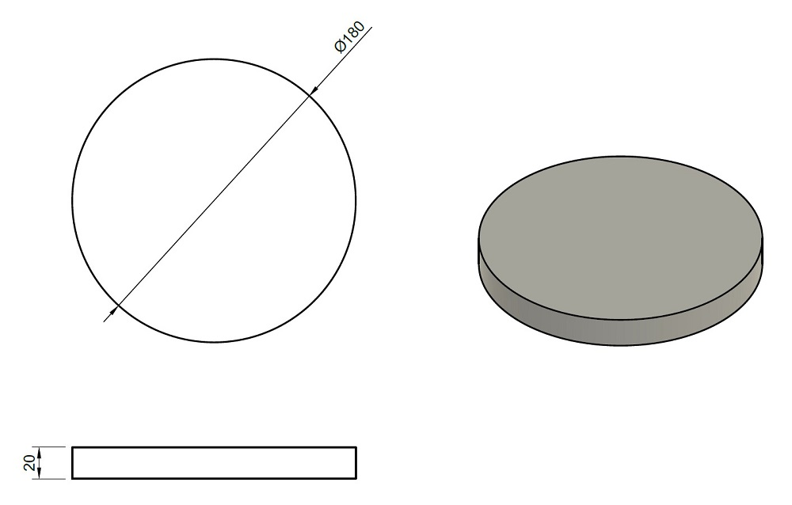
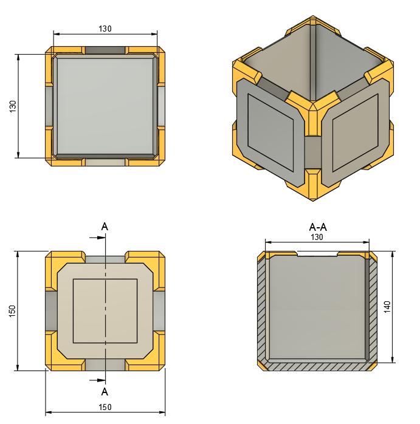
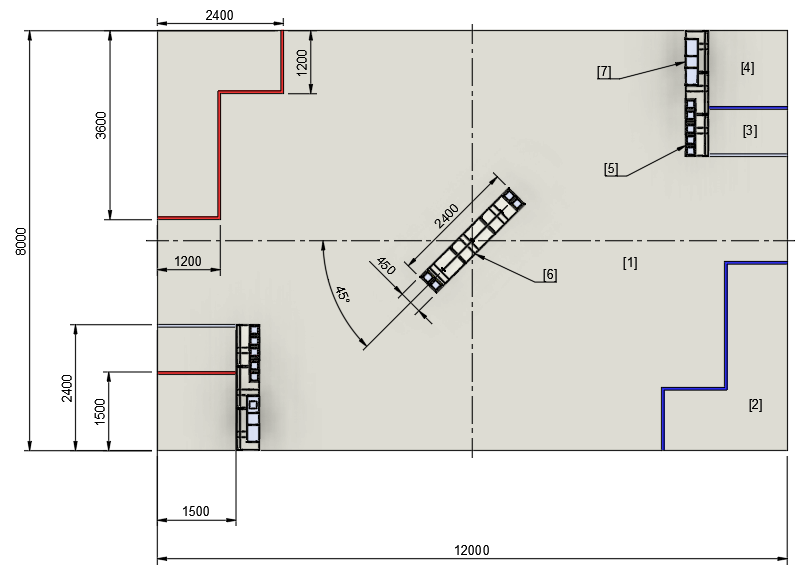
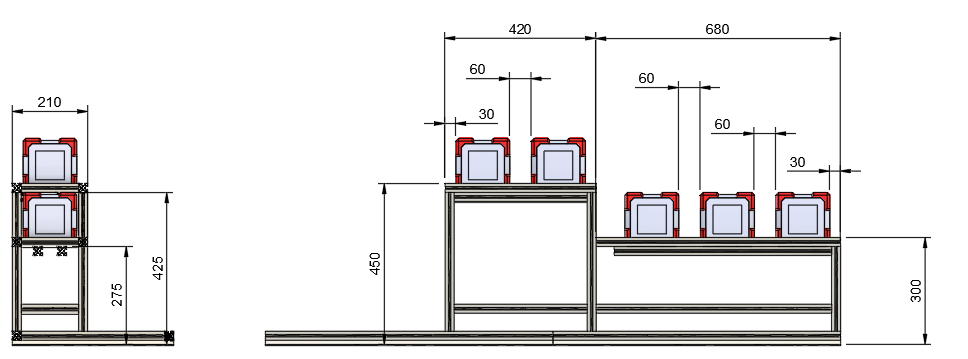
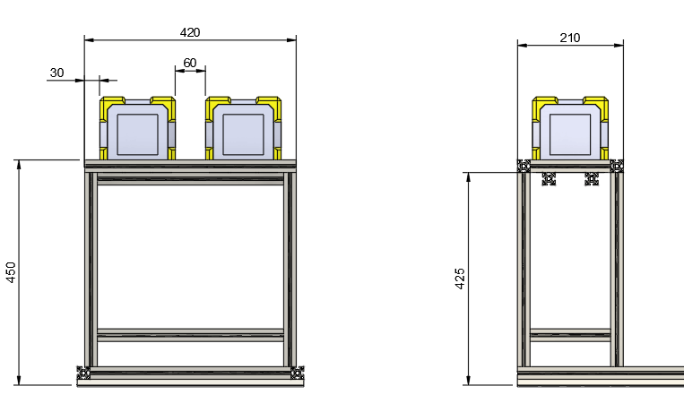
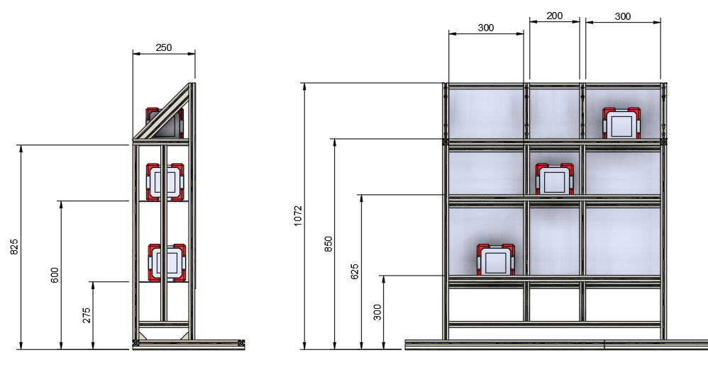

# CoRE-2ルールブック v26.0.1

# 1章　はじめに
本ルールブックはエンジニア選手権、The Championship of Robotics Engineers（CoRE）の2部リーグで使用するルールを記載している。リーグに共通するルールは共通ルールブックに記載されているため、共通ルールブックも参照すること。

なお、2部リーグにおいてはエントリーチーム数が8に満たない場合、準決勝に代わる同盟バトル形式の試合を別途実施する。詳細は別途参加チームに公開する。

# 2章　重要な用語集
ここでは、ルールブック内で使用される用語の中でも重要なものを概説する。各用語の詳細については、ルールブック中の該当する箇所を参照すること。

| 用語 | 定義 |
| -------- | -------- |
| 総大将チーム | ビデオ審査により選出されるチームのこと。総大将チームは所属選手の中から総大将を1名選出する。 |
| 総大将 | 各操縦手の指揮や各ラウンドにおける出撃ロボットの決定、競技中に資源ポイントを消費して各種スキルを発動できる選手のこと。 |
| 同盟 | 総大将チームを筆頭とした複数チームの組み合わせのこと。トーナメント各戦では個々のチーム同士ではなく同盟同士の対戦を行い、試合に敗北した同盟は勝利した同盟の傘下となって次の試合に出場する。 |
| 試合 | 各同盟の勝敗を決定するための対戦のこと。 |
| ラウンド | 各試合における対戦の区切りのこと。 |
| HP | ロボットのヒットポイントのこと。 |
| 撃破 | ロボットのHPが0となり、行動できなくなった状態のこと。 |
| 復活 | 撃破から一定秒数が経過した時に、HPが自動回復して競技に復帰できる要素のこと。 |
| VP（勝利ポイント）| 各ラウンドの勝敗条件に用いるポイントのこと。|
| RP（資源ポイント）| 各ラウンド中に使用することで各種スキルを得られるポイントのこと。|
| RPコンテナ | スポットへ設置することでVPとRPを獲得できる競技用品のこと。 |
| オートレフェリーシステム | 競技中のヒット判定やHP管理、その他判定に関する処理を行うシステムのこと。 |
| ダメージパネル | ロボットにフライングディスクがヒットしたことを判定する装置のこと。 |

# 3章　ロボット
CoRE-2にエントリーしたチームは以下の規則を満たしたロボット1台を出場させることができる。

## エネルギー源の規則
ロボットは電力もしくは圧縮空気以外のエネルギー源を用いてはならない。

**⚠禁止事項**
- 燃焼機関や高圧ガス、爆発物、危険な化学物質などの使用は禁じる。
- 油圧、水圧などフィールドを汚染する可能性があるアクチュエータの使用は禁じる。

### 電源の制限
ロボットへ供給する電源の電圧は公称24Vを超えてはならない。電源には、容量が40A以下の電流遮断用素子や器具（ヒューズやブレーカーなど）を設けなければならない。

**⚠留意事項**
- 以降のルール改定ではオートレフェリーシステムにより電力消費量を計測し、電力消費量が大きい場合に競技上不利となるルールの導入を予定している（電力消費量が一定値を超えるとHPが減少するなど）。

### 圧縮空気の制限
圧縮空気はゲージ圧力が常温で0.75MPaを超えてはならない。このゲージ圧力が常に確認できる圧力計を取り付けること。なお圧縮空気のエアタンクは、市販のエアタンク以外を使用してはならない。

## ロボットの規則
**⚠注意**
- 人間に対して危害を及ぼす可能性がないか、また他のロボットやフィールドを破損させる可能性がないか十分にリスク評価し、許容可能な範囲となるまでリスク軽減策を講じなければならない。

### サイズの制限
ロボットのサイズは、試合開始時に幅800mm×奥行き800mm×高さ1000mmを超えてはならない。試合開始後は幅1000mm×奥行き1000mm×高さ1200mmを超えてはならない。サイズの計測にはオートレフェリーシステムを含め、マガジンを利用する場合はマガジンも含める。なお、複数種類のマガジンを使用する場合には、競技中起こり得るマガジン取り付けのパターンすべてにおいてサイズ制限を超えてはならない。また、映像伝送装置のうち、HDMIトランスミッターとそのマウントパーツ、バッテリー、HDMIケーブルはサイズの計測に含めない。

### アームの制限
RPコンテナの回収や設置に使用するアーム機構は、その最下端と床面の距離が300mmを下回らないように、動作範囲が機械的に制限されていなければならない。

### フライングディスク射出機構の制限
フライングディスクの射出速度は秒速8m/sを超えてはならない。射出機構の数は1つまでとする。ただし競技中に人が一切操縦せず、センサ情報などを使って自動制御されている射出機構の数は制限しない。
なお、射出機構とは、1枚のフライングディスクに対し一方向にのみ加速度を与え、単一の開口部からロボット外に射出する機構を指す。フライングディスクを装填する機構や射出角度を変更するためのジンバルなどの機構は射出機構には該当しない。射出機構がディスクに与える角加速度は制限されない。

### 分離の制限
マガジンを除いて、ロボットは分離してはならない。

### 重量の制限
ロボットの重量は、30kgを超えてはならない。重量の計算には、バッテリー、映像伝送装置、オートレフェリーシステム、エアタンクを含め、マガジンを利用する場合はマガジンも含める。なお、複数種類のマガジンを使用する場合には、競技中起こり得るマガジン取り付けのパターンすべてにおいて30kgを超えてはならない。エアタンクの重量の計算には空気の有無は問わない。また、映像伝送装置のうち、HDMIトランスミッターとそのマウントパーツ、バッテリー、HDMIケーブルは重量の計算に含めない。

### 操縦方法の制限
ロボットを操縦する時には、実行委員会が貸出する操縦用無線モジュールを用いた無線通信以外の手段を用いてはならない。なお、緊急時に操縦手から無線通信によって停止を指令できるようにしなければならない。

### 無線通信の制限
操縦以外の目的で使用する無線モジュールは5GHz・1.9GHz・920MHz・315MHz帯の周波数を用いてはならない。

### 外観の制限
ロボットの外観には、ダメージパネルなどオートレフェリーシステムと誤認するようなデザインおよび光源を使用してはならない。また、他のロボットに搭載されたカメラのホワイトバランスが崩れるような光源を使用してはならない。光源がどの方向から見てもカメラに向かないようにしなければならない。チーム外の第三者に権利が帰属するデザインは、正当な許諾なく使用してはならない。

### その他の制限
ロボットは以下の制限を守らなければならない。
- レーザーは[JIS C 6802：2018](https://kikakurui.com/c6/C6802-2018-01.html)に示されるクラス1以外の製品を使用してはならない。
- フィールドに対して吸引する機構や吸盤などは使用してはならない。
- 一時的なジャンプなどを除き、飛行してはならない。

### 非常停止スイッチの取付
ロボットには、非常停止スイッチとして黄色の土台に取り付けた赤い押しボタンを1つ以上備えなければならない。設置位置は、第三者でも見つけやすく、360度どこからでもいずれかのスイッチを押すことができ、スイッチを押す時に最もリスクが少ない位置としなければならない。非常停止スイッチの設置位置に関しては、ロボット全体の外観、デザイン性などよりも第三者でも安全に操作できることを最優先にして決定すること。

### チームコードシールの貼付
各チームのロボットを識別しやすくするため、チームコードを記載したシールをロボットに貼り付けなければならない。シールは実行委員会から各チームに2枚配布する。様々な方向からチームコードが見えやすくなるよう、シールはそれぞれが対向するように貼り付けなければならない。なお、シールは容易に剥がれない下地に貼り付けなければならない。

シールのサイズは約270mm×80mmである（下記の例を参照）。シールには最大4桁のチームコード、CoREのロゴ、チームエンブレムを掲載する。

## 競技システムの搭載
ロボットには以下の装置・部品を取り付け、適切に接続しなければならない。いずれも詳細は競技システムのルールブックを参照すること。
1. 操縦用無線受信モジュール
2. オートレフェリーシステムのクライアント
3. 映像伝送装置

## 競技に必要な機能の実装
**⚠注意**
- 各チームはロボットの構造を考慮した上で、最も安全に完全停止（脱力）状態へ移行できる機能を実装しなければならない。

ロボットには以下の機能をすべて実装しなければならない。
1. 遠隔非常停止スイッチを含め、非常停止スイッチのいずれか1つを押した時にロボットが完全停止（脱力）状態へ移行する。
2. 撃破時にロボットが完全停止（脱力）状態へ移行する。
3. 操縦の信号がロストした時にロボットが完全停止（脱力）状態へ移行する。

1に関して、速やかにアクチュエータに供給される全てのエネルギー源を遮断し、安全に完全停止（脱力）状態へ移行しなければならない。この完全停止（脱力）状態は、操縦手からの操作があっても、完全停止（脱力）状態を維持しなければならない。

2に関して、オートレフェリーシステムから出力する撃破状態を表す信号をチーム側の制御回路で読み取り、撃破時に速やかにアクチュエータに供給されるエネルギー源を遮断し、安全に完全停止（脱力）状態へ移行しなければならない。

3に関して、信号がロストした時に速やかにアクチュエータに供給される全てのエネルギー源を遮断し、安全に完全停止（脱力）状態へ移行しなければならない。この完全停止（脱力）状態は、信号が復帰するまで継続しなければならない。

## マガジンの規則
**⚠注意**
- マガジンの使用および製作は必須ではない。

ラウンド中、補給手によってフライングディスクを補給できる。このとき、フライングディスクを搭載したマガジンをロボットに取り付けることで補給することもできる。マガジンを使用する場合、以下の制限を満たさなければならない。
- マガジンのサイズは、500mm×500mm×800mmを超えてはならない。
- マガジンには、電力や圧縮空気などのエネルギー源を取り付けてはならない。

# 4章　総大将チームの決定と同盟の結成
**⚠注意**
- 2026シーズンより総大将決定戦は行わず、すべての試合が同盟バトルとなる。

総大将チームおよび同盟の割り当ては、シーズン途中に行うビデオ審査の順位に基づいて決定する。

## 総大将チームの決定方法
審査ビデオに対して実行委員会が評点を付け、このうち上位4チームを総大将チームとする。

### 同盟の結成方法
ビデオ審査で決まった4つの総大将チームに対し、以下の手順で他のチームを割り当てて4つの同盟を結成する。
1. ビデオ審査順位1位の総大将チームから順番に、1チームを指名して同盟に割り当てる。指名前に、すべてのチームの審査ビデオを出場チームに共有する。
2. ビデオ審査の順位が偏らないよう、実行委員会が残りのすべてのチームを各同盟に割り当てる。

# 5章　競技形式
競技はトーナメント方式で実施する。トーナメントではビデオ審査で決定した4つの同盟による同盟バトルを実施する。準決勝では各総大将の指揮の下、各同盟からロボット2台を出撃させて2本先取の試合を行う。準決勝で敗北した同盟は、対戦相手の同盟の傘下に入って1つの同盟となり、決勝戦に進出する。決勝戦では各総大将の指揮の下、各同盟からロボット3台を出撃させて3本先取の試合を行う。決勝戦で勝利した同盟が競技優勝、敗北した同盟が競技準優勝となる。

## 同盟バトル
2つの同盟による1ラウンド7分間の同盟バトルを行う。準決勝は3ラウンド2本先取形式（BO3）、決勝は5ラウンド3本先取形式（BO5）で行う。各ラウンドでは総大将指揮の下、同盟内からロボットを準決勝では2台出撃させて2vs2で、決勝では3台出撃させて3vs3で競技を行う。

準決勝、決勝ともに同盟内のチームが準決勝では第2ラウンドまでに、決勝戦では第3ラウンドまでに、最低1回は出撃するように総大将は出撃ロボットを選ばなければならない。試合の流れについては6章「競技の進行」を参照すること。

### トーナメント表
トーナメントは以下の同盟の割り当てで実施する。各対戦において上側の同盟がフィールドの赤サイドに、下側の同盟が青サイドに割り当てられる。

### ラウンドの勝敗条件
7分が経過してラウンドが終了した際に、獲得したVPが多い同盟の勝利とする。VPが同点の場合は、以下の順序で勝敗を決定する。
1. スポットにより多くのRPコンテナを設置した同盟の勝利
2. 相手ロボットを撃破した回数が多い同盟の勝利
3. 以上の条件で決定できない場合、引き分けとなり当該ラウンドは再試合とする

## 競技における選手の役割
各チームはエントリーした選手の中から操縦手1名、整備手5名を選出する。また必要に応じて補給手1名を選出できる。総大将チームは総大将を1名選出する。

### 総大将チームによる総大将の選出
総大将チームは自チームに所属する選手の中から総大将1名を選出する。ただし、総大将は操縦手・整備手・補給手と兼任してはならない。また総大将は選出後、変更してはならない。

### 総大将の役割
総大将は、同盟内のチームの意見を参考に各ラウンドで出撃させるロボットを決定する。ラウンド中、総大将は操縦ブースの指定位置で指揮しなければならない。総大将は操縦ブースで自同盟から出撃中のロボットすべての操縦画面を見ることができ、自同盟から出撃中の操縦手全員と会話できる。総大将は、操縦ブースに設置された端末を操作し、資源ポイントを消費して各種スキルを発動できる。また、総大将はセッティングタイムに参加できる。

### 操縦手の役割
操縦手は、映像伝送装置で送信される映像を見ながらロボットを操縦する。ラウンド中、操縦ブースの操縦席に着席しなければならない。操縦手は自同盟から出撃中の他の操縦手および総大将と会話できる。また、操縦手はセッティングタイムに参加できる。

### 整備手の役割
整備手は、セッティングタイムにロボットの調整を行う。またラウンド中、手動補給エリアで自チームのロボットの軽整備ができる。セッティングタイム終了後、整備手はスタンバイブースで待機しなければならない。ただしラウンド中、軽整備を行う予定の整備手（1チーム1名まで）は補給待機ブースで待機しなければならない。

### 補給手の役割
補給手は、手動補給エリアで自チームのロボットへフライングディスクを補給できる。ラウンド中、補給手は補給待機ブースで待機しなければならない。また、補給手はセッティングタイムに参加できる。

## 競技の判定と審判団
競技状況はオートレフェリーシステムによって自動で判定し、システムのみで判定できない箇所は審判団が補助する。

# 6章　競技の進行
トーナメントの各試合では以下のプロセスに従って競技が進行する。

## システムチェック
出場する両同盟のすべてのチームは、スタンバイブースでシステムチェックを受けなければならない。システムチェックでは、オートレフェリーシステムが正常に動作するかをチェックする。

## ラウンド1の出撃ロボットの決定
両同盟の総大将は、ラウンド1で同盟から出撃させるロボットとその操縦席の番号を決定し、審判へ申告する。申告は実行委員会が作成したフォーマットの書類に記載する形で行う。申告後、出撃するチームと操縦席番号は一切変更できない。

## 出場チームの紹介
出場する両同盟のキャプテンは、対戦同盟の入場および紹介に参加するため指定位置へ速やかに移動しなければならない。

## フィールドへロボットを配置
審判の指示に従って、出撃チームの整備手はロボットをスタートゾーンへ配置する。

## セッティングタイム
タイマーの合図で2分間のセッティングタイムが開始する。この時間では、出撃チームの操縦手・整備手・補給手がフィールドに入って、ロボットの調整・動作確認ができる。また、各同盟にはセッティングタイム開始とともにフライングディスクおよびRPコンテナが割り当てられる。操縦手はセッティングタイム終了までに操縦席に着席しなければならない。
- セッティングタイム中に出撃チームにトラブルが起きた場合、審判に対して最大2分間のタイムアウトを申告できる。詳細はタイムアウトの項を参照すること。
- オートレフェリーシステムや映像伝送装置などの競技システムにトラブルが起きた場合、テクニカルタイムアウトの措置が執られることがある。詳細はテクニカルタイムアウトの項を参照すること。

## オートレフェリーシステムの初期化
セッティングタイムが終了し、フィールドから選手・審判を含めてすべての人が出た後に、オートレフェリーシステムの初期化を行う。

## ラウンド
タイマーのカウントダウンとともに、7分間のラウンドが開始する。ラウンド終了後、各チームの整備手はロボットの電源を切るか、非常停止スイッチを操作しなければならない。

## 競技用品の返却
試合終了後、ロボットに競技用品が搭載されている場合は速やかに取り出して返却すること。

## 勝敗の確定
準決勝においてはどちらかの同盟がラウンドを2本先取、決勝戦においては3本先取した時点でその試合が終了する。試合終了後、両総大将に対してヒーローインタビューが行われる。

## 同盟会議
次のラウンドがある場合は、タイマーの合図で3分間の同盟会議が開始する。両同盟の総大将は、当該ラウンドに同盟から出撃させるロボットとその操縦席の番号を決定し、同盟会議の時間が終了するまでに審判へ申告する。申告は実行委員会が作成したフォーマットの書類に記載する形で行う。申告後、出撃するチームと操縦席番号は一切変更できない。

## セッティングタイム中のタイムアウト
実行委員会の判断によりテクニカルタイムアウトが発生する場合がある。また、総大将の判断により最大2分間のタイムアウトを申請できる。

### テクニカルタイムアウト
オートレフェリーシステムや映像伝送装置、操縦用無線モジュールなど実行委員会が用意する競技システムにトラブルが発生した場合、審判はテクニカルタイムアウトを宣言し、セッティングタイムの時間経過を一時停止できる。出場チームオリジナルのデバイスなどにトラブルが発生した場合、テクニカルタイムアウトは適用されない。テクニカルタイムアウトが実行されている間、選手はスタッフと協力して発生しているトラブルへ対処することしか認められず、それ以外の目的でロボットの調整や修理を行ってはならない。

### タイムアウト
セッティングタイム中、ロボットにトラブルが起こった場合に、セッティングタイムを2分間延長するタイムアウトを申請できる。タイムアウトは、同盟ごとに1試合に1度だけ認められる。申請する際は、同盟の総大将が審判にタイムアウトを申請すること。審判はタイムアウトの申請を受けた場合、両方の同盟に対してタイムアウトを通告する。両同盟はこの時間にロボットの調整や修理を行うことができる。1回のセッティングタイム中にタイムアウトを申請できるのはどちらかの同盟のみとする。両同盟からタイムアウトの申請があった場合、先に審判へ申請があった同盟のタイムアウトが優先され、後から申請があった同盟のタイムアウトは却下される。なお、セッティングタイムが残り30秒未満である場合、タイムアウトの申請は認められない。また、タイムアウトを申請後からキャンセルすることは認められない。

# 7章　競技内容
**⚠注意**
- 自同盟からフライングディスクの投擲によってHPが減少した場合も、そのダメージは有効とする。

## 各同盟のカラー
各試合において赤サイドに割り当てられた同盟は赤同盟、青サイドに割り当てられた同盟は青同盟とする。

## ロボットのスタート位置
セッティングタイム終了時、赤同盟からの出撃ロボットは赤スタートゾーンに、青同盟からの出撃ロボットは青スタートゾーンに、上面から見て収まっていなければならない。

## フライングディスクの付与
セッティングタイム開始時、各同盟には以下の枚数のフライングディスクが付与される。出撃チームが各賞ファイナリスト選出ボーナスを獲得している場合は、そのボーナスに応じてディスクが追加される。各賞ファイナリスト選出ボーナスについては共通ルールブックを参照すること。各同盟は、付与されたフライングディスクをそのラウンドの出撃チームで共用する。
- 準決勝では1ラウンド1同盟当たり200枚
- 決勝戦では1ラウンド1同盟当たり300枚

## RPコンテナの付与とロボットへの取付
セッティングタイム開始時、準決勝では1ラウンド1同盟当たり2個のRPコンテナが、決勝では1ラウンド1同盟当たり3個のRPコンテナが付与される。赤同盟のRPコンテナは赤色、青同盟は青色である。整備手は、セッティング中にRPコンテナをロボットに取り付けることができる。

## ロボットのHP
ラウンド開始時、ロボットのHPはいずれも60である。

## フライングディスクによる攻撃
ロボットは、フライングディスクを投げ当てる以外の行為で相手ロボットのダメージパネルを攻撃してはならない。フライングディスクがダメージパネルにヒットしたとき、ヒットしたロボットのHPが10減少する。攻撃力アップの効果を得ている場合、減少するHPがその倍率だけ増加する。なお、衝撃や振動によってダメージパネルが反応してHPが減少した場合でも、そのダメージは有効とする。補給手の安全を確保するため、補給中の手動補給エリアに向けて意図的にフライングディスクを投げてはならない。

## フライングディスクの再利用
フィールド内外に落ちているすべてのフライングディスクは再利用してはならない。

## ロボットの撃破
以下のどちらかの条件を満たしたとき、そのロボットは撃破となる。
- HPが0となった場合。
- ロボットが転倒し、復帰できなくなった場合。なお、転倒とは、ロボットの底面がフィールド面から離れ、自力で復帰できなくなった場合を指す。

## 撃破からの復活
ロボットは、以下の条件で撃破状態から復活できる。ただし、いずれの場合も転倒状態にある場合は復活できない。なお、復活から5秒間はHPが減少しない無敵状態とする。
- ラウンド中、撃破されてから30秒が経過すると、HPが自動で全回復して復活し、その場から動作を再開できる。
- ラウンド中、総大将がリジェネを発動するとHPが全回復して復活し、その場から動作を再開できる。

## RPコンテナの回収とスポットへの設置
**⚠注意**
- RPコンテナの設置は審判が判定するため、VP・RP獲得が瞬時に反映されない場合もある。
- 相手同盟のスポットにRPコンテナを設置した場合、反則とする。

ラウンド開始時、赤サイドと青サイドのRPコンテナ置き場にそれぞれ5個のRPコンテナが設置されている。赤サイドのRPコンテナは赤色、青サイドは青色である。フィールド中央の共通RPコンテナ置場には4つのRPコンテナが設置されている。共通RPコンテナは黄色である。ロボットが自同盟サイド、もしくは共通RPコンテナを回収し、自同盟の各スポットに設置するとVPとRPが得られる。ただし、1つのスポットに複数個のRPコンテナを設置したとしても、VPとRPは最初の1回しか得ることができない。また、相手同盟のRPコンテナを保持した場合や両同盟のスポットに設置済みのRPコンテナを取り出した場合、反則となる。

## 勝利ポイントの獲得
各同盟は、以下の表の通り勝利ポイント（VP）を獲得できる。

| 獲得VP量 | 事象 | 備考 |
| -------- | -------- | -------- |
| 10 | 相手ロボットを1台撃破する |  |
| 40 | 相手同盟のロボットを同時刻に2台撃破状態にする | 2回まで |
| 30 | RPコンテナをスポットの下段に1つ設置する | 最大3回 |
| 50 | RPコンテナをスポットの中段もしくは上段に1つ設置する | 最大6回 |

## 資源ポイントの初期値と獲得
資源ポイント（RP）の初期値は、以下の通り決定する。各賞ファイナリスト選出ボーナスについては共通ルールブックを参照すること。
（RPの初期値）＝100＋（出撃チームの各賞ファイナリスト選出ボーナス）

ラウンド中、以下の表の通り追加でRPを得ることができる。

| 獲得RP量 | 事象 | 備考 |
| -------- | -------- | -------- |
| 50 | 試合時間が5分経過する | 経過時に自動的に加算 |
| 30 | RPコンテナをスポットの下段に1つ設置する | 最大3回 |
| 50 | RPコンテナをスポットの中段もしくは上段に1つ設置する | 最大6回 |
| 50 | RPコンテナをスポットに設置した際、3x3のスポットの縦横斜めのいずれかに3つRPコンテナがそろった | 縦3回、横3回、斜め2回の最大8回 |

## 資源ポイントの消費によるスキル発動
各同盟は資源ポイント（RP）を消費することで、以下の表の通り各種スキルを発動できる。ピットインとサプライを除くすべてのスキルは、同時刻に重ねて発動することはできず、また効果終了後5秒間はスキルを発動できない。RPの消費とスキルの選択の方法については後日詳細を発表する。

| スキル名 | 消費RP量 | 効果 |
| -------- | -------- | -------- |
| ピットイン | 20 | フライングディスクの手動補給や軽整備を1回 |
| サプライ | 100 | 自同盟で利用できるフライングディスクを100枚追加 |
| ヒーリング Lv.1 | 50 | 自同盟のロボットのHPを30回復 |
| ヒーリング Lv.2 | 100 | 自同盟のロボットのHPを全回復 |
| ブースト Lv.1 | 50 | 自同盟のロボットの攻撃力を20秒間2倍 |
| ブースト Lv.2 | 90 | 自同盟のロボットの攻撃力を40秒間2倍 |
| バリア Lv.1 | 80 | 自同盟のロボットが20秒間受けるダメージが半減 |
| バリア Lv.2 | 150 | 自同盟のロボットが15秒間無敵 |
| リジェネ | 100 | 自同盟のロボットの1台をHP全回復状態でその場で復活させる |

## フライングディスクの手動補給や軽整備
総大将がRPを消費してピットインを発動すれば、ロボット1台が手動補給エリアに1度侵入できる。ロボットが上面から見てすべて自同盟の手動補給エリア内の補給ゾーンに入れば、補給手がフライングディスクを補給できる。もしくは整備手が軽整備できる。なお、ロボットが上面から見てすべて自同盟の補給ゾーンに入った時刻から20秒以上が経過しなければ、補給ゾーン外に出て競技に復帰できない。審判が時間を計測して補給手に補給ゾーン外に出てよいタイミングを指示するため、補給手はロボットのカメラ越しに操縦手に合図を送ること。

マガジンを使用して補給する場合、マガジンはセッティングタイム中に補給待機ブースに設置しなければならない。補給手は、自チームのロボットが補給ゾーンに入った時にマガジンを補給待機ブースから補給ゾーンに運び、マガジンを取り付けることができる。なお、マガジンをロボットから取り外した場合、当該マガジンは補給後に直ちに補給待機ブースに運ばなければならない。

また、補給中は以下の制限を守らなければならない。
- 非常停止スイッチを操作し、ロボットを完全停止（脱力）状態としなければならない。
- 手動補給エリアには同時に複数のロボットが入ってはならない。
- ロボットがRPコンテナを持っている場合、補給手もしくは整備手はそれらに触れてはならない。ただし、RPコンテナをロボットから取り除くことはできる。

なお、手動補給中は、当該ロボットがサイズ制限を満たさない状況の発生が一時的に認められる。ただし、この例外は当該ロボットが上面から見て補給ゾーンに常に収まっている場合のみ認められる。

## ロボットの非常停止
ロボットが競技中に制御不能となった場合、操縦手が非常停止の信号を送信して、もしくは審判が非常停止スイッチを押して当該ロボットを停止させる。以降、当該ロボットは停止したままラウンドが終了するまで待機しなければならない。

## 反則行為と失格
### 反則行為
以下の反則行為があった場合、当該同盟のVPが50減少する。ただし、VPは0より小さくはならない。
1. スタート時にフライングをした場合。
2. ロボットがフィールド外に進入した場合。
3. 相手同盟の手動補給エリアに進入した場合。
4. 相手同盟のRPコンテナを保持した場合。
5. スポットに設置済みのRPコンテナを取り出した場合。
6. 相手同盟のスポットにRPコンテナを設置した場合。
7. 緊急時を除き、選手が審判の許可を得ずロボットに触れた場合。
8. 選手が競技中に指定された場所以外に立ち入った場合。
9. フィールドや選手権会場、設備などを破損、汚染した場合。
10. 審判の指示に従わない行為をした場合。
11. ルールブックの規則に違反する行為をした場合。

### 失格
審判が以下の失格行為を認めた場合、当該ラウンドは相手同盟の勝利とする。
1. 故意に相手ロボットの破損・拘束・転倒を招いた場合。
2. 相手ロボットの反則・失格を誘導した場合。
3. 故意にフィールドの破壊を行った場合。
4. オートレフェリーシステムや映像伝送装置など、実行委員会が貸与した競技システムがロボットから落下した場合。
5. オートレフェリーシステムや映像伝送装置など、実行委員会が貸与した競技システムを故意に破損させた場合。
6. ルールブックの規則に違反する危険な行為を行った場合。
7. 発火など、安全管理上重大な問題が発生した場合。

# 8章　競技用品
CoRE-2ではフライングディスクおよびRPコンテナを使用する。以下に各物品の詳細について示す。

## フライングディスク
フライングディスクは、ロボットが相手ロボットを攻撃するために使用できる。積水化成品工業株式会社製の[ライトロンボードRLB20](https://www.sekisuikasei.com/jp/products/electronics/ligthlon_board/)を直径180mm、厚さ20mmの円盤形状に切り抜いたものを使用する。競技中、各チームは実行委員会で用意するフライングディスクを使用しなければならない。

 

## RPコンテナ
RPコンテナは、VPおよびRPを獲得するために使用できる。一辺が150mmの立方体形状で、BambuLab製のTPU68Dおよび高速PETGで3Dプリントしたものを使用する。重量は約500gである。競技中、各チームは実行委員会で用意するRPコンテナを使用しなければならない。

 

# 9章　フィールド
CoRE-2では以下のフィールドを使用する（[3DCAD図はこちらを参照](https://a360.co/4mDHeM4)）。フィールドの寸法には若干の誤差が生じる可能性がある。

 

- [1] バトルエリア
- [2] スタートゾーン
- [3] 手動補給エリア
- [4] 補給ゾーン
- [5] RPコンテナ置き場
- [6] 共通RPコンテナ置き場
- [7] スポット

## [1] バトルエリア
バトルエリアは、各エリア・ゾーンや構造物を除くフィールドすべての領域である。

## [2] スタートゾーン
スタートゾーンは赤サイド・青サイド用に1つずつ設置した、L字型の領域である。

## [3] 手動補給エリアと [4] 補給ゾーン
手動補給エリアは赤サイド・青サイド用に1つずつ設置した、1500mm×2400mmの領域である。エリア内には、1500mm×1500mmの補給ゾーンがある。

## [5] RPコンテナ置き場
RPコンテナ置き場はバトルエリア内に赤サイド・青サイド用に1つずつ設置する。高さ300mmの台座には3つのRPコンテナが、高さ450mmの台座には2つのRPコンテナが置かれている。

 

## [6] 共通RPコンテナ置き場
共通RPコンテナ置き場はバトルエリア内中央に1つ設置する。高さ450mmの台座には4つの共通RPコンテナが置かれている。

 

## [7] スポット
スポットはバトルエリア内に赤サイド・青サイド用に1つずつ設置する。

 

## フェンス
フィールド最外周には単管パイプを用いたフェンスを設置する。
