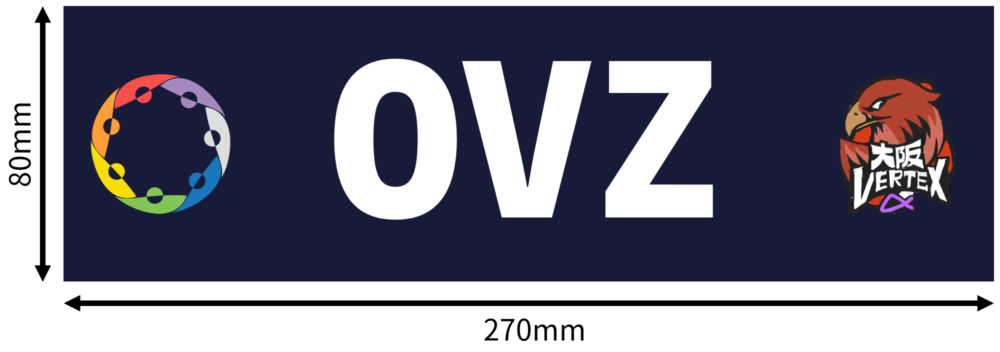
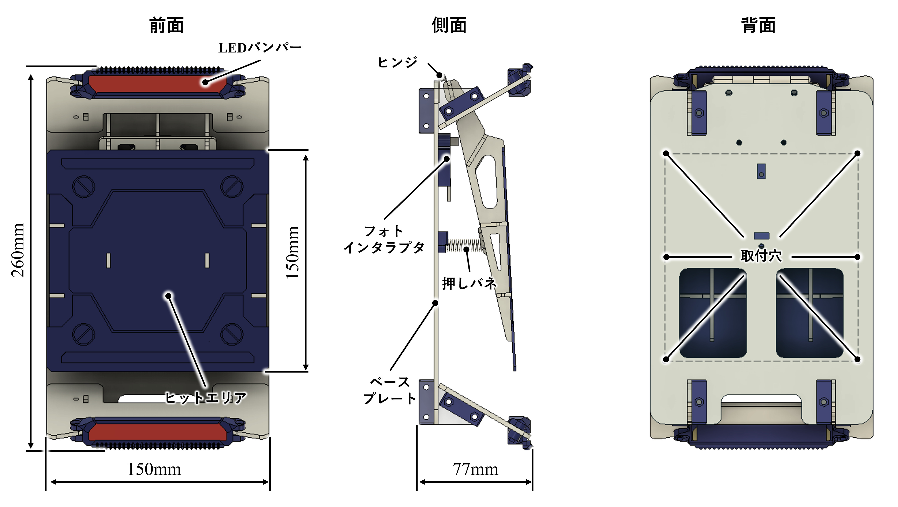
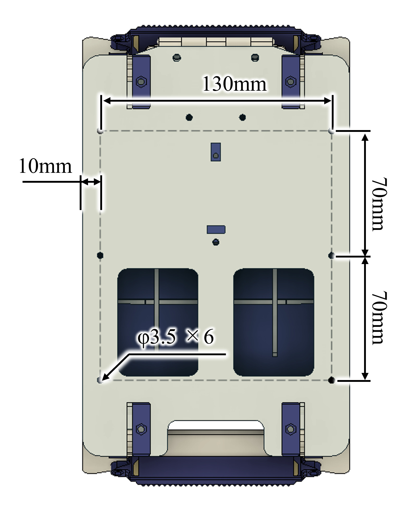
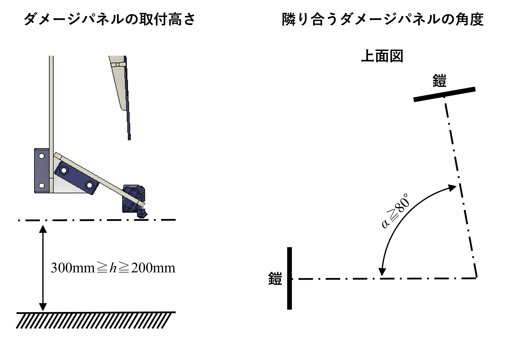
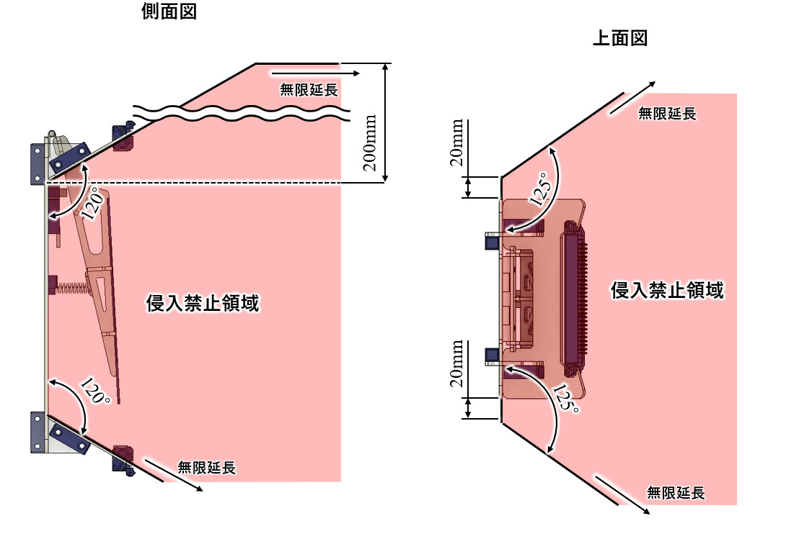
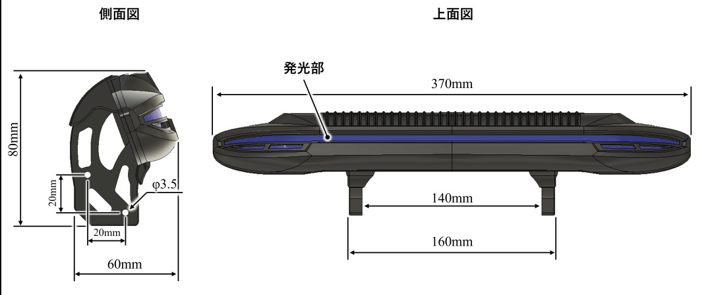
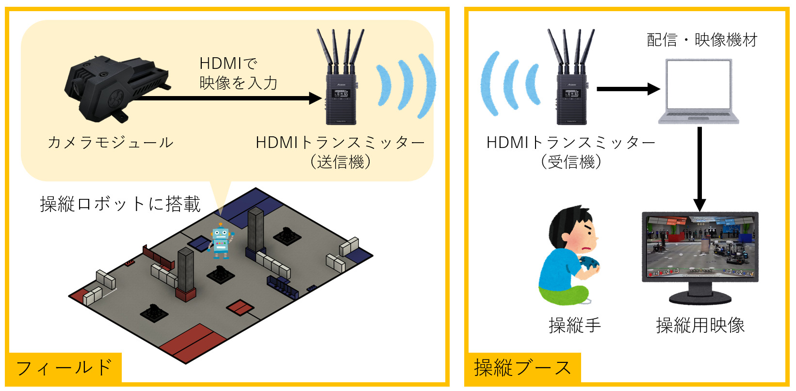
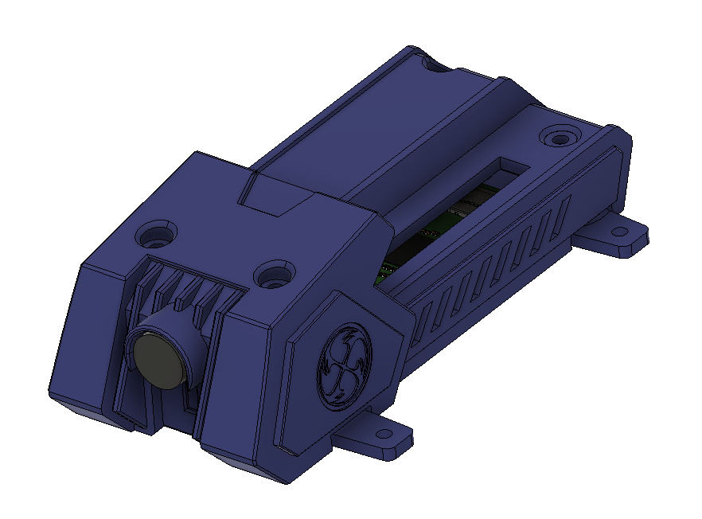
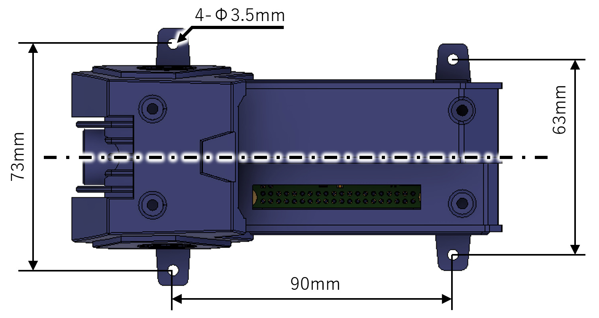

# CoRE共通ルールブック v1.1.0

# 1章　はじめに
本ルールブックは、エンジニア選手権、The Championship of Robotics Engineers（CoRE）の1部リーグと2部リーグで共通するルールを記載している。1部リーグと2部リーグでは試合形式などが異なるため、出場リーグに合わせてそれぞれのルールブックも参照すること。

## 本選手権の理念
### 本選手権によって実現したい未来像
本選⼿権の開催を通じて「技術者の裾野が広がり優秀な技術者が多数輩出されるとともに、あらゆる⼈々が技術者の素養を持ち科学技術の発展へ共に貢献できる社会を創ることで、社会⼀体となって科学技術でより良い社会を共創する」未来を⽬指す。

### 本選手権が果たすべき役割・使命
本選⼿権の使命は「あらゆる⼈々が科学技術を学べる機会と場所、学びの道筋、ロールモデルをロボット競技の枠組みとして提供することで、科学技術への深い教養を持つとともに⾃信を持って新しいことに挑戦でき、各々がコミュニティ発展に貢献できる”挑戦的共創⼈材”を育成すること」である。

### 選手権に関わるすべての人が身につけるべき価値観・⾏動指針
CoREで育成する”挑戦的共創⼈材”が⾝につけるべき重要な価値観は以下の7つである。
- 未知に挑み続ける
    - あらゆる場⾯で新しい技術やアイデアを常に探求しよう
    - 失敗を恐れずに⼤胆に⾏動しよう
- 継続で壁を打ち破る
    - 情熱の下に、粘り強く問題に挑もう
- 学びで世界を変える
    - 好奇⼼を持って学び続けることでより良い世界を共創しよう
    - 強みを伸ばしながら、学びを広げることで視座を⾼めよう
- 協⼒してより⾼みへ
    - 違いを認め合い、互いを尊重して、仲間を増やそう
    - 各々の強みを活かして協⼒することで⾼みを⽬指そう
- あらゆる挑戦を楽しむ
    - 困難な状況でも常に全⼒で楽しもう
    - 仲間と楽しみを分かち合おう
- 未来へつなげる
    - チームの継続的発展のために⾏動しよう
    - エンジニアコミュニティ発展のために⾏動しよう（※ここでいうエンジニアコミュニティとは、CoRE等の特定のコミュニティに限らず、エンジニアリングに関わる⼈や組織全てを包括する）
- ⼈・技術へ誠実に
    - 誠実で信頼される⼈であろう
    - 公正かつ真摯に技術と向き合おう

# 2章　重要な用語集
ここでは、ルールブック内で使用される用語の中でも重要なものを概説する。各用語の詳細については、ルールブック中の該当する箇所を参照すること。

| 用語 | 定義 |
| -------- | -------- |
| CoRE | The Championship of Robotics Engineersの略称。 |
| 挑戦的共創人材 | CoREで育成する次世代エンジニアのこと。 |
| CoRE-1 | CoRE 1部リーグを表す。 |
| CoRE-2 | CoRE 2部リーグを表す。 |
| 総大将チーム | 総大将決定戦により選出されるチームのこと。総大将チームは所属している選手の中から総大将を1名選出する。 |
| 総大将 | 競技中における各操縦手の指揮や、各ラウンドにおける出撃ロボットを決定する選手のこと。 |
| 同盟 | 総大将チームを筆頭とした複数チームの組み合わせのこと。決勝トーナメントでは個々のチーム同士ではなく同盟同士の対戦となり、試合に敗北した同盟は勝利した同盟の傘下となって次の試合に出場する。 |
| 総大将決定戦 | 総大将チームを決定するための試合。操縦ロボットチームとしてエントリーしたチームの順位を決定する。 |
| 決勝トーナメント | 競技優勝を決定するための試合。 |
| 試合 | 総大将決定戦においては各チームの勝ち点、決勝トーナメントにおいては各同盟の勝敗を決定するための対戦のこと。 |
| ラウンド | 決勝トーナメントにおける試合の区切りのこと。 |
| 操縦ロボット | CoRE-1・CoRE-2それぞれにおいて総大将決定戦、決勝トーナメントに出場でき、各チームがハードウェア・ソフトウェアの製作を行うロボット。 |
| 自動ロボット | CoRE-1の決勝トーナメントのみに出場するロボット。実行委員会が製作したロボットに対してソフトウェア開発のみ行う。 |
| HP | 操縦ロボットのヒットポイントのこと。 |
| 撃破 | 操縦ロボットのHPが0となり、行動できなくなった状態。 |
| オートレフェリーシステム | 競技中のヒット判定やHP管理、その他判定に関する処理を行うシステム。 |
| ダメージパネル | 操縦ロボットにフライングディスクがヒットしたことを判定する装置。 |
| 操縦ブース | 総大将および操縦手が着席し、各ロボットの操縦や指示・情報伝達を行う場所。 |
| マガジン | あらかじめフライングディスクを装填しておき、操縦ロボットへのフライングディスクの補給をスムーズに行うための器具。 |
| 強化素材 | スポットへ設置することによってバフ効果やHP回復ができる競技用品。 |
| バフ効果 | 自分の攻撃力が上昇し、有利な状態が発生すること。 |

# 3章　チームの規則
**⚠注意**
- 監督および選手は、複数チームに登録することはできない。
- 選手の競技における役割については、1部リーグと2部リーグそれぞれ出場するリーグのルールブックも参照すること。

CoREは、参加するチーム構成員のすべての人々が挑戦的共創人材としての価値観を身につけ、次世代のエンジニアとして成長することを目的としている。したがって、参加するすべてのチーム活動は複数年にわたって継続的に行われることを前提としている。そのため、チーム構成員の中でも特に監督やキャプテン、プロジェクトマネージャーはチームを維持し発展させ、すべての構成員が成長できるようなチームを作りあげるよう行動しなければならない。また、CoREの参加者、観客その他関連するすべての人々が、過去の活躍を含め持続的に各チームを認識しやすくするため、チーム固有の情報（チーム名およびチームエンブレムなど）は継続して使用されなければならない（注1）。

（注1）例えばCoREのWebサイトでは各チームの過去の戦績を掲載する。参加する毎にチーム名やエンブレムが変更されると、継続して応援したい観客にとってもチームの識別が困難となる。

## チーム名の規則
**⚠注意**
- チーム名は、プロスポーツチームのように継続して使用すること。

チーム名は、CoREの参加者、観客その他関連するすべての人々がチームを認識するための固有の名称であり、誰からもわかりやすく呼びやすい名称として名付けなければならない。各チームは、以下のガイドラインに従ってチーム名を命名しなければならない。なお、実行委員会がチーム名の修正を求める場合もあり、変更に応じない場合はエントリーが認められない。
- 自チームとは関連のない既存のチームや企業・ブランド・その他商標などと混同しないようにする。
- 名前は覚えやすく、発音しやすく、短いものにする。
- 名前は公共の場で使用するにふさわしく、誰からも不快に思われないものにする。
- 特定の界隈の者にしか理解できない名前にはしないようにする。

### 実行委員会によるチームコードの命名
実行委員会は、登録されたチーム名を短縮した4文字以内のチームコードを命名する。チームコードにはアルファベットと数字を使用する。例えば登録されたチーム名が「VERTEX-Zeta」であった場合、「VZ」がチームコードの一例となる。チームコードは、ロボットに掲載するチームコードシールや、選手権の配信映像、操縦画面などに使用する。

## チームエンブレムの規則
**⚠注意**
- チームエンブレムは、プロスポーツチームのように継続して使用すること。

チームエンブレムは、CoREの参加者、観客その他関連するすべての人々がチームを認識するための固有のイラストである。各チームは、以下のガイドラインに従ってチームエンブレムを制作しなければならない。なお、実行委員会がチームエンブレムの修正を求める場合もあり、変更に応じない場合はエントリーが認められない。
- 自チームとは関連のない既存のチームや企業、ブランド、その他商標のロゴやエンブレムと混同しないデザインにする。
- 掲載スペースは基本的に正方形を想定しているため、エンブレムが極端に縦長や横長とならないデザインにする（アスペクト比が1:1に近いことを推奨）。
- エンブレムは最小で20mm×20mm程度（操縦画面など）のサイズで使用するため、小さく表示した場合にも識別できるようなデザインにする。
- チーム外の第三者に権利が帰属するデザインは使用してはならない。ただし、権利者に正当な許諾を得て使用する場合はこの限りではない。
- エンブレムは公共の場で使用するにふさわしく、誰からも不快に思われないものにする。

## チーム構成員の規則
CoREに参加するチームは、監督1名以上および選手5名以上で構成される。選手権当日もこの人数を満たさない場合、試合に出場できない。コーチの登録は必須ではないものの、人材育成の観点から技術のみならず多様な分野での助言およびコーチングを得るためにコーチを入れることを強く推奨する。なお、監督および選手は、複数のチームに登録することはできない。

### 監督
監督はチームに1名以上必要であり、最大5名まで登録できる。未成年者は監督になることはできない。チームが教育機関に属する場合、最低1名は当該教育機関に属する教職員を含めなければならない。

### コーチ
コーチは5名まで登録できる。コーチは、選手権開催日時点で15歳以上でなければならない。

### 選手
選手はチームに5名以上必要であり、20名まで登録できる。選手は、選手権開催日時点で10歳以上でなければならない。

## チーム活動における構成員の役割
各チームは登録した選手の中から、キャプテン1名、プロジェクトマネージャー1名、安全管理担当者1名、PR担当者1名を選出する。各役割はいずれも兼任してはならない。

### 監督の役割
監督は観察力・指導⼒と親しみやすさをもって、所属全選手の継続的な成⻑や挑戦を促すことに努める。その主な役割は以下の通りである。
- **チームの観察と分析**：チーム全体と選手個人個人、また製作したロボットを深く観察し、抱える課題を見つけ分析し、根本原因を把握する。
- **コミュニケーション**：選手とともにチーム活動を楽しんで親しい関係を構築し、選手の意見を十分に傾聴する。
- **チームの指導**：チームが抱える問題を選手に向けて論理的に説明し、解決策を選手とともに議論し、解決に向けて選手の行動を促す。また、選手の成長や挑戦を促し、誘導する。
- **チームの発展**：チームの将来を見据えて、発展を促す。

### コーチの役割
コーチは、専門性を持って知識、ノウハウを選手に助言し、所属全選手の成長を促すことに努める。

### キャプテンの役割
キャプテンは、分析・決断・先導⼒を持ってチームをあるべき⽅向に導き、またチームの円滑かつ継続的発展に務める。その主な役割は以下の通りである。
- **チーム目標の策定と共有**：チームが進むべき目標を、具体的かつ達成度合いが測定可能な形で、またチームによって適切な難易度として策定し、チーム全員に目標とその策定理由を共有する。
- **チームの分析**：チームが抱える課題・問題を洗い出す。
- **判断・決断**：チームが進むべき方向を、チームのビジョンに基づき論理的に根拠を立てた上で、判断もしくは決断する。
- **チームの先導**：選手の統率を取り、チームが進むべき方向を責任感を持って誘導する。
- **コミュニケーション**：選手がお互いに協力しやすい雰囲気を生み出すために日頃からすべての選手と良好な人間関係を構築する。
- **チーム育成方針の策定**：チームを継続的に発展させるため、選手のスキルアップや後輩育成を含めたチームリソースの拡充のための方針を策定する。
- **実行委員会との連携**：CoREコミュニティ発展のため、ワークショップなどで積極的に提案を行う。実行委員会からの情報をチームにもれなく円滑に共有する。

### プロジェクトマネージャーの役割
プロジェクトマネージャーは、分析・計画⼒を持ってチーム⽬標を実現する計画を⽴案し、計画が円滑に進むように努める。その主な役割は以下の通りである。
- **仕様策定**：チーム目標の実現に必要なロボットの仕様を、チームリソースを加味して策定する。
- **計画立案とタスク割当**：ロボットの製作計画を立て、タスクに分割して選手に適材適所で割り当てる。
- **タスクの進捗管理**：選手と密にコミュニケーションを取り、タスクの進捗状況を管理する。
- **リソースの状況把握**：チーム内リソースの状況を把握し、チーム全員に共有する。
- **計画の修正**：タスクの進捗度に応じて計画を修正する。 
- **改善活動**：適切なタイミングで計画と成果を見直し、改善に努める。
- **リソースの拡充**：チーム方針に基づき、チームのリソースを拡充するための計画を立て、実行する。

### 安全管理担当者の役割
安全管理担当者は、チームが安全に活動できるようチーム全員へのリスク情報の共有、活動におけるリスクアセスメント、リスク軽減策の考案と実施を主導する。その主な役割は以下の通りである。
- **ロボット設計のリスクアセスメントの主導**：リスクアセスメントシートを用いてロボットの機構・アイデアを活かしつつ安全なロボットの設計を行えるよう主導する。
- **作業環境のリスクアセスメントの主導**：チームごとの作業環境に合わせてリスクが評価されるよう主導する。
- **動作試験・練習のリスクアセスメントの主導**：各チームの動作試験・練習環境やロボットの機構・アイデアに応じてリスクが評価されるよう主導する。
 - **リスク情報の共有の主導**：チーム内でのリスク情報共有を主導する。

### PR担当者の役割
PR担当者は、チームとコミュニティの発展を目的として、チーム活動の対外的な広報を務める。その主な役割は以下の通りである。
- **広報ターゲットと手段の策定**：広報のターゲットを設定し、それに見合った広報手段を選択する。
- **広報手段の開拓**：従来の広報手段だけにとらわれず、様々な手段の開拓を進める。
- **広報効果の評価**：広報による効果を定量的に評価する。

# 4章　表彰の規則
**⚠注意**
- 総合部門および競技部門を除き、各部門の賞の審査を受けるためには各チームが審査を希望する賞の応募シートを提出しなければならない。
- 総合部門および競技部門を除き、各部門の賞はルーブリックに従い応募シートの内容のみによって審査される。そのため、各チームはルーブリックを熟読し理解して応募シートを作る必要がある。

本選⼿権では総合部門・個人部門・競技部門・技術部門・運営部門の5つに分け、様々な賞を設けている。総合部門および競技部門を除き、すべての賞には審査基準およびその達成度合いを明確にするルーブリックを作成し、公開している。ルーブリックの各項目を達成し、各賞の受賞に近づくことによって、個人もしくはチームに関わるすべての人の成長を促している。

総合部門および競技部門を除き、各部門の賞の審査を受けるためには各チームが審査を希望する賞の応募シートを提出しなければならない。応募シートの詳細は、別途提出物の情報を参照すること。提出された応募シートの内容のみに基づき、各賞の審査員がルーブリックに従って点数をつけ、ファイナリストを決定し、その中から特に優れた個人もしくはチームを決定する。なお、審査員はすべての賞で共通の人物ではなく、賞によって異なる審査員が割り当てられることがある。したがって、各チームはルーブリックおよび審査基準を熟読し理解した上で各賞の応募シートを作成し、応募しなければならない。審査員が⼀定の基準を満たしていないと判断した場合、受賞者もしくは受賞チームを該当なしとする場合もある。

チームもしくは選手個人がファイナリストに選出された場合、当該賞の応募シートはCoREのWebサイトにて選手権開催後に公開される。

## 総合部門
提出書類（各賞応募シート）の内容と競技の結果を総合的に鑑みて、各基準にしたがって選出される。

### 総合優勝
個⼈育成・⾰新的技術開発・チーム運営において優れた成果を残し、競技においても優れた成績を残した、最も優秀なチームに贈られる賞である。総合優勝は下記の条件を満たしたチームのみを対象とする。
- 技術部⾨賞と、その他に少なくとも2つ以上の賞に応募していること。
- 応募した各賞のルーブリックポイントの平均ポイントが、全て2ポイント以上であること。

総合優勝は、対象となったチームから次の評価項⽬に基づき最も評価点が⾼いチームを選出する。詳細は総合優勝評価基準を参照すること。
- 技術部⾨・運営部⾨・個⼈部⾨の審査結果
    - 受賞に⾄らなかった場合でも、審査結果を加味する。
    - 個⼈部⾨のMVPについては、決勝戦における総⼤将チームの選手のみ加点対象とする。
- 競技での戦績
- 選⼿権までの⾏動による加点

## 個人部門
それぞれの賞の応募シートを提出することで応募できる。いずれの賞についても応募は任意である。ただし、1つの賞には1つの応募シートのみ提出できる。表彰評価基準のルーブリックにしたがって点数化し、優れた者を選出する。なお、各賞でファイナリストを選出したとしても、受賞者の該当なしと判断する場合もある。

### MVP（最優秀選⼿）
本選⼿権で育てる“挑戦的共創⼈材”が持つべき、7つの価値観を最も体現した選手に贈られる、個⼈が獲得できる最⾼位の賞である。応募できるのは各チームから1名のみとする。なお、チームに属する選手全員が応募対象であり、必ずしもキャプテンやプロジェクトマネージャーなどの役割を担っている必要はない。応募した選手のうち、下記の選考条件を満たした者のみがMVPファイナリストとなり、MVPの選考対象となる。
    - 決勝戦において総⼤将チームの選手であること。
    - ルーブリックに基づき、No.1からNo.8の評価ポイントの平均が3.2ポイント以上であること。
    - 決勝戦後に実施する、審査員からのMVP選考インタビューに参加できること。

### 優秀キャプテン賞
優れた分析・決断・先導⼒でチームをあるべき⽅向に導き、またチームの円滑かつ継続的発展に務めた、模範となるべきキャプテンに贈られる賞である。ルーブリックに基づき、全項⽬の平均が2.5ポイント以上だった者のみがファイナリストとなり、その中から特に優れた者を選出する。

### 優秀監督賞
優れた観察・指導⼒と親しみやすさをもち、全選手の継続的な成⻑や挑戦を促すことに努めた、模範となるべき監督に贈られる賞である。なお、監督が複数名在籍する場合でも、応募できるのは1名のみとする。ルーブリックに基づき、全項⽬の平均が2.5ポイント以上だった者のみがファイナリストとなり、その中から特に優れた者を選出する。

### 優秀プロジェクトマネージャー賞
優れた分析・計画⼒でチーム⽬標を実現する計画を⽴案し、円滑に進むように努めた、模範となるべきプロジェクトマネージャーに贈られる賞である。ルーブリックに基づき、全項⽬の平均が2.5ポイント以上だった者のみがファイナリストとなり、その中から特に優れた者を選出する。

## 競技部門
競技の勝敗により決定する。

### 競技優勝
優勝した同盟内の全チームに贈られる。

### 競技準優勝
準優勝した同盟内の全チームに贈られる。

## 技術部門
技術部⾨の中からいずれか1つの賞を選び、応募シートを提出して応募する。各賞の選考は表彰評価基準ルーブリックにしたがって点数化し、全項⽬の平均が2.5ポイント以上を獲得したチームがファイナリストとなり、その中から特に優れたチームを選出する。なお、ファイナリストを選出したとしても、受賞チームの該当なしと判断する場合もある。また、ここでの⾰新的とは「本選⼿権の提出書類で過去に同じ機能、仕組みのアイデアが出ていないこと」と定義する。

### ⾰新的技術賞
勝利を⽬指す優れた設計思想の実現のために⾰新的なアイデアを考案し、そのアイデアを⾼い再現性を持って具現化できる、⾼度な発想⼒と技術⼒、実現⼒を兼ね備えたチームに贈られる賞である。

### ⾰新的アイデア賞
勝利を⽬指す優れた設計思想の実現のために⾰新的なアイデアを考案し、再現性と動作の安定性に課題は残るものの、そのアイデアを具現化できる⾼度な発想⼒と実現⼒を持つチームに贈られる賞である。

### グッドトライ賞
未実現ではあるものの、勝利を⽬指す優れた設計思想の実現のために⾰新的なアイデアの実装を試み、挑戦を重ねて実現のための道筋を⾒い出したチームに贈られる賞である。

### 技術提案賞
未実現ではあるものの、勝利を⽬指す優れた設計思想およびその実現のための⾰新的なアイデアを考案したチームに贈られる賞である。

## 運営部門
それぞれの賞の応募シートを提出することで応募できる。いずれの賞についても応募は任意である。ただし、1つの賞には1つの応募シートのみ提出できる。各賞の選考は表彰評価基準ルーブリックにしたがって点数化し、全項⽬の平均が2.5ポイント以上であるチームがファイナリストとなり、その中から特に優れたチームを選出する。なお、ファイナリストを選出したとしても、受賞チームの該当なしと判断する場合もある。

### リスクアセスメント賞
リスクアセスメントの考え方に基づき、安全なロボットを設計し、作業環境・動作試験・練習などチームの活動において生じ得るリスクを評価し、リスク軽減策の考案と実施、またチーム内へのリスク情報の共有を実施した、リスクアセスメントの取り組みが優れたチームに贈られる賞である。

### ナレッジシェア賞
エンジニアコミュニティ発展のために、チームが持つ知識やノウハウなどを積極的に外部へ公開する取り組みが優れたチームに贈られる賞である。

### ベストチーム賞
良いチームを作るための取り組みや、選手が成⻑するための取り組みなどが優れたチームに贈られる賞である。ベストチーム賞のみ提出フォーマットが違うため注意すること。ベストチーム賞の応募シートはA2サイズで印刷し、選⼿権当⽇に会場内で掲⽰する。

### 改善賞
チーム活動での課題や発⽣したトラブルに対して優れた改善⽅法を考案し、粘り強く改善に取り組んだチームに贈られる賞である。

### 優秀広報賞
各チームが定める広報の⽬的（例えばチームリソースの拡充や、エンジニアリングの楽しさのPRなど）にしたがって、優れた広報活動を⾏ったチームに贈られる賞である。

# 5章　操縦ロボットの規則
**⚠注意**
- 本競技では複数の操縦ロボットが同じフィールドで競技を行うため、多少の接触や衝突では壊れない操縦ロボットを製作すること。
- 故意に相手操縦ロボットを破損させたと審判が判定した場合や、発火など安全管理上重大な支障が生じている場合を除き、接触による操縦ロボットの破損が生じても競技は続行する。

各チームは以下の規則を満たした操縦ロボット1台を出場させることができる。なお、CoRE-1において自動ロボットチームとしてエントリーした場合、操縦ロボットを出場させることはできない。自動ロボットの規則については1部リーグルールブックを参照すること。

## エネルギー源の規則
操縦ロボットは電力もしくは圧縮空気以外のエネルギー源を用いてはならない。

**⚠禁止事項**
- 燃焼機関や高圧ガス、爆発物、危険な化学物質などの使用は禁じる。
- 油圧、水圧などフィールドを汚染する可能性があるアクチュエータの使用は禁じる。

### 電源の制限
操縦ロボットへ供給する電源の電圧は公称24Vを超えてはならない。電源には、容量が40A以下の電流遮断用素子や器具（ヒューズやブレーカーなど）を設けなければならない。

**⚠留意事項**
- 次回以降のルール改定ではオートレフェリーシステムにより電力消費量を計測し、電力消費量が大きい場合に競技上不利となるルールの導入を予定している（電力消費量が一定値を超えるとHPが減少するなど）。

### 圧縮空気の制限
圧縮空気はゲージ圧力が常温で0.75MPaを超えてはならない。このゲージ圧力が常に確認できる圧力計を取り付けること。なお圧縮空気のエアタンクは、市販のエアタンク以外を使用してはならない。

## ロボットの規則
**⚠注意**
- 人間に対して危害を及ぼす可能性がないか十分にリスク評価し、リスク軽減策を講じなければならない。
- 他のロボットやフィールドを破損させる可能性がないか十分にリスク評価し、リスク軽減策を講じなければならない。

### サイズの制限
操縦ロボットのサイズは、試合開始時に幅800mm×奥行き800mm×高さ1000mmを超えてはならない。試合開始後は幅1200mm×奥行き1200mm×高さ1200mmを超えてはならない。サイズの計測にはオートレフェリーシステムを含め、マガジンを利用する場合はマガジンも含める。なお、複数種類のマガジンを使用する場合には、競技中起こり得る操縦ロボットへのマガジン取り付けのパターンすべてにおいてサイズ制限を超えてはならない。また、映像伝送装置のうち、HDMIトランスミッターとそのマウントパーツ、バッテリー、HDMIケーブルはサイズの計測に含めない。

### 分離の制限
マガジンを除いて、操縦ロボットは分離してはならない。

### 重量の制限
操縦ロボットの重量は、30kgを超えてはならない。重量の計算には、バッテリー、映像伝送装置、オートレフェリーシステム、エアタンクを含め、マガジンを利用する場合はマガジンも含める。なお、複数種類のマガジンを使用する場合には、競技中起こり得る操縦ロボットへのマガジン取り付けのパターンすべてにおいて30kgを超えてはならない。エアタンクの重量の計算には空気の有無は問わない。また、映像伝送装置のうち、HDMIトランスミッターとそのマウントパーツ、バッテリー、HDMIケーブルは重量の計算に含めない。

### 外観の制限
操縦ロボットの外観には、ダメージパネルなどオートレフェリーシステムと誤認するようなデザインを使用してはならない。また、他のロボットに搭載されたカメラのホワイトバランスが崩れるような光源を使用してはならない。光源がどの方向から見てもカメラに向かないようにしなければならない。CoRE-1においては、自動ロボットによるダメージパネル検出の妨げとなるため、操縦ロボットの外観に赤、青、およびそれに準ずる色の光源を取り付けてはならない。チーム外の第三者に権利が帰属するデザインは使用してはならない。ただし、権利者に正当な許諾を得て使用する場合はこの限りではない。

### 操縦方法の制限
操縦手が操縦ロボットを操縦する時には、無線通信以外の手段を用いてはならない。なお、緊急時に操縦手から無線通信によって停止を指令できるようにしなければならない。

### 無線通信の制限
操縦ロボットの操縦に使用する無線モジュールは、実行委員会から提供するモジュール以外用いてはならない。操縦以外の目的で使用する無線モジュールは5GHz・1.9GHz・920MHz・315MHz帯の周波数を用いてはならない（注2）。操縦以外の目的で使用する無線モジュールがある場合は、事前に使用するモジュールと周波数帯域を実行委員会に届け出なければならない。

（注2）315MHz帯は現時点で使用していないが、今後オートレフェリーシステムに使用する可能性があるため使用を制限する。

### その他の制限
操縦ロボットは以下の制限を守らなければならない。
- レーザーは[JIS C 6802：2018](https://kikakurui.com/c6/C6802-2018-01.html)に示されるクラス1以外の製品を使用してはならない。
- フィールドに対して吸引する機構や吸盤などは使用してはならない。
- プロペラを用いて飛行してはならない。

### 競技に必要な物品の搭載
**⚠注意**
- 非常停止スイッチの設置に関しては、ロボット全体の外観、デザイン性などよりも第三者でも安全に操作できることを最優先すること。

操縦ロボットには以下の装置・部品を取り付け、適切に接続しなければならない。
1. オートレフェリーシステムのクライアント（詳細は8章を参照）
2. 映像伝送装置（詳細は9章を参照）
3. 非常停止スイッチ

3に関して、非常停止スイッチは黄色の土台に取り付けた赤い押しボタンを1つ以上備えなければならない。設置位置は、第三者でも見つけやすく、360度どこからでもいずれかのスイッチを押すことができ、スイッチを押す時に最もリスクが少ない位置としなければならない。

### 競技に必要な機能の実装
**⚠注意**
- 各チームはロボットの構造を考慮した上で、最も安全に完全停止（脱力）状態へ移行できる機能を実装しなければならない。

操縦ロボットには以下の機能を実装しなければならない。
1. 非常停止スイッチのいずれか1つを押した時にロボットが完全停止（脱力）状態へ移行する。
2. 撃破時にロボットが完全停止（脱力）状態へ移行する。
3. 操縦の信号がロストした時にロボットが完全停止（脱力）状態へ移行する。

1に関して、速やかにアクチュエータに供給される全てのエネルギー源を遮断し、安全に完全停止（脱力）状態へ移行しなければならない。この完全停止（脱力）状態は、操縦手からの操作があっても、完全停止（脱力）状態を維持しなければならない。

2に関して、オートレフェリーシステムによって駆動電源が遮断されるため、その場合においても速やかにアクチュエータに供給されるその他のエネルギー源を遮断し、安全に完全停止（脱力）状態へ移行しなければならない。オートレフェリーシステムから撃破状態であることを示す信号を送信できるため、復活後の駆動電源復帰時に安全に動作を再開できる機能の実装を推奨する。

3に関して、信号がロストした時に速やかにアクチュエータに供給される全てのエネルギー源を遮断し、安全に完全停止（脱力）状態へ移行しなければならない。この完全停止（脱力）状態は、信号が復帰するまで継続しなければならない。

### チームコードシールの貼り付け
ロボットにはどのチームのロボットかをフィールド上で識別しやすくするため、チームコードを記載したシールを操縦ロボットに貼り付けなければならない。シールは実行委員会から各チームに2枚を選手権当日より事前に配布する。様々な方向からチームコードが見えやすくなるよう、シールはそれぞれが対向するように貼り付けなければならない。なお、シールは容易に剥がれないような下地に貼り付けなければならない。

シールのサイズは約270mm×80mmである（下記の例を参照）。シールには最大4桁のチームコード、CoREのロゴ、チームエンブレムを掲載する。

## 操縦用無線モジュールの規則
操縦ロボットを操縦するために、各チームは実行委員会から貸出する操縦用無線モジュール（送信側・受信側）を使用しなければならない。操縦用無線モジュールでは、920MHz帯の無線モジュールの一つである[IM920sL](https://www.interplan.co.jp/solution/wireless/im920sl/)を使用している。なお、操縦用無線モジュール（受信側）はオートレフェリーシステムのメインモジュール内に組み込まれている。各チームはメインモジュールと通信し、操縦用無線モジュール（送信側）からのデータを受信できる。操縦用無線モジュールの詳細は後日発表する。

## マガジンの規則
**⚠注意**
- マガジンの使用および製作は必須ではない。
- CoRE-1においては、フライングディスクもしくはマガジンの自動補給、補給ベースの要素が追加される。これらの詳細については1部リーグルールブックを参照すること。

決勝トーナメントからラウンド中、補給手によってフライングディスクの補給が可能となる。このとき、フライングディスクを搭載したマガジンを操縦ロボットに取り付けることで補給することもできる。マガジンを使用する場合、以下の制限を満たさなければならない。
- マガジンのサイズは、500mm×500mm×800mmを超えてはならない。
- マガジンには、電力や圧縮空気などのエネルギー源を取り付けてはならない。

## 操縦ロボットチームへの貸出機材
**⚠注意**
- 貸出にあたり、チームは借用規則に同意し、各規則を遵守しなければならない。
- 不可抗力によらない借用者の不適切な使用・管理方法に起因する機材の破損・紛失などが生じた場合、機材の修理・新規購入に必要な費用の一部または全額を請求することがある。

操縦ロボットチームとしてエントリーしたチームには、実行委員会より以下の物品を貸し出す予定である。詳細は後日発表する。
- 操縦用無線モジュール1つ
- オートレフェリーシステム関連
    - メインモジュール1つ
    - ダメージパネル4つ
    - HPインジケータ1つ
    - 駆動電源遮断モジュール1つ
    - 上記接続のためのケーブル・端子類
- 映像伝送装置関連
    - カメラモジュール1つ
    - HDMIトランスミッター1式
    - マウントパーツ1つ
    - NP-Fバッテリー2つ
    - NP-Fバッテリー充電器1つ
    - 上記接続のためのケーブル・端子・ネジ類
- フライングディスク40枚

# 6章　安全管理の規則
チームに関わるすべての人が安全に活動でき、また選手権当日に関わるすべての人が安全に活動できるように、各チームはリスクアセスメントを実施し、安全ガイドラインにしたがって活動しなければならない。安全ガイドラインおよびCoREにおけるリスクアセスメント方法の詳細については後日詳細を発表する。

# 7章　検査、システムチェックの規則
操縦ロボットは、選手権当日に以下の項目の検査およびシステムチェックを受けなければならない。これらを通過しない場合、選手権には出場できない。

## 検査
検査では、操縦ロボット・自動ロボット・マガジン・補給ベースの検査を行う。マガジン・補給ベースに関しては使用するチームのみが検査対象である。なお、補給ベースはCoRE-1のみで使用できる。

### 操縦ロボットの検査項目
| No. | 検査項目 | 検査有無 |
| -------- | -------- | -------- |
| 1 | ロボットのサイズ | 必須 |
| 2 | ロボットの重量 | 必須 |
| 3 | ロボットの外観 | 必須 |
| 4 | ロボットの安全性 | 必須 |
| 5 | 電源の公称電圧 | 必須 |
| 6 | エアタンク | 圧縮空気使用時のみ |
| 7 | ゲージ圧力計の搭載 | 圧縮空気使用時のみ |
| 8 | 光源 | 使用時のみ |
| 9 | レーザー | 使用時のみ |
| 10 | 非常停止スイッチの設置要件 | 必須 |
| 11 | 競技に必要な機能の動作チェック | 必須 |
| 12 | チームコードシールの設置要件 | 必須 |
| 13 | メインモジュールの設置要件 | 必須 |
| 14 | 駆動電源遮断モジュールの設置要件 | 必須 |
| 14 | ダメージパネルの設置要件 | 必須 |
| 15 | HPインジケータの設置要件 | 必須 |
| 16 | カメラモジュールの設置要件 | 使用時のみ |
| 17 | HDMIトランスミッターの設置要件 | 必須 |

**備考**
- 1に関して、機構などの展開により試合開始後にサイズが変化する操縦ロボットについては試合開始前後でそれぞれ最大のサイズを検査する。
- 5, 6, 7, 8, 9, 10に関して複数の使用、搭載がある場合はすべてが検査対象である。
- 14に関して、CoRE-1出場チームで自動補給を行うチームは補給手順中に設置要件を満たしているか検査する。

### 自動ロボットの検査項目
詳細は後日発表する。

### マガジンの検査項目
| No. | 検査項目 | 検査有無 |
| -------- | -------- | -------- |
| 1 | マガジンのサイズ | マガジン使用時のみ |
| 2 | マガジンを取り付けた際の操縦ロボットのサイズ | マガジン使用時のみ |
| 3 | マガジンを取り付けた際の操縦ロボットの重量 | マガジン使用時のみ |
| 4 | その他マガジンの制限事項 | マガジン使用時のみ |

**備考**
- 複数のマガジンを使用するチームはすべてのマガジンの検査を受けなければならない。ただし、同一のマガジン構造であれば検査は免除する。
- 2と3に関しては、競技中起こり得る操縦ロボットへのマガジン取り付けのパターンすべてを検査する。

### 補給ベースの検査項目
| No. | 検査項目 | 検査有無 |
| -------- | -------- | -------- |
| 1 | マガジンを取り付けた際の補給ベースのサイズ  | CoRE-1出場チームで補給ベース使用時のみ |
| 2 | マガジンを取り付けた際の補給ベースの重量 | CoRE-1出場チームで補給ベース使用時のみ |
| 3 | その他補給ベースの制限事項 | CoRE-1出場チームで補給ベース使用時のみ |

**備考**
- 1と2に関しては、競技中起こり得る補給ベースへのマガジン取り付けのパターンすべてを検査する。

## システムチェック
システムチェックでは以下の項目をチェックする。
- ダメージパネル・HPインジケータ・映像伝送装置の動作チェック
- オートレフェリーシステムホストとの接続チェック

# 8章　オートレフェリーシステム
オートレフェリーシステムは、審判の判定を補助するためのシステムである。出場するすべての操縦ロボットにはオートレフェリーシステムのクライアントを搭載しなければならない。競技中、クライアントは実行委員会で管理するホストと接続し、ホストは競技中に発生する事象を管理する。

オートレフェリーシステムに関する規則の詳細は後日発表する。

## クライアントの構成
操縦ロボットに搭載するオートレフェリーシステムのクライアントは以下のデバイスから構成される。
- メインモジュール
- 駆動電源遮断モジュール
- 4つのダメージパネル
- HPインジケータ

## メインモジュールの規則
メインモジュールは、クライアント側に接続されるすべてのデバイスを管理するモジュールである。1台の操縦ロボットには1つのメインモジュールを取り付ける。メインモジュールを駆動電源遮断モジュール、4つのダメージパネル、HPインジケータと接続することで、各デバイスが機能する。メインモジュールには920MHz帯の無線モジュールが実装されており、オートレフェリーシステムのホストと通信を行う。

### メインモジュール取付の規則
メインモジュールには無線モジュールが実装されている。そのため、操縦ロボットを水平方向のどの方向から見ても金属材料によってメインモジュールが隠れないように、できる限り高い位置などにメインモジュールを取り付けなければならない。詳細は後日発表する。

## 駆動電源遮断モジュールの規則
駆動電源遮断モジュールは、操縦ロボットが撃破されたときに当該ロボットの駆動電源を遮断するためのモジュールである。1台の操縦ロボットには1つの駆動電源遮断モジュールを取り付ける。各チームは駆動電源遮断モジュールを、駆動電源とアクチュエータの間に接続しなければならない。駆動電源遮断モジュールを介さずに、駆動電源とアクチュエータを接続してはならない。

### 駆動電源遮断モジュール取付の規則
詳細は後日発表する。

## ダメージパネルの規則
ダメージパネルは、フライングディスクのヒットを判定するための装置である。1台の操縦ロボットには4つのダメージパネルを取り付ける。動作の様子は[こちらの動画](https://youtu.be/KPfLOQzSafI)が参考となる。フライングディスクが縦150mm×幅150mmのヒットエリアに接触すると、接触時の衝撃で押しバネが縮められることによりフォトインタラプタが反応し、ダメージを検出する。上下に取り付けられたLEDバンパーは競技中常に発光しており、画像処理などでダメージパネルの位置検出のために使用される。

### ダメージパネル発光の規則
操縦ロボットが撃破状態でない場合、LEDバンパーは出撃するサイドに応じて赤色もしくは青色に発光している（注3）。撃破された場合、サイドに関係なくLEDバンパーは黄色に発光する。ダメージを検出した際には、LEDバンパーは瞬間的に点滅する。操縦ロボットが無敵状態の場合、LEDバンパーは出撃するサイドに関係なく緑色に点灯する。

（注3）総大将決定戦においては、攻撃サイドが赤、迎撃サイドが青である。決勝トーナメント以降はトーナメントで割り当てられた赤サイド、青サイドの色となる。

### ダメージパネル取付の規則
ダメージパネル設置時には以下の要件を全て満たさなければならない。ダメージパネルとロボットの固定部には、部材の変形などが起こらないよう、⾦属製の⾓パイプや板材など剛性の⾼い素材を使⽤することを推奨する。
- 下図に⽰すベースプレート上の取付穴を6つ全て使⽤して強固に固定すること。

- ヒンジを上側とし、地⾯に対してベースプレート⻑辺が垂直、短辺が並⾏になるように取り付けること。
- ロボットとダメージパネルの固定部に可動部を設けてはならない。
- 競技中にロボットのシャーシ（フィールド上を移動するための機構）の重⼼との相対位置が変化しないようにしなければならない。
- 下図に⽰すように、床からベースプレートの最下端までの距離が200mm-300mm以内に収まるように取り付け、競技中に⾼さが⼤きく変化しないようにすること。なお、フライングディスクや段差等への乗り上げによる⼀時的な⾼さの変化は許容する。
- 隣り合うダメージパネルは、上⾯から⾒た際に固定⾯の法線ベクトル同⼠の⾓度が80°以上となるように取り付け、競技中を通してその⾓度が変化しないようにすること。

- 下図に⽰すように、取り付け⾯を左右に20mm延⻑した平⾯から上下120°、左右135°の領域内は競技中を通して⾃ロボットの構造物、および⾃ロボットが保持している強化素材・フライングディスクが侵⼊してはならない。

- 画像処理の妨げとなるため、ダメージパネル周辺にLEDなどの光源を取り付けてはならない。

## HPインジケータの規則
HPインジケータは中央の発光部によりHP残量を表⽰する装置である。1台の操縦ロボットには1つのHPインジケータを取り付ける。

### HPインジケータ発光の規則
操縦ロボットが撃破状態でない場合、発光部は出撃するサイドに応じて赤色もしくは青色に発光している（注4）。発光部が全て光っている状態が、HPが最大値の状態でありHPの減少とともに左右の発光部から消灯していく。撃破された場合、サイドに関係なく発光部の全てが黄色に発光する。操縦ロボットが無敵状態の場合、発光部全体が出撃するサイドに関係なく緑色に点灯する。

（注3）総大将決定戦においては、攻撃サイドが赤、迎撃サイドが青である。決勝トーナメント以降はトーナメントで割り当てられた赤サイド、青サイドの色となる。

### HPインジケータ取付の規則
HPインジケータの設置時には以下の要件を全て満たさなければならない。
- HPインジケータは、⻑⼿⽅向と地⾯の角度が±10°以内になるように固定すること。
- 固定には上図に⽰されている取付⽳を4つ全て⽤いること。
- 破損防⽌のため、他ロボットやフィールド構造物と衝突した際にHPインジケータが直接接触しないような位置に取り付けること。
- 操縦ロボットを水平方向から見た際に、HPインジケータの発光部が隠されずに完全に見える方向があること。

# 9章　映像伝送装置
操縦ロボット視点の映像を操縦ブースに無線送信するため、映像伝送装置を使用する。映像伝送装置は、カメラモジュール、HDMIトランスミッター（送信機、受信機）、送信機をロボットに取り付けるためのマウントパーツ、HDMIケーブルから構成される。送信機は操縦ロボットに搭載し、受信機は操縦ブースに設置する。実行委員会から貸出するカメラモジュールの代わりに、HDMIによって映像出力が可能な機材を各チームで製作し、使用できる。各チームは操縦ブースの機材に変更を加えてはならない。

## カメラモジュール
操縦ロボットチームとしてエントリーした各チームには、実行委員会が製作したカメラモジュール1台を貸出する。カメラモジュールのサイズは幅85mm×奥行き140mm×高さ45mmである。カメラの画角は160度程度である。実行委員会が製作したカメラモジュールの電源はオートレフェリーシステムのメインモジュールから給電できる。カメラモジュールからはカメラ映像がHDMIで出力されており、送信機に接続することでカメラ映像を無線送信できる。

貸出するカメラモジュールは改造してはならない。ただし、カメラモジュールの前に光学機器を取り付けるなど、モジュール自体を改造しない工夫は行ってもよい。

### カメラモジュールの固定方法
下図に示す4つの取付穴をすべて使用し、強固に固定すること。

### チームによるカメラモジュールの置き換え
チームはHDMIによって映像出力が可能な機材を製作し、貸出するカメラモジュールの代わりに使用できる。この場合、貸出するカメラモジュールは操縦ロボットに搭載しなくてよい。ただし、出力する映像の解像度は1280×720とすること。

## HDMIトランスミッター
操縦ロボットから操縦ブースに映像を無線送信するため、市販のHDMIトランスミッターを使用する。選手権当日に使用するHDMIトランスミッターは2種類あることに注意すること。また、貸出するHDMIトランスミッターは選手権当日に使用するHDMIトランスミッターとは異なることに注意すること。いずれのHDMIトランスミッターも操縦ロボットへ同様に取り付けられるよう、マウントパーツを貸出する。HDMIトランスミッターへは、カメラ用バッテリー（NP-Fバッテリー）もしくはUSB-Cで電源を供給できる。

### チーム貸出用HDMIトランスミッター
操縦ロボットチームとしてエントリーした各チームには、[MOMAN Matrix600](https://amzn.asia/d/3SVWkK3)を1セット貸出する。

### 選手権当日用HDMIトランスミッター
選手権当日は、[ACCSOON CineEye 2S Pro](https://rental.pandastudio.tv/item/accsoon-cineeye-2spro/)（最大6台）および[ACCSOON CineView SE](https://amzn.asia/d/dqdejUh)（最大4台）を使用する予定である。選手権当日に操縦ロボットに搭載するHDMIトランスミッターの送信機へは、実行委員会が管理・貸出するNP-Fバッテリーで電源を供給する。

### HDMIトランスミッター（送信機）取付の規則
操縦ロボットを水平方向のどの方向から見ても金属材料によってHDMIトランスミッター（送信機）が隠れないように、できる限り高い位置などに取り付けなければならない。また実行委員会より貸出する、送信機の取り付け、取り外しを容易にするためのマウントパーツを使ってロボットに取り付けなければならない。詳細は後日発表する。

# 10章　ルールメイキングの規則およびルールへの質問
**⚠注意**
- ルールへの提案および質問はすべてCoRE-RulebookのGithubリポジトリ内のissueに記入すること。
- 実行委員会への直接的なルールへの質問・意見は原則一切受け付けない。ただし、個人情報など公開できない事柄が含まれる場合などは、これに限らない。

CoREでは、参加者自らがルールのあるべき姿を、参加者相互に議論してルールを見直し、中長期的にもより良いルールを作り上げるという観点から、ルールメイキングを実施する。ルールメイキングとは、立場や意見の異なる関係者と対話を通じて納得を得られる解を探りながら、ルールを見直す手法のことである。ルールの見直しには既存のルールの削除、既存のルールの修正、またルールの新規追加などが含まれる。実行委員会が作るルールも完璧なものではなく、選手の層が変わればあるべきルールの姿も変わる。したがって、選手・実行委員会・観客その他CoREに関連するすべての人々が納得し続けることができるルールの策定・見直しを目的として、ルールメイキングを実施する。

ルールメイキングにおいて、参加者は以下の点を考慮してルールの見直しを提案しなければならない。
- 安全管理に問題が発生するルールの見直しは受け入れられない
- 選手権運営上の問題が発生するルールの見直しは受け入れられない
- 特定のチームや個人のみが有利になるような、広く同意が得られないルールの見直しは受け入れられない
- 非エンジニアを含む多くの観戦者にとって、楽しく観戦できなくなるようなルールの見直しは受け入れられない

なお、ルールメイキングの対象となるのは、以下の項目である。
- 共通ルールブック
    - 5章　操縦ロボットの規則
    - 6章　安全管理の規則
- 1部リーグルールブック
    - 3章　自動ロボットチームおよび自動ロボットの規則
    - 4章　競技形式の規則
    - 6章　競技内容の規則
- 2部リーグルールブック
    - 3章　競技形式の規則
    - 5章　競技内容の規則

## ルールメイキングの進め方
ルールメイキングは以下の流れにしたがって実施する。
1. ルールの修正・削除・新規追加の提案をGithubのissueに記入して公開する。
1. issueに記載された提案に対して、他の選手や実行委員会が意見を記入して議論する。
1. 対話での議論の場を設けるため、一部の提案に関してはオンラインワークショップを実施し、その中で議論する。
1. 議論が収束すれば、そのルールに対する意見および議論の中で決定した事項をルールブックに反映する。

### 1. Githubのissueへの提案の記載
各チームは、ルールブックが公開されているCoRE-Rulebookリポジトリにおいて、ルールに対する提案をissueに記入し、公開できる。issueに記入する際にはissueテンプレートを使わなければならない。issueテンプレートには記入が必須でない項目もあるが、各項目を記入することによって提案が明確になるため、すべての項目を埋めることを強く推奨する。なお、チームおよび発言者の不明な提案は削除される。

### 2. issueに記載された提案への議論
すべてのチーム、また実行委員会はissueに記載された提案に対して、それぞれの意見を記入できる。意見を記入する際には下記の項目を記載する必要がある。
1. **【必須】チーム名および氏名** ：発言者を明確に記載する
2. **【必須】提案に対する賛否**：最初に賛成か反対かの立場を明確に記載する
3. **【必須】賛否の理由**：賛成か反対かを主張する理由を記載する 
4. **【推奨】提案者への提案**：提案者に対して、提案をより良くするための提案や変更点を記載する

チームおよび発言者の不明な意見は議論の内容に反映されない。実行委員会からの意見は、チーム間の議論を促すため、もしくは安全管理上・選手権運営上の懸念を伝える目的で記入する。

### 3. オンラインワークショップの実施
対話での議論の場を設けるため、オンラインワークショップを実施する。ワークショップの時間は1時間程度とし、issueに記載された提案の中で未解決のものの中から、対話で議論すべき提案を1回のワークショップで最大5個まで扱う。オンラインワークショップで扱う提案は実行委員会が選出し、ワークショップ開催日の1週間前にCoRE公式Webサイト上で公表する。なお、ワークショップへの参加は必須ではない。

ワークショップでは、取り上げた提案に対して参加者が意見できる。このとき、チームおよび発言者が誰かわかるようにして発言しなければならない。チームおよび発言者の不明な発言は議論の内容に反映されない。ワークショップでの議論は実行委員会によって議事録が採られ、ワークショップ後に当該issueの議論に記入される。ワークショップの内容は録画され、後日次世代ロボットエンジニア支援機構のYouTubeチャンネルで公開される（ワークショップをYouTubeライブ配信することもある）

### 4. ルールブックへの反映
issueにおいて議論が収束し、ルールブックへの追記・修正・削除などの見直しが必要であるとの結論になれば、決定した事項を実行委員会がルールブックへ反映する。反映内容に問題がないかどうかを選手側が確認する期間を一週間設け、意見の無い場合はその反映内容を確定させる。議論が収束したかどうかは議論の流れを見ながら実行委員会が適宜判断する。

## 13歳未満の選手からの提案・意見の記入方法
ルールメイキングにおいてはGithubの利用が必須となるが、13歳未満の選手はGithubを使用できない。したがって、13歳未満の選手の提案や意見は監督に伝え、監督が代理でissueに提案や意見を記入しなければならない。

## 実行委員会への質問・意見の記入方法
各チームは、ルールブックが公開されているCoRE-Rulebookリポジトリにおいて、「実行委員会への質問・意見」のissueテンプレートを使って実行委員会への質問・意見をissueに記入できる。ただし、実行委員会への直接的なルールへの質問・意見は原則一切受け付けない。したがって、質問や意見がルールブックの内容に関係する場合、ルールメイキングの手順にしたがって質問・意見を記入すること。個人情報が含まれるなど、質問・意見内容を公開できない場合は、CoRE実行委員会のメールアドレスまで質問・意見を送信すること。
CoRE実行委員会のメールアドレス：info-core_AT_scramble-robot.org（_AT_を@に変えること）

# issueテンプレート
## ルールの新規追加提案
- 【必須】チーム名・記入者氏名（記入式）
- 【必須】どのルールブックへのルールの追加を提案しますか？（選択式）
    - 共通、1部、2部
- 【必須】どの章へのルールの追加を提案しますか？（記入式）
- 【必須】どのようなルールの追加を提案しますか？（自由記述）
- そのルールを追加する目的はなんですか？（自由記述）
- そのルールが追加されることによって生じる懸念はありますか？（自由記述）
- 何故そのルールが現状のルールブックに記載されていないのだと思いますか？（自由記述）
- そのルールの追加によって影響を受けるチーム・人は誰ですか？（自由記述）

## ルールの削除提案
- 【必須】チーム名・記入者氏名（記入式）
- 【必須】どのルールブックからルールの削除を提案しますか？（選択式）
    - 共通、1部、2部
- 【必須】どの章からルールの削除を提案しますか？（記入式）
- 【必須】どのルールの削除を提案しますか？（自由記述）
- そのルールを削除する目的はなんですか？（自由記述）
- そのルールが削除されることによって生じる懸念はありますか？（自由記述）
- 何故そのルールが現状のルールブックに記載されているのだと思いますか？（自由記述）
- そのルールの削除によって影響を受けるチーム・人は誰ですか？（自由記述）

## ルールの変更提案
- 【必須】チーム名・記入者氏名（記入式）
- 【必須】どのルールブックのルールの変更を提案しますか？（選択式）
    - 共通、1部、2部
- 【必須】どの章のルールの変更を提案しますか？（記入式）
- 【必須】どのルールの変更を提案しますか？（自由記述）
- そのルールを変更する目的はなんですか？（自由記述）
- そのルールが変更されることによって生じる懸念はありますか？（自由記述）
- 何故そのルールが現状のルールブックに記載されているのだと思いますか？（自由記述）
- そのルールの変更によって影響を受けるチーム・人は誰ですか？（自由記述）

## 実行委員会への質問・意見
- 【必須】チーム名・記入者氏名（記入式）
- 【必須】その質問・意見はルールブックに対するものになっていませんか？ルールブックに対する質問や意見は実行委員会へ質問・意見するのではなくルールメイキングの枠組みで行ってください。
    - ルールブックへの質問・意見ではない（チェック必須）
- 【必須】実行委員会への質問・意見内容を記入してください（自由記述）