# CoRE競技システムルールブック v26.1.0

# 1章　はじめに
本ルールブックはエンジニア選手権、The Championship of Robotics Engineers（CoRE）で使用する競技システムに関するルールを記載している。

## ⚠注意事項
- 競技委員会が貸し出す競技用品は使用上の注意をすべて確認の上、細心の注意を払って正しく使用すること
- チームの過失により貸し出し品を破損させた場合、修理費用を請求する。
    - 費用は[スプレッドシート](https://docs.google.com/spreadsheets/d/1zRqEbOusPDcRgHV9da_1heSxuTv68BbhBAzQRKBERl0/edit?gid=0#gid=0)を参照すること
    - 返送および交換に必要な送料はチーム負担とする
- クライアントモジュールおよび操縦用無線モジュールをチームの回路や電源に接続する場合は、配線の誤り、接続先回路からのノイズ、および供給する電源の安定性に十分注意すること。

# 2章　競技システムの概要
CoREで使用する競技システムは以下の3つから構成される。
- オートレフェリーシステム
- 操縦用無線モジュール
- 映像伝送装置

# 3章　オートレフェリーシステム
オートレフェリーシステムは、審判の判定を補助するためのシステムである。競技中、クライアントは実行委員会で管理するホストと接続し、ホストは競技中に発生する事象を管理する。

## クライアントの構成
ロボットに搭載するオートレフェリーシステムのクライアントは以下のデバイスから構成される。
- クライアントモジュール
- バッテリーホルダー
- ダメージパネル
- HPインジケータ
- Wi-Fi HaLow&trade;モジュール

### 1部リーグで取り付けるデバイス
開発するロボットの種別に応じて、下記の表の通りのデバイスを指定個数だけ取り付けること。

|デバイス名 | アタッカー | オートアタッカー | ビルダー | ストライダー |
| -------- | -------- | -------- | -------- | -------- |
| クライアントモジュール | 1 | 1 | 1 | なし |
| バッテリーホルダー | 1 | 1 | 1 | なし |
| ダメージパネル | 4 | 3 | 3 | なし |
| HPインジケータ | 1 | 1 | 1 | なし |
| Wi-Fi HaLow&trade;モジュール取り付け部 | 1 | 1 | 1 | なし |

### 2部リーグで取り付けるデバイス
ロボットは、1つのクライアントモジュール、1つのバッテリーホルダー、4つのダメージパネル、1つのHPインジケータ、1つのWi-Fi HaLow&trade;モジュールを取り付けること。

## クライアントモジュール
クライアントモジュールは、クライアント側に接続されるすべてのデバイスを管理するモジュールである。クライアントモジュールをバッテリーホルダー、ダメージパネル、HPインジケータ、Wi-Fi HaLow&trade;モジュールと接続することで、各デバイスが機能する。クライアントモジュールとダメージパネルはデイジーチェーン接続され、SPI通信によりヒット情報の取得を行う。

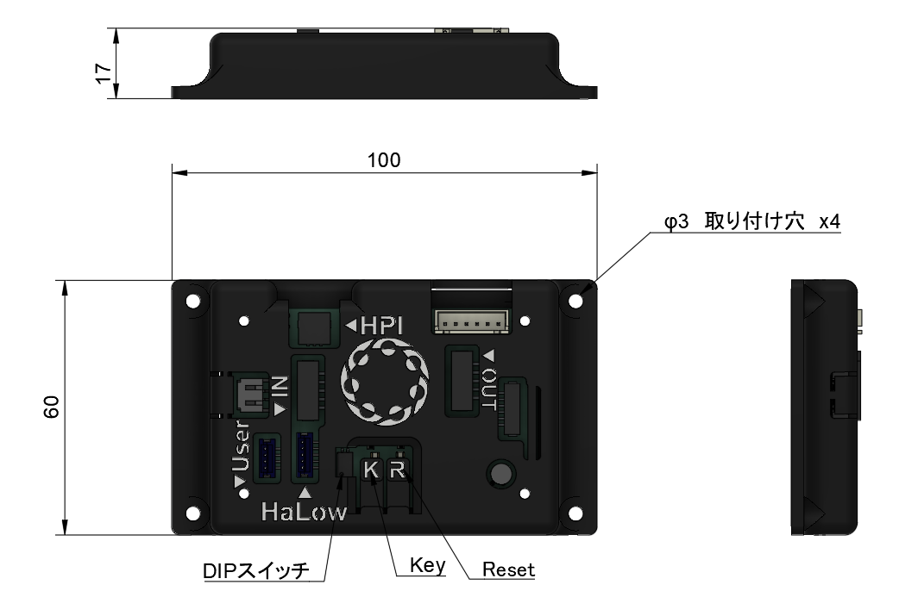

### クライアントモジュール取付の規則
クライアントモジュールをロボットに取り付ける際には以下の要件をすべて満たさなければならない。
- モジュール上の取付穴を4つすべてを使⽤して強固に固定すること。
- 本モジュールは試合前に運営スタッフが操作するため、クライアントモジュール上のボタンやスイッチを容易に操作できる位置に取り付けること。

### クライアントモジュールの操作方法
クライアントモジュールには2つのボタン（Key、Reset）と2P DIPスイッチが取り付けられており、これらを操作することでモードの切替やリセットを行う。DIPスイッチおよびKeyを下表の通りに設定した状態でResetを押すと、モードを切り替えることができる。KeyがONの場合は、Keyを押下した状態でResetを押し、モード切替が完了した後にKeyを離すこと。

|No.| DIP 1 | DIP 2 | Key | モード名 | 詳細 |
| -------- | -------- | -------- | -------- | -------- | -------- |
| 1 | OFF | OFF | OFF | 通常動作モード | HPインジケータ、ダメージパネル共に白色に発光。Wi-Fi HaLow&trade;モジュールおよびホストシミュレータにより動作を制御する。 |
| 2 | OFF | ON | OFF | スタンドアロンモード（赤） | 動作確認用のモード。HPインジケータが赤色、ダメージパネルは緑色に発光。HPは100。KeyでHPリセット。 |
| 3 | OFF | ON | ON | スタンドアロンモード（青） | 動作確認用のモード。HPインジケータが青色、ダメージパネルは緑色に発光。HPは100。KeyでHPリセット。 |

### LEDによるSPI通信状態確認
クライアントモジュールには、KeyおよびResetボタンの上部に2つのLEDが設けられており、その発光状態によって、ダメージパネルとのSPI通信の状態を確認できる。

|LED1（黄色）| LED2（赤色） | 状態 |
| -------- | -------- | -------- |
| クライアントモジュールおよび他のダメージパネルと同期して点滅 | 消灯 | 正常に動作 |  
| 点滅/点灯/消灯 | 点滅/点灯 | SPI通信エラー | 

SPI通信エラーの場合は下記を確認すること。
- 配線が正しく接続されているかどうか（IN/OUTが逆に接続されていないか、コネクタの刺さりが甘くないか等）
- ダメージパネルが全て通常動作モードとなっているかどうか
- 配線の接触不良がないかどうか

### 撃破信号の読み取り
クライアントモジュールのZH 4Pコネクタからは、撃破状態においてHIGH（5V）、非撃破状態においてLOW（0V）となる撃破信号が出力される。
各チームの回路で撃破信号を読み取る際は下図を参照してハーネスを製作し、接続すること。

**⚠ノイズや過電圧がクライアントモジュールに入力されないよう十分に対策および検証してから接続すること。**

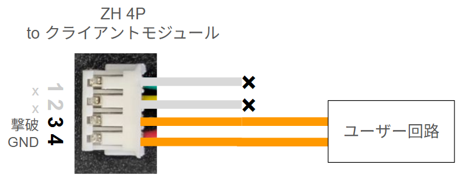

### ステータスの読み取り（オプション）

クライアントモジュールのZH 4Pコネクタからは、3.3Vロジック（5Vではないことに注意）のUARTにより自ロボットのステータスを読み取ることができる。ステータスを読み取る際は、クライアントモジュールを通常動作モードに設定し、Wi-Fi HaLow&trade;モジュールもしくはホストシミュレータを接続すること。スタンドアロンモードではステータスは出力されない。
各チームの回路でステータスを読み取る際は下図を参照してハーネスを製作し、接続すること。

**⚠ノイズや過電圧がクライアントモジュールに入力されないよう十分に対策および検証してから接続すること。**

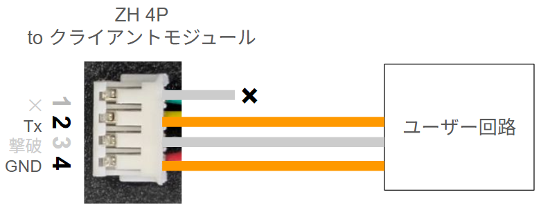

UARTの通信設定は下記の通りである。

設定: 115200bps / パリティなし / ストップビット1 / 改行コード \n

クライアントモジュールからは下記の2種類のメッセージが送信される。

#### 1. Status
- タイミング: 1秒周期で送信

|Value| 内容 | 有効値 |
| -------- | -------- | -------- | 
| CC | ヘッダ | CC |
| node_id | 送信元クライアントモジュールID | 10進数3桁、Wi-Fi HaLow&trade;モジュール非接続時は0 |
| flags | 撃破フラグ | b0: 不使用、b1:撃破フラグ(1)/⽣存フラグ(0) |
| color | b0~3:同盟カラー、b4~7:チームカラー | チームカラーの4bitは、0:OFF, 1:⾚, 2:緑, 3:⻘, 4:シアン, 5:マゼンタ, 6:⻩, 7:⽩。同盟カラーの4bitは、0:OFF, 1:⾚, 2:緑, 3:⻘, 4:⽩ |
| hp | 現在のヒットポイント割合（最大HPに対する現在HPの割合） | 0~100（16進では0~64） |
| voltage | 電圧値 | v * 100mV（分解能: 8bit ubyte）例: 0x0A → 10 → 1.0V |
| pid | パケットID | 0~255で巡回 |

例: CC,00,03,27,50,00,01

#### 2. Hit
- タイミング: ダメージパネルがHit判定をしたタイミングで⾮同期に送信

|Value| 内容 | 有効値 |
| -------- | -------- | -------- | 
| BB | ヘッダ | BB |
| node_id | 送信元クライアントモジュールID | 10進数3桁 |
| hit_flags | ダメージパネルHITフラグ | b0~7: 各ダメージパネルのヒット状態 |

例: BB,00,01

## バッテリーホルダー
バッテリーホルダーは、クライアントに電源を供給するためのモジュールである。1台のロボットには1つのバッテリーホルダーを取り付ける。

### バッテリーホルダー取付の規則
バッテリーホルダーをロボットに取り付ける際には以下の要件をすべて満たさなければならない。
- バッテリーホルダーは下図に⽰すφ3の取付穴①4つ、もしくはφ5の取付穴②4つのどちらかをすべて使⽤して強固に固定すること。

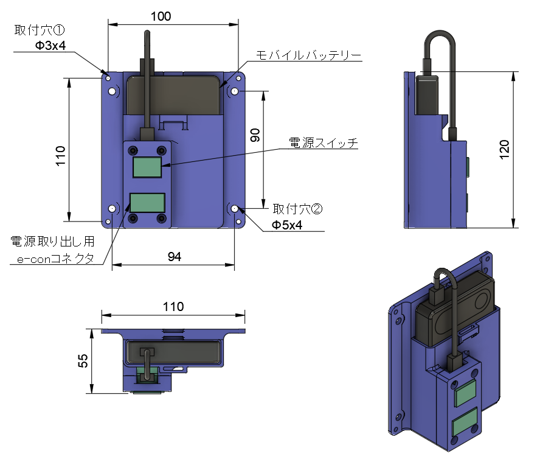

- 破損防⽌のため、他ロボットやフィールド構造物と衝突した際にモジュールが直接接触しないような位置に取り付けること。

## ダメージパネル
ダメージパネルは、フライングディスクのヒットを判定するための装置である。フライングディスクが145mm×145mmのCFRP製のヒットエリアに接触すると、接触時の振動が検知され、ダメージが判定される。上下に取り付けられたLEDバーは競技中常に発光しており、画像処理などによるダメージパネルの位置検出のために使用できる。

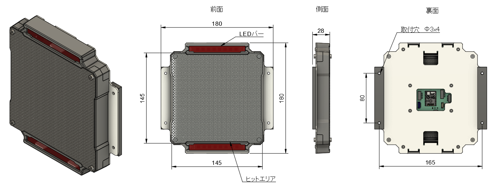

### ⚠ダメージパネル使用上の注意
- ヒットエリアに対してディスク以外による衝撃や強い力を加えてはならない
- 保管の際はヒットエリアに外力が加わらないような状態を保つこと

### ヒット検知の仕様
ダメージパネルは下記の条件の範囲でヒットを検知する。射出されたディスクがヒットエリアに当たった際にヒットを検知する。それ以外のヒットエリアへの接触（手で保持したディスクをヒットエリアに当てる等）ではヒット検知されない。
- 最大検知角度：左右135°
- 最大検知速度：12m/s
- 最大検知頻度：3Hz

### ダメージパネル発光の仕様
ダメージパネルのLEDは下表に従って発光する。

|ロボットの状態|LEDバーの発光|備考|
| -------- | -------- |-------- |
|通常時|赤もしくは青に点灯（所属同盟の色）||
|ヒット時|瞬間的に点滅||
|撃破時|黄色に点灯||
|バリア発動時|緑色に点灯||
|ヘッドアタッカー選出時|マゼンタもしくはシアン（所属同盟の色）|CoRE-1のみ|

### ダメージパネル取付の規則
ダメージパネル設置時には以下の要件を全て満たさなければならない。

- ダメージパネルとロボットの固定部には、⾦属製の⾓パイプや板材などの素材を使⽤し、剛性の高い構造を採用すること。
- ダメージパネルはTPU製ダンパのみを介してロボットと接触していること。
- TPU製ダンパに設けられた取付穴を4つ全て使⽤し強固に固定すること。

- 下図に示すように、裏面の基板カバーにある「TOP」の刻印が正しく読める向きを上側とし、その状態でヒットエリアが地面に対して垂直になるように取り付けること。

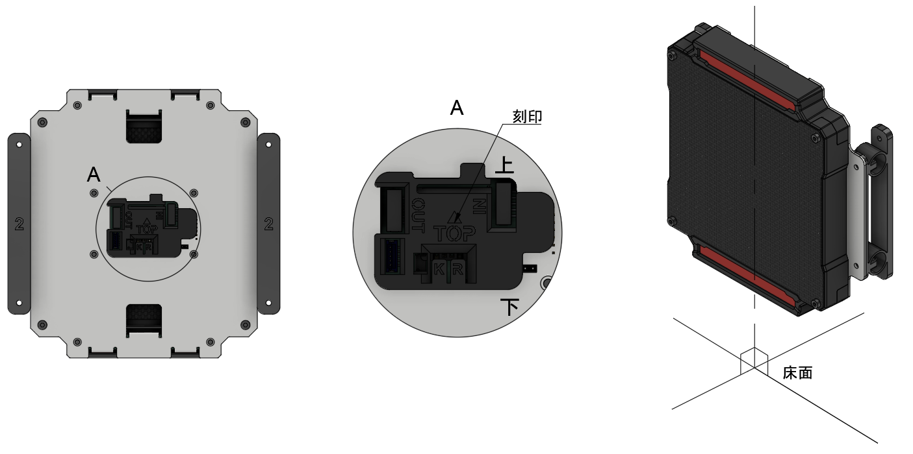

- ロボットとダメージパネルの固定部に可動部を設けてはならない。
- 競技中にロボットのシャーシ（フィールド上を移動するための機構）の重⼼との相対位置が変化しないようにしなければならない。
- 下図に⽰すように、試合中を通じて床からヒットエリアの最下端までの距離が60mm-140mm以内に収まるように取り付けること。サスペンションなどを搭載する場合、その可動範囲は本制限内で設定されなければならない。なお、フライングディスクやバンカー・高台への乗り上げ等のフィールドによる一時的な高さの変化は許容される。
- 隣り合うダメージパネルは、上⾯から⾒た際に固定⾯の法線ベクトル同⼠の⾓度は90°となるように取り付けること。ただし、CoRE-1に出場するビルダーとオートアタッカーは90°以上となるように取り付けること。いずれも競技中を通してその⾓度が変化しないようにすること。

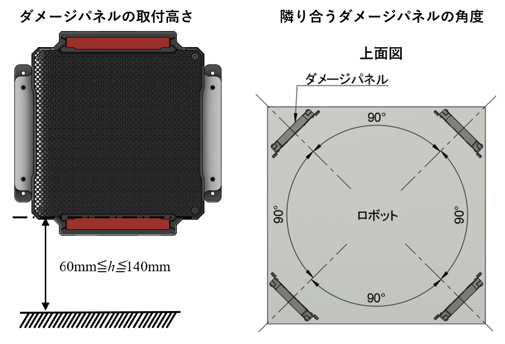

- 下図に⽰す放射状の領域内はダメージパネルの侵入禁止領域である。侵入禁止領域は、競技中を通して⾃ロボットの構造物、および⾃ロボットが保持しているRPコンテナ・フライングディスクが侵⼊してはならない。

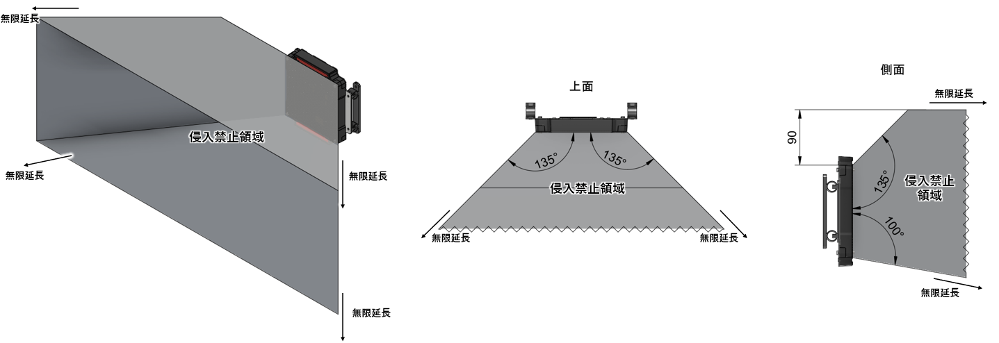

- 画像処理の妨げとなるため、ダメージパネル周辺にLEDなどの光源を取り付けてはならない。

### ダメージパネルの操作方法
ダメージパネル裏面の基板には2つのボタン（Key、Reset）と2P DIPスイッチが取り付けられており、これらを操作することでモードの切替やリセットを行う。DIPスイッチおよびKeyを下表の通りに設定した状態でResetを押すと、モードを切り替えることができる。

|No.| DIP 1 | DIP 2 | Key | モード名 | 詳細 |
| -------- | -------- | -------- | -------- | -------- | -------- |
| 1 | OFF | OFF | OFF | 通常動作モード | SPIデイジーチェーンによるクライアントモジュールとの通信とヒット判定を行う。LEDバーの発光色はクライアントモジュールのモードに依存する。 |
| 2 | OFF | ON | OFF | 単体動作モード | ダメージパネル単体でヒット判定を行うモード。SPIデイジーチェーンの通信機能は無効となる。LEDバーは緑色に発光。 |

### LEDによるSPI通信状態確認
ダメージパネル裏面の基板には、KeyおよびResetボタンの上部に2つのLEDが設けられており、その発光状態によって、クライアントモジュールおよび他のダメージパネルとのSPI通信の状態を確認できる。

|LED1（黄色）| LED2（赤色） | 状態 |
| -------- | -------- | -------- |
| クライアントモジュールおよび他のダメージパネルと同期して点滅 | 消灯 | 正常に動作 |  
| 点滅/点灯/消灯 | 点滅/点灯 | SPI通信エラー | 

SPI通信エラーの場合は下記を確認すること。
- 配線が正しく接続されているかどうか（IN/OUTが逆に接続されていないか、コネクタの刺さりが甘くないか等）
- ダメージパネルが全て通常動作モードとなっているかどうか
- 配線の接触不良がないかどうか

## HPインジケータ
HPインジケータはLEDによりHP残量を表⽰する装置である。1台のロボットには1つのHPインジケータを取り付ける。

### HPインジケータ発光の仕様
HPインジケータは下表に従って発光する。

|ロボットの状態|LEDバーの発光|備考|
| -------- | -------- |-------- |
|通常時|赤もしくは青に点灯（所属同盟の色）||
|ヒット時|瞬間的に点滅||
|撃破時|内側が黄色、外側が赤もしくは青に点灯（所属同盟の色）|参考画像　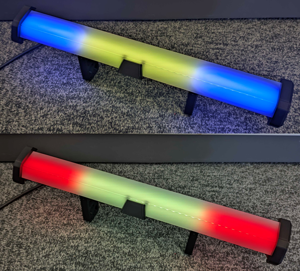|
|バリア発動時|赤もしくは青に点灯（所属同盟の色）||
|ヘッドアタッカー選出時|マゼンタもしくはシアン（所属同盟の色）|CoRE-1のみ|

### HPインジケータ取付の規則
HPインジケータの設置時には以下の要件を全て満たさなければならない。
- HPインジケータは、⻑⼿⽅向と地⾯の角度が±10°以内になるように固定すること。
- 固定には上図に⽰されている取付⽳を4つ全て⽤いること。
- 破損防⽌のため、他ロボットやフィールド構造物と衝突した際にHPインジケータが直接接触しないような位置に取り付けること。
- ロボットを水平方向から見た際に、HPインジケータの発光部が隠されずに完全に見える方向があること。

## Wi-Fi HaLow&trade;モジュール
Wi-Fi HaLow&trade;モジュールは、オートレフェリーのクライアント側とホスト側の通信を担うモジュールである。本モジュールは、920MHz帯の周波数を利用する無線通信規格であるWi-Fi HaLow&trade;を用いて通信を行う。

Wi-Fi HaLow&trade;モジュールは、ロボット側に固定されたマウントパーツ、マウントパーツに着脱可能なWi-Fi HaLow&trade;モジュール本体、およびアンテナから構成される。参加チームにはマウントパーツのみを配布し、Wi-Fi HaLow&trade;モジュール本体はHDMIトランスミッターと同様に、ラウンド前後に運営スタッフが着脱する。

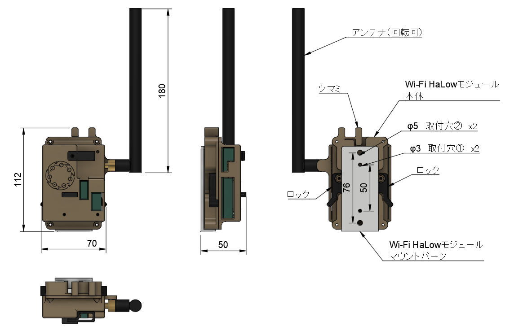

Wi-Fi HaLow&trade;モジュール本体は下記の手順でマウントパーツに取り付けられる。取り付け後は、ハーネス⑤のe-conコネクタとハーネス⑨のUSB Type-Cをモジュール本体の対応するコネクタに接続する。取り外しの際は下記の手順を逆順に行う。

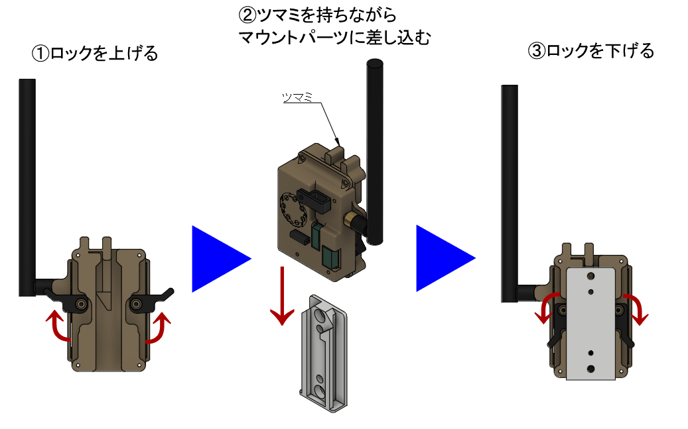

### Wi-Fi HaLow&trade;モジュール取付の規則
Wi-Fi HaLow&trade;モジュールをロボットに取り付ける際には以下の要件をすべて満たさなければならない。
- Wi-Fi HaLow&trade;モジュールマウントパーツはφ3の取付穴①2つ、もしくはφ5の取付穴②2つのどちらかをすべて使⽤して強固に固定すること。
- Wi-Fi HaLow&trade;モジュールマウントパーツは下図に示す2方向**以外**の方向で取り付けること。

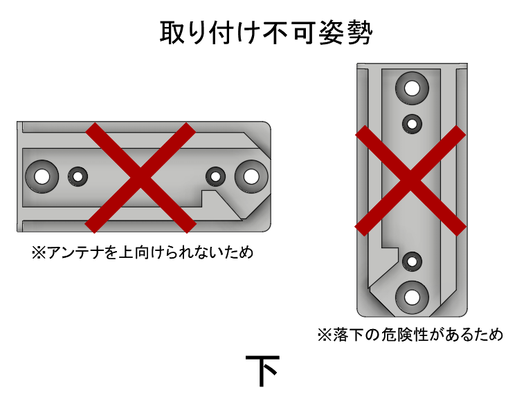

- Wi-Fi HaLow&trade;モジュールマウントパーツはWi-Fi HaLow&trade;モジュール本体を容易に着脱できるよう、周囲に十分なクリアランスを確保した位置に取り付けること。
- 破損防⽌のため、他ロボットやフィールド構造物と衝突した際にWi-Fi HaLow&trade;モジュール本体およびアンテナが直接接触しないような位置に取り付けること。
- 通信の安定化のため、ロボットを水平方向のどの方向から見ても金属によってWi-Fi HaLow&trade;モジュールのアンテナ部が隠れないようすること。
- 下図に示すように、Wi-Fi HaLow&trade;モジュールのアンテナ基部が地面から700mm以上となるように取り付けること。

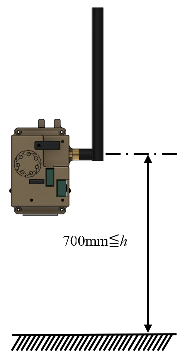

- アンテナ付近にモータなど電磁ノイズの発生源を置いてはならない。
- HDMIトランスミッターのアンテナとWi-Fi HaLow&trade;モジュールのアンテナが100mm以上離れるように取り付けること。

- クライアントモジュールとWi-Fi HaLow&trade;モジュールを迅速に接続できるよう、ハーネス⑤のe-conコネクタ 4P側およびハーネス⑨のUSB Type-C側をマウントパーツ付近に固定すること。

## ホストシミュレータ
ホストシミュレータは、Wi-Fi HaLow&trade;モジュールを通じたホストとの通信を再現する機能を持つモジュールである。チームは練習やテストの際に、ホストシミュレータを操作することでダメージパネルおよびHPインジケータの色や最大HPを変更することができる。

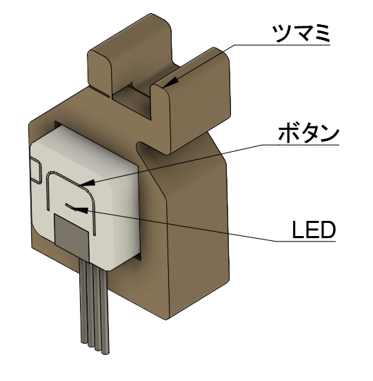

ホストシミュレータを使用する際は、クライアントモジュールとダメージパネルを通常動作モードに設定し、ハーネス⑤のe-conコネクタ 4Pを接続すること。
ホストシミュレータのボタンを押すことで、下表のモードを順次切り替えることができる。ホストシミュレータのLEDはダメージパネルの発光色を示している。

|モード|最大HP|ダメージパネルの発光色|
| -------- | -------- |-------- |
|赤同盟|100|赤|
|青同盟|100|青|
|ヘッドアタッカー（赤）|300|マゼンタ|
|ヘッドアタッカー（青）|300|マゼンタ|
|バリア発動時（赤）|HP減少なし|緑（HPインジケータは赤）|
|バリア発動時（青）|HP減少なし|緑（HPインジケータは青）|

ホストシミュレータは、下図のようにWi-Fi HaLow&trade;モジュールマウントパーツに取り付けることができる。

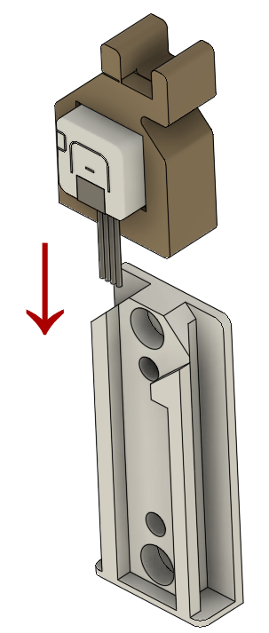

# 4章　操縦用無線モジュール
ロボットを操縦するために、各チームは実行委員会から貸出する操縦用無線モジュール（無線送信モジュール・無線受信モジュール）を使用しなければならない。操縦用無線モジュールでは、920MHz帯の無線モジュールの一つである[IM920sL](https://www.interplan.co.jp/solution/wireless/im920sl/)を使用している。操縦用無線モジュールの接続方法や使用方法については別紙資料を参照すること。

## ⚠操縦用無線モジュール使用上の注意
- 操縦用無線モジュールには、ノイズや電圧変動の少ない安定した5V電源を供給すること。
- ノイズの多い電源や、USB-PDなど電圧が変化する可能性のある規格の電源は接続してはならない。

## 無線送信モジュール取付の規則
無線送信モジュールをコントローラなどに取り付ける際には以下の要件をすべて満たさなければならない。
- モジュールの四隅にある取付穴を4つすべてを使⽤して強固に固定しなければならない。固定時に、モジュールに曲げなどの力が加わらないようにしなければならない。

- 無線送信モジュールを金属で覆ってはならない。
- 無線モジュールIM920sLを中心として半径80mm以内にモータなど電磁ノイズの発生源を置いてはならない。

## 無線受信モジュール取付の規則
無線受信モジュールは樹脂製の板に固定されている。無線受信モジュールをロボットに取り付ける際には以下の要件をすべて満たさなければならない。
- 樹脂製の板の四隅にある取付穴を4つすべてを使⽤して強固に固定しなければならない。

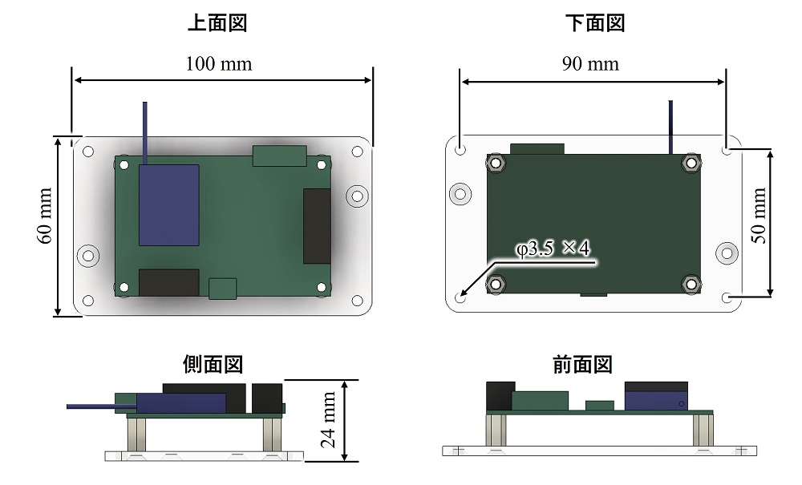

- ロボットを水平方向のどの方向から見ても金属によって無線受信モジュールが隠れないように、できる限りロボットの高い位置に取り付けなければならない。ただし、軽微なスペーサなどの通信に影響しない部品については参加チームの責任において金属部品が水平方向に存在するように取り付けてもよい。
- 破損防止のため他ロボットやフィールド構造物と衝突した際にモジュールが直接接触しないような位置に取り付けること。
- 無線モジュールIM920sLを中心として半径80mm以内にモータなど電磁ノイズの発生源を置いてはならない。

# 5章　映像伝送装置
ロボット視点の映像を操縦ブースに無線送信するため、映像伝送装置を使用する。映像伝送装置は、カメラモジュール、HDMIトランスミッター（送信機、受信機）、送信機をロボットに取り付けるためのマウントパーツ、HDMIケーブルから構成される。送信機はロボットに搭載し、受信機は操縦ブースに設置する。実行委員会から貸出するカメラモジュールの代わりに、HDMIによって映像出力が可能な機材を各チームで製作し、使用できる。各チームは操縦ブースの機材に変更を加えてはならない。

## 操縦ブースで表示されるロボット視点映像のUI
ロボットHP、試合時間、チームスコアなどのUIは、操縦ブースで表示されるロボット視点映像の内、下図に示される青色の範囲内に表示される。

試合開始時のカウントダウンや撃破時の復活までのカウントダウン、試合終了時の勝利チーム表示は、上記のUIとは別に下図のように画面中央に表示される。

## カメラモジュール
映像伝送装置の取り付けが必要なチームには、実行委員会が製作したカメラモジュール1台を貸出する。カメラの画角は160度程度である。実行委員会が製作したカメラモジュールの電源はオートレフェリーシステムのメインモジュールから給電できる。カメラモジュールからはカメラ映像がHDMIで出力されており、送信機に接続することでカメラ映像を無線送信できる。

貸出するカメラモジュールは改造してはならない。ただし、カメラモジュールの前に光学機器を取り付けるなど、モジュール自体を改造しない工夫は行ってもよい。

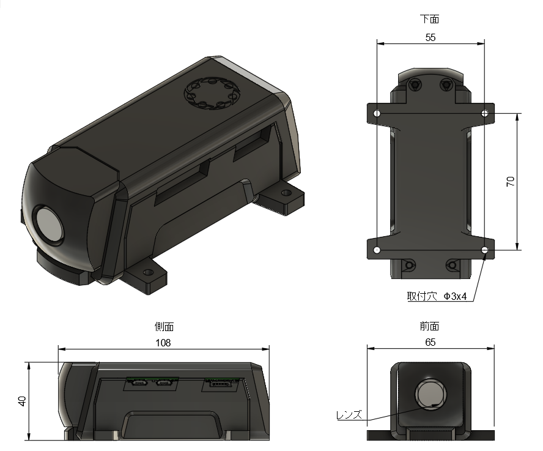

### カメラモジュールの固定方法
上図に示す4つの取付穴をすべて使用し、強固に固定すること。

### チームによるカメラモジュールの置き換え
HDMIによって映像出力が可能な機材を製作し、貸出するカメラモジュールの代わりに使用できる。この場合、貸出するカメラモジュールはロボットに搭載しなくてよい。ただし、出力する映像の解像度は1280×720としなければならない。

## HDMIトランスミッター
ロボットから操縦ブースに映像を無線送信するため、市販のHDMIトランスミッターを使用する。選手権当日に使用するHDMIトランスミッターは2種類あることに注意すること。また、貸出するHDMIトランスミッターは選手権当日に使用するHDMIトランスミッターとは異なることに注意すること。いずれのHDMIトランスミッターもロボットへ同様に取り付けられるよう、マウントパーツを貸出する。HDMIトランスミッターへは、カメラ用バッテリー（NP-Fバッテリー）もしくはUSB-Cで電源を供給できる。

### チーム貸出用HDMIトランスミッター
映像伝送装置の取り付けが必要なチームには、[MOMAN Matrix600s](https://amzn.asia/d/3SVWkK3)もしくは[Shimbol TP Mini](https://amzn.asia/d/hQpLUlm)を1セット貸出する。

### 選手権当日用HDMIトランスミッター
選手権当日は、[ACCSOON CineEye 2S Pro](https://rental.pandastudio.tv/item/accsoon-cineeye-2spro/)および[ACCSOON CineView SE](https://amzn.asia/d/dqdejUh)を使用する予定である。選手権当日にロボットに搭載するHDMIトランスミッターの送信機へは、実行委員会が管理・貸出するNP-Fバッテリーで電源を供給する。

### HDMIトランスミッター（送信機）取付の規則
HDMIトランスミッター（送信機）をロボットに取り付ける際には以下の要件をすべて満たさなければならない。なお、送信機の取付・取り外しを容易にするため、マウントパーツ（実行委員会より貸出）を使用しなければならない。マウントパーツは、ロボット側とHDMIトランスミッター側の2つの部品で構成される。マウントパーツ（HDMIトランスミッター側）はHDMIトランスミッターの種類に応じて4種類がある。チーム側に貸し出すのは練習用HDMIトランスミッターのマウントパーツのみである。
- マウントパーツ（ロボット側）は下図に⽰すφ3の取付穴①4つ、もしくはφ5の取付穴②2つのどちらかをすべて使⽤して強固に固定すること。

- マウントパーツ（ロボット側）はM6エンザートの金属面が露出している面を下にして取り付けること。
- HDMIトランスミッター（送信機）はマウントパーツ（HDMIトランスミッター側）にインチねじを使用して強固に固定すること。
- マウントパーツ（HDMIトランスミッター側）は、M6の蝶ボルトを使ってマウントパーツ（ロボット側）へ強固に取り付けること。
- ロボットを水平方向のどの方向から見ても金属によってHDMIトランスミッター（送信機）が隠れないように、できる限り高い位置に取り付けなければならない。なお、ACCSOON CineEye 2S ProおよびACCSOON CineView SEは練習用に貸し出しているMoman Matrix 600よりもサイズが大きいため、下図の寸法や3Dモデルを参考に大会本番で使用するHDMIトランスミッター（送信側）が2種類とも取り付けられるスペースを確保しなければならない。
    - [練習用HDMIトランスミッタ①（Moman Matrix 600、Shimbol TP Mini）](https://a360.co/411WY2O)
    - [練習用HDMIトランスミッタ②（Moman Matrix 600s）](https://a360.co/3EOeK2c)
    - [本番用HDMIトランスミッタ①（HACCSOON CineView SE）](https://a360.co/4140Osl)
    - [本番用HDMIトランスミッタ②（ACCSOON CineEye 2S Pro）](https://a360.co/4k95l5f)

# 6章　競技システムの接続
競技システム同士の接続のため、チームには下記のハーネスを貸与する。
ハーネス⑥を除く全てのハーネスは加工してはならない。

|ハーネス番号 | 端処理1 | 端処理2 | 数量/クライアント | 用途 |
| -------- | -------- | -------- | -------- | -------- |
| ② | PHコネクタ 5P | PHコネクタ 5P |  6（予備含む） | クライアントモジュール - ダメージパネル接続用 |
| ②-1 | PHコネクタ（オス） 5P | PHコネクタ（メス） 5P |  2 | ハーネス②延長用 |
| ⑤ | ZHコネクタ 5P | e-conコネクタ 4P |  1 | クライアント - Wi-Fi HaLow&trade;モジュール接続用 |
| ⑥ | ZHコネクタ 4P | 切りっぱなし（加工可） | 1 | クライアントモジュール - ユーザー回路接続用 |
| ⑦ | XHコネクタ 6P | e-conコネクタ 3P | 1 | クライアント - バッテリーモジュール接続用 |
| ⑧ | ZHコネクタ 3P | ZHコネクタ 3P | 1 | クライアントモジュール - HPインジケータ接続用 |
| ⑨ | USB Type-C | e-conコネクタ 3P | 1 | バッテリーホルダー - Wi-Fi HaLow&trade;モジュール接続用 |
| α | USB Micro-B | e-conコネクタ 3P | 1 | カメラ - バッテリーホルダー接続用 |
| β | HDMI | Mini HDMI | 1 | カメラモジュール - HDMIトランスミッター |
| γ | e-conコネクタ（オス） 3P | e-conコネクタ（メス） 3P | 2 | 電源延長用 |

競技システム同士は下図の通りに接続すること。ビルダーおよびオートアタッカーチームはダメージパネルを3枚接続すること。

**⚠コネクタの向きと接続箇所に十分注意して配線を行うこと**

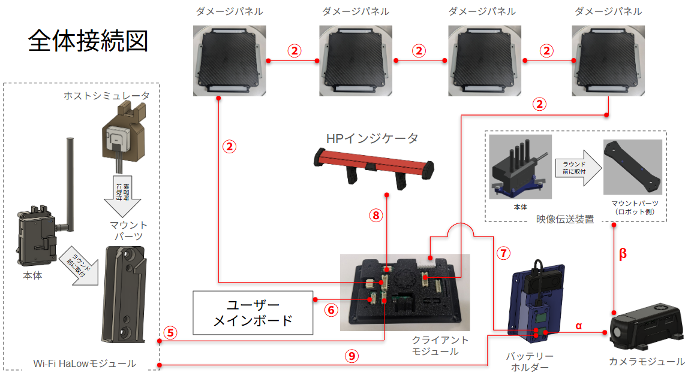

クライアントモジュールのコネクタとハーネスおよび接続先モジュールの対応は下記を参照すること。

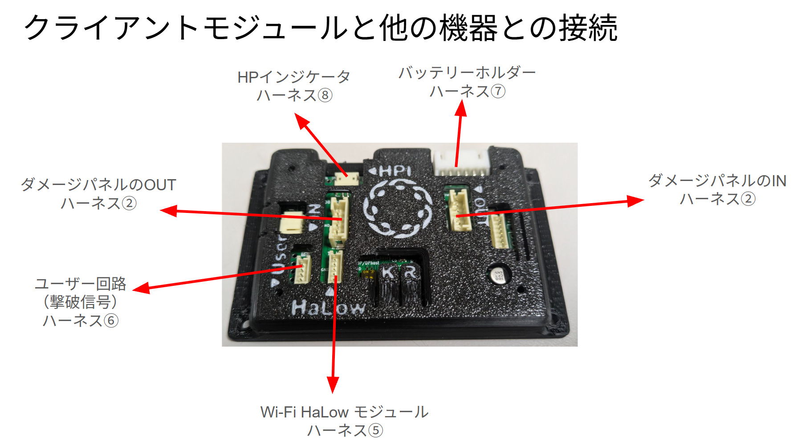

クライアントモジュールとダメージパネルは、下記の通り、IN端子とOUT端子を順に接続し、一周してクライアントモジュールに戻るように接続すること。ビルダーおよびオートアタッカーチームはダメージパネルを3枚のみ接続すること。

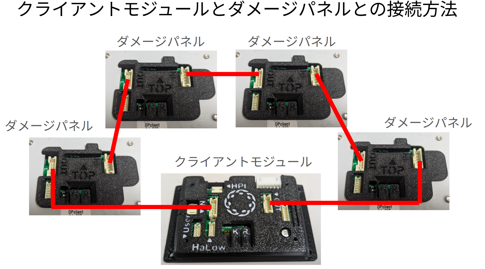

