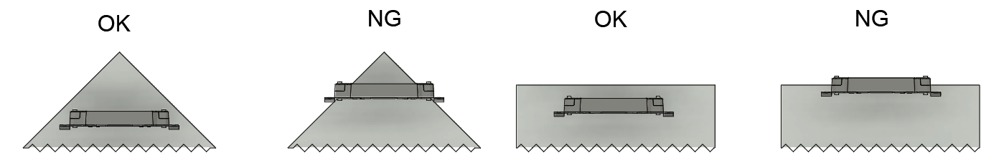

# CoRE競技システムルールブック v26.0.0

# 1章　はじめに
本ルールブックはエンジニア選手権、The Championship of Robotics Engineers（CoRE）で使用する競技システムに関するルールを記載している。

# 2章　競技システムの概要
CoREで使用する競技システムは以下の3つから構成される。
- オートレフェリーシステム
- 操縦用無線モジュール
- 映像伝送装置

# 3章　オートレフェリーシステム
オートレフェリーシステムは、審判の判定を補助するためのシステムである。競技中、クライアントは実行委員会で管理するホストと接続し、ホストは競技中に発生する事象を管理する。

## クライアントの構成
ロボットに搭載するオートレフェリーシステムのクライアントは以下のデバイスから構成される。
- クライアントモジュール
- バッテリーホルダー
- ダメージパネル
- HPインジケータ

### 1部リーグで取り付けるデバイス
開発するロボットの種別に応じて、下記の表の通りのデバイスを指定個数だけ取り付けること。

|デバイス名 | アタッカー | オートアタッカー | ビルダー | ストライダー |
| -------- | -------- | -------- | -------- | -------- |
| クライアントモジュール | 1 | 1 | 1 | なし |
| バッテリーホルダー | 1 | 1 | 1 | なし |
| ダメージパネル | 4 | 3 | 3 | なし |
| HPインジケータ | 1 | 1 | 1 | なし |

### 2部リーグで取り付けるデバイス
ロボットは、1つのクライアントモジュール、1つのバッテリーホルダー、4つのダメージパネル、1つのHPインジケータを取り付けること。

## クライアントモジュール
クライアントモジュールの詳細は後日公開する。

## バッテリーホルダー
バッテリーホルダーは、クライアントに電源を供給するためのモジュールである。1台のロボットには1つのバッテリーホルダーを取り付ける。

### バッテリーホルダー取付の規則
バッテリーホルダーをロボットに取り付ける際には以下の要件をすべて満たさなければならない。
- バッテリーホルダーは下図に⽰すφ3の取付穴①4つ、もしくはφ5の取付穴②4つのどちらかをすべて使⽤して強固に固定すること。

- 破損防⽌のため、他ロボットやフィールド構造物と衝突した際にモジュールが直接接触しないような位置に取り付けること。

## ダメージパネル
ダメージパネルは、フライングディスクのヒットを判定するための装置である。フライングディスクが145mm×145mmのCFRP製のヒットエリアに接触すると、接触時の振動が検知され、ダメージが判定される。上下に取り付けられたLEDバーは競技中常に発光しており、画像処理などによるダメージパネルの位置検出のために使用できる。

### ヒット検知の仕様
ダメージパネルは下記の条件の範囲でヒットを検知する．
- 最大検知角度：左右135°
- 最大検知速度：10m/s
- 最大検知頻度：3Hz

### ダメージパネル発光の仕様
ダメージパネルのLEDは下表に従って発光する。

|ロボットの状態|LEDバーの発光|備考|
| -------- | -------- |-------- |
|通常時|赤もしくは青に点灯（所属同盟の色）||
|ヒット時|瞬間的に点滅||
|撃破時|黄色に点灯||
|バリア発動時|緑色に点灯||
|ヘッドアタッカー選出時|マゼンタもしくはシアン（所属同盟の色）|CoRE-1のみ|

### ダメージパネル取付の規則
ダメージパネル設置時には以下の要件を全て満たさなければならない。ダメージパネルとロボットの固定部には、⾦属製の⾓パイプや板材などの素材を使⽤し、剛性の高い構造を採用すること。固定部の剛性が低いと振動によりヒットの誤検知が起こる可能性が高まる。
- 上図に⽰す取付穴を4つ全て使⽤して強固に固定すること。

- 下図に示すように、裏面基板にある「M5」の刻印、または貼付されたステッカーの文字が正しく読める向きを上側とし、その状態でヒットエリアが地面に対して垂直になるように取り付けること．

- ロボットとダメージパネルの固定部に可動部を設けてはならない。
- 競技中にロボットのシャーシ（フィールド上を移動するための機構）の重⼼との相対位置が変化しないようにしなければならない。
- 下図に⽰すように、試合中を通じて床からヒットエリアの最下端までの距離が60mm-140mm以内に収まるように取り付けること。サスペンションなどを搭載する場合、その可動範囲は本制限内で設定されなければならない。なお、フライングディスクやバンカー・高台への乗り上げ等のフィールドによる一時的な高さの変化は許容される。
- 隣り合うダメージパネルは、上⾯から⾒た際に固定⾯の法線ベクトル同⼠の⾓度は90°となるように取り付けること。ただし、CoRE-1に出場するビルダーとオートアタッカーは90°以上となるように取り付けること。いずれも競技中を通してその⾓度が変化しないようにすること。

- 衝突時の破損防⽌のため、下図に示すように、上面から見た際にダメージパネルがロボットの最外周の内部に入る位置に取り付けること。

- 下図に⽰す放射状の領域内はダメージパネルの侵入禁止領域である。侵入禁止領域は、競技中を通して⾃ロボットの構造物、および⾃ロボットが保持しているRPコンテナ・フライングディスクが侵⼊してはならない。

- 画像処理の妨げとなるため、ダメージパネル周辺にLEDなどの光源を取り付けてはならない。

## HPインジケータ
HPインジケータは中央の発光部によりHP残量を表⽰する装置である。1台のロボットには1つのHPインジケータを取り付ける。

### HPインジケータ発光の仕様
HPインジケータは下表に従って発光する。

|ロボットの状態|LEDバーの発光|備考|
| -------- | -------- |-------- |
|通常時|赤もしくは青に点灯（所属同盟の色）||
|ヒット時|瞬間的に点滅||
|撃破時|黄色に点灯||
|バリア発動時|緑色に点灯||
|ヘッドアタッカー選出時|マゼンタもしくはシアン（所属同盟の色）|CoRE-1のみ|

### HPインジケータ取付の規則
HPインジケータの設置時には以下の要件を全て満たさなければならない。
- HPインジケータは、⻑⼿⽅向と地⾯の角度が±10°以内になるように固定すること。
- 固定には上図に⽰されている取付⽳を4つ全て⽤いること。
- 破損防⽌のため、他ロボットやフィールド構造物と衝突した際にHPインジケータが直接接触しないような位置に取り付けること。
- ロボットを水平方向から見た際に、HPインジケータの発光部が隠されずに完全に見える方向があること。

# 4章　操縦用無線モジュール
ロボットを操縦するために、各チームは実行委員会から貸出する操縦用無線モジュール（無線送信モジュール・無線受信モジュール）を使用しなければならない。操縦用無線モジュールでは、920MHz帯の無線モジュールの一つである[IM920sL](https://www.interplan.co.jp/solution/wireless/im920sl/)を使用している。操縦用無線モジュールの接続方法や使用方法については別紙資料を参照すること。

## 無線送信モジュール取付の規則
無線送信モジュールをコントローラなどに取り付ける際には以下の要件をすべて満たさなければならない。
- モジュールの四隅にある取付穴を4つすべてを使⽤して強固に固定しなければならない。固定時に、モジュールに曲げなどの力が加わらないようにしなければならない。

- 無線送信モジュールを金属で覆ってはならない。
- 無線モジュールIM920sLを中心として半径80mm以内にモータなど電磁ノイズの発生源を置いてはならない。

## 無線受信モジュール取付の規則
無線受信モジュールは樹脂製の板に固定されている。無線受信モジュールをロボットに取り付ける際には以下の要件をすべて満たさなければならない。
- 樹脂製の板の四隅にある取付穴を4つすべてを使⽤して強固に固定しなければならない。

- ロボットを水平方向のどの方向から見ても金属によって無線受信モジュールが隠れないように、できる限りロボットの高い位置に取り付けなければならない。ただし、軽微なスペーサなどの通信に影響しない部品については参加チームの責任において金属部品が水平方向に存在するように取り付けてもよい。
- 破損防止のため他ロボットやフィールド構造物と衝突した際にモジュールが直接接触しないような位置に取り付けること。
- 無線モジュールIM920sLを中心として半径80mm以内にモータなど電磁ノイズの発生源を置いてはならない。

# 5章　映像伝送装置
ロボット視点の映像を操縦ブースに無線送信するため、映像伝送装置を使用する。映像伝送装置は、カメラモジュール、HDMIトランスミッター（送信機、受信機）、送信機をロボットに取り付けるためのマウントパーツ、HDMIケーブルから構成される。送信機はロボットに搭載し、受信機は操縦ブースに設置する。実行委員会から貸出するカメラモジュールの代わりに、HDMIによって映像出力が可能な機材を各チームで製作し、使用できる。各チームは操縦ブースの機材に変更を加えてはならない。

## 操縦ブースで表示されるロボット視点映像のUI
ロボットHP、試合時間、チームスコアなどのUIは、操縦ブースで表示されるロボット視点映像の内、下図に示される青色の範囲内に表示される。

試合開始時のカウントダウンや撃破時の復活までのカウントダウン、試合終了時の勝利チーム表示は、上記のUIとは別に下図のように画面中央に表示される。

## カメラモジュール
映像伝送装置の取り付けが必要なチームには、実行委員会が製作したカメラモジュール1台を貸出する。カメラの画角は160度程度である。実行委員会が製作したカメラモジュールの電源はオートレフェリーシステムのメインモジュールから給電できる。カメラモジュールからはカメラ映像がHDMIで出力されており、送信機に接続することでカメラ映像を無線送信できる。

貸出するカメラモジュールは改造してはならない。ただし、カメラモジュールの前に光学機器を取り付けるなど、モジュール自体を改造しない工夫は行ってもよい。

### カメラモジュールの固定方法
上図に示す4つの取付穴をすべて使用し、強固に固定すること。

### チームによるカメラモジュールの置き換え
HDMIによって映像出力が可能な機材を製作し、貸出するカメラモジュールの代わりに使用できる。この場合、貸出するカメラモジュールはロボットに搭載しなくてよい。ただし、出力する映像の解像度は1280×720としなければならない。

## HDMIトランスミッター
ロボットから操縦ブースに映像を無線送信するため、市販のHDMIトランスミッターを使用する。選手権当日に使用するHDMIトランスミッターは2種類あることに注意すること。また、貸出するHDMIトランスミッターは選手権当日に使用するHDMIトランスミッターとは異なることに注意すること。いずれのHDMIトランスミッターもロボットへ同様に取り付けられるよう、マウントパーツを貸出する。HDMIトランスミッターへは、カメラ用バッテリー（NP-Fバッテリー）もしくはUSB-Cで電源を供給できる。

### チーム貸出用HDMIトランスミッター
映像伝送装置の取り付けが必要なチームには、[MOMAN Matrix600s](https://amzn.asia/d/3SVWkK3)もしくは[Shimbol TP Mini](https://amzn.asia/d/hQpLUlm)を1セット貸出する。

### 選手権当日用HDMIトランスミッター
選手権当日は、[ACCSOON CineEye 2S Pro](https://rental.pandastudio.tv/item/accsoon-cineeye-2spro/)および[ACCSOON CineView SE](https://amzn.asia/d/dqdejUh)を使用する予定である。選手権当日にロボットに搭載するHDMIトランスミッターの送信機へは、実行委員会が管理・貸出するNP-Fバッテリーで電源を供給する。

### HDMIトランスミッター（送信機）取付の規則
HDMIトランスミッター（送信機）をロボットに取り付ける際には以下の要件をすべて満たさなければならない。なお、送信機の取付・取り外しを容易にするため、マウントパーツ（実行委員会より貸出）を使用しなければならない。マウントパーツは、ロボット側とHDMIトランスミッター側の2つの部品で構成される。マウントパーツ（HDMIトランスミッター側）はHDMIトランスミッターの種類に応じて4種類がある。チーム側に貸し出すのは練習用HDMIトランスミッターのマウントパーツのみである。
- マウントパーツ（ロボット側）は下図に⽰すφ3の取付穴①4つ、もしくはφ5の取付穴②2つのどちらかをすべて使⽤して強固に固定すること。

- マウントパーツ（ロボット側）はM6エンザートの金属面が露出している面を下にして取り付けること。
- HDMIトランスミッター（送信機）はマウントパーツ（HDMIトランスミッター側）にインチねじを使用して強固に固定すること。
- マウントパーツ（HDMIトランスミッター側）は、M6の蝶ボルトを使ってマウントパーツ（ロボット側）へ強固に取り付けること。
- ロボットを水平方向のどの方向から見ても金属によってHDMIトランスミッター（送信機）が隠れないように、できる限り高い位置に取り付けなければならない。なお、ACCSOON CineEye 2S ProおよびACCSOON CineView SEは練習用に貸し出しているMoman Matrix 600よりもサイズが大きいため、下図の寸法や3Dモデルを参考に大会本番で使用するHDMIトランスミッター（送信側）が2種類とも取り付けられるスペースを確保しなければならない。
    - [練習用HDMIトランスミッタ①（Moman Matrix 600，Shimbol TP Mini）](https://a360.co/411WY2O)
    - [練習用HDMIトランスミッタ②（Moman Matrix 600s）](https://a360.co/3EOeK2c)
    - [本番用HDMIトランスミッタ①（HACCSOON CineView SE）](https://a360.co/4140Osl)
    - [本番用HDMIトランスミッタ②（ACCSOON CineEye 2S Pro）](https://a360.co/4k95l5f)

